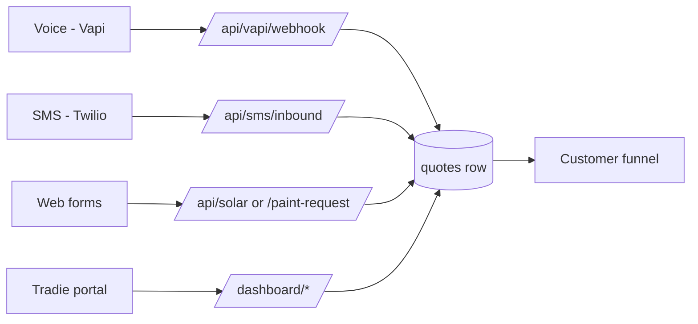

# Platform Overview

QuoteMax is a multi-trade AI quoting platform for Australian residential trade
businesses. A customer reaches a tradie by **phone, SMS or a web form**; the
platform captures the job, drafts or measures a price, publishes a
customer-facing quote page, takes money through Stripe, and books the visit —
without the tradie writing the quote on a Sunday night.

The product is **one Next.js 16 application** living in
`quotemate-automation/`. The repository root holds planning documents, the
design system and strategy history; it is not deployed. See
[[Repository Layout]] for the full map.

## What it actually is, in numbers

Verified by enumeration on 2026-09-04 against
`C:\Users\dalig\Downloads\QuoteMate\quoteMate\quotemate-automation`:

| Thing | Count | How it was counted |
|---|---|---|
| `lib/` domain modules (directories) | **58** | `find lib -maxdepth 1 -mindepth 1 -type d` |
| API route handlers | **270** | `find app/api -name route.ts` |
| Rendered pages | **92** | `find app -name page.tsx` |
| SQL migration files (incl. `*_down.sql`) | **244** | `ls sql/migrations` |
| Highest migration | **196** `196_ev_charger_clarifying_questions.sql` | `ls sql/migrations` |
| Top-level `app/api/*` groups | **33** | `ls app/api` |

⚠ **Drift** — `CLAUDE.md` states "~55 domain modules", "sql/migrations/002…182
(216 files)" and "85 base tables". The module count is **58**, the migration
ceiling is **196**, and the migration directory holds **244** files. Treat
`CLAUDE.md` counts as a floor, not a fact. See [[Migrations]] and
[[Database Overview]].

## The eight-plus trades

The platform is explicitly **not** a two-trade pilot. Trades are data — a
`trades` registry row plus a CSV load through `/admin/loader` — not hand-wired
code. See [[Trades Registry]].

Live trades with their own pipeline code in `lib/`:

| Trade | Primary lib module | Intake shape |
|---|---|---|
| Electrical | `lib/estimate`, `lib/intake` | Voice / SMS / portal → LLM |
| Plumbing | `lib/estimate`, `lib/intake` | Voice / SMS / portal → LLM |
| Roofing | `lib/roofing`, `lib/sms/roofing-*` | SMS receptionist + dashboard measure |
| Solar | `lib/solar` | Deterministic web form |
| Painting | `lib/painting`, `lib/sms/painting-*` | SMS receptionist + web form |
| Commercial painting | `lib/commercial-painting` | Separate stack, own release gate |
| Aircon | `lib/aircon` | Plan upload → sizing |
| Signage | `lib/signage` | Photo/vision assessment |
| EV charger (electrical sub-case) | `lib/estimate` + `lib/sms` scope guards | SMS + dashboard, gated |

The EV-charger work is the most recent addition — `sql/migrations/192_ev_charger_bounds.sql`
and `196_ev_charger_clarifying_questions.sql`, plus a live scope test at
`quotemate-automation/lib/sms/live-ev-charger-scope.test.ts` (untracked at the
time of writing). See [[EV Charger Jobs]] and [[Electrical]].

## The load-bearing idea: LLM conversation, deterministic money

This is the single design constraint that explains most of the code:

> **An LLM may hold the conversation. An LLM MUST NOT produce a number.**

Every figure a customer ever sees comes from a tool or a pure pricing
function, and a validator rejects anything else:

- Electrical/plumbing estimation calls Claude with **tool-calling only** for
  prices (`quotemate-automation/lib/estimate/tools.ts`), then
  `quotemate-automation/lib/estimate/validate.ts` verifies every line item
  derives from `pricing_book` / `shared_*` / `tenant_custom_assemblies` scoped
  to the intake's trade. A failure downgrades the whole quote to the $99
  inspection route. See [[Grounding Validator]].
- SMS receptionists are Sonnet-driven, but `assertGroundedReply` discards any
  reply that states a price, area, structure count, measured address, quote
  link or booking confirmation that no tool produced. See
  [[Grounding and Safe Replies]].
- Roofing, solar, painting and commercial-painting pricers are **pure**
  functions with no model in the money path at all.

The corollary an engineer must internalise: **there is no single "quote
engine"**. There are four differently-shaped pipelines. See
[[The Four Pipelines]].

## The three intake channels

- **Voice** — Vapi persona "jon", Deepgram STT, ElevenLabs TTS, Haiku on the
  turn. See [[Voice Channel (Vapi)]].
- **SMS** — one Twilio webhook, `app/api/sms/inbound/route.ts`, which contains
  **four different receptionists** behind one entry point. This is the single
  most tangled route in the codebase. See [[SMS Inbound Route]] and
  [[SMS Channel Overview]].
- **Web forms** — self-serve customer intake per trade:
  `/solar/[tenantSlug]`, `/paint-request/[token]`, aircon plan upload,
  `/quote-request`.
- **Portal** — the tradie types the job themselves in `/dashboard/*`. This was
  the original v1 wedge and it still works.

## The customer funnel is pay-first

Every trade funnel is the same four beats: **quote page → Stripe → booking
calendar → thanks**. The customer pays *before* choosing a time slot, not
after. Both halves of that are enforced at the Stripe mint, not at the booking
page:

- The early-booking discount MUST be realised at `/r/[token]/[tier]`
  (`resolveMintDiscount`). Moving it to the book route silently removes the
  discount for everyone.
- `canTakePayment()` MUST gate every mint on an `initial` row, so a tenant with
  no bookable windows is never charged.

Both guards are scoped to `quote_kind='initial'` since migration 194
(`sql/migrations/194_quote_chain.sql`). A post-visit `final` or `balance`
child has no visit to book and must never inherit an early-bird offer. See
[[Pay-First Booking Funnel]], [[Mint Routes and Guards]] and
[[The Post-Visit Quote Ladder]].

Real funnel pages on disk (`find app/q app/r -name page.tsx -o -name route.ts`):

| Funnel | Quote page | Book | Thanks | Stripe mint |
|---|---|---|---|---|
| Generic (electrical / plumbing / solar deposit / roofing rows on `quotes`) | `/q/[token]` | `/q/[token]/book` | `/q/[token]/thanks` | `/r/[token]/[tier]` |
| Roofing | `/q/roof/[token]` | `/q/roof/[token]/book` | `/q/roof/[token]/thanks` | `/r/roof/[token]/[tier]` |
| Painting | `/q/paint/[token]` | `/q/paint/[token]/book` | `/q/paint/[token]/thanks` | `/r/paint/[token]/[tier]` |
| Solar (own surface) | `/q/solar/[token]` | via generic | via generic | `/r/[token]/[tier]` |
| Aircon / commercial paint / plan / choose | `/q/aircon/[token]`, `/q/commercial-paint/[token]`, `/q/plan/[token]`, `/q/choose/[token]` | via generic | | |

⚠ **Drift** — `CLAUDE.md` says "Solar has no pages of its own". False:
`app/q/solar/[token]/page.tsx` exists and is token-gated against
`solar_estimates.public_token` with its own confirm gate. Both statements are
partly true — solar *also* writes a twin `quotes` row so it can use the
generic booking funnel — but the dedicated page is real and is the surface
customers actually receive. See [[Solar]] and [[Quote Pages]].

Also real but undocumented in `CLAUDE.md`: `/q/[token]/approve`,
`/q/[token]/cancelled`, and per-trade calendar exports
`/q/roof/[token]/visit.ics` and `/q/paint/[token]/visit.ics`.

## Marketing surface

`app/page.tsx` is a full marketing home page in the "command centre" design
language — warm-charcoal canvas, Caterpillar-yellow accent, Manrope +
JetBrains Mono, borders and lit edges instead of shadows
(`quotemate-automation/app/layout.tsx:8-18`, `app/page.tsx:1-10`). The site
defaults to the **light** palette on first visit and stores the choice in
`localStorage` under `qm-theme`, applied before first paint by an inline
script (`app/layout.tsx:69-71`). `<html lang="en-AU">` carries a long comment
explaining that it does *not* fix `<input type="date">` formatting — do not
"re-fix" it (`app/layout.tsx:44-53`). See [[Design System Overview]].

Public marketing routes: `/`, `/pricing`, `/trades/{electrical,plumbing,roofing,painting,solar}`,
`/legal/*`, `/watch`, `/start/[tenantId]`, `/quote-request`.

## Auth and tenancy in one paragraph

Auth is **Clerk** (`@clerk/nextjs@^7.5.10`, `@clerk/backend@3.8.5`), wrapped
inside `<body>` per Clerk's Next 16 guidance rather than around `<html>`
(`app/layout.tsx:72-77`). A legacy Supabase PKCE path survives at
`/auth/callback`, `/signin`, `/signup`. Multi-tenancy is enforced in the
**application layer** by `tenant_id` filtering — server routes use the Supabase
service-role key and therefore bypass RLS entirely, so RLS being "on" for most
tables is not by itself an isolation guarantee. See [[Auth and Identity]],
[[Tenancy Model]] and [[Tenancy and RLS]].

## What is honestly missing

- The **eval framework** is partial — `eval_runs` / `eval_run_items` exist and
  `/admin/agents/eval-fixture` scores, but prompts still largely iterate
  without a measured delta. See [[Testing Strategy]].
- **Stripe Connect Express** is wired but onboarded on a minority of tenants,
  and Stripe is still in **test mode**. See [[Stripe Connect]].
- **RLS phase 2** (tenant-scoped positive policies) is deferred; token-only
  endpoints have known tenancy holes. See [[Known Debt Register]].
- Several SMS receptionist blockers are live: stop-word false positives,
  `y`/`ya`/thumbs-up not accepted as yes, "no worries" parsing as no, and a
  roofing thread capturing every later turn on a multi-trade tenant. See
  [[Known Debt Register]] and [[Roofing Receptionist]].

⚠ **Drift** — `README.md` is materially stale. It claims "Opus 4.7 / Sonnet
4.6", "no PDF in v1", "Stripe Connect Express … planned but not yet wired",
"Sentry error tracking … planned", and a 2026-05-18 status of three trades.
All four are wrong: PDFs ship through Gotenberg (`lib/pdf/`), Connect is wired
(`lib/stripe/connect.ts`), `@sentry/nextjs@^10.63.0` is a dependency with
`sentry.server.config.ts`, `sentry.edge.config.ts`, `instrumentation.ts` and
`instrumentation-client.ts` present in the app root, and eight-plus trades are
live. `CLAUDE.md`'s own claim that there is "No PostHog/Sentry yet" is
likewise stale. See [[Tech Stack]] and [[Observability and Tracing]].

## Open questions

- Whether Sentry is actually *enabled* in production or merely installed — the
  config files exist but the DSN gating was not read for this note.
- Whether `app/app/[[...path]]/page.tsx` (a catch-all under `app/app/`) is the
  mobile-app landing/deep-link shim; it pairs with
  `lib/mobile-app-associations.ts` and `app/.well-known/`, but its purpose was
  not confirmed.
- Exact live tenant and trade counts in Supabase — this note reports code
  surface, not production rows.

## Related

- [[System Architecture]]
- [[The Four Pipelines]]
- [[Repository Layout]]
- [[Tech Stack]]
- [[Database Overview]]
- [[Payments Overview]]
- [[Known Debt Register]]
- [[Strategy Overview]]
