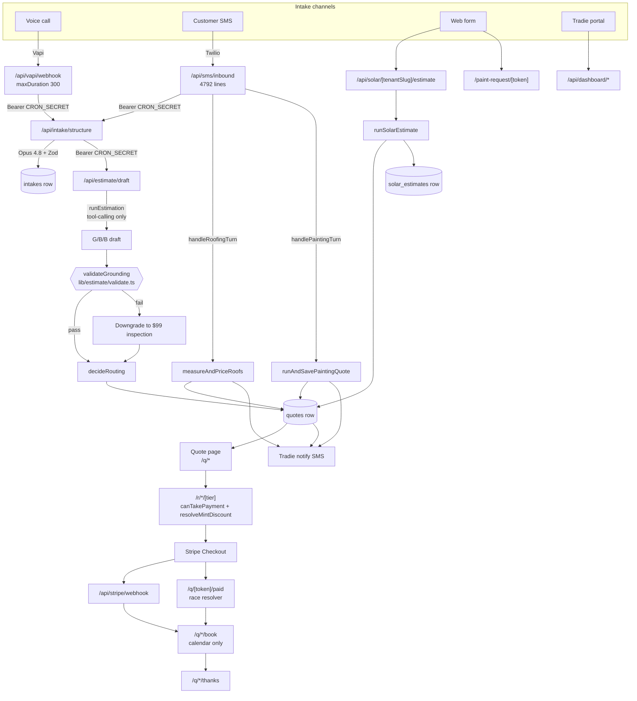
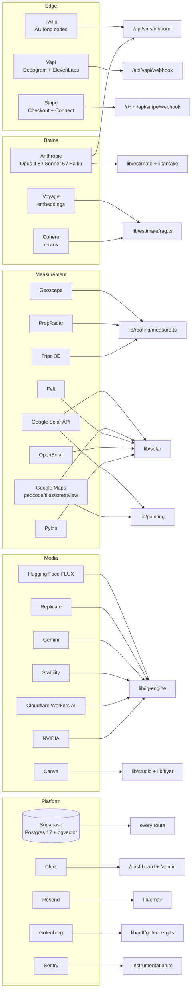

# System Architecture

One Next.js 16 application, four inbound edges, four differently-shaped
pipelines, one shared customer funnel. This note is the map. For *why* the
pipelines differ, read [[The Four Pipelines]].

## The whole shape



## Where each external service attaches



Full env-var inventory lives in [[Environment Variables and Feature Flags]];
per-service detail in [[External Services and Integrations]].

## The inbound edges, in detail

### Voice — `app/api/vapi/webhook/route.ts`

272 lines, `export const maxDuration = 300`
(`quotemate-automation/app/api/vapi/webhook/route.ts:11`). It fast-acks the
Vapi tool/end-of-call event, then self-calls the internal intake chain.

⚠ **Security gap, still open.** This route has **no auth of its own**. The
internal routes it calls are guarded, but the webhook that reaches them is
not — so the pipeline remains reachable through Vapi's endpoint by anyone who
finds it. Named in `CLAUDE.md` and confirmed by reading the handler.

### SMS — `app/api/sms/inbound/route.ts`

**4,792 lines in one file.** This is the largest single route in the codebase
and it holds four receptionists behind one Twilio webhook. It does not
dispatch on trade per message; it runs handlers in order and the first one
that engages returns. See [[SMS Inbound Route]] for the ordering and its
consequences.

The invariant that matters most here:

> A roofing thread on a **multi-trade** tenant captures every subsequent turn
> regardless of what the customer writes, because `shouldEngageRoofing`
> resumes on `isActiveRoofingFlow(prev)` alone and the route returns before
> `extractSlots` is ever reached.

That is not a bug report — it is the current behaviour, documented in
`CLAUDE.md` and in `docs/strategy.md` v18. See [[Roofing Receptionist]] and
[[Known Debt Register]].

### Web forms

`POST /api/solar/[tenantSlug]/estimate` is **public and unauthenticated by
design** — it is the customer-facing solar form endpoint,
`maxDuration = 120`, `dynamic = 'force-dynamic'`
(`quotemate-automation/app/api/solar/[tenantSlug]/estimate/route.ts:49-57`).
Painting has `/paint-request/[token]`; aircon has a plan-upload flow. See
[[Solar]] and [[Painting]].

### Portal

`/dashboard/*` behind Clerk. The tradie types the job. This was v1 and is
still the fallback for anything the automation cannot capture.
See [[Dashboard Overview]].

## The internal handoff and its single point of failure

Two routes are internal-only and guarded by exactly one function:

| Route | Guard | maxDuration |
|---|---|---|
| `POST /api/intake/structure` | `isCronAuthorised` (`app/api/intake/structure/route.ts:145`) | 300 (`:28`) |
| `POST /api/estimate/draft` | `isCronAuthorised` (`app/api/estimate/draft/route.ts:81`) | 300 (`:62`) |

`isCronAuthorised` lives in `quotemate-automation/lib/agents/cron.ts:23-36`
and is **fail-closed in production**:

```ts
if (env.NODE_ENV === 'production') {
  if (!expected) return false
  return got === `Bearer ${expected}`
}
```

> **Invariant.** `CRON_SECRET` MUST be present in every environment where
> `NODE_ENV === 'production'`. Without it, `isCronAuthorised` returns `false`
> unconditionally and **every intake channel stops producing quotes** — three
> of the four then text the customer a failure message.

The trap: Vercel sets `NODE_ENV=production` on **Preview** deployments too. A
secret scoped only to Production will 401 the entire pipeline on every preview
build. Six call sites send the header (vapi/webhook, sms/inbound,
q/choose/[token], intake/structure→draft, t/[slug]/lead, tenant/job-quote) and
`quotemate-automation/tests/internal-route-auth.test.ts` fails if a seventh
ships without it.

`proxy.ts` is a bare `clerkMiddleware()` and gates nothing. `isCronAuthorised`
is the only gate.

## Async execution model

Webhook routes **fast-ack under 500 ms**, then run the heavy work in
`next/server`'s `after()`. Idempotency is keyed on Twilio's `MessageSid`.
`maxDuration` is raised to 300 on the LLM and measurement routes — Vercel
Hobby's 10-second ceiling times these out, so the deployment needs Pro or
Railway.

⚠ **Known hole.** The inflight lock is **60 seconds**; a worst-case roofing
turn (address verify → Geoscape measure → pricing → photo compose) runs
200–300 seconds. A second Twilio webhook can therefore take the lock and run
concurrently, producing duplicate or out-of-order replies. See
[[Known Debt Register]].

## Cron

Six cron routes exist under `app/api/cron/`:

| Route | Purpose |
|---|---|
| `agents/[agent]` | Proxies to the Railway agent runner; only `eval`, `catalogue`, `tradie-learn` are valid names (`lib/agents/cron.ts:7-11`) |
| `followup-2h` | 2-hour quote follow-up (migration 159) |
| `kb-sync` | Knowledge-base sync (`lib/kb-sync`) |
| `push-receipts` | Push notification receipts (`lib/push`, migration 191) |
| `sms-cleanup` | SMS conversation housekeeping |
| `tenant-filestore-reconcile` | Tenant file store reconciliation |

⚠ **Drift** — `quotemate-automation/vercel.json` contains **only** a
`$schema` key. No `crons` array, no function overrides, no headers. Whatever
schedules these routes is configured outside the repository (Vercel dashboard
or Railway), which means the schedule is not reviewable in git. See
[[Deployment and Hosting]] and [[Operations Overview]].

## Model placement

| Step | Model | Where |
|---|---|---|
| Intake structuring | `claude-opus-4-8` | `lib/intake/structure.ts:187` |
| Estimation | `claude-opus-4-8` | `lib/estimate/run.ts:147` |
| SMS dialog, slot extraction, intent | `claude-sonnet-5` | `lib/sms/model.ts:33` (`SMS_RECEPTIONIST_MODEL`) |
| Voice persona | Haiku 4.5 | `VAPI_VOICE_MODEL` |

`SMS_RECEPTIONIST_MODEL` deliberately carries **no date suffix** — dated forms
such as `claude-sonnet-5-20260115` are not valid ids (`lib/sms/model.ts:31-33`).
`maxOutputTokens` must be passed explicitly at every call site because the
pinned `@ai-sdk/anthropic@3.0.71` resolves per-model limits from a hardcoded
table that predates Sonnet 5 and falls through to an unknown-model branch
(`lib/sms/model.ts:36-42`). See [[Model and Prompt Inventory]].

⚠ **Drift inside the code itself.** `lib/sms/model.ts:19-20` states the LLM
receptionist flag is "default OFF". It is **default ON**:

```ts
// lib/sms/llm-receptionist.ts:104-110
export function llmReceptionistEnabled(tenantId: string | null): boolean {
  const raw = (process.env.SMS_LLM_RECEPTIONIST_ENABLED ?? '').trim()
  if (/^(0|false|off|no)$/i.test(raw)) return false
  if (!raw || /^(1|true|on|yes|all)$/i.test(raw)) return true
  if (!tenantId) return false
  return raw.split(',').map((s) => s.trim()).filter(Boolean).includes(tenantId)
}
```

Unset means **on for every tenant**. `0`/`false`/`off`/`no` is the kill switch.
A comma-separated tenant-id list narrows to a pilot cohort. The stale comment
in `model.ts` is the hazard: an engineer reading it would believe the
deterministic state machines are driving production. They are not — they are
the per-turn fallback net. See [[LLM Receptionist]].

## Payments edge

Stripe Checkout is minted at `/r/[token]/[tier]`, `/r/roof/[token]/[tier]` and
`/r/paint/[token]/[tier]`. The webhook is
`app/api/stripe/webhook/route.ts`, verifying with
`webhooks.constructEventAsync(raw, sig, secret)` at `:133` — the async form,
required in an edge/Node runtime where the sync crypto path is unavailable.
Two webhook secrets exist: `STRIPE_WEBHOOK_SECRET` and
`STRIPE_CONNECT_WEBHOOK_SECRET`.

There is a **race** between the Stripe webhook and the customer's browser
returning to `success_url`. It is resolved by `/q/[token]/paid`, which is not
a rendered page but a router that calls `confirmPaidFromSession` and then
redirects onward to `/book`, `/thanks` or the quote. See
[[Mint Routes and Guards]] and [[Payments Overview]].

## Data plane

Everything lands in Supabase Postgres 17 with pgvector. Server routes use
`SUPABASE_SERVICE_ROLE_KEY`, which **bypasses RLS**, so tenancy is enforced by
application-layer `tenant_id` filtering. Storage buckets hold intake photos,
tenant files and tenant videos. `SUPABASE_DB_URL` is used by the `pg`-based
migration and diagnostic scripts. See [[Database Overview]] and
[[Tenancy and RLS]].

Observability is `lib/log/pipeline.ts` writing structured rows to
`pipeline_traces`, plus Sentry — `sentry.server.config.ts`,
`sentry.edge.config.ts`, `instrumentation.ts`, `instrumentation-client.ts`,
`@sentry/nextjs@^10.63.0`. ⚠ Both `README.md` and `CLAUDE.md` claim Sentry is
not present. It is. See [[Observability and Tracing]].

## Open questions

- What schedules the six cron routes, given `vercel.json` is empty of `crons`.
- Whether the Vapi webhook signature can be verified with a Vapi-side secret,
  which would close the unauthenticated-edge gap without touching the internal
  guard.
- Whether the 60-second inflight lock is configurable or hardcoded, and where.

## Related

- [[Platform Overview]]
- [[The Four Pipelines]]
- [[Repository Layout]]
- [[SMS Inbound Route]]
- [[Grounding Validator]]
- [[Mint Routes and Guards]]
- [[External Services and Integrations]]
- [[Known Debt Register]]
