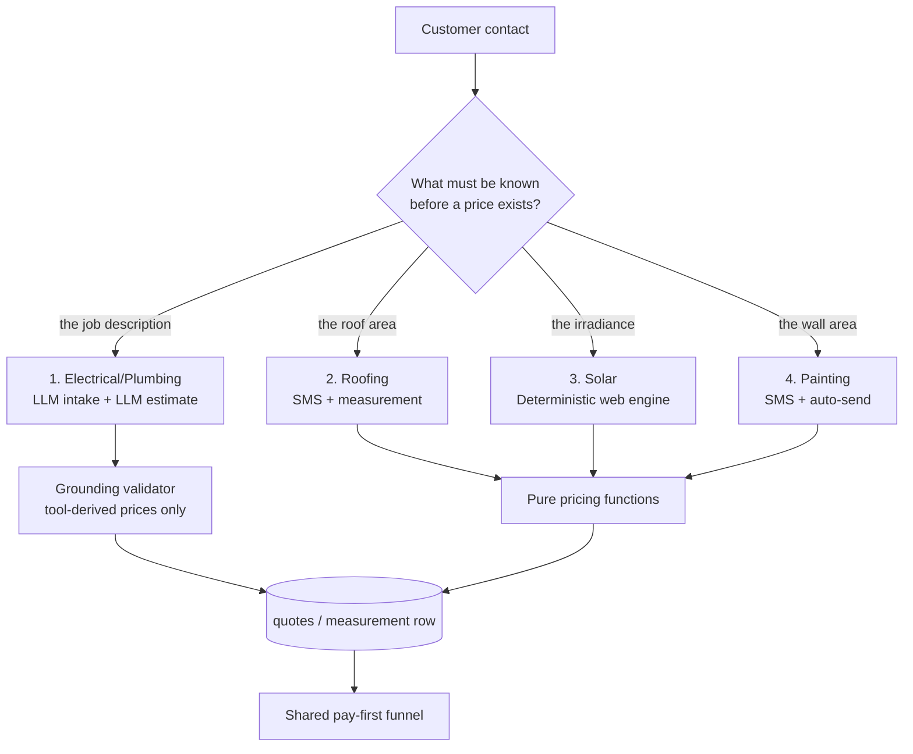
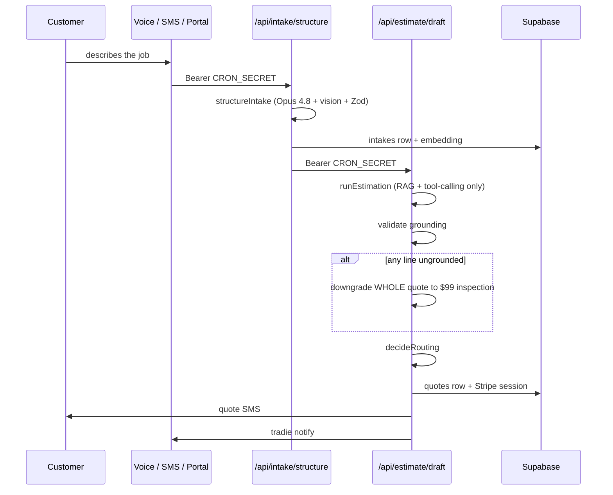

# The Four Pipelines

**This system is not one pipeline.** The most common and most expensive
mistake an engineer makes here is assuming that "a quote" is produced one way
and that a fix in one place fixes the others. It is not, and it does not.

There are four differently-shaped pipelines. They share a database, a customer
funnel and a payments edge. They share almost nothing else — not the intake
shape, not the pricing mechanism, not the review gate, not the failure mode,
not even whether an LLM is involved in producing the number.

## Why they diverged

Each pipeline exists because a different question had to be answered before a
price could exist:

| Pipeline | The hard question | The answer's shape |
|---|---|---|
| Electrical / plumbing | *What is the job?* | Unstructured language → structured intake → priced from a book |
| Roofing | *How big is the roof?* | Address → satellite/cadastral measurement → deterministic pricing |
| Solar | *How much sun, and what will the grid allow?* | Address → irradiance + export limits → deterministic sizing |
| Painting | *How much wall is there?* | Address → building footprint + street view → deterministic pricing |

Only the first one has a question an LLM can answer. The other three have
questions that a **measurement provider** answers, and the LLM's job shrinks
to holding the conversation that collects the address and the preferences.
That single distinction produces every structural difference below.



---

## 1. Electrical and plumbing — LLM intake, LLM estimate

**The only pipeline where a model is in the room when the price is formed**,
and therefore the only one that needs a grounding validator as a hard backstop.

### Entry functions

| Step | Function | File |
|---|---|---|
| Structure the intake | `structureIntake` | `lib/intake/structure.ts:183` |
| Finalise the intake object | `finaliseIntake` | `lib/intake/structure.ts:116` |
| Estimate | `runEstimation` | `lib/estimate/run.ts:144` |
| Load grounded prices | `loadCandidatePrices` | `lib/estimate/run.ts:1716` |
| Validate grounding | `lib/estimate/validate.ts` | — |
| Route | `decideRoutingDetailed` / `decideRouting` | `lib/routing/decide.ts:87` / `:114` |

HTTP entry: `POST /api/intake/structure` → `POST /api/estimate/draft`, both
guarded by `isCronAuthorised`, both `maxDuration = 300`.

### The flow



Both LLM steps run **`claude-opus-4-8`** (`lib/intake/structure.ts:187`,
`lib/estimate/run.ts:147`). The estimation call has **tool-calling only** for
prices (`lib/estimate/tools.ts`) — the model may not type a number.

### The two guards that matter

**Grounding.** `lib/estimate/validate.ts` checks every line-item price derives
from `pricing_book` + `shared_*` + `tenant_custom_assemblies` **scoped to
`intake.trade`**. Any single failure downgrades the *entire* quote to the $99
inspection route — not just the offending line. See [[Grounding Validator]].

**Routing.** `decideRoutingDetailed` (`lib/routing/decide.ts:87-111`) is a
five-condition AND, and every failure is *named* for observability:

```ts
if (intake.inspection_required || quote.needs_inspection)
  return { decision: 'inspection_required', reasons: ['inspection_trigger'] }
if (input.v3AutoSendEnabled === false) reasons.push('auto_send_hard_off')
if (intake.confidence !== 'HIGH') reasons.push('confidence_not_high')
if (!jobAllowed) reasons.push(jobType ? 'job_type_not_allowlisted' : 'job_type_missing')
if (input.pricingPath !== 'deterministic') reasons.push('pricing_path_not_deterministic')
reasons.push(...failedDeployGates(input.deployGate))
if (reasons.length === 0) return { decision: 'auto_send', reasons: [] }
return { decision: 'tradie_review', reasons }
```

> **Invariant (R7).** `pricingPath` MUST be `'deterministic'` for auto-send.
> An Opus-priced or unknown-path quote is held for tradie review **even when
> confidence is HIGH and the job type is allowlisted**. The LLM may draft; it
> may not auto-send its own arithmetic.

Note also that an inspection trigger short-circuits *before* confidence is
consulted — the strongest signal wins unconditionally. See
[[Routing Decision]].

### What the customer pays

Since `docs/strategy.md` v20 (2026-08-06) the Stripe session minted for these
two trades is **always the flat $99 site inspection**. The `good`/`better`/
`best` draft is still computed, stored, rendered on `/q/[token]`, printed in
the PDF and listed in the SMS — it is simply not sold against. The 30% deposit
converted at 3.2% on electrical against 14.8% for the $99, and plumbing's
deposit converted **0 out of 53** times.

Since migration 194 (`sql/migrations/194_quote_chain.sql`) the $99 is the
**first of up to three charges**: `initial` ($99) → `final` (deposit, a
job-type percentage of the confirmed total *less* the $99 already paid, plus a
2% platform fee on top) → `balance` on completion. Each is its own `quotes`
row linked by `quote_kind` and `parent_quote_id`. See
[[The Post-Visit Quote Ladder]] and [[What the Customer Pays by Trade]].

Deep notes: [[Intake Structuring]], [[Estimate Engine]], [[Electrical]],
[[Plumbing]], [[EV Charger Jobs]].

---

## 2. Roofing — SMS receptionist plus measurement

**LLM conversation, deterministic money.** The customer flow is no longer
zero-LLM (changed 2026-07-26, `docs/strategy.md` v17), but the model still
never produces a figure.

### Entry functions

| Step | Function | File |
|---|---|---|
| SMS turn handler | `handleRoofingTurn` | `app/api/sms/inbound/route.ts:459` (called at `:2597`) |
| Engage decision | `shouldEngageRoofing` | `lib/sms/roofing-receptionist.ts:1046` |
| Resume test | `isActiveRoofingFlow` | `lib/sms/roofing-receptionist.ts:1029` |
| LLM turn | `lib/sms/llm-receptionist.ts` | — |
| Fallback state machine | `lib/sms/roofing-{intake,receptionist,compose}.ts` | — |
| Measure and price | `measureAndPriceRoofs` | `lib/roofing/measure.ts:231` |
| Tradie notify | `notifyRoofingTradie` | `lib/sms/roofing-notify.ts:123` |

### The deterministic spine

Whichever way the turn is decided, the pipeline underneath is identical:

```
address → map-verify (lib/sms/verify-address.ts) → confirm → intent
→ material → (Colorbond profile) → pitch → measureAndPriceRoofs
→ send roof photos + "which building(s)?" → priced SMS + /q/roof/[token] + PDF
```

`measureAndPriceRoofs` (`lib/roofing/measure.ts:231`) is a **multi-structure**
pipeline: it uses the provider's `measureAll()` when available and otherwise
wraps a single `measure()` into a one-building result, so any provider works.
Critically, each structure is priced with its own inputs —

> **Invariant.** Areas are **never summed onto a single material rate**. A
> 120 m² house and a 30 m² shed are two priced structures, not one 150 m²
> roof.

A PropRadar property-context lookup runs **concurrently** with the
measurement, keys off the same address, resolves to `null` when enrichment is
off or the address is uncovered, and never throws
(`lib/roofing/measure.ts:238-241`).

### The two-token pair

`lib/roofing/tokens.ts` mints tokens as a pair: the customer's `public_token`
(`/q/roof/[token]`) and the tradie's `measure_token` (`/m/[measure_token]`,
the Measurement Results page where structures are toggled, measurements
corrected, the job re-priced and saved as a quote). The tradie also has a
pure-dashboard path via `/api/roofing/{measure,save,save-as-quote}`.

### The engage logic — and where CLAUDE.md is now stale

`shouldEngageRoofing` has **four arms, checked in order**
(`lib/sms/roofing-receptionist.ts:1046-1105`):

1. `if ((prev?.declined_trades ?? []).includes('roofing')) return false` —
   checked **first**, because a refusal ("no i dont want a roofer") itself
   contains the roofing keyword and a later arm would re-open the very flow
   the customer just declined. Shipped after a live failure on 2026-07-25.
2. `const canResume = isActiveRoofingFlow(prev) && !followupPinActive;
   if (canResume) return true` — an open roofing thread resumes, **unless** a
   follow-up pin is active on the thread.
3. `if (!generalMidGather && looksLikeRoofingEnquiry(inbound)) return true` —
   a fresh keyword engages **only when the general dialog is not already
   mid-gather**.
4. A roofing-only tenant (`trades === ['roofing']`) engages with **no keyword
   at all**, because there is no other trade to route to.

⚠ **Drift.** `CLAUDE.md` states that `shouldEngageRoofing` lives at
`lib/sms/roofing-receptionist.ts:968` and "resumes on `isActiveRoofingFlow(prev)`
alone, never inspecting the inbound text". Both details have moved:

- The function is at **line 1046**, not 968.
- The resume arm is now `isActiveRoofingFlow(prev) && !followupPinActive` — a
  follow-up pin *does* break the resume.
- `declined_trades` and `generalMidGather` guards have shipped since the doc
  was written, and the dispatch calls are at `route.ts:2597` (roofing) and
  `:2681` (painting), not `:2185-2187`.

The **core hazard remains real**: arm 2 still returns `true` without looking
at the inbound text, so an open roofing thread with no follow-up pin still
captures the next turn whatever the customer writes, and `extractSlots`
(`route.ts:2824`) is never reached because the handler returns at `:2640`.
`generalMidGather` narrows the *cold-start* hijack, not the *resume* capture.

The source comment at `lib/sms/roofing-receptionist.ts:1066-1092` is worth
reading in full — it names the live failure (conversation `b2625cbe`, Atomic
Electrical, 2026-07-31: "It's a 125mm insulated panel roofing" matched the
bare substring `roofing` on an electrical downlight job and held the thread
for nine more messages), states that four vocabulary patches had already been
tried, and explicitly accepts the trade-off that a genuine mid-electrical
roofing upsell is now lost. That is the right way to record a decision.

There is also a **stale-state closer**: when roofing is turned off for a
tenant mid-thread, `closeStaleRoofingState` writes the closed state back to
`sms_conversations.roofing_state` so the general dialog does not inherit a warm
roofing thread and a later re-enable does not resume a zombie flow
(`route.ts:2645-2665`, best-effort).

Deep notes: [[Roofing]], [[Roofing Receptionist]], [[SMS Inbound Route]].

---

## 3. Solar — deterministic web engine, no SMS

**The only pipeline with no conversational intake at all.** There is no SMS
solar flow; "solar quote please" texted to a QuoteMax number is a dead lead.

### Entry function

| Step | Function | File |
|---|---|---|
| HTTP entry | `POST` | `app/api/solar/[tenantSlug]/estimate/route.ts:57` (`maxDuration = 120`, `dynamic = 'force-dynamic'`) |
| Engine | `runSolarEstimate` | `lib/solar/intake.ts:114` |
| Finalise | `finaliseSolarEstimate` | `lib/solar/intake.ts:60` (called at `:297`) |
| Release gate | `canShowPrices` | `lib/solar/publish.ts:37` |
| Auto-release flag | `SOLAR_AUTO_RELEASE` | `lib/solar/release.ts:65-72` |

The public form is `/solar/[tenantSlug]`; the customer surface is
`/q/solar/[token]`, token-gated against `solar_estimates.public_token`.

### The chain

```
geocode → Google Solar coverage gate → roof facts (or manual bucket fallback)
→ sizing into G/B/B tiers (capped by roof area AND DNSP export limit)
→ annual AC production (CEC cross-check)
→ price (gross − STC rebate = net, CER postcode→zone table)
→ savings / payback economics → guardrails
```

Every step is a pure function. No model writes a price. The one AI feature —
the "roof intelligence" brief, `lib/solar/ai-brief.ts`, Sonnet — is prompted
with **zero dollar figures** and validated.

### Three rows, one estimate

`runSolarEstimate` persists **three** rows:

1. an `intakes` row,
2. a `solar_estimates` row,
3. a **twin `quotes` row** so the generic pay-first funnel works.

That twin row is why solar deposits mint through `/r/[token]/[tier]` — the
same route electrical and plumbing use. See [[Mint Routes and Guards]].

### The config freshness gate

`runSolarEstimate` throws **before any computation** if the config fails
validation for the install year (`lib/solar/intake.ts:143-147`):

```ts
const validation = validateSolarConfig(args.config, installYear)
if (!validation.ok) {
  throw new Error(`solar config invalid: ${validation.code} — ${validation.detail}`)
}
```

> **Invariant.** STC deeming and CER zone data are year-dependent. A stale
> `solar_config` MUST fail loudly at the top rather than produce a quietly
> wrong rebate. Do not add a fallback here.

It also requires orchestrator opts up front —
`if (!opts) throw new Error('runSolarEstimate requires orchestrator opts (geocode + network).')`
(`lib/solar/intake.ts:139-140`) — so a caller cannot accidentally run the
engine without a geocoder and a DNSP network.

Only a **finite positive** `requestedSizeKw` anchors the sizing tiers;
anything else degrades to `null` and the tiers anchor to the roof maximum
(`lib/solar/intake.ts:153-160`). The same value backs both
`context.requested_size_kw` (what `sizing.ts` reads) and
`context.requested_system_kw` (the DB column the dashboard reads back) — two
names for one number, which is a trap if you only update one.

### Release gate and its known hole

`SOLAR_AUTO_RELEASE` (default on) auto-releases a **clean, priced,
non-inspection** estimate in `after()`. Flagged and inspection-routed
estimates are held behind `lib/solar/publish.ts`.

⚠ **Two live holes, both critical:**

1. `finaliseSolarEstimate` can overwrite an `inspection_required` decision, so
   auto-release can send a **$0 confirmed quote** when the engine cannot size
   a system — no imagery, roof too small, or any Google Solar outage.
2. "Held for review" is **cosmetic on token routes**: the PDF route and the
   `/r/*` deposit link check `routing` but not `confirmed_at` / `released_at`,
   so a flagged estimate is still downloadable and payable by anyone holding
   the link. The painting PDF route has the same class of hole.

Additionally, `/api/solar/{confirm,redraft}` check that the caller is *signed
in*, not that they *own the quote*, and they key off the customer's own token
— a cross-tenant action. See [[Known Debt Register]].

Background OpenSolar (`lib/opensolar`) and Pylon (`lib/pylon`, `PYLON_ENABLED`)
cross-checks can add guardrail flags after the fact.

Deep note: [[Solar]].

---

## 4. Painting — SMS receptionist, auto-send

Mirrors roofing structurally, including the LLM conversation layer and the
same `SMS_LLM_RECEPTIONIST_ENABLED` flag. Diverges on the **release model**.

### Entry functions

| Step | Function | File |
|---|---|---|
| SMS turn handler | `handlePaintingTurn` | `app/api/sms/inbound/route.ts:1215` (called at `:2681`) |
| Engage decision | `shouldEngagePainting` | `lib/sms/painting-receptionist.ts:451` |
| Resume test | `isActivePaintingFlow` | `lib/sms/painting-receptionist.ts:406` |
| Estimate and persist | `runAndSavePaintingQuote` | `lib/painting/quote-dispatch.ts:72` |
| Rate card | `loadPaintingRateCard` | `lib/painting/quote-dispatch.ts:38` |
| Compose delivery | `composePaintingQuoteDelivery` | `lib/painting/quote-dispatch.ts:163` |
| Tradie notify | `notifyPaintingTradie` | `lib/painting/release.ts:42` |
| PDF for MMS | `resolvePaintingPdfMms` | `lib/painting/quote-dispatch.ts:141` |

Alternate intake: the `/paint-request/[token]` self-serve form.

Area comes from a Google Solar building lookup plus street view; pricing lives
in `lib/painting/pricing.ts`.

### Auto-send and the two-column rule

Since `docs/strategy.md` v21 (2026-08-07) a priced row is stamped
`released_at` **at save time**, inside `runAndSavePaintingQuote`, and the
customer is texted the full quote on the same turn. The old tradie review gate
is retired — it silently dropped 3 of 8 live sends.

```ts
// lib/painting/quote-dispatch.ts:93-98
const inspection = estimate.price.routing.decision === 'inspection_required'
const row = buildSavedPaintingRow({
  ...
  releasedAt: inspection ? null : new Date().toISOString(),
```

> **Invariant.** `released_at` MUST be stamped **before** the send, because
> the quote page, the PDF route and the $99 mint all gate on it. An
> inspection-routed row has no price to show and keeps its `null`.

There are **two columns answering two different questions**, and conflating
them is the documented failure mode:

| Column | Question | Rule |
|---|---|---|
| `released_at` (migration 157) | May the customer see prices? | Written **before** the send; a dashboard save stamps it while texting nobody |
| `quote_sent_at` (migration 189) | Did a carrier accept the message? | The **only** thing `/p` may read to show "Sent to customer" |

Every painting send path returns `{ sent }`. A first send that fails rolls
`released_at` back through `revertPaintingRelease`, which checks the write's
`error` — because **supabase-js resolves `{data, error}` on failure, it does
not throw**. A bare `await` on any Supabase or Twilio call is the silent-failure
bug class this whole design exists to close.

> **Never** re-defer the release send into `after()`, and **never** report
> `ok` without `sent`. That exact pairing is how 3 of 8 live releases texted
> nobody while `/p` displayed "Sent".

### ⚠ Drift the other way — a documented debt that is already fixed

`CLAUDE.md` lists as open debt: "Draft/edit still writes per-tier Sessions into
`painting_measurements.stripe_links` (`lib/painting/quote-dispatch.ts`) that
nothing reads — dead writes, worth a cleanup."

That is **fixed**. `runAndSavePaintingQuote` now mints nothing, and says so
(`lib/painting/quote-dispatch.ts:120-127`):

> "No Stripe session is minted here. Draft time used to create up to three
> per-tier 30% deposit Sessions, but since spec painting-site-visit-first
> nothing can link them (`/r/paint` 302s G/B/B onto the $99 site visit), and
> this function is awaited BEFORE the customer's holding SMS — so those were
> three sequential Stripe round-trips of pure latency producing dead links."

The one payable Session, the flat $99 site visit, is minted **on demand** by
`/r/paint/<token>/inspection` and stored under `stripe_links.inspection`.

The gate modules are unchanged and still load-bearing: `canShowPaintingPrices`
and `resolvePaintMintTier` still withhold an unreleased row, and `/p/[token]`
plus `/api/painting/release/[token]` remain for edits, resends and retrying a
failed auto-send.

**Commercial painting is a separate stack** (`lib/commercial-painting`,
`paint_rates` / `paint_runs`), texts the price immediately, keeps its own
tradie release gate and a tier deposit, and is untouched by v21. Do not assume
a painting fix reaches it. See [[Commercial Painting]].

Deep notes: [[Painting]], [[Painting Receptionist]].

---

## Side-by-side

| | 1. Elec/Plumb | 2. Roofing | 3. Solar | 4. Painting |
|---|---|---|---|---|
| Intake | Voice / SMS / portal | SMS + dashboard | Web form only | SMS + web form |
| LLM in conversation | Yes (Sonnet 5) | Yes (Sonnet 5) | **No** | Yes (Sonnet 5) |
| LLM in pricing | **Yes** (Opus, tool-calls) | No | No | No |
| Grounding validator | Required backstop | `assertGroundedReply` on text | N/A | `assertGroundedReply` on text |
| Price source | `pricing_book` + `shared_*` | `lib/roofing/pricing` | `lib/solar/*` pure chain | `lib/painting/pricing.ts` |
| Measurement provider | none | Geoscape, PropRadar, Google | Google Solar, Felt, OpenSolar, Pylon | Google Solar + street view |
| Row written | `quotes` | `roofing_measurements` + `quotes` | `intakes` + `solar_estimates` + twin `quotes` | `painting_measurements` |
| Review gate | `decideRouting` → auto-send / review / inspection | auto-send | `SOLAR_AUTO_RELEASE`, clean only | auto-send at save (v21) |
| Customer page | `/q/[token]` | `/q/roof/[token]` | `/q/solar/[token]` (+ generic twin) | `/q/paint/[token]` |
| Mint route | `/r/[token]/[tier]` | `/r/roof/[token]/[tier]` | `/r/[token]/[tier]` | `/r/paint/[token]/[tier]` |
| Customer pays | $99 → deposit → balance (mig 194) | flat $99 only | tier deposit | flat $99 only |
| Signature failure | ungrounded line → whole quote to inspection | thread capture on multi-trade tenant | $0 confirmed quote on provider outage | `ok` reported without `sent` |

## Rules that follow from all this

1. **Never generalise a fix across pipelines without checking.** "Painting
   auto-sends" says nothing about commercial painting. "Solar holds flagged
   estimates" says nothing about whether the PDF route honours the hold.
2. **The trade gate is an allowlist, never a blocklist.** The elec/plumb
   payment gate is exactly `['electrical','plumbing']` on the raw
   `intakes.trade`, and it **fails open** when the trade cannot be resolved. A
   blocklist ("not solar") silently kills roofing's deposit path.
3. **`needs_inspection` is a different axis** from the $99 change. It
   force-nulls the tiers, so those rows never had prices to show and were
   always $99-only. The v20 change targets `needs_inspection = false` rows —
   prices shown, $99 charged.
4. **Never derive the "other trade active" signal from
   `conversation_state.slots.job_type`.** It has been `null` on every
   conversation since 2026-07-08 and would suppress all SMS quoting. The
   correct signal comes from `roofing_state` / `painting_state.last_step` via
   `sideEffectsAllowed` in `lib/sms/inbound-helpers.ts`.

## Open questions

- Aircon (`lib/aircon`) and signage (`lib/signage`) are arguably a fifth and
  sixth shape — plan-upload → sizing, and photo/vision assessment against
  `signage_rules` — but both hang off the dashboard and the generic funnel
  rather than owning an intake channel. Whether they warrant pipeline status
  is a judgement call this note defers.
- Whether `handleRoofingTurn` and `handlePaintingTurn` can ever both engage on
  one message, or whether the roofing early-return at `route.ts:2640` makes
  that impossible by construction.

## Related

- [[Platform Overview]]
- [[System Architecture]]
- [[SMS Inbound Route]]
- [[Grounding Validator]]
- [[Routing Decision]]
- [[Roofing]]
- [[Solar]]
- [[Painting]]
- [[What the Customer Pays by Trade]]
