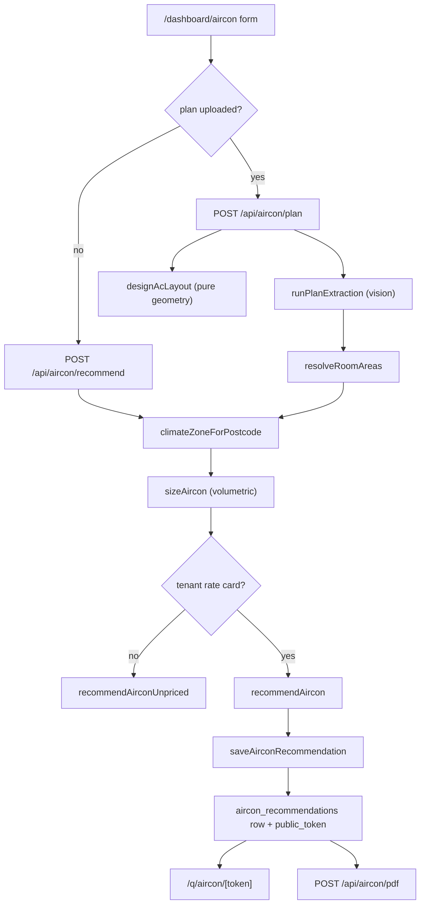

# Aircon

Air-conditioning is a **tradie-driven dashboard tool**, not a customer intake channel. There is no
aircon SMS receptionist, no voice path, and no self-serve customer form. A tradie opens
`/dashboard/aircon`, types a property's details (or uploads a floor plan), and the deterministic
engine returns an indicative **ducted vs split** recommendation with a price *band* and a
"book a site assessment" posture. Aircon never takes money — see [[What the Customer Pays by Trade]].

It is the smallest complete trade in the platform: a real pipeline end-to-end, with genuinely
narrow surface area. Two API entry points, one persisted table, one customer page, one PDF.

## What is actually built

| Piece | Status | Where |
|---|---|---|
| `trades` registry row `aircon` | Built | `quotemate-automation/sql/migrations/097_aircon_trade_phase1.sql` |
| Climate zone resolver | Built (simplified heuristic) | `quotemate-automation/lib/aircon/climate.ts` |
| Volumetric sizing engine | Built, pure, unit-tested | `quotemate-automation/lib/aircon/sizing.ts` |
| Rate-card pricing (ducted + split) | Built, pure | `quotemate-automation/lib/aircon/recommend.ts` |
| Tenant rate-card resolution + authority | Built | `quotemate-automation/lib/aircon/pricing-context.ts` |
| Form entry point | Built | `quotemate-automation/app/api/aircon/recommend/route.ts` |
| Floor-plan entry point (vision) | Built | `quotemate-automation/app/api/aircon/plan/route.ts` |
| Deterministic layout design (SVG overlay) | Built, **not persisted** | `quotemate-automation/lib/aircon/design.ts` |
| Persistence | Built (mig 144) | `aircon_recommendations` |
| Customer page | Built, read-only | `quotemate-automation/app/q/aircon/[token]/page.tsx` |
| PDF report | Built | `quotemate-automation/app/api/aircon/pdf/route.ts` |
| Customer intake (SMS / voice / web form) | **Does not exist** | — |
| Booking, deposit, Stripe mint | **Does not exist** | — |

## The pipeline



### 1. Climate

`climateZoneForPostcode(postcode, state)` groups AU into four cooling buckets —
`cool | temperate | subtropical | tropical` — from a state switch plus a couple of postcode ranges
(`quotemate-automation/lib/aircon/climate.ts:26`). It is explicitly a **v1 approximation**: the
file's own header says the real NCC zone-by-postcode table is "a future data import". NT is always
tropical, TAS always cool, QLD splits at postcode 4700, NSW carves out the far north coast
(2480–2489) and the Snowy (2625–2627).

The returned `note` string carries "simplified v1 mapping — confirm on site" into the response, so
the caveat travels with the number.

### 2. Sizing — volumetric, not per-m²

`sizeAircon` (`quotemate-automation/lib/aircon/sizing.ts:126`) is pure and computes:

```
kW = volume_m3 × climate_factor × room_type_factor × insulation × storey × raked_stratification
```

Ceiling height feeds the load through **volume** rather than as a fudge multiplier — the file header
makes that design choice explicit. Constants worth knowing:

| Constant | Values | Source |
|---|---|---|
| `VOLUMETRIC_CLIMATE_FACTOR` (kW/m³) | cool 0.0542 · temperate 0.0625 · subtropical 0.0708 · tropical 0.0833 | `sizing.ts:34` |
| `ROOM_TYPE_FACTOR` | bedroom 0.7 · living 1.0 | `sizing.ts:39` |
| `CEILING_HEIGHT_M` | standard 2.4 · high 2.7 · raked 2.7 | `sizing.ts:41` |
| `RAKED_STRATIFICATION_MULT` | 1.05 | `sizing.ts:52` |
| `INSULATION_MULT` | good 0.9 · average 1.0 · poor 1.15 · unknown 1.05 | `sizing.ts:54` |
| `STOREY_MULT` | 1 → 1.0 · 2 → 1.06 · 3+ → 1.1 | `sizing.ts:66` |
| `DIVERSITY_FACTOR` | 0.8 (connected → ducted central unit) | `sizing.ts:86` |
| `AC_UNIT_SIZES` | 2.5, 3.5, 5.0, 7.0, 8.0 kW | `sizing.ts:89` |
| `CONFIDENCE_BAND` | high ±10% · medium ±18% · low ±30% | `sizing.ts:80` |

Only two room kinds are ever conditioned — `bedroom` and `living` (`types.ts`, `RoomType`).
Bathrooms, laundries, garages and halls are excluded from the load.

`floor_area_source` records where the area came from: `entered`, `typical_room_mix`,
`solar_footprint`, or `floor_plan`. An entered `floor_area_m2` pins confidence to high; a
`FLOOR_AREA_RATIO` sanity clamp of 0.45–2.4 (`sizing.ts:74`) guards against absurd inputs.

### 3. Location evidence (Google, best-effort)

`resolveAcLocationEvidence` (`quotemate-automation/lib/aircon/location.ts`) fans out to three
Google APIs, each of which degrades to a typed `{ ok: false, code }` rather than throwing:

| Evidence | Env var (with fallback) | Used for |
|---|---|---|
| Geocode | `GOOGLE_GEOCODE_API_KEY` → `GOOGLE_MAPS_API_KEY` | lat/lng, map, formatted address |
| Weather | `GOOGLE_WEATHER_API_KEY` → `GOOGLE_MAPS_API_KEY` | shown as context on the dashboard |
| Building footprint | `GOOGLE_SOLAR_API_KEY` → `GOOGLE_MAPS_API_KEY` | floor-area fallback |

The footprint path reuses painting's Solar parsers (`parseFootprintM2`, `parseImageryDate` from
`quotemate-automation/lib/painting/providers/solar`). When the tradie leaves floor area blank, the
route substitutes `footprint × storeys × 0.85 wall correction`
(`quotemate-automation/app/api/aircon/recommend/route.ts:76`). **An entered area always wins.**

`GET /api/aircon/static-map` proxies a Google Static Maps satellite tile through
`buildStaticMapUrl` from `quotemate-automation/lib/roofing/google-maps` — it is dual-auth gated
(`resolveIdentityRequest`) and 503s when `GOOGLE_MAPS_API_KEY` is unset.

### 4. Money — a tenant rate card, never the estimator

Aircon does **not** go through the Opus estimator or the [[Grounding Validator]]. The money path is
a rate card, and it is per-tenant only.

`loadTenantAcPricingContext` (`quotemate-automation/lib/aircon/pricing-context.ts:60`) reads
`pricing_book` rows for the tenant and looks for `overlays.aircon_rate_card`. Selection order:
the tenant's primary trade's book, then a book with `trade = 'aircon'`, then the alphabetically
first carded book.

`parseTenantAcRateCard` (`recommend.ts:332`) accepts **only a complete card** — every head band in
`REQUIRED_HEAD_BANDS = ['2.5','3.5','5','7','8']` must be a positive finite number, and the
multi-head discount must be a 0–1 fraction. Its doc comment is the invariant:
*"Never fills gaps from seed defaults."*

> **Invariant.** A tenant with no complete `aircon_rate_card` MUST receive
> `pricing_status: 'tenant_pricing_required'` (`recommendAirconUnpriced`, `recommend.ts:301`), never a
> platform-default price. There is no `DEFAULT_AC_RATE_CARD` in the codebase any more — grep returns
> nothing, even though migration 097's header still names it. ⚠ See *Drift* below.

Pricing shapes:

- **Split** — `sum(per_head[roundUpToUnit(room.kw)])` across every conditioned room, minus
  `multi_head_discount_pct` when there are 2+ heads (`recommend.ts:60`). An unmatched band falls
  back to the `'8'` rate.
- **Ducted** — `base_ex_gst + rate_per_kw × capacity + per_zone × zones`, then a multi-storey
  uplift (`DUCTED_STOREY_UPLIFT_PCT = { 1: 0, 2: 0.08, 3: 0.15 }`, `recommend.ts:122`), then
  `max(min_ex_gst, …)`. Zero conditioned zones short-circuits to `$0` with **no** minimum floor —
  the comment calls this out: "no phantom min-price floor".

Every option carries an `AcPriceExplanation` — point estimate ex- and inc-GST, the band percentage,
the literal `formula` string, a `band_reason`, and itemised `components` / `adjustments`. This is
what the dashboard and PDF render as "the working", and it is why aircon reads as transparent
without ever needing an LLM in the money path. GST wording comes from `airconPriceBasis`
(`quotemate-automation/lib/aircon/gst-copy.ts`) so unregistered tenants do not display "inc GST".

### 5. Routing — always one answer

`AcRoutingDecision` is a single-member union: `decision: 'book_assessment'`
(`quotemate-automation/lib/aircon/types.ts`). `decideRouting` (`recommend.ts:210`) only changes the
*reason* — raked ceilings, low sizing confidence, 3+ storeys, `connected_kw >= 14`, and so on.

> Aircon has no "quotable" branch. Every result, priced or not, routes to a site assessment. This is
> the trade's deliberate "indicative posture", stated in the types file and enforced by the schema
> (`recommendation-schema.ts` pins `routing.decision` to the literal `'book_assessment'`).

## The floor-plan branch

`POST /api/aircon/plan` accepts `multipart/form-data` with `plan`, `address`, `inputs`, and an
optional `request_id`.

| Constraint | Value | Source |
|---|---|---|
| Media types | `application/pdf`, `image/png`, `image/jpeg`, `image/webp` | `plan-extract.ts:27` (`PLAN_MEDIA_TYPES`) |
| Size cap | 32 MB (`MAX_PLAN_BYTES`) | `app/api/aircon/plan/route.ts:31` |
| `maxDuration` | 300 s — "the vision read of a full plan can take minutes" | `app/api/aircon/plan/route.ts:28` |
| Model | `claude-opus-4-8` default, overridable by `AC_PLAN_MODEL` then `ESTIMATION_MODEL` | `plan-extract.ts:25`, `:186` |

The vision call and the Google location fan-out run in `Promise.all`, and the extraction is wrapped
in a settled-result shim so a location failure cannot mask an extraction failure
(`app/api/aircon/plan/route.ts:110`).

Failure modes are distinct and typed, which is unusually careful for a small trade:

| Error | HTTP | Meaning |
|---|---|---|
| `unsupported_plan_type` | 400 | media type not in `PLAN_MEDIA_TYPES` |
| `plan_too_large` | 400 | over 32 MB |
| `plan_extraction_failed` | 502 | the model call threw |
| `plan_unreadable` | 422 | the model returned zero rooms |
| `plan_no_conditioned_rooms` | 422 | rooms read, but no bedrooms/living |
| `pricing_persistence_failed` | 503 | priced, but the insert did not land |

`plan-extract.ts` is structured as pure core + thin IO (`buildPlanExtractionPrompt`,
`parsePlanExtraction`, `runPlanExtraction`) and `LOAD_TYPE_BY_ROOM` maps the nine extracted room
kinds down to the two conditioned load types — kitchens count as `living` (open-plan AU stock),
studies size like `bedroom`.

`resolveRoomAreas` (`quotemate-automation/lib/aircon/plan-scale.ts:79`) turns page-percent polygons
into real m², recording an `area_source` of `dimensions`, `stated_total_apportioned`, or
`scale_inferred` per room. Coordinates follow the estimator convention: 1-based page, x/y as
percentages 0–100 from the top-left.

`designAcLayout` (`quotemate-automation/lib/aircon/design.ts`) is **pure geometry** — polygon
centroids place ducted outlets and split heads, straight runs go from the central unit to each
outlet, and zones are grouped. `THREE_PHASE_KW = 12` and `MAX_SPLIT_HEADS = 5` produce warnings.
The header states the boundary plainly: *"PURE GEOMETRY — no LLM, no randomness, no prices. This is
the engineering artifact; Gemini image-gen never draws it."* It renders as an SVG overlay through
`FloorPlanOverlay` on the dashboard.

⚠ **The plan design is not persisted.** `saveAirconRecommendation` writes only the
`AcPricedRecommendation` jsonb. The `plan` readout and the `design` object exist solely in the HTTP
response. Refresh the dashboard and the overlay is gone; `/q/aircon/[token]` never shows it. This is
the single largest maturity gap in the trade.

## Persistence and identity

`aircon_recommendations` (migration 144) is the only aircon-owned table:

| Column | Notes |
|---|---|
| `tenant_id` | FK `tenants(id) on delete set null` |
| `created_by` | uuid → `auth.users`; **must** be a Supabase id, never a Clerk `user_…` |
| `address`, `postcode`, `state` | as submitted |
| `customer_name`, `customer_phone` | columns exist; no route writes them |
| `recommendation` | the full `AcPricedRecommendation` jsonb |
| `routing` | flat copy, e.g. `'book_assessment'` |
| `public_token` | unique partial index where not null |

RLS is enabled with no anon policy; reads go through the service-role key.

> **Invariant (created_by).** `supabaseUserIdFor`
> (`quotemate-automation/lib/aircon/save-recommendation.ts:31`) resolves `tenant.owner_user_id` for a
> Clerk caller and the caller's own id for a Supabase caller, else `null`. Passing a Clerk
> `user_…` string fails the uuid FK — the same trap documented in
> `quotemate-automation/app/api/roofing/save/route.ts`.

> **Invariant (fail closed on money).** Both routes return
> `503 pricing_persistence_failed` when `pricing_status === 'priced'` but `saved` is null
> (`app/api/aircon/recommend/route.ts:104`, `app/api/aircon/plan/route.ts:190`). The comment states
> the rule: *"Never expose in-memory money after a failed insert."* Do not soften this to a warn-and-
> continue; the priced artefact is only authoritative once it exists under the tenant.

### Idempotency via a derived token

When a `request_id` is supplied, `public_token` is **not** random — it is
`HMAC-SHA256(SUPABASE_SERVICE_ROLE_KEY, "aircon:{tenantId}:{requestId}")` truncated to 32 hex chars
(`airconIdempotencyToken`, `save-recommendation.ts:16`). The save pre-reads that token, and on
insert failure re-reads it to resolve a concurrent retry that won the unique index. Without a
`request_id` the token comes from `generateShareToken()` and retries duplicate.

Tenant-less callers get `saved: null` and keep only the in-memory recommendation — there is nothing
to anchor a job to.

## The pricing-authority lock

This is the most interesting invariant in the trade, and it has no equivalent in roofing or painting.

Every priced recommendation stores a `pricing_authority`:

```
{ source: 'tenant_pricing_book', tenant_id, pricing_book_id, revision }
```

where `revision` is `sha256(stableJson({ pricingBookId, rateCard }))` — a deterministic hash over
the exact card that produced the money (`acPricingRevision`, `pricing-context.ts:52`).

> **Invariant.** `/q/aircon/[token]` reloads the tenant's *current* pricing context and calls
> `acPricingAuthorityMatches` (`pricing-context.ts:22`). If the tenant has since edited their rate
> card — or the card has gone missing, or the row has no tenant — the page renders
> `<PricingUnavailable />` instead of the stale prices
> (`app/q/aircon/[token]/page.tsx:64`). `POST /api/aircon/pdf` runs the same check before rendering.
> A stale aircon price is therefore *unreachable*, not merely marked stale.

`parseStoredPricedRecommendation` (`quotemate-automation/lib/aircon/recommendation-schema.ts`) is a
strict Zod gate on the stored jsonb — the revision must match `/^[a-f0-9]{64}$/`, options must be
non-empty, `routing.decision` must be the literal. A malformed row fails to a not-found-style page
rather than rendering partial money.

## Surfaces

| Surface | Path | Notes |
|---|---|---|
| Tradie tool | `/dashboard/aircon` | ~1000-line client component, `FeatureGate slug="aircon"` |
| Customer page | `/q/aircon/[token]` | read-only, shared `app/q/_chrome/*` |
| PDF | `POST /api/aircon/pdf` | id-only request; money reloaded from the DB |
| Static map | `GET /api/aircon/static-map` | dual-auth, Google Static Maps |
| Quotes tab | `/api/tenant/trade-jobs` | `trade: 'aircon'`, `href` = `/q/aircon/{public_token}` |

The dashboard tool renders the satellite map, weather/footprint evidence, the volumetric working
(per-room m³ → kW), a line-item price breakdown per option, and the layout schematic — it is built
"so the tradie and the customer can both see HOW the estimate was reached"
(`app/dashboard/aircon/page.tsx:8`).

Feature gating: aircon is in the `pro` and `crew` plan tiers
(`quotemate-automation/lib/features/plan.ts:20-21`) and mapped in
`quotemate-automation/lib/features/catalog.ts:27`.

`POST /api/aircon/pdf` renders through Gotenberg from `buildAirconReportHtml`, stores via
`storeQuoteAsset`, and ingests into the file store. Its KB summary is deliberately PII-minimised —
sizing, product names and climate zone only, **never the address or prices**
(`app/api/aircon/pdf/route.ts:36`).

`/api/tenant/trade-jobs` carries the one-line summary of aircon's money posture:
*"No money guard: aircon recommendations never take a deposit."*

## How aircon reaches the funnel — it does not

Aircon writes **no `quotes` row**, mints **no Stripe session**, and has **no `/r/*` route**. It does
not participate in the [[Pay-First Booking Funnel]] and there is no aircon entry in the mint-tier
resolver. Every CTA on `/q/aircon/[token]` is label-only — `ctaHref: null` on both the sticky bar
and each tier card — because, in the page's own words, *"No booking link exists in the data model"*
(`app/q/aircon/[token]/page.tsx:93`). "Book assessment" is a prompt to phone the tradie.

Aircon's only touch point with the wider platform is the dashboard Quotes tab via
`/api/tenant/trade-jobs`, and the file store via the PDF route.

## ⚠ Drift

- **`plan_uploads` / `plan_upload_requests` / `plan_extractions` are NOT aircon tables.**
  `CLAUDE.md` groups them under aircon in *Tables by domain*
  (`aircon_recommendations + plan_uploads/plan_upload_requests/plan_extractions`). They belong to the
  **plan take-off estimator** (`quotemate-automation/lib/estimation/*`, migrations 099, 102, 104),
  which is a different feature with a different pipeline. No file under `lib/aircon/` or
  `app/api/aircon/` references any of the three. Aircon's plan branch persists nothing about the plan.
- **`/q/plan/[token]` is not aircon's funnel.** That page reads `plan_extractions.share_token` and
  renders `ExtractionItem[]` / `PricedBom` from `lib/estimation/*`
  (`quotemate-automation/app/q/plan/[token]/page.tsx:38`). Aircon's customer page is
  `/q/aircon/[token]`. See [[Quote Pages]].
- **`DEFAULT_AC_RATE_CARD` no longer exists.** Migration 097's header still points at
  "lib/aircon/recommend.ts DEFAULT_AC_RATE_CARD" as the money path
  (`sql/migrations/097_aircon_trade_phase1.sql:5`). It has since been removed in favour of
  tenant-only cards — a grep across `lib/` and `app/` returns nothing. The migration comment is stale;
  the behaviour it describes would now be a bug.
- **The seeded aircon `shared_assemblies` rows are decorative.** Migration 097 inserts two rows
  ("Split system — supply & install (per head)", "Ducted system — supply & install (per kW)") and its
  own comment says *"the deterministic engine does not read them"*. Nothing in `lib/aircon/` queries
  `shared_assemblies`. Do not treat them as the price source.
- **Migration 144's header describes a TODO that has since been done.** It says
  "Today the recommender computes in-memory per request and persists nothing — this table is the
  missing piece … wire /api/aircon/recommend to persist a row". Both routes now persist.
- **Aircon is absent from the intake enum by design.** Migration 097 states it "does NOT alter the
  IntakeSchema trade enum (aircon has no `lib/intake/structure.ts` path)". This is why there is no
  aircon SMS or voice flow, and why "aircon quote please" over SMS is a dead lead — the same class of
  gap as solar's. See [[Known Debt Register]].

## Honest maturity assessment

**Genuinely built and solid:** the sizing engine (pure, heavily unit-tested — `sizing.test.ts`,
`sizing-plan.test.ts`, `design.test.ts`, `plan-scale.test.ts`, `plan-extract.test.ts`,
`recommend.test.ts`, `save-recommendation.test.ts`, `report-html.test.ts`,
`pricing-context.test.ts`), the rate-card money path, the pricing-authority lock, the persistence
fail-closed behaviour, and the PDF.

**Built but thin:** the floor-plan branch works end-to-end but throws away the design artefact after
the response; there is no way to re-open a past plan run, and no tradie edit/correct surface (unlike
roofing's `/m/[measure_token]`). `/api/tenant/trade-jobs` notes: *"No tradie detail/edit page for
aircon — the recommender is one-shot."*

**Approximate:** the climate zone mapping is a hand-written heuristic that its own file flags for
calibration; the volumetric factors are documented as needing calibration "against real installs"
(`sizing.ts:31`).

**Not built at all:** customer intake of any kind, booking, payment, follow-up, tradie notification,
and customer contact capture (`customer_name` / `customer_phone` columns sit empty).

## Open questions

- Is there any live tenant with a complete `pricing_book.overlays.aircon_rate_card`? If not, every
  aircon run in production returns `tenant_pricing_required` and the customer page and PDF are
  unreachable. The pricing-wizard surface that authors this card was not read for this note.
- The `aircon_recommendations.customer_name` / `customer_phone` columns are unwritten by any route
  read here — was a contact-capture step planned and dropped, or never started?
- `AC_PLAN_MODEL` and `ESTIMATION_MODEL` are read at `plan-extract.ts:186` but were not found in any
  deployment documentation reviewed here; whether either is set in production is unverified. See
  [[Environment Variables and Feature Flags]].

## Related

- [[Signage]]
- [[The Four Pipelines]]
- [[Trades Registry]]
- [[What the Customer Pays by Trade]]
- [[Quote Pages]]
- [[Dashboard Overview]]
- [[Model and Prompt Inventory]]
- [[Known Debt Register]]
