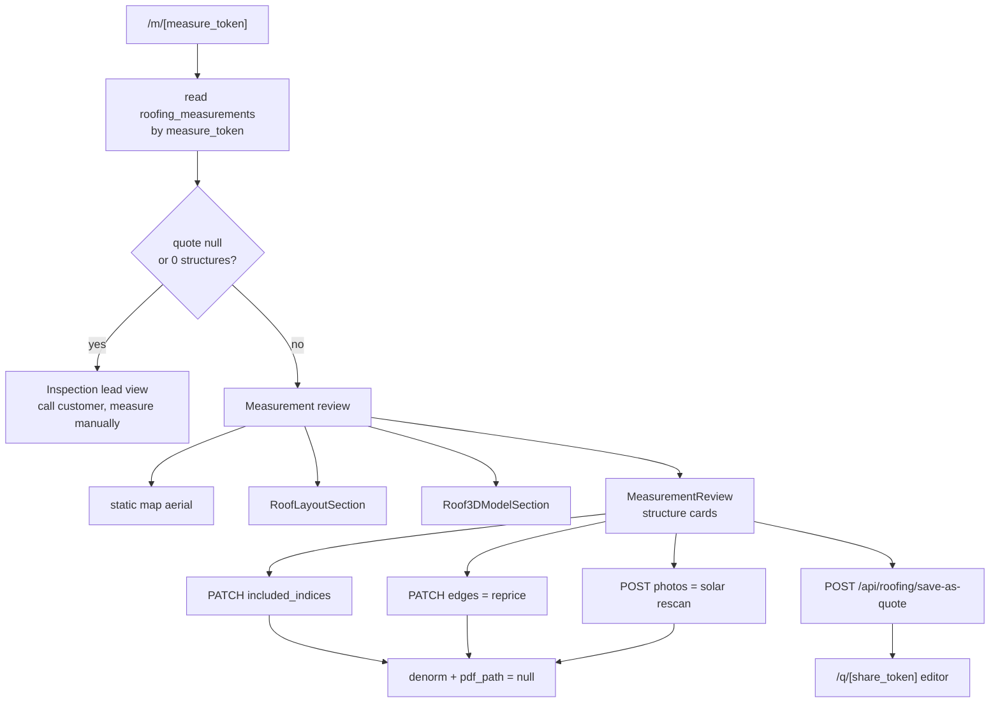

# Measurement Results Page

`/m/[measure_token]` is the **tradie-facing** view of a roofing measurement, added by
migration 140. One `roofing_measurements` row, two pages: this one shows the raw
measured structures for review and narrowing; `/q/roof/[public_token]` shows the
customer's priced quote. See [[Roofing]] for the token pair.

**Trust model: the token IS the capability.** No bearer, no Clerk session — anyone
with the link can open it, exactly like the customer quote page. The page uses the
service-role Supabase client because it is a public sharing surface, and exposes only
the columns it renders (`quotemate-automation/app/m/[token]/page.tsx:44-63`). The
"← Dashboard" link is static, on the reasoning that `measure_token` holders are
tradies by construction.

⚠ That reasoning is the page's only tenancy control. A leaked `measure_token` grants
a stranger the ability to re-price the job, change the structure selection, upload
photos and trigger a solar re-scan — the PATCH and POST on
`/api/roofing/measurement/[token]` use the same token-only model. The one thing it
does **not** grant is promotion to a quote: `POST /api/roofing/save-as-quote` is
bearer-authed and attributes the row to the signed-in tradie's tenant. See
[[Tenancy and RLS]].

## Two states of one record

### The unmeasured-lead branch

If `quote` is null or has zero structures, the page renders an **Inspection lead**
view rather than `notFound()`. The comment records exactly why
(`app/m/[token]/page.tsx:180-190`): this is a real row the SMS receptionist writes
when Geoscape holds no footprints for the address — inspection-routed, `structures`
empty, `quote` null. The dashboard roofing queue links every job here by
`measure_token`, so 404-ing meant a **booked inspection had no tradie surface at
all**; the only resolving link was the customer page, which hides everything behind
its confirm gate. Fixed live on 2026-08-06 (12 Smith St, Surry Hills).

The lead view shows customer, property, routing, a `tel:` button, and a link to
`/dashboard/roofing/measure` to measure it by hand.

**Invariant — both states share `MeasureShell`.** The shell (sticky tradie bar,
`QuoteSheet` + `Letterhead`, footer) is factored out precisely so the measured and
unmeasured views "must not look like two different products".

### Best-effort column reads

Four columns are read in **separate, individually-guarded queries** rather than in
the main select: `quote_share_token` (migration 168), `layout_status` + `layout_plan`
(170), and `model3d_status` (173). Each swallows its error. The stated pattern is
that the page must never break if it loads before a migration applies — the same
approach `/p` uses for `released_at`. It costs three extra round trips per render.

## Structure selection

`included_indices` (int[], 1-based, migration 140) is the **authoritative** set of
structures in the job. `quotemate-automation/lib/roofing/selection.ts` is the pure
module every reader shares.

| Function | Behaviour |
|---|---|
| `sanitizeIndices(idx, count)` | unique, ascending, in `[1..count]`; **rejects floats outright** rather than truncating, so a stray `2.5` can never silently select structure 2 |
| `structureCount(quote)` | length of `quote.structures`, null-safe |
| `primaryStructureIndices(quote)` | the one index whose `role === 'primary'`, falling back to the first |
| `defaultStructureIndices(quote)` | **the** single decision point for the null/empty default — delegates to `primaryStructureIndices` |
| `resolveEffectiveIndices(...)` | starts from the persisted selection and **only ever narrows** |
| `denormFromSelection(quote, idx)` | the denormalised summary, via `narrowQuoteToStructures` + `applySolarToTiers` |

**Invariant — a NULL/empty selection means roof-only, not all structures.** The
default is the main dwelling alone, so the tradie opts sheds and garages *in* rather
than out. This supersedes an older "NULL = all structures" back-compat default;
explicitly-saved selections — including migration 140's backfilled all-structures
arrays — are still honoured verbatim (`lib/roofing/selection.ts:11-19, 66-79`).

**Invariant — `resolveEffectiveIndices` narrows, never widens.** A legacy `?s=`
link and a customer single-pick (`confirmed_structure`) each *intersect* with the
tradie's selection. An intersection that would empty the set is ignored — the wider
set is kept rather than showing nothing. A legacy link must not be able to add a shed
the tradie removed.

**Invariant — the denormalised summary is recomputed on every write.** Every branch
of `PATCH`/`POST /api/roofing/measurement/[token]` writes
`combined_area_m2`, `combined_better_inc_gst` and `structure_count` from
`denormFromSelection`, and sets **`pdf_path: null`** so the lazily-regenerating PDF
route rebuilds from the new selection. Skipping the denorm strands the dashboard list
price below what `/m`, `/q/roof` and the PDF show — a bug the code comments record
happening twice (once for solar attachment, once here).

**Invariant — at least one structure stays included.** An empty `included` returns
`no_structures` with "Keep at least one structure in the job."

### Client behaviour

Toggling a structure in `MeasurementReview.tsx`:

1. optimistically sets local state,
2. PATCHes `included_indices`,
3. **reverts on failure**,
4. calls `router.refresh()` so the server-flattened promotion payload
   (`saveAsQuoteBody`) reflects this toggle — otherwise "Edit & send quote" would
   promote the **stale** selection (`MeasurementReview.tsx:341-350`).

The component also dispatches a `qm:roof-selection` `CustomEvent` on `window` every
time `included` changes. `RoofLayoutSection` listens and re-frames the map, re-zones
the overlay, and recomputes the deterministic material bill of quantities live — the
two client islands are siblings, not parent/child, so an event is the coupling.

The secondary-structure contribution shown to the tradie is derived as
`combined(included) − combined(included ∩ primary)` **through the same helper as the
headline**, never a free-form re-sum, so it cannot drift. Both operands are
**solar-less**: with the job-level solar allowance in the operands it cancels when the
primary is priced but leaks into the delta when the primary is excluded or
inspection-routed (base = $0, no solar), overstating the secondaries by the whole
allowance (`MeasurementReview.tsx:266-282`).

## Re-pricing on `/m`

`PATCH /api/roofing/measurement/[token]` with an `edges` array re-prices the stored
quote in place. The pure work is `repriceWithEdgeOverrides`
(`quotemate-automation/lib/roofing/reprice.ts`), extracted so the route stays thin and
the logic is testable without Supabase.

Each override is keyed by 1-based `index`. Zod bounds
(`app/api/roofing/measurement/[token]/route.ts:31-51`):

| Field | Range | Meaning |
|---|---|---|
| `hips`, `valleys` | int 0–50 | confirmed edge counts |
| `box_gutter_lm` | 0–500 | not derivable from a 2-D footprint |
| `gutter_lm`, `fascia_lm`, `soffit_lm` | 0–1000 | accessory quantities |
| `downpipe_count` | int 0–60 | accessory quantity |
| `pitch_degrees` | 1–75 | measured on site |
| `sloped_area_m2` | 1–10000 | measured on site |
| `form` | enum | corrected roof form |
| `storeys` | int 1–10 | corrected storey count |

The interconnected-recompute rules, verbatim from `reprice.ts`:

- `pitch_degrees` re-buckets `inputs.pitch` via `pitchBucketFromDegrees` **and**
  re-derives `sloped_area_m2` from the footprint — **unless** the same override also
  declares `sloped_area_m2`, in which case the explicit area wins. The new pitch also
  flows into per-edge hip/valley lengths through `deriveEdgeWorks` inside pricing.
- `sloped_area_m2` is used verbatim; the tradie measured it.
- `form: 'complex'` or a very-steep pitch fires inspection routing automatically
  inside `calculateRoofingPrice` — nothing special happens here.
- **Every overridden measurement stamps `field_sources = 'declared'`**, so a tradie
  edit can never masquerade as a measured value on the provenance display.

**Invariant — null is a no-op on measurement corrections, not a clear.** Only
positive numbers apply. Clearing a measurement would silently force inspection
routing, so an explicit value is required. (Accessories are the opposite: `null`
removes the line.)

**Invariant — re-pricing requires a live tenant rate card.** The route loads
`loadTenantRoofingPricingContext` and 422s with `tenant_pricing_required` when the
tenant is missing or the card is incomplete. It then stamps the fresh
`pricing_authority` onto the updated quote, so `save-as-quote`'s revision check keeps
passing. See the pricing-authority section of [[Roofing]].

⚠ Note the asymmetry: `/api/roofing/save` demands an HMAC-signed pricing-run proof
before it trusts a posted quote, but `/api/roofing/measurement/[token]` re-prices from
**server-side stored structures** using only bounded numeric overrides. That is the
right design — the client never supplies a price here — but it means the two write
paths have genuinely different threat models, and only one of them is protected by a
run token.

The client mirrors the server: `MeasurementReview.tsx:17-18` imports "the SAME
pricing helpers the server reprice uses, so the dependent-value preview can never
drift from what saving will produce."

## Solar re-scan from tradie photos

`POST /api/roofing/measurement/[token]` accepts 1–6 close-up roof photos as
`{ base64, mime }` and re-runs `detectSolarForJob`, merging the photo pass with the
per-structure aerial read, then persists onto `quote.solar`.

- `maxDuration = 60` — Gemini per structure plus an Anthropic photo pass run inline.
- A mock provider is rewritten to `'manual'` so the orchestrator's demo short-circuit
  is bypassed: the tradie explicitly attached photos, so the scan must actually run.
- No detection returns `{ ok: true, solar: null }` with a plain-English detail, not an
  error.
- The customer `/upload/[token]` photo source is **deliberately not wired** — roofing
  jobs do not yet collect customer photos.

## Layout plan section

`RoofLayoutSection` renders the AI work-strategy overlay over the same static-map
aerial, plus a legend and material quantities.

**Invariant — generation is tradie-initiated and lives only here.**
`GET /api/roofing/q/[token]/layout-plan` returns the stored plan and **never
generates**, because the customer pages and the PDF read through it and "must never
bill Gemini". `POST` generates (or returns the cached plan) via
`generateRoofLayoutPlan`, is CAS-guarded on `layout_status`, and is best-effort. The
GET also only returns `plan` when `layout_status === 'ready'` — a generating or
failed row reports its status with a null plan.

**Invariant — the numbers are deterministic.** The material quantities come from
`layoutMaterials` in `quotemate-automation/lib/roofing/layout-plan.ts` — "never LLM
numbers". The model produces zones and strategy; the bill of quantities is arithmetic.

Note this route is keyed by **`public_token`**, not `measure_token`, even though it is
POSTed from the tradie page — the page passes `row.public_token` down. So does the
static-map image (`/api/roofing/q/${public_token}/static-map`).

## 3D model section

`Roof3DModelSection` + `POST|GET /api/roofing/model3d/[measure_token]`.

Explicitly **Track B: visual only; never feeds measurements or pricing**
(`app/api/roofing/model3d/[token]/route.ts:2`).

- `POST` takes 2–5 labelled JPEG data-URL captures taken client-side from the Google
  Photorealistic 3D view. Views are `front | left | right | back | top`; **`front` is
  required**, plus at least one of left/back/right, and duplicates are rejected. Cap
  is 8 MB per image (~250 KB expected) to guard against oversized canvases.
- It CAS-claims `model3d_status`, fast-acks, and runs enhancement (Gemini
  "nano-banana"), front/back synthesis, Tripo upload and task creation in
  `after()`. `maxDuration = 300`.
- `GET` polls: it proxies the Tripo task state and, on success, downloads the GLB
  into storage (Tripo URLs expire in about 5 minutes) and returns a signed URL the
  three.js viewer loads directly.
- `mode: 'manual'` skips the enhancement-cache **read** — the tradie framed those
  shots deliberately — but still refreshes the cache.

The capture target is computed server-side on the page: the primary structure's
polygon centroid plus `captureOrbitRangeM` derived from the footprint bounding-box
diagonal, "far enough that the whole house fits with margin, close enough that it
still fills the shot".

## Promotion to a quote

The "Edit & send quote" action POSTs `/api/roofing/save-as-quote` with a body of only
`{ expected_pricing_revision }` (the `measure_token` comes from the path context in
the client call). It is **bearer-authed** and **idempotent server-side** — a second
promotion returns the existing quote's `shareToken`.

The page pre-computes `saveAsQuoteBody` server-side and sets it to `null` when the row
is already promoted (`quote_share_token` present) or when the stored
`pricing_authority.revision` is not a 64-hex string — so an unusable payload never
ships in the RSC payload, and the UI links straight to the dashboard editor instead of
re-promoting.

## Presentation

The page reuses the customer quote surface's Command Centre chrome
(`app/q/_chrome/parts` — `QuoteSheet`, `Letterhead`) with `data-qm-theme="dark"` and
the `.qm-quote` scoped palette, at a **wider sheet** (`--qm-sheet-w: 1200px`) because
this is a desktop review surface where the structure cards and stat grids earn the
room. The letterhead is loaded via `loadTenantIdentity` and degrades to "Your roofing
team" for rows predating tenant stamping. See [[Design System Overview]].

## Open questions

- The layout-plan and static-map routes are keyed by `public_token` while the
  measurement and model3d routes are keyed by `measure_token`. Is that split
  deliberate (customer surfaces must be able to read the same assets) or historical?
- `RoofLayoutSection` performs no `fetch` of its own in the section head that was
  read; the POST is presumably in the button handler further down. Not confirmed
  line-by-line here.
- The unmeasured-lead branch links to `/dashboard/roofing/measure` — that dashboard
  route was not verified to exist during this pass.

## Related
- [[Roofing]]
- [[Roof Measurement Providers]]
- [[Roofing Receptionist]]
- [[Quote Pages]]
- [[Quote PDFs and Reports]]
- [[Dashboard Overview]]
- [[Tenancy and RLS]]
