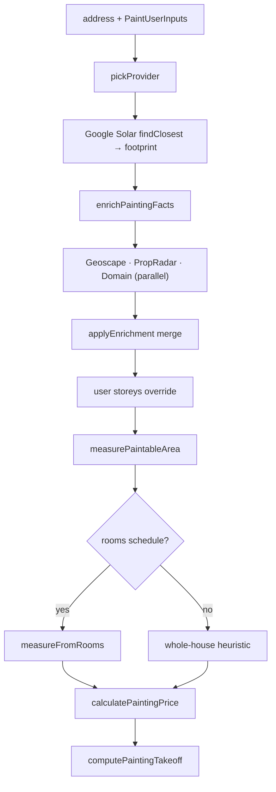

# Painting Measurement and Pricing

The arithmetic behind [[Painting]]. Everything in this note is **pure** — no I/O, no `Date`, no
`Math.random`, fully unit-tested. This is the trade's equivalent of the "deterministic money"
half of the [[Decision Log]] entry: an LLM may *converse*, but every m², every litre and every
dollar comes out of these functions.

Chain: `estimatePainting` → provider lookup → enrichment → `measurePaintableArea` →
`calculatePaintingPrice` → `computePaintingTakeoff`.



## 1. Property facts

### Provider selection

`pickProvider` (`lib/painting/measure.ts:60`), in order:

1. `opts.provider` — explicit override; tests pass `MockPropertyProvider`.
2. `GOOGLE_MAPS_API_KEY` set → `SolarPropertyProvider`.
3. otherwise the deterministic `MockPropertyProvider`, so local dev still runs.

`SolarPropertyProvider` (`lib/painting/providers/solar.ts`): address → Google **Geocoding API** →
lat/lng → Google **Solar `buildingInsights:findClosest`** → the building's ground footprint in m².
`parseFootprintM2` prefers `solarPotential.wholeRoofStats.groundAreaMeters2`, then
`buildingStats.groundAreaMeters2`, and only as a last resort the pitch-inclusive
`wholeRoofStats.areaMeters2`. `parseImageryDate` yields `YYYY-MM` for provenance.

The key never leaves the server; both calls use the same `GOOGLE_MAPS_API_KEY` with the Solar API
enabled on that Cloud project.

⚠ **Solar returns a footprint, not a storey count.** A two-storey home is under-measured ~2× unless
the user declares `PaintUserInputs.storeys`. The provider surfaces a warning to that effect. The
declared value is re-applied **after** enrichment (`lib/painting/measure.ts`, the
`inputs.storeys && inputs.storeys > 0` branch) so it always wins over any provider or enricher value.

### Enrichment

`enrichPaintingFacts` (`lib/painting/enrich.ts:130`) runs three enrichers **concurrently** via
`Promise.all`. Each no-ops without its key, so an estimate always succeeds on the base provider
alone.

| Enricher | Env var | Supplies |
|---|---|---|
| Geoscape | `GEOSCAPE_API_KEY` (base `GEOSCAPE_API_BASE_URL`, default `https://api.psma.com.au/v1`) | storeys, eave height, footprint, zoning-derived property type |
| PropRadar | `PROPRADAR_API` (base `PROPRADAR_API_BASE_URL`) | beds, baths, car, land size, year built, specific property type, listing floor area |
| Domain | `DOMAIN_API_KEY` / `DOMAIN_API` (base `DOMAIN_API_BASE_URL`) | fills what is still null, plus `has_floor_plan` / `floor_plan_urls` |

`applyEnrichment` (`lib/painting/enrich.ts:56`) is the pure merge, and its precedence rules are
subtle enough to be invariants:

- **Non-null only.** The Solar footprint is never overwritten — *except* when the tradie explicitly
  picked a structure.
- **Geoscape zoning fills a null property type; PropRadar's specific type (House / Apartment)
  overrides it.**
- **Domain runs LAST** and only fills what is still null. PropRadar stays authoritative wherever it
  has an answer. `floor_plan_urls` / `has_floor_plan` are always applied — no other provider
  supplies them.
- ⚠ **A listing floor area describes the WHOLE dwelling.** When a specific structure was targeted,
  neither PropRadar's nor Domain's listing area may be applied (`!opts.targeted` guards both) —
  otherwise a shed would be priced at the house's floor area.

### Structure targeting

`inputs.structure.building_id` (from `POST /api/painting/structures`) targets the Geoscape lookup at
one building at a multi-structure address.

**`targeted` is true ONLY when the requested building was actually fetched:**

```ts
const requested = opts.geoscape?.buildingId
const structureTargeted = !!requested && geoscape.matched_building_id === requested
```

`lib/painting/enrich.ts:145`. A Geoscape miss returns an empty patch with no matched id, and the
estimate must fall back to honest address-level behaviour — no override, no "estimating the selected
structure" claim. `lib/painting/measure.ts` mirrors this: on a hit it stamps `structure_label` /
`structure_role` and a capture note; on a miss it writes a note saying it *could not* target the
structure and used address-level data. Claiming the selected structure while pricing another
building is the failure this guard exists to prevent.

## 2. Floor area

`resolveFloorArea` (`lib/painting/area.ts:88`) picks the best available number and its confidence:

| Priority | Source | `floor_area_source` | Confidence |
|---|---|---|---|
| 1 | `inputs.manual_floor_area_m2` | `manual` | high |
| 2 | `facts.floor_area_m2` (listing / manual / floor_plan) | as given | high |
| 2b | `facts.floor_area_m2` from a footprint derivation | `footprint` | medium |
| 2c | `facts.floor_area_m2` from anything else | — | low |
| 3 | `facts.footprint_m2 × storeys × 0.9` | `footprint` | medium |
| 4 | `facts.bedrooms × 45` | `beds_estimate` | low |
| — | nothing usable | — | **null → inspection** |

`EAVES_CORRECTION = 0.9` corrects footprint-as-floor-footprint for overhang.
`FLOOR_AREA_PER_BEDROOM = 45` is explicitly labelled "the weakest proxy" and lands at **low**
confidence, which `requiresInspection` then routes to a site measure. Constants exported for tests
as `__test_only__`.

## 3. Surfaces

`measurePaintableArea` (`lib/painting/area.ts:167`). Two bases: `'rooms'` when a dimensioned schedule
applies, `'whole_house'` otherwise.

### Geometry constants

`lib/painting/geometry.ts`:

- `K_SHAPE_INTERIOR = 1.08` — perimeter shape factor; real rooms are oblong, not square.
- `K_SHAPE_EXTERIOR = 1.15` — the same for a whole building footprint.

`lib/painting/area.ts`:

| Constant | Value | Use |
|---|---|---|
| `CEILING_HEIGHT_M` | standard 2.4, high 2.7, extra_high 3.2, raked 2.7 | metres per bucket |
| `WALL_MULTIPLIER` | standard 2.8, high 3.2, extra_high 3.6, raked 3.5 | **net** wall m² per floor m², openings absorbed |
| `EXTERIOR_WALL_BAND_M` | 2.7 | façade band painted per storey, to the eaves |
| `GABLE_FACTOR` | 1.1 | gable/hip uplift, averaged across roof forms |
| `CONFIDENCE_BAND` | high 0.12, medium 0.25, low 0.40 | ± half-width of the quantity band |

`extra_high` and `raked` heights are computed but **indicative only** — both route to inspection
before a price commits.

### Whole-house formulas

- **Walls** = `floor_area × WALL_MULTIPLIER[ceiling_height]` (already net of a ~10–15% opening
  deduction).
- **Ceilings** = floor area.
- **Trim** = `(K_SHAPE_INTERIOR × 4 × √floor_area) × 1.6` linear metres — internal perimeter scaled
  for architraves and partition runs.
- **Exterior** = `(K_SHAPE_EXTERIOR × 4 × √footprint) × wallHeight × GABLE_FACTOR`, where
  `wallHeight` prefers a real Geoscape `eave_height_m` (clamped to 2.1–15 m) — and when that is
  present it is **NOT** multiplied by storeys again, because a ground-to-eave height already spans
  every storey. Without it: `EXTERIOR_WALL_BAND_M × storeys`.

Every quantity carries `quantity_low` / `quantity_high` at `± CONFIDENCE_BAND[confidence]`. The
estimate is always a **range**, never a hard number, because the floor area is itself uncertain.

### The exterior footprint invariant

```ts
const exteriorFootprint =
  facts.footprint_m2 > 0 ? facts.footprint_m2
  : wholeHouse != null ? wholeHouse.floor_area_m2 / storeys
  : null
```

`lib/painting/area.ts` — the fallback uses the **whole-house** area and never the room-schedule sum.
A partial room schedule would shrink the façade and silently under-quote. This is why
`measurePaintableArea` always resolves `wholeHouse` even on the per-room path. With neither a
footprint nor a whole-house area, `exterior` produces **no surface at all** plus the note "The
exterior needs an on-site measure" — inventing one from the interior schedule is the under-quote the
comment forbids.

### Per-room path

`measureFromRooms` (`lib/painting/rooms.ts:106`) sums each room's own perimeter instead of treating
the house as one empty box.

| Constant | Value | Meaning |
|---|---|---|
| `ROOM_OPENING_DEDUCTION` | 0.12 | doors/windows off gross wall area |
| `SKIRTING_RUN_FACTOR` | 0.9 | share of perimeter that actually carries skirting |
| `ARCHITRAVE_LM_PER_ROOM` | 5.0 | one 2040×820 door architrave set per room |
| `DEFAULT_EXCLUDED_ROOM_TYPES` | `['garage']` | painters quote the garage separately, if at all |

- `wall_area = Σperimeter × ceilingHeight × (1 − 0.12)`
- `trim_lm = Σperimeter × 0.9 + roomCount × 5.0`
- `ceiling_area = Σfloor_area`

`roomPerimeterM` prefers `2 × (width + length)`; falls back to `K_SHAPE_INTERIOR × 4 × √area`. A room
contributes only when it has BOTH a resolvable perimeter and a positive area. Accumulation is at full
precision, rounded once at the end. `all_dimensioned` (no room fell back) upgrades confidence to
`high`; otherwise `medium`.

**The room path is skipped in three cases** (`resolveRoomTotals`, `lib/painting/area.ts`):

1. a hand-entered `manual_floor_area_m2` — same priority as `resolveFloorArea`;
2. ⚠ **`inputs.structure.building_id` is set** — a targeted structure is ONE building at the address,
   but a plan's room list covers the whole property, so measuring every room would quote the main
   house when the granny flat was selected;
3. an absent, empty, all-excluded or geometry-free schedule.

`ARCHITRAVE_LM_PER_ROOM` is flat per room: it over-counts an open-plan space and under-counts a hall
with four openings. The constant is named precisely so a tenant override can refine it later.

### Where rooms come from

`paintRoomsFromPlanExtraction` (`lib/painting/plan-rooms.ts`) adapts the **aircon** trade's
`AcPlanExtraction` — a vision model's read of an uploaded dimensioned floor plan — into `PaintRoom[]`.
Nothing in that adapter calls a model or does I/O; ids are deterministic
(`<slug-of-name>-<1-based-index>`). See [[Aircon]].

`parseRoomDimensions` (`lib/painting/rooms.ts:48`) parses printed "W x L" strings with the same rules
as `lib/aircon/plan-scale.ts` (strip commas, lowercase, same regex, values ≥ 100 treated as mm) but
returns the pair rather than an area, and applies **no** area sanity bounds — a 288 m² garage is a
legitimate room.

## 4. Routing — when a price must not commit

`requiresInspection` (`lib/painting/pricing.ts:116`) returns an `inspection_required` decision on any
of, in order:

| Trigger | Why |
|---|---|
| `measurement === null` | no reliable floor area at all |
| `condition === 'poor'` | flaking / water-damaged / mouldy — prep is unpriceable remotely |
| `ceiling_height === 'raked'` | area and access not derivable from floor area |
| `ceiling_height === 'extra_high'` | > ~2.7 m needs scaffold or tower |
| `year_built < 1970` **and** exterior in scope | lead paint and fibro/asbestos risk |
| `storeys >= 3` | access and fall protection |
| `confidence === 'low'` | the area is only a rough estimate |

Anything else falls through to `tradie_review`. Tiers are still computed for an inspection-routed
job (an indicative range for the tradie) — the customer UI swaps to the site-visit CTA, exactly as
[[Roofing]] does, and the [[Quote PDFs and Reports]] route 404s.

## 5. Pricing

`calculatePaintingPrice` (`lib/painting/pricing.ts:264`). Painting does **not** use the strict-grounding
Opus estimator ([[Estimate Engine]] / [[Grounding Validator]]) — it is a deterministic per-unit
calculation.

### Tier semantics

| Tier | Label | Fraction of Better |
|---|---|---|
| good | `1-coat refresh` | `good_refresh_fraction` = 0.72 |
| better | `2-coat standard repaint` | 1.0 — **the base** |
| best | `Premium paint + full prep` | `1 + premium_uplift_pct` = 1.28 |

Good is "a lighter scope, not a discount" — the comment is explicit about that framing.

### Default rate card

`DEFAULT_PAINTING_RATE_CARD` (`lib/painting/pricing.ts:36`), sourced from an AU painting estimator
brief for 2024–2026:

| Lever | Default |
|---|---|
| `rate_per_unit` | walls $28/m², ceilings $20/m², trim $12/lm, exterior $45/m² |
| `coats_multiplier` | 1 → 0.7, 2 → 1.0, 3 → 1.35 |
| `condition_multiplier` | sound 1.0, minor 1.15, bare 1.4 |
| `colour_change_extra` | 0.10 |
| `double_storey_loading_pct` | 0.50 (exterior only, ≥ 2 storeys) |
| `gst_registered` | true → ×1.1 |
| `call_out_minimum_ex_gst` | $450 |
| `pricing_model` | `sqm` |

The `poor` condition maps to a **1.0** multiplier "never reaches pricing (inspection), keep safe" —
a deliberate defensive default, not a rate.

### Order of operations

```
better_ex_gst = Σ_surfaces  quantity × rate × (coats × condition × colour) × exteriorLoading
tier_ex_gst   = max(better_ex_gst × tierFraction, call_out_minimum_ex_gst)
tier_inc_gst  = tier_ex_gst × 1.1
```

The band is the same calculation at `quantity_low` and `quantity_high`. The double-storey loading
applies **only** to the `exterior` surface, not to walls/ceilings/trim.

⚠ The $450 call-out floor is applied **per tier, after** the fraction — so on a very small job Good,
Better and Best can all clamp to the same $450 and the tiers collapse. `call_out_minimum_applied` is
returned so the UI can say so. The comment's intent is that it sits "well below any whole-house tier,
so it only binds on small jobs".

### Hourly mode

`effectiveRatePerUnit` (`lib/painting/pricing.ts:93`) converts a painter who quotes by labour time:
per scope, `hourly_rate ÷ production_rate` (units → hours → dollars). It **falls back to the fixed
`rate_per_unit`** for any scope with a missing or zero production rate, so the engine can never
divide by zero. Feeding this through the existing per-unit engine keeps coats/prep multipliers,
loadings, tiers, GST and the call-out floor identical across both models — **only the base rate
changes**.

Defaults: `DEFAULT_PAINTING_HOURLY_RATE = 85` $/hr ex-GST; `DEFAULT_PAINTING_PRODUCTION_RATES` =
walls 3 m²/hr, ceilings 4 m²/hr, trim 7 lm/hr, exterior 2 m²/hr.

### The breakdown

Every price carries a `breakdown` object listing each surface's quantity, `rate_per_unit` and
`line_ex_gst`, plus every multiplier by name, `better_ex_gst`, the tier fractions, the GST factor,
the call-out floor and the `pricing_model`. This is what makes the number auditable on `/p` and in
the PDF without re-deriving it.

## 6. Take-off

`computePaintingTakeoff` (`lib/painting/takeoff.ts`) derives, from the **same** measured surfaces:

- litres per product → whole AU retail packs (1/4/10/15 L) → $ ex-GST;
- labour hours (production rates × the pricing multipliers) → crew-days;
- **margin = tier price − materials − labour** — tradie-only display.

⚠ **The take-off is derived FROM the priced tiers and never fed back into them.**
`calculatePaintingPrice` reads nothing from `takeoff.ts`; an invariance test in `takeoff.test.ts`
enforces it. Quoted customer numbers structurally cannot move when the take-off card changes.

`DEFAULT_PAINTING_TAKEOFF_CARD` coverage (m²/L per coat, lm/L for trim): wall 16, ceiling 16,
exterior 14 ("texture drinks more"), primer/sealer 12, trim enamel 45. Trade $/L ex-GST: wall 14,
ceiling 12, trim enamel 20, exterior 16. AU units throughout.

## 7. Per-tenant rate-card overlay

`lib/painting/rate-card-overlay.ts`, stored in `pricing_book.overlays.painting_rate_card` (jsonb).
Read by `POST /api/painting/estimate` and by `runAndSavePaintingQuote`.

**Merge semantics** (same as roofing): a supplied value **replaces** the default; blank/null/undefined
falls back to the default; out-of-range values are **rejected at validation** rather than silently
clamped. Editable levers are `rate_per_unit`, `double_storey_loading_pct`, `premium_uplift_pct`,
`good_refresh_fraction`, `colour_change_extra`, `call_out_minimum_ex_gst`, `gst_registered`, plus the
hourly and take-off blocks. Coats and condition multipliers stay at the code defaults and are shown
read-only in the breakdown.

Fat-finger caps: `MAX_RATE_PER_UNIT` 200, `MAX_CALL_OUT_EX_GST` 5000, `MAX_FRACTION` 2,
`MAX_HOURLY_RATE` 2000, `MAX_PRODUCTION_RATE` 200, `MAX_COVERAGE_PER_LITRE` 200,
`MAX_PRICE_PER_LITRE` 500, `MIN_MULTIPLIER` 0.1 / `MAX_MULTIPLIER` 3.

⚠ **Multi-trade overlay resolution is a three-step fallback**, duplicated in two places
(`app/api/painting/estimate/route.ts:38` `loadPaintingOverlay` and
`lib/painting/quote-dispatch.ts:38` `loadPaintingRateCard`): prefer the `pricing_book` row whose
`trade = 'painting'`, then the tenant's primary-trade row, then any row that happens to carry a card.
A multi-trade tenant (electrical + painting) has one `pricing_book` row per trade and the painting
card lives on the painting row — but `tenants.trade` (the scalar) may be electrical. Both copies must
be changed together.

⚠ The overlay module still exports `MIN_DEPOSIT_PCT` / `MAX_DEPOSIT_PCT` ("deposit % of the inc-GST
tier price charged at Stripe checkout"). Residential painting takes **no** deposit since
`docs/strategy.md` v19 — see [[What the Customer Pays by Trade]]. Dead levers, same family as the
dead `stripe_links` tier writes.

## 8. Request contract

`lib/painting/request-schema.ts` — Zod, split out so the parser is testable without Next handlers.

- `PaintAddressSchema`: address 3–300 chars, **AU 4-digit postcode**, state enum of the 8 AU
  states/territories.
- `PaintInputsSchema`: `scopes` (≥ 1 of walls/ceilings/trim/exterior), `coats` 1|2|3, `condition`
  sound|minor|bare|poor, `ceiling_height` standard|high|extra_high|raked, `colour_change` bool,
  optional `storeys` 1|2|3, optional `manual_floor_area_m2` ≤ 2000, optional `rooms` (≤ 200), optional
  `structure`.
- `SavePaintingSchema` adds `source` (`rea|domain|solar|geoscape|mock|manual`), the whole
  `estimate` as `z.unknown()`, and optional `customer_name` / `customer_phone`.

Room bounds are sanity limits, not business rules — "a 288 m² garage is a legitimate room, a 500 m
wall is not".

## 9. Imagery

`lib/painting/streetview.ts` builds Google **Street View Static API** URLs — the *front* of the
house (walls and trim), not the satellite aerial [[Roofing]] uses. Defaults: 640×480, `fov: 85`,
`pitch: 8` ("a few degrees up flatters a single-storey façade"), `scale: 2`. A metadata builder
(`buildStreetViewMetadataUrl` / `parseStreetViewMetadata`) checks coverage before fetching an image.

The key stays server-side: `/api/painting/street-view` fetches the image and streams it. That same
frame feeds both `POST /api/painting/detect-material` and the AI repaint preview
(`lib/painting/paint-after.ts`, provider selector `PAINTING_IMAGE_PROVIDER`).

## Open questions

- The `sqm` vs `hourly` `pricing_model` is settable on the overlay; whether any live tenant has
  flipped it was not checked in this pass.
- `MockPropertyProvider` is the fallback whenever `GOOGLE_MAPS_API_KEY` is unset — there is no guard
  that would stop a production deployment missing the key from silently quoting off mock facts.
  Whether such a guard exists elsewhere (deploy checks, `/api/health/deep`) was not verified here.

## Related

- [[Painting]]
- [[Commercial Painting]]
- [[Roofing]]
- [[Solar]]
- [[Aircon]]
- [[Grounding Validator]]
- [[External Services and Integrations]]
- [[Environment Variables and Feature Flags]]
