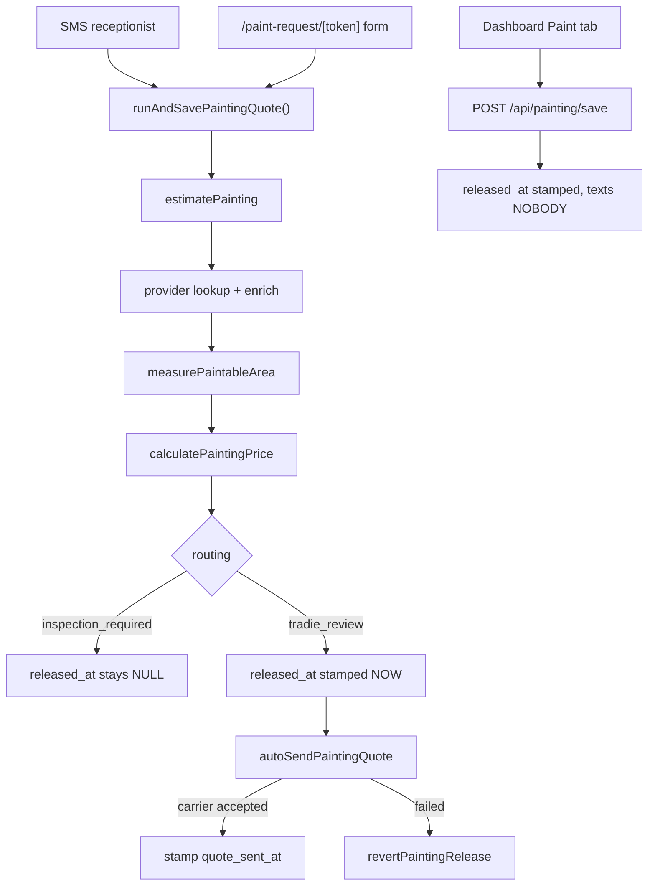

# Painting

Residential painting. One of the four pipeline shapes described in [[The Four Pipelines]] — the
"SMS receptionist + self-serve form, deterministic pricer, auto-send" shape it shares structurally
with [[Roofing]].

> **This note is RESIDENTIAL painting only.** [[Commercial Painting]] is a completely separate
> stack — different tables (`paint_rates` / `paint_runs`), a different pricer, a different release
> gate, and it still takes a **tier deposit** rather than the flat $99. Nothing in this note applies
> to it and nothing in that note applies here. The two must never be conflated.

## Shape in one paragraph

A customer arrives by SMS ([[Painting Receptionist]]), by the self-serve `/paint-request/[token]`
form, or is entered by the tradie in the dashboard Paint tab. The address is resolved to
**property facts** (footprint, storeys, beds, listing floor area, eave height) by a base provider
plus three enrichers, the deterministic area engine turns those facts into paintable m²/lm, and the
pure pricer produces Good/Better/Best with an inc-GST **band**. The row is saved into
`painting_measurements`, **released at save time**, and the customer is texted the full quote on the
same turn. The only money the customer can pay is a **flat $99 refundable site visit**.

No LLM touches an area or a price. The one vision call in this stack
(`/api/painting/detect-material`) classifies a wall substrate and returns cost *guidance* text — it
never feeds the pricer. See [[Painting Measurement and Pricing]] for the arithmetic.



## The three origins

| Origin | Entry point | `created_by` | Released at save | Texts the customer |
|---|---|---|---|---|
| SMS receptionist | `app/api/sms/inbound/route.ts` → `handlePaintingTurn` | null | yes, if priced | yes, same turn |
| Self-serve form | `POST /api/paint-request/[token]` | null | yes, if priced | yes, same turn |
| Dashboard save | `POST /api/painting/save` | the auth user | **always** | **no — nobody** |

The dashboard save is the trap. `app/api/painting/save/route.ts:74` passes
`releasedAt: new Date().toISOString()` unconditionally and sends no SMS at all. That is the exact
population migration 189 was written for.

All three converge on `buildSavedPaintingRow` (`lib/painting/save-row.ts:74`), which mints **two**
unguessable 32-char hex tokens per job:

- `public_token` → the customer quote page `/q/paint/[token]`
- `estimate_token` → the tradie surface `/p/[token]`

Same pair-of-tokens pattern as [[Roofing]] (`roofing_measurements.public_token` /
`measure_token`).

## The two timestamp columns — never conflate them

This is the load-bearing invariant of the whole trade.

| Column | Migration | Means | Written |
|---|---|---|---|
| `released_at` | 157 | *the customer MAY see prices* | **BEFORE** the send |
| `quote_sent_at` | 189 | *a carrier ACCEPTED the message* | only after a real acceptance |

`released_at` MUST be stamped before the send, because three surfaces gate on it — the quote page
(`canShowPaintingPrices`), the $99 mint (`resolvePaintMintTier`) and the SMS body's links. A quote
texted with links that 302 back to a holding page is a broken quote.

That ordering creates the obligation: **a first send that fails MUST roll `released_at` back**
(`revertPaintingRelease`, `lib/painting/release.ts:125`), or the customer-facing gate stays open for
a quote nobody received.

⚠ `supabase-js` **resolves** `{ data, error }` on failure — it does not throw. A bare `await` on any
Supabase or Twilio call in this stack is the silent-failure bug class. `revertPaintingRelease` and
`markPaintingQuoteSent` both check `error` explicitly and return `{ reverted } / { marked }`; callers
MUST honour a `false` and not report the row as held. `sendPaintingQuoteToCustomer`
(`lib/painting/release.ts:248`) checks `res.ok` from `sendSms` for the same reason — the bare await
there is what the migration-189 comment calls "the silent failure this spec exists to close".

The historical damage, recorded verbatim in `sql/migrations/189_painting_quote_sent_at.sql`:
**3 of 8 live releases stamped `released_at`, returned `ok: true` and texted nobody**, while `/p`
rendered "Sent to customer". Migration 189 deliberately performs **no backfill** — the comment
reasons that `sendPaintingQuoteToCustomer` calls `sendSms` directly and writes no `sms_messages`
row, so the 5 real sends cannot be distinguished from the 3 dropped ones, and a duplicate SMS is
recoverable where a silent drop is not.

## Auto-send

Since `docs/strategy.md` v21 (2026-08-07) a priced residential painting quote auto-sends. The
tradie review gate is retired as a *gate*; the machinery is unchanged and still load-bearing.

`runAndSavePaintingQuote` (`lib/painting/quote-dispatch.ts:101`):

```ts
releasedAt: inspection ? null : new Date().toISOString(),
```

An inspection-routed row has no price to show and keeps its null. A priced row is released.

`autoSendPaintingQuote` (`lib/painting/release.ts:161`) is the shared helper both draft-time origins
call, so compose → send → stamp/revert cannot drift between the SMS path and the form path. It takes
an injected `send` closure because each origin resolves a different from-number and persists the
thread differently, and it returns `{ sent }` — never `ok` without `sent`.

`notifyPaintingTradie` (`lib/painting/release.ts:42`) still fires on every new job. Its
`customerTexted: false` arm switches the copy to a plain-words FAILURE alert: with the review gate
retired, that SMS is the **only witness** to a dropped send.

⚠ It resolves the notify number as `tenant.owner_mobile ?? TRADIE_NOTIFY_NUMBER ?? null` and returns
`{ notified: false }` when both are absent. A tenant with no `owner_mobile` and no env fallback
notifies nobody — the "silent notify black hole" in [[Known Debt Register]].

## The tradie surfaces

### `/p/[token]` — Paint Estimate Results

`app/p/[token]/page.tsx`. Keyed by `estimate_token`. Anyone holding the link can open it: the
unguessable token *is* the capability, same trust model as the customer quote page. Service-role
read, only the rendered columns exposed. The dashboard sends the tradie here the moment an estimate
is computed, mirroring roofing's measure → `/m/[measure_token]` redirect.

It renders `SendToCustomerButton.tsx` and `EditQuotePanel.tsx`.

**`quote_sent_at` is the ONLY column `/p` may read to show "Sent to customer".** Reading
`released_at` there is what produced the false "Sent" state on every dashboard save.

### `POST /api/painting/release/[token]`

The "Send to customer" endpoint. Token = `estimate_token`. With auto-send live this is the
**resend** after an on-site edit and the **retry** for a failed auto-send, not a review gate.

The decision table lives in `paintingReleaseEligibility` (`lib/painting/publish-gate.ts:80`):

| `released_at` | `quote_sent_at` | `resend` | stamp | send |
|---|---|---|---|---|
| null | — | — | yes | yes |
| set | null | — | no | **yes** |
| set | set | false | no | no (idempotent) |
| set | set | true | no | yes |

The second row exists because `released_at` alone would make Send a dead no-op on the dominant
population (every dashboard save is released and texted to nobody).

Two ordering invariants in `app/api/painting/release/[token]/route.ts`:

1. The send is **awaited**, not deferred to `after()` — the response reports `{ sent }` and `/p`
   shows "Sent" only on `sent === true`. Deferring it is precisely what let 3 of 8 releases stamp,
   return `ok: true` and text nobody (`route.ts:12-14`).
2. The AI repaint pre-warm went **back into** `after()` — 10–20 s of inline image generation could
   push the request past `maxDuration` and skip the rollback entirely (`route.ts:109-114`). The PDF
   self-heals anyway, because its cache path embeds the repaint timestamp.

### `POST /api/painting/edit/[token]`

Token = `estimate_token`. Lets the painter override each tier's customer-visible label, scope text
and inc-GST headline — before sending, or after release for the on-site revision flow. The pure
`applyTierEdits` (`lib/painting/edit.ts`) re-derives ex-GST and the band from the headline, and the
result is persisted onto `painting_measurements.estimate` (jsonb) plus the denormalised
`better_inc_gst`. Both the customer page and the customer SMS read `estimate.price.tiers` straight
from the jsonb, so an edit flows through immediately. A priced edit **expires and drops** any legacy
per-tier Stripe deposit session left on the row. It refuses an inspection-routed job (no priced
tiers to edit).

## What the customer pays — flat $99, and nothing else

Since `docs/strategy.md` v19 the ONLY residential-painting customer charge is the **flat $99
refundable site visit**. G/B/B prices stay visible as information; the price is confirmed on site.
See [[What the Customer Pays by Trade]].

`app/r/paint/[token]/[tier]/route.ts`:

- `tier === 'inspection'` → mint the $99 site visit.
- `tier ∈ {good, better, best}` → **302 to `/r/paint/<token>/inspection`**. Pure string check, no row
  read. Every previously-texted deposit link still lands somewhere payable.
- anything else → 400.

The mint gate is `resolvePaintMintTier(tier, routing, released)` (`lib/painting/pay-redirect.ts:35`):
`inspection` is admitted when the row is **inspection-routed OR released**. A HELD row (priced,
unreleased) gets a friendly **302 back to `/q/paint/<token>`** — its holding message — rather than a
bare 400.

`mintPaintSiteVisit` then, in order:

1. already `paid_at` → 302 to `/q/paint/<token>/book` (never re-charge).
2. `canTakePayment({ bookableCount })` via `loadTenantBookingOptions` — pay-first means the customer
   commits before seeing times, so refuse the charge when the painter published none; 302 with
   `?slots=0`. A lookup **throw** deliberately lets payment through (`route.ts:112-118`).
3. `connectDestinationForTenantId` → `createPaintingSiteVisitSession` with Connect routing (platform
   `application_fee`, destination = the tenant's connected account); a tenant with no connected
   account mints platform-direct. See [[Stripe Connect]].
4. Store the fresh Session under `stripe_links.inspection` and **expire the one it replaces**, so a
   second tab cannot complete an orphaned older Session — at most ONE payable Session per row.

⚠ **Tenant-less rows skip the slots guard entirely.** Step 2 is wrapped in `if (row.tenant_id)`
(`app/r/paint/[token]/[tier]/route.ts:103`), so a row with `tenant_id IS NULL` mints regardless of
whether anyone can attend. Same hole on `/r/roof`. Listed in [[Known Debt Register]].

### The dead `stripe_links` writes

Draft time used to create up to three per-tier 30% deposit Sessions and store them in
`painting_measurements.stripe_links` (migration 156). `runAndSavePaintingQuote` no longer does
(`lib/painting/quote-dispatch.ts:125-131`): nothing can link them since `/r/paint` 302s G/B/B onto
the $99 mint, and the function is awaited *before* the customer's SMS, so they were three sequential
Stripe round-trips of pure latency producing dead links.

⚠ The retired machinery is still in the tree and still referenced: `buildPaintRedirectUrl`
(`lib/painting/pay-redirect.ts:67`), `paintingDepositLocked` (`lib/painting/publish-gate.ts:56`) and
`createPaintingCheckoutSessionForTier` are all documented as unreachable-from-`/r/paint` but kept for
remaining callers and tests. `stripe_links` itself is still written — by the $99 mint, under the
`inspection` key only. Any cleanup must distinguish the live `inspection` key from the dead tier
keys.

## Customer surfaces

| Surface | Path | Gate |
|---|---|---|
| Quote page | `/q/paint/[public_token]` | `paintQuotePayable` / `paintHeldForReview` |
| Booking | `/q/paint/[token]/book` | pay-first — [[Pay-First Booking Funnel]] |
| Thanks | `/q/paint/[token]/thanks` | |
| Calendar file | `/q/paint/[token]/visit.ics` | |
| PDF | `/api/q/paint/[token]/pdf` | ⚠ routing only — see below |
| Pay short-link | `/r/paint/[token]/[tier]` | `resolvePaintMintTier` |

`lib/painting/quote-view.ts` decides layout and content. `paintQuoteViewMode` now returns `'five'`
for **every** state (the five-numbered-section format roofing and electrical/plumbing use);
`?full=1` is the long-scroll escape hatch. The old carve-out kept held rows on the long-scroll
branch, which has no TrustVideo, so the customer never saw the tradie video until the painter pressed
Send.

`paintHeldForReview` is defined as the exact complement of `paintQuotePayable` — the page derives
**both** from there rather than restating the expression, so holding copy and a payment CTA
structurally cannot render together. A 2026-08-06 review found the page restating the gate inline
with the test mirroring it by hand.

⚠ **The painting PDF route does not check the publish gate.**
`app/api/q/paint/[token]/pdf/route.ts:26` selects `public_token, pdf_path, routing` and 404s only on
`routing === 'inspection_required'`. A held (unreleased) priced row is still downloadable by anyone
with the link, with full prices in it. Same class as the solar PDF/deposit hole in
[[Known Debt Register]].

## Data model

`public.painting_measurements` — one row per saved job (migration 089). RLS **on with no policies**
(the Phase-1.5 convention); service-role routes bypass it, the anon key sees zero rows. Tenancy is
app-layer plus token-gating — see [[Tenancy and RLS]].

| Column group | Columns | Added by |
|---|---|---|
| Identity | `id`, `tenant_id`, `created_by` | 089 |
| Property | `address`, `postcode`, `state`, `source` | 089 |
| Lead | `customer_name`, `customer_phone` | 089 |
| Denormalised summary | `scopes[]`, `floor_area_m2`, `total_area_m2`, `confidence`, `better_inc_gst`, `routing` | 089 |
| Payloads | `inputs` jsonb, `estimate` jsonb | 089 |
| Tokens | `public_token` (unique partial index), `estimate_token` | 089 / 151 |
| PDF | `pdf_path` | 115 |
| Money | `stripe_links`, `paid_at`, `paid_tier`, `paid_stripe_session_id` | 156 |
| Gate | `released_at` | 157 |
| Booking | `scheduled_at`, `scheduled_window` | 167 |
| Preview | `preview_image_path`, `preview_status` | 169 |
| Money | `paid_amount_cents` | 181 |
| Delivery evidence | `quote_sent_at` | 189 |

Migration 157 **backfilled** `released_at = created_at` on every pre-existing row, on the reasoning
that they were all tradie-authored dashboard saves. Migration 189 deliberately backfilled nothing.

`public.painting_lead_requests` (migration 154) — one row per offered self-serve form link.
`token` is the primary key and the unguessable hash in `/paint-request/[token]`; carries
`tenant_id`, `conversation_id`, `customer_phone`, `status` (`pending` → `submitted`), `quote_token`
(the `painting_measurements.public_token` the submission produced), `submitted_at`. The SMS Q&A
fallback never creates a row — it quotes inline. ⚠ This is one of the 7 tables with **RLS off**.

Migration 154 also added `sms_conversations.painting_state` (jsonb), deliberately decoupled from both
`conversation_state.slots` and `roofing_state` so the three flows never collide. Both 089 and 154
end with `notify pgrst, 'reload schema'` — 154's comment calls the missing reload "the PGRST204 trap
migration 085 documents — it made the roofing receptionist lose its memory".

## The self-serve form

`/paint-request/[token]` (`app/paint-request/[token]/page.tsx` + `PaintRequestForm.tsx`), backed by
`app/api/paint-request/[token]/route.ts`. No auth: the unguessable token is the capability. **One
shot** — a `submitted` lead returns 409.

`POST` order of operations:

1. Validate against `EstimateRequestSchema`.
2. `runAndSavePaintingQuote` — provider lookup, estimate, save, release-if-priced.
3. Mark the lead `submitted` **regardless of the estimate outcome** (one-shot is honoured even on a
   provider failure).
4. Resolve the from-number: the conversation's `to_number` first, then `tenants.twilio_sms_number`.
5. Priced → `autoSendPaintingQuote`; on `sent === false`, text the customer a
   `buildPaintingHoldingSms` expectation-setter with **no price**, and notify the tradie with
   `customerTexted: false`. Inspection-routed → the on-site-measure message.

There is a sibling `POST /api/paint-request/[token]/suggest-address`.

## Vision: detect-material

`POST /api/painting/detect-material` (`app/api/painting/detect-material/route.ts`). Bearer-authed
(Clerk or legacy Supabase via `resolveIdentityRequest`). Classifies the **exterior wall material**
from the Street View frontage — the roof-down satellite view cannot see walls, so it reuses the same
Street View image the repaint preview uses (`lib/painting/streetview.ts`). Prompt and parsing in
`lib/painting/material.ts`; `materialGuidance` returns the cost guidance text.

The model default is deliberately **`gemini-2.5-pro`**, not flash
(`route.ts:35`, `GEMINI_VISION_MODEL` overrides — shared with the roofing route). The comment records
why: at the route's `fov=85` a set-back façade frames small, `gemini-2.5-flash` cannot resolve
weatherboard shadow-lines and reads the wall as render at HIGH confidence (reproduced on a specific
Coorparoo address); tightening fov is non-monotonic across houses and the prompt had already
over-corrected twice.

Failures surface as `{ ok: false, code }` at HTTP 200 — `maps_key_missing`, `gemini_key_missing`.
**This output never reaches the pricer.** See [[Model and Prompt Inventory]].

## Other painting routes

| Route | Purpose |
|---|---|
| `POST /api/painting/estimate` | dashboard read-only estimate; loads the tenant rate-card overlay; `maxDuration = 30` |
| `POST /api/painting/save` | persist a job (releases immediately, texts nobody); `after()` pre-warms the repaint |
| `GET /api/painting/save` | list this tenant's saved jobs (tenant-scoped, or `created_by` when tenant-less) |
| `POST /api/painting/structures` | multi-building picker at an address |
| `POST /api/painting/street-view` | frontage image lookup |
| `POST /api/painting/3d-location` | location framing for the repaint render |
| `POST /api/painting/preview` + `/refine` | AI repaint "after" image |
| `GET /api/painting/q/[token]/{after-image,static-map,street-view}` | customer-page imagery |

The "after" render provider selector is `PAINTING_IMAGE_PROVIDER` (HF FLUX.1-Kontext-dev primary,
Replicate → Gemini fallbacks) — see [[External Services and Integrations]].

## ⚠ Drift

- **`CLAUDE.md` "Auto-send vs review-required"** lists residential painting as auto-send, which
  matches. But `calculatePaintingPrice` still hard-codes the routing reason
  `'Quote auto-calculated from the floor-area estimate. Every painting quote needs tradie sign-off
  before customer send.'` (`lib/painting/pricing.ts`, the `tradie_review` default). That string is
  stale copy from before v21 and can surface to a tradie; the code path around it auto-sends.
- **`publish-gate.ts` header** and **`pay-redirect.ts` header** both open with "⚠ Since spec …" and
  describe their own modules as retired-but-load-bearing. They are accurate; a reader skimming
  function names alone would wrongly conclude `paintingDepositLocked` still gates `/r/paint`. It
  does not — `resolvePaintMintTier` does.
- **Migration 157's own header** says a painting quote "is now DRAFTED and held for the tradie to
  review… before the customer sees any price". That is v21-superseded: no origin drafts a held priced
  row any more. The column it adds is still live.
- The **`released_at` backfill comment in 157** and the **no-backfill reasoning in 189** are worth
  reading together before touching either column.

## Open questions

- `paintingDepositLocked` is documented as "kept for its remaining callers/tests" — the callers were
  not enumerated during this pass.
- The `pdf` route's missing `released_at` check has no ticket reference in the code; whether it is
  knowingly accepted or simply unnoticed is not recorded in-tree.

## Related

- [[Painting Measurement and Pricing]]
- [[Commercial Painting]]
- [[Painting Receptionist]]
- [[Roofing]]
- [[What the Customer Pays by Trade]]
- [[Pay-First Booking Funnel]]
- [[Mint Routes and Guards]]
- [[Known Debt Register]]
