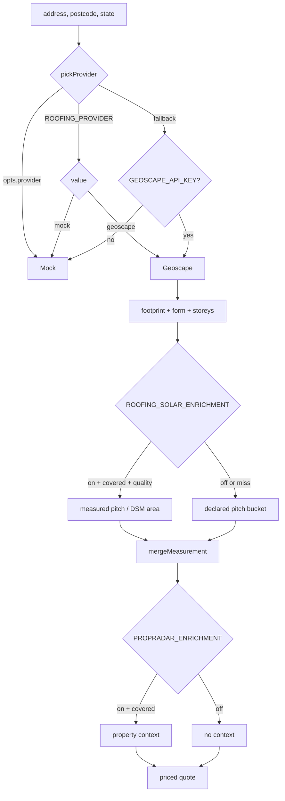

# Roof Measurement Providers

A roofing measurement is not one API call. It is a **canonical geometry provider**
(Geoscape), plus up to four optional enrichment layers, each independently flagged and
each failing safe back to the layer below. This note documents the chain, the
selection logic, and every env var that steers it.

The contract every geometry provider implements is
`RoofingMeasurementProvider` (`quotemate-automation/lib/roofing/providers/base.ts`):

```
name: 'geoscape' | 'lidar' | 'mock' | 'manual'
measure(input): Promise<RoofingMeasurementResult>
measureAll?(input): Promise<RoofingMultiMeasurementResult>   // optional
```

**Invariant — `measure()` MUST NOT throw on operational failure.** Only programmer
errors (missing address, malformed input) may throw. Everything else comes back as
`{ ok: false, code, detail }` so the orchestrator can route to inspection instead of
500-ing an SMS webhook. The failure codes are a closed set in `lib/roofing/types.ts`:
`address_not_resolved`, `outside_coverage`, `no_building_at_address`,
`complex_form_requires_inspection`, `provider_unavailable`, `provider_rate_limited`,
`provider_invalid_response`.

`measureAll()` is optional. When a provider omits it, `measureAndPriceRoofs` wraps a
single `measure()` result into a one-building array, so the multi-structure pipeline
works against any adapter (`quotemate-automation/lib/roofing/measure.ts:230-256`).

## Selection

`pickProvider` (`quotemate-automation/lib/roofing/measure.ts:89`) resolves in exactly
this order:

1. `opts.provider` — an explicit instance. Tests pass `MockRoofingProvider`; the
   dashboard's demo toggle sends `use_mock_provider` on the request body, which the
   route turns into this override.
2. `ROOFING_PROVIDER` env var — `'mock'` or `'geoscape'`, lower-cased.
3. Fallback heuristic — `GeoscapeProvider` if `GEOSCAPE_API_KEY` is present, else
   `MockRoofingProvider`.

⚠ **Drift.** `ROOFING_PROVIDER` is documented in `CLAUDE.md` as selecting between
Geoscape / PropRadar / Google. It does not: it only chooses `mock` vs `geoscape`, and
any other value (including `'propradar'` or `'google'`) falls through to the key-presence
heuristic. PropRadar and Google are **enrichment layers**, not alternative geometry
providers — they can never measure a roof on their own. The `'lidar'` and `'manual'`
provider names exist in the type union but have **no implementation** in
`lib/roofing/providers/`.



## Layer 1 — Geoscape (canonical geometry)

`quotemate-automation/lib/roofing/providers/geoscape.ts` (~54k, the largest single
file in the trade). Host `https://api.psma.com.au/v1`, overridable via
`GEOSCAPE_API_BASE_URL`.

**Auth is a raw key in the `Authorization` header — no `Bearer ` prefix.** The header
comment records this was confirmed by probing the live API on 2026-05-29.

The API is HATEOAS: the polygon is not inline. A measurement is a link-following walk.

| Step | Call | Yields |
|---|---|---|
| 1 | `GET /addresses?addressString=&state=&perPage=1` | `addressId` |
| 2 | `GET /buildings?addressId=` | building summaries + `links` |
| 3a | `links.footprint2d` | GeoJSON polygon |
| 3b | `links.roofShape` | roof form |
| 3c | `links.estimatedLevels` | storeys |
| 3d | `links.area` | planar area m² |
| 3e | 7 more roof/height/solar attribute links | `GeoscapeBuildingAttributes` |

**Credit cost: 13 credits per complete measurement** (1 address + 1 buildings list +
11 sub-resources). The file's header sizes the Premium tier (30k+ credits/month) at
roughly 2,300 measurements a month.

### The guards that matter

- **Parcel-number mismatch refusal.** `/addresses` is a *scoreless fuzzy top-1* — a
  postcode digit out silently returns a neighbouring parcel. The code cites the real
  case: `"223 Archer St"` matching `"33 Archer St Gumdale"`. `parcelNumberMismatch`
  (`geoscape.ts:644`) compares street numbers and returns
  `address_not_resolved` rather than measuring and pricing a different house. It
  **fails open** when either number is absent.
- **Bounded 429 retry.** `tryGetRetrying` retries up to 4 times with linear backoff
  plus jitter (`250 × i + rand(150)` ms), and only on HTTP 429. It guards both
  critical-path calls (address resolve, buildings list) — a single un-retried
  rate-limit used to dead-end the whole SMS roofing flow — and the sub-resource
  fan-out, where a dropped 429 would silently null out a licensed attribute.
- **Sub-resource concurrency capped at 3** (`SUB_RESOURCE_CONCURRENCY`), because
  Geoscape 429s large concurrent bursts.
- **Polygon shape tolerance.** `pickPolygon` accepts four shapes Geoscape actually
  returns: Polygon and MultiPolygon, each with `type` present *or omitted*. The
  `/footprint2d` sub-resource returns the `type`-omitted MultiPolygon shape, confirmed
  by probe on 2026-05-30.
- **Auth diagnosis.** A 401/403 on `/addresses` reports "check the API key has
  Addresses + Buildings products enabled"; on `/buildings` it names the Buildings
  product specifically. A 404 on `/buildings` is `no_building_at_address`, not a
  generic failure.

### How `measureAll` finds sheds

Two independent sources of secondary structures are merged
(`geoscape.ts:429-520`):

1. **Separate buildings** in the `/buildings` list, each with its own `buildingId`.
2. **Extra sub-polygons** inside the primary building's MultiPolygon footprint,
   above `SECONDARY_MIN_AREA_M2 = 10` m². Below that it is a carport sliver or a
   projection artefact, not a roof worth quoting. These get suffixed ids:
   `` `${buildingId}#${n}` ``.

Only the **primary** building's footprint is split — non-primary summaries already
cover their own sheds.

`rankBuildingSummaries` orders summaries **fewest related addresses first**, which is
Geoscape's proxy for "most specific match to the queried address" (a terrace or
apartment block returns several buildings; the one related to fewest addresses is the
one you asked about). The list is then capped at `MAX_BUILDINGS = 6` to bound credit
cost — 6 buildings × an 11-call fan-out is already 68 credits.

**Failure of one building does not fail the job.** A sub-resource error pushes a
warning (`"Building X could not be measured (…); skipped."`) and continues. Only
zero measurable structures returns `provider_invalid_response`.

**Invariant — exactly one primary.** After the loop, if ranking edge cases left none
flagged, `buildings[0]` is forced to `primary`. Note this is Geoscape's *specificity*
primary; the pricing layer later re-assigns roles by **size** via `roofSizeOrder`, so
the primary that reaches the quote is the largest roof, not necessarily this one. See
[[Roofing]].

## Layer 2 — Google Solar API (measured pitch, DSM area)

`quotemate-automation/lib/roofing/solar-api.ts`. Off by default.

Why it exists, from the file header: Geoscape gives a 2-D footprint and a roof-form
label, but **pitch is self-declared by the customer as a coarse bucket** and sloped
area is `footprint × bucket multiplier`. That declared pitch is the weakest number on
the roofing money path. `buildingInsights:findClosest` returns the measured pitch and
area of every roof segment, so an area-weighted mean pitch replaces the bucket.

Doctrine, stated explicitly in the source:

- **Geoscape stays the canonical AREA source.** Solar supplies the *pitch*, applied to
  the Geoscape footprint, so one area source of truth survives.
- **Except at HIGH imagery quality**, where Google's DSM-measured whole-roof area
  (`measured_roof_area_m2`) is used directly — it accounts for hips, valleys and
  complex geometry better than `footprint / cos(θ)` (`solar-api.ts:365-372`). The
  metric records this as `area_source: 'measured'`.
- **Fail-safe.** No coverage, low imagery quality, network error, missing key or
  disabled flag → today's declared-pitch behaviour. Never throws, never blocks a
  quote.
- **Measured very-steep (> 35°) routes to inspection** — a safety win over a customer
  under-declaring their pitch to get a cheaper number.

Controls:

| Setting | Default | Effect |
|---|---|---|
| `ROOFING_SOLAR_ENRICHMENT` | off | master switch; must be on **and** a key present (`solarEnabled`, `solar-api.ts:182`) |
| `GOOGLE_SOLAR_API_KEY` (falls back to `GOOGLE_MAPS_API_KEY`) | — | credential |
| `GOOGLE_SOLAR_API_BASE_URL` | Google's | override |
| `SOLAR_EXPANDED_COVERAGE` | off | adds `&experiments=EXPANDED_COVERAGE`, admitting satellite-derived `'BASE'` imagery |
| accepted qualities | `['HIGH','MEDIUM']` | `DEFAULT_ACCEPT_QUALITIES`, `solar-api.ts:132` — the money-path gate |

In the multi-structure path, Solar is called **once per building, sequentially**, to
stay gentle on the quota — bounded by `MAX_BUILDINGS`
(`quotemate-automation/lib/roofing/measure.ts`, the comment above the per-building
loop).

## Layer 3 — `mergeMeasurement` (fusion, pure, always runs)

`quotemate-automation/lib/roofing/merge-metrics.ts` runs on **every** measurement,
Solar on or off. It is pure, has no I/O, and does three things:

1. Attaches per-field provenance in `field_sources` — `google_solar` > `geoscape` >
   `derived` > `declared`, so `/m` and any audit can show where each number came from.
2. Maps Geoscape's verbatim material string onto the `RoofMaterial` enum via
   `roofMaterialFromGeoscape` and stores it as `suggested_material`.
3. Records where existing-solar knowledge came from.

**Invariant — the suggestion never silently overrides pricing.** Material stays the
tradie's declared choice; Geoscape's read is a pre-fill plus a **safety warning** when
it disagrees on asbestos. The mapper deliberately checks cement/fibro/asbestos/fibre
**before** the generic "metal"/"tile" catch-alls, because the cement read is the
highest-value one — it drives the asbestos gate. An unrecognised string returns
`null`, never a guess.

Geoscape classifies coarse *categories*, not Colorbond profiles, so `"Metal"` maps to
`colorbond_corrugated` (the corrugated default), not to Trimdek or Klip-Lok.

## Layer 4 — PropRadar (property context)

`quotemate-automation/lib/roofing/propradar.ts`. Base
`https://api.propradar.com.au/v1` (override `PROPRADAR_API_BASE_URL`), auth via an
`X-API-Key` header. Enabled only when `PROPRADAR_ENRICHMENT === 'true'` **and**
`PROPRADAR_API_KEY` is set (`propradarEnabled`).

Two calls: `/properties/search?address=&postcode=` → `property_id` →
`/properties/{id}`. It returns dwelling type, `year_built`, floor and land area,
bedrooms, bathrooms, parking.

It is **additive and best-effort** — every failure path returns `null`, and the
lookup is fired *concurrently* with the measurement in `measureAndPriceRoofs` because
both key off the same address.

Its one load-bearing contribution: a PropRadar `year_built` seeds
`building_year_built` for any structure the caller did not supply one for, which feeds
the pre-1990 asbestos inspection gate.

⚠ Two real limits, both documented in the source:

- PropRadar only covers **on-market or recently-sold** properties. Roofing customers
  are mostly off-market, so a lookup returns `null` for most addresses.
- `year_built` requires a **Hobby+ plan** and is omitted on free. So the asbestos-gate
  benefit — the whole reason this layer is on the money path — does not light up until
  the plan is upgraded.

`HOUSE_LIKE` (`house`, `duplex`, `townhouse`, `villa`, `terrace`, `semi`) marks
roof-quotable dwelling types; anything else (unit, apartment, flat) is a strata or
shared roof the tradie must confirm access to before quoting, surfaced through
`propertyContextWarnings`.

## Imagery: what the customer and tradie actually see

None of these measure. They are display and vision inputs.

| Module | Route | Notes |
|---|---|---|
| `google-maps.ts` | `GET /api/roofing/static-map`, `GET /api/roofing/q/[token]/static-map` | pure URL builder; the **route** fetches the image and streams it so `GOOGLE_MAPS_API_KEY` never reaches the browser |
| `google-tiles.ts` | `GET /api/roofing/map-tiles/session`, `GET /api/roofing/map-tiles/[z]/[x]/[y]` | MapLibre raster source proxied server-side; session cached in `localStorage` (`qm.gmaps.tiles.session.v2`) at most once a fortnight |
| `street-view.ts` | `GET /api/roofing/street-view` | ground-level photo for vision + the report |
| `geocode.ts` | `GET /api/roofing/reverse-geocode` | Nominatim (OSM, no key, `NOMINATIM_API_URL`); server-side only because Nominatim wants a real `User-Agent` and browsers cannot set one |
| `providers/predictive.ts` | `GET /api/roofing/suggest-address` | Geoscape Predictive type-ahead; the picked `addressId` feeds Buildings directly, skipping the `/addresses` fuzzy lookup and its parcel-mismatch risk |

**Licensing note, from `google-maps.ts`:** Google Maps Static is used for *display
alongside* our own measurement source. Geoscape's polygon is the canonical
measurement — the Google image is never measured from.

`isValidTileCoord` (`google-tiles.ts`) constrains the proxy to `z` ≤ 2 digits and
`x`/`y` ≤ 7 digits, so the tile route cannot be used to forward arbitrary paths to
Google, while still passing legitimate z19 tiles.

The tile proxy is **best-effort**: any failure (Map Tiles API not enabled on the key,
no key, network) returns `null` and the map falls back to the free Esri basemap. The
map never breaks because Map Tiles is unavailable.

## Vision providers (material + solar detection)

`quotemate-automation/lib/roofing/vision-provider.ts` is a three-deep cascade used by
`vision-verify.ts` (does the customer's photo show the same building, and what
material is it) and close-up solar detection.

`ROOFING_VISION_PROVIDER` picks the **primary**; the other open VLM is the middle
fallback; **Claude is always the final backstop**:

| Value | Chain |
|---|---|
| unset or `huggingface` | HF → Cloudflare → Claude |
| `cloudflare` | Cloudflare → HF → Claude |
| `claude` | Claude only |

- Hugging Face: Inference-Providers router, `HUGGING_FACE_API_TOKEN`, model
  `HF_VISION_MODEL` (default `Qwen/Qwen2.5-VL-72B-Instruct`). Multi-image.
- Cloudflare: Workers AI `/ai/run`, `CLOUDFLARE_ACCOUNT_ID` +
  `CLOUDFLARE_WORKERS_AI_TOKEN` (falling back to `CLOUDFLARE_CLAUDE_VISION` /
  `CLOUDFLARE_API_TOKEN`), model `CLOUDFLARE_VISION_MODEL`. **Single-image only** —
  the building-match comparison degrades to `null`, material classification survives.
- Claude: `ANTHROPIC_API_KEY`, model `ROOFING_VISION_MODEL`, default
  `claude-sonnet-4-6` (`vision-verify.ts:20`).

An open-VLM answer must pass an `isUsable` gate before it is accepted; otherwise the
chain falls through. The stated reason is that open VLMs are weaker on exactly the
reads that carry liability — asbestos, roof material, existing solar — so Claude
backstops the money and liability path.

⚠ The header notes explicitly that **neither Claude nor Gemini is hosted on HF or
Cloudflare Workers AI**; both "primaries" are open VLMs and the frontier read is the
fallback. This contradicts nothing in `CLAUDE.md` but is easy to misread from the flag
name alone.

`ROOF_MATERIALS` in `lib/roofing/types.ts` exists **as a value, not just a union**,
specifically because a hand-written `ReadonlySet<RoofMaterial>` is satisfied by a
subset — which is how `vision-verify.ts` silently kept a 6-material vocabulary after
corrugated and spandek were added, reporting every corrugated roof as Trimdek.

## Mock provider

`quotemate-automation/lib/roofing/providers/mock.ts`. Deterministic from a hash of
`address.toLowerCase() + '|' + postcode`:

- footprint 110–289 m²
- form cycles `gable` / `hip` / `gable_hip`
- 2 storeys on 1-in-7 addresses
- hips: 0 for gable, 4 for hip, 2 for gable_hip; valleys: 1 for gable_hip

Same address always yields the same metrics, which is what makes it usable for
screencasts, the dashboard demo toggle, and orchestrator unit tests.

## Env var summary

Every `process.env` reference under `quotemate-automation/lib/roofing/`:

| Var | Layer | Effect when unset |
|---|---|---|
| `ROOFING_PROVIDER` | selection | falls to key-presence heuristic |
| `GEOSCAPE_API_KEY` | geometry | Mock provider is selected; an explicit Geoscape instance returns `provider_unavailable` |
| `GEOSCAPE_API_BASE_URL` | geometry | `https://api.psma.com.au/v1` |
| `ROOFING_SOLAR_ENRICHMENT` | pitch | declared-pitch bucket only |
| `GOOGLE_SOLAR_API_KEY` / `GOOGLE_MAPS_API_KEY` | pitch, imagery | Solar disabled; static map + tiles unavailable |
| `GOOGLE_SOLAR_API_BASE_URL` | pitch | Google default |
| `SOLAR_EXPANDED_COVERAGE` | pitch | `BASE` imagery not requested |
| `PROPRADAR_ENRICHMENT`, `PROPRADAR_API_KEY` | context | no property context; asbestos gate relies on tradie-entered year |
| `PROPRADAR_API_BASE_URL` | context | `https://api.propradar.com.au/v1` |
| `NOMINATIM_API_URL` | geocode | OSM public endpoint |
| `ROOFING_VISION_PROVIDER`, `ROOFING_VISION_MODEL` | vision | HF primary, `claude-sonnet-4-6` backstop |
| `HF_VISION_MODEL`, `HUGGING_FACE_API_TOKEN` / `HF_TOKEN` | vision | HF leg skipped |
| `CLOUDFLARE_*` | vision | Cloudflare leg skipped |
| `GEMINI_API_KEY`, `GEMINI_VISION_MODEL` | aerial solar detect | detection degrades |
| `ROOFING_IMAGE_PROVIDER` | after-render | see [[Roofing]] |
| `ROOFING_EDGE_ANALYSIS_ENABLED` | edge analysis | default-off; form-based hip/valley estimates only |
| `ROOFING_LAYOUT_MODEL` | layout plan | default model |
| `ROOFING_MODEL3D_IMAGE_MODEL`, `ROOFING_MODEL3D_SYNTH`, `TRIPO_API_KEY`, `TRIPO_MODEL_VERSION`, `TRIPO_FACE_LIMIT`, `TRIPO_TEXTURE_QUALITY` | 3D model | no `.glb` generated |
| `ANTHROPIC_API_KEY` | vision backstop | no final backstop |
| `SUPABASE_SERVICE_ROLE_KEY`, `NEXT_PUBLIC_SUPABASE_URL` | persistence + HMAC | pricing-run proofs unavailable |

See [[Environment Variables and Feature Flags]] for the platform-wide list.

## Open questions

- `'lidar'` and `'manual'` are in the provider-name union with no adapter. Are they
  reserved, or leftovers?
- Does anything call `pickBestSummary` now that `measureAll` uses
  `rankBuildingSummaries`? It may only survive on the single-`measure()` path.

## Related
- [[Roofing]]
- [[Measurement Results Page]]
- [[Roofing Receptionist]]
- [[External Services and Integrations]]
- [[Environment Variables and Feature Flags]]
- [[Solar]]
- [[Model and Prompt Inventory]]
