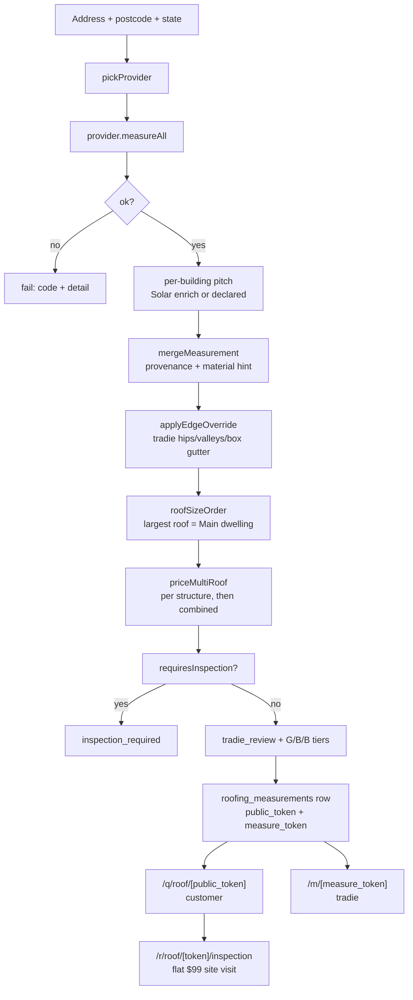

# Roofing

Roofing is the largest self-contained trade slice in the app: ~101 files in
`quotemate-automation/lib/roofing/` plus a `providers/` sub-directory, 17 API route
groups under `quotemate-automation/app/api/roofing/`, a tradie page at `/m/[token]`
and a customer funnel at `/q/roof/[token]`.

Its defining property is that **no LLM ever touches the money**. Where
[[Electrical]] and [[Plumbing]] run an Opus draft through the [[Grounding Validator]],
roofing computes `$/m² × sloped area × loadings` in a pure function
(`quotemate-automation/lib/roofing/pricing.ts`) and never asks a model for a number.
The rationale is written at the top of that file: roofers price per sloped square
metre operationally, so line-item granularity is unnecessary, and a deterministic
calculation means no validator is needed at all.

The LLM appears only *around* the money: the [[Roofing Receptionist]] drives the SMS
conversation, and vision models classify material and detect existing solar. Both are
fenced by [[Grounding and Safe Replies]].

## The shape of the trade

Two entry paths converge on the same measurement + pricing core:

1. **SMS** — the customer texts; the [[Roofing Receptionist]] collects address,
   intent, material, pitch, then calls `measureAndPriceRoofs`. Persists via
   `quotemate-automation/lib/sms/roofing-measure-dispatch.ts`.
2. **Dashboard** — the tradie types the address into the Roof tab, hits
   `POST /api/roofing/measure-all`, reviews structures, saves via
   `POST /api/roofing/save`.

Both write one row into `public.roofing_measurements`. Both mint the two capability
tokens described below. Neither writes into `public.quotes` unless the tradie
explicitly promotes the job with `POST /api/roofing/save-as-quote`.

## Address to price, step by step

`measureAndPriceRoofs` (`quotemate-automation/lib/roofing/measure.ts:216`) is the
orchestrator. The single-structure sibling `measureAndPriceRoof` still exists and is
used by `POST /api/roofing/measure`, but the multi-structure path is the one the
dashboard and SMS both take.

| Step | Function | File |
|---|---|---|
| Pick a provider | `pickProvider` | `lib/roofing/measure.ts:89` |
| Kick off PropRadar concurrently | `fetchPropertyContext` | `lib/roofing/propradar.ts` |
| Enumerate structures | `provider.measureAll()` (falls back to wrapping `measure()`) | `lib/roofing/providers/base.ts` |
| Pitch: measured or declared | `enrichMetricsWithSolar` / `reapplyPitchToMetrics` | `lib/roofing/solar-api.ts`, `measure.ts:79` |
| Fuse provenance + material hint | `mergeMeasurement` | `lib/roofing/merge-metrics.ts` |
| Apply tradie edge overrides | `applyEdgeOverride` | `lib/roofing/measure.ts` (module-private) |
| Rank structures largest-first | `roofSizeOrder` | `lib/roofing/pricing.ts:741` |
| Price every structure | `priceMultiRoof` → `calculateRoofingPrice` | `lib/roofing/pricing.ts:773`, `:491` |

**Invariant — the Main dwelling is always the largest roof.** `roofSizeOrder` runs
*before* pricing and re-assigns `role` so index 0 is `primary` and the rest are
`secondary` largest-to-smallest. Doing this after pricing would let the quote, the
per-structure aerials, the PDF and the SMS disagree about which building is the house
(`quotemate-automation/lib/roofing/measure.ts`, the comment above the `roofSizeOrder`
call).

**Invariant — solar-enrichment warnings are re-labelled with the FINAL structure
label.** Warnings are collected per building during enrichment, then re-emitted as
`` `${quote.structures[rank].label}: ${w}` `` after ordering, so a warning never names
a structure by its pre-sort identity.

## Pricing, in detail

`calculateRoofingPrice` (`quotemate-automation/lib/roofing/pricing.ts:491`) is pure.
Inputs: `metrics`, `inputs` (material, pitch, intent, year built), an optional
`rateCard`, an optional `outsideCoverage` flag.

- **Sloped area** = `footprint_m2 × PITCH_CORRECTION[pitch]`, where the corrections
  are `shallow 1.06`, `standard 1.10`, `steep 1.18`, and `very_steep`/`unknown` are
  `null` — a null routes the job to inspection rather than guessing
  (`pricing.ts:66-89`). When Google Solar returns a HIGH-quality DSM roof area,
  `measured_roof_area_m2` supersedes the derived figure and `area_source` records
  `'measured'` (`lib/roofing/types.ts`).
- **Tiers** map onto three operational scopes: `good` = patch/spot repair (a fraction
  of the re-roof base), `better` = re-roof in the same material, `best` = upgrade
  material.
- **Best is never cheaper than Better.** `upgradeRate` is floored to `baseRate`, and
  after the call-out minimum `bestEx = Math.max(applyFloor(bestRaw), betterEx)`. The
  code cites `specs/roofing-tier-ordering-fix.md`; the failure it prevents is a
  terracotta roof ($130/m²) being "upgraded" to Colorbond Klip-Lok ($115/m²) and
  pricing *down*.
- **Loadings** stack multiplicatively: `multi_storey` at 2+ storeys, `asbestos` on
  `cement_sheet`, and an optional per-tenant `complexity_loading_pct`
  (`applicableLoadings`, `pricing.ts:199`).
- **Call-out minimum** raises any positive tier to `call_out_minimum_ex_gst`
  (default $550 ex-GST — a half-day mobilisation). Zero-rate tiers stay at zero
  rather than fabricating a number.
- **Edge works** (ridge/hip repointing, valley flashing, box gutter) are derived by
  `deriveEdgeWorks` and itemised only when the tier has a priceable base
  (`sqmEx > 0`). Repair intents charge edge works on every tier; `full_reroof` /
  `gutter_replace` / `unknown` charge them only on the patch-scoped `good` tier and
  show them at $0 on the others labelled "included in the re-roof scope".
- **Accessories** (gutter lm, downpipe count, fascia lm, soffit lm, box gutter lm)
  are **never inferred from the footprint**. `footprintPerimeterM` exists as a
  display suggestion only; the quantity must be typed by a tradie on `/m`
  (`lib/roofing/types.ts`, the comment block on `RoofMetrics`).

### Routing to inspection

`requiresInspection` (`pricing.ts:89`) returns the first matching gate, in order:

| Gate | Condition |
|---|---|
| Outside coverage | `outsideCoverage === true` |
| Asbestos | `material === 'cement_sheet'` |
| Asbestos by age | `building_year_built < 1990` **and** `intent === 'full_reroof'` |
| Fall protection | `pitch` is `very_steep` or `unknown` |
| Complex form | `metrics.form === 'complex'` |
| No area | `sloped_area_m2 === null` |
| Access | `storeys >= 3` |

Anything that survives all seven becomes `tradie_review` — never `auto_quote`, even
though the union in `lib/roofing/types.ts` defines that third variant. Job-level
routing in `priceMultiRoof` escalates: **if any one structure requires inspection,
the whole job is `inspection_required`**, because a tradie must attend the property
regardless. `inspection_structures` records which ones triggered it.

⚠ **Drift.** `docs/strategy.md` and the repo `CLAUDE.md` both describe roofing as
"auto-send". That is true of price *visibility* on `/q/roof`, but the routing decider
itself never emits `auto_quote` — every priced job carries
`decision: 'tradie_review'` with the reason "Every roofing quote requires tradie
sign-off before customer send." The auto-send behaviour comes from
`POST /api/roofing/save` stamping `confirmed_at` at insert time, not from the router.

## Pricing authority — the signed run proof

The newest and least-documented part of the trade
(`quotemate-automation/lib/roofing/pricing-authority.ts`, added 2026-09-01). It exists
because a client that computes a price and then posts it back to `/save` can post any
number it likes.

- `loadTenantRoofingPricingContext(db, tenantId, primaryTrade)` reads
  `pricing_book.overlays.roofing_rate_card` for the tenant and parses it with
  `parseTenantRoofingRateCard`. That parser is **strict and fills nothing from
  product defaults** — every rate, both loadings, `upgrade_material`,
  `gst_registered`, the call-out minimum, six per-lm rates, the downpipe rate,
  `price_edge_works` and both solar allowance figures must be present and in range,
  or it returns `null`.
- A `null` means **setup-required**, not "use defaults". `/api/roofing/measure`,
  `/measure-all`, `/save`, `/detect-solar`, `/measurement/[token]` and the SMS
  dispatch all bail with `tenant_pricing_required` when it returns null.
- `roofingPricingRevision` hashes `{pricingBookId, rateCard}` with SHA-256 over a
  key-sorted stable JSON encoding, giving a `revision` string that changes the instant
  a tradie edits a rate.
- `createRoofPricingRun` (called by `/measure-all`) issues an HMAC-signed token
  `base64url(proof).base64url(sig)` binding `tenant_id`, `pricing_book_id`,
  `pricing_revision`, a `request_digest` of `{address, provider, quote}`, and a 30
  minute TTL.
- `verifyRoofPricingRun` (called by `/save`) rejects with `invalid_run`,
  `wrong_tenant`, `pricing_stale` (HTTP 409), `run_expired` or `run_mismatch`. Only
  after it passes does the route trust the posted quote — and it explicitly discards
  the caller's `structures` list (`void callerStructures`) in favour of the signed
  snapshot.
- `roofMeasurementTokensForRun` derives **both capability tokens deterministically**
  from the run id: `HMAC-SHA256(secret, "roof:<purpose>:<runId>")` truncated to 32
  hex characters. Because they are a pure function of the run, a retried save finds
  the existing row by `measure_token` and returns `{ ok: true, existing: true }`
  instead of duplicating the job.

The HMAC secret is `SUPABASE_SERVICE_ROLE_KEY`; when it is absent the routes return
`pricing_authority_unavailable` rather than falling back to unsigned trust.

`POST /api/roofing/save-as-quote` runs the same check by a different route: it
compares the `pricing_authority` stamped onto the stored `quote` jsonb against the
tenant's current authority **and** against the caller's
`expected_pricing_revision`, and 409s on any mismatch. Its request schema accepts
only `{ measure_token, expected_pricing_revision }` — every scope and money field is
reloaded server-side.

⚠ **Drift.** `CLAUDE.md` describes the rate card as coming from
`pricing_book.overlays` with `DEFAULT_ROOFING_RATE_CARD` as the fallback. That is no
longer how the running routes behave: `DEFAULT_ROOFING_RATE_CARD` (`pricing.ts:157`)
is still the default *inside* the pure pricer, but every HTTP surface now refuses to
price at all without a complete tenant card.

## The two-token pair

Every `roofing_measurements` row carries two unguessable capability tokens
(`quotemate-automation/lib/roofing/tokens.ts`):

| Column | Page | Audience |
|---|---|---|
| `public_token` | `/q/roof/[public_token]` | customer — priced quote, $99 mint, booking |
| `measure_token` | `/m/[measure_token]` | tradie — [[Measurement Results Page]] |

**Invariant — mint them as a pair and spread the result into the insert.** The
docstring in `tokens.ts` records why: minting them separately is exactly how the SMS
receptionist ended up writing `public_token` only, leaving every SMS-origin job
without a Measurement Results page while web saves had one. `save-as-quote` claims
rows *by* `measure_token`, so those 16 jobs could not be promoted to a quote at all.

Three defences now exist for the same failure:

1. `newMeasurementTokens()` returns both — used by
   `quotemate-automation/app/api/sms/inbound/route.ts:1168` and
   `quotemate-automation/lib/sms/roofing-measure-dispatch.ts:134`.
2. `roofMeasurementTokensForRun()` derives both from the signed run — used by
   `quotemate-automation/app/api/roofing/save/route.ts:162`.
3. Migration 182 sets a **column default** on `measure_token`
   (`encode(gen_random_bytes(16),'hex')`) so a writer that omits it still gets a
   token. The migration deliberately does **not** add `NOT NULL`: the failure mode
   was omission, and a hard-failing SMS webhook is worse than a missing link
   (`sql/migrations/182_measure_token_default.sql`).

⚠ Note the two minters produce different token widths — `newMeasurementTokens` gives
32 hex chars from `randomBytes(16)`, `roofMeasurementTokensForRun` truncates an HMAC
to 32 hex chars. Both are 32 characters, so nothing downstream distinguishes them,
but they are not the same construction and only the second is idempotent.

## `roofing_measurements` columns

Base table from migration 081; everything after is additive `add column if not
exists`.

| Column | Type | Added | Purpose |
|---|---|---|---|
| `id` | uuid pk | 081 | |
| `tenant_id` | uuid → tenants | 081 | `on delete set null` |
| `created_by` | uuid | 081 | Supabase `auth.users` id — never a Clerk `user_…` string |
| `address`, `postcode`, `state` | text | 081 | property |
| `provider` | text | 081 | `geoscape` / `lidar` / `mock` / `manual` |
| `customer_name`, `customer_phone` | text | 081 | lead capture |
| `structure_count` | int | 081 | denormalised |
| `combined_area_m2` | numeric | 081 | denormalised |
| `combined_better_inc_gst` | numeric | 081 | denormalised list price |
| `routing` | text | 081 | `tradie_review` / `inspection_required` |
| `structures` | jsonb | 081 | `[{buildingId, role, label, inputs}]` |
| `quote` | jsonb | 081 | full `MultiRoofQuote` + `pricing_authority` + `pricing_run_id` |
| `roofing_state` (on `sms_conversations`) | jsonb | 085 | see [[Roofing Receptionist]] |
| `public_token` | text | 085 | customer capability token |
| `confirmed_at` | timestamptz | 086 | gate for showing full prices |
| `confirmed_structure` | int | 086 | SMS single-structure confirm |
| `preview_image_path`, `preview_status` | text | 086 | aerial preview |
| `pdf_path` | text | 105 | cached Gotenberg render |
| `measure_token` | text | 140 (default 182) | tradie capability token |
| `included_indices` | int[] | 140 | **authoritative** structure selection, 1-based |
| `paid_at`, `paid_tier`, `paid_stripe_session_id` | — | 165 | $99 site visit |
| `customer_accepted_at`, `customer_accepted_tier` | — | 165 | explicit acceptance |
| `scheduled_at`, `scheduled_window` | — | 167 | booking |
| `quote_id`, `quote_share_token` | uuid / text | 168 | link to the promoted `quotes` row |
| `layout_plan`, `layout_status` | jsonb / text | 170 | see below |
| `model3d_status`, `model3d_task_id`, `model3d_glb_path`, `model3d_error` | — | 173 | Tripo 3D model |
| `model3d_anatomy` | jsonb | 174 | 3D anatomy labels |
| `paid_amount_cents` | bigint | 181 | actual amount taken |

RLS is enabled on the table with **no policies** (migration 081) — service-role API
routes bypass it, the anon key sees zero rows. Tenancy is app-layer plus the two
capability tokens. See [[Tenancy and RLS]].

**Invariant — `included_indices` is 1-based and authoritative.** `/api/roofing/save`
defaults a fresh job to **roof-only** (just the primary structure) so the tradie opts
sheds and garages *in*, not out (`primaryStructureIndices`,
`quotemate-automation/lib/roofing/selection.ts`). The denormalised summary is derived
from the same selection via `denormFromSelection`, so the dashboard list, `/m`,
`/q/roof` and the PDF all show the same number.

**Invariant — denormalise AFTER attaching solar.** `save/route.ts` computes
`denorm` from `quoteToStore` (the solar-attached quote), not from the incoming
payload. Computing it first stored a lower dashboard-list price than every other
surface showed.

## Save-as-quote: promoting a measurement

`POST /api/roofing/save-as-quote` writes a real `intakes` + `quotes` pair so a
roofing job can use the generic [[Quote Pages]] funnel and the `/q/[token]` surface:

- `intakes` — `trade='roofing'`, `job_type` from the inputs, scope holds the
  measurement, address/suburb split by `splitAddress`.
- `quotes` — `good`/`better`/`best` jsonb built by `buildTierObjects`, a
  `share_token` from `generateShareToken`, `status='draft'`,
  `needs_inspection` mirroring `routing.decision`.

Roofing intakes deliberately **bypass** `lib/intake/structure.ts` — the `IntakeSchema`
enum is still `['electrical','plumbing']`, so the row is written directly. See
[[Intake Structuring]].

## Extras hanging off the measurement

- **Layout plan** (`lib/roofing/layout-plan.ts`, ~36k, migration 170) — a derived
  sheet-layout / edge-protection plan stored in `layout_plan` jsonb with a
  `layout_status` state, rendered by `RoofLayoutSection.tsx` on `/m` and served to
  the customer page by `GET /api/roofing/q/[token]/layout-plan`. Overlay rendering
  lives in `layout-overlay-svg.ts` and `layout-geojson.ts`.
- **3D model** (`lib/roofing/model3d.ts`, ~39k, migrations 173/174) — a Tripo task
  (`TRIPO_*` env) producing a `.glb` in the `intake-photos` bucket, with
  `model3d_status` cycling `null → generating → ready → failed`, plus a
  `model3d_anatomy` jsonb of labelled roof parts. Driven by
  `POST /api/roofing/model3d/[token]` and shown by `Roof3DModelSection.tsx`.
- **Semantic edge analysis** (`lib/roofing/edge-analysis.ts`, migration 172, flag
  `ROOFING_EDGE_ANALYSIS_ENABLED`) — refines hip/valley/ridge classification beyond
  the form-based estimates in `estimateHipsFromForm` / `estimateValleysFromForm`.
- **Existing solar / skylight detection** (`lib/roofing/solar.ts`,
  `solar-detect.ts`) — runs inline in `/api/roofing/save` (hence
  `maxDuration = 60`) and attaches a `SolarQuoteAddon` detach-and-reinstate allowance
  to the stored quote. It is a deterministic add-on on the money path and never flows
  through the estimator grounding validator.
- **After-image renders** (`roof-after.ts`, `showcase-render.ts`) — the FLUX/Replicate
  "what it will look like" render, served by
  `GET /api/roofing/q/[token]/after-image`.
- **PropRadar property context** — dwelling type, year built, floor/land area, gated
  on `PROPRADAR_ENRICHMENT` **and** `PROPRADAR_API_KEY`. Best-effort and additive; it
  seeds the pre-1990 asbestos gate for structures whose year the caller did not
  supply. `year_built` needs a paid Hobby+ plan, so on the free tier the asbestos
  benefit does not light up at all (`lib/roofing/propradar.ts`).

## What the customer pays

Roofing is a **flat $99 refundable site visit**, minted at
`/r/roof/[token]/inspection`. Good/Better/Best prices stay visible as information;
the price is confirmed on site. There is no tier deposit on roofing. See
[[What the Customer Pays by Trade]] and [[Mint Routes and Guards]].

⚠ Known hole, carried from the debt register: `/r/roof` skips the `canTakePayment()`
slots guard on **tenant-less rows** (`tenant_id IS NULL` → mint anyway), so a legacy
or dev-number job can be charged with no bookable window. See
[[Known Debt Register]].

## Open questions

- Does anything still call the single-structure `measureAndPriceRoof` other than
  `POST /api/roofing/measure`? The dashboard appears to use `/measure-all`
  exclusively.
- `RoofingRoutingDecision` defines an `auto_quote` variant that no code path in
  `pricing.ts` produces. Is it read anywhere, or is it dead?
- `lib/roofing/promotion.ts` is small and recent (2026-07-21) — its relationship to
  `save-as-quote` was not traced here.

## Related
- [[Roof Measurement Providers]]
- [[Measurement Results Page]]
- [[Roofing Receptionist]]
- [[The Four Pipelines]]
- [[What the Customer Pays by Trade]]
- [[Quote Pages]]
- [[Tenancy and RLS]]
- [[Known Debt Register]]
