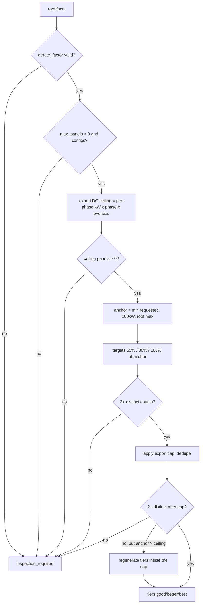

# Solar Sizing and Pricing Engine

The arithmetic half of [[Solar]]. Every module below is **PURE** — no I/O, no
LLM, fully unit-tested (each `*.ts` has a sibling `*.test.ts`). This is what the
"deterministic money" half of the [[Decision Log]] entry actually means for solar:
there is no model anywhere in this chain to ground, because there is no model.

The orchestration order is fixed by `runSolarEstimate`
(`quotemate-automation/lib/solar/intake.ts:256-271`):

```
sizeSolarSystem  →  estimateSolarProduction (per tier)  →  calculateSolarPrice  →  calculateSolarEconomics
```

---

## 0. Config — no magic numbers in code

Everything that could drift with a market or regulator change lives in the dated
`solar_config` table (migration 100), loaded by `loadSolarConfig`, then overlaid
per tenant by `loadSolarTenantRates` (`lib/solar/rate-card-overlay.ts`) from
`pricing_book.overlays.solar_rate_card`. Every estimate stamps the
`config_version` it used.

`DEFAULT_SOLAR_CONFIG` (`lib/solar/config.ts:158`) is the shipped baseline:

| Field | Default | Used by |
|---|---|---|
| `derate_factor` | `0.81` | DC→AC in `production.ts`, DC ceiling in `sizing.ts` |
| `dc_oversize_factor` | **absent by default** | `sizing.ts`; falls back to `1 / derate ≈ 1.23` |
| `self_consumption_pct` | `0.40` | `economics.ts` |
| `retail_rate_aud_per_kwh` | `0.32` | `economics.ts` |
| `stc_price_aud` | `38` | `pricing.ts` |
| `feed_in.default_aud_per_kwh` | `0.06` (Ausgrid `0.08`, Ergon `0.0858`) | `economics.ts` |
| `export_limits.default_kw_per_phase` | `5` | `sizing.ts` |
| `default_panel_capacity_watts` | `400` | `roof.ts`, `manual-fallback.ts`, `production.ts` |
| `area_per_panel_m2` | `1.95` | `manual-fallback.ts` |
| `complex_roof_min_segments` | `6` | `pricing.ts` loadings |
| `degradation_pct_per_year` | `0.005` | metadata on the production result |

### The freshness gate

`validateSolarConfig(config, installYear)` (`lib/solar/config.ts:238`) runs
**first**, before any computation, and `runSolarEstimate` throws on a failure
(`intake.ts:143-148`) — which the route turns into a 502 `engine_failed`. It
refuses when:

- the config is missing (`config_missing`);
- there is no `deeming_schedule` entry for the install year, or it is `<= 0`
  (`deeming_year_past` — the SRES wind-down: `2031: 0`);
- `stc_price_aud` is unset or non-positive (`stc_price_unset`);
- `zone_table` is empty (`config_invalid`);
- `derate_factor` is not a fraction in `(0,1)`;
- `dc_oversize_factor`, when present, is outside `[1, 2]`.

**Invariant: the freshness gate MUST run before sizing, because a stale
`deeming_schedule` would silently price a system with the wrong STC rebate — and
`checkNetIdentity` would still pass, since net would consistently equal
gross − (wrong rebate).**

---

## 1. Roof facts — two sources, one shape

Both producers return the same `SolarRoofFacts`; only `source` differs. Downstream
code never branches on which one it got, except for the confidence band.

### `normaliseSolarRoofFacts` (Google) — `lib/solar/roof.ts:35`

Takes the parsed `SolarRoofInsight` from the reused roofing client **plus** a
`raw` handle to the same response body, because `solarPotential` fields
(`maxArrayPanelsCount`, `panelCapacityWatts`, `solarPanelConfigs`) are not in the
roofing parser's output. Notable choices:

- Segment areas are summed **raw** and rounded once
  (`roof.ts:66-68`); the per-plane `round1` is display-only, so per-segment
  rounding error never accumulates into `usable_area_m2`.
- `primary_orientation` is the orientation of the single largest plane.
- `max_panels_count = floor(maxArrayPanelsCount)`, `0` when absent.

### `buildManualRoofFacts` (fallback) — `lib/solar/manual-fallback.ts:66`

The customer declares three facts: dominant roof direction, a size bucket, and
storeys. Net (already obstruction-discounted) areas:

| `roof_size` | usable m² | panels at 1.95 m²/panel |
|---|---|---|
| `small` | 45 | 23 |
| `medium` | 90 | 46 |
| `large` | 150 | 76 |

DC yield is **not** one flat AU-wide number. It resolves most-specific-first:
`manual_benchmark_by_state` (NSW 1621 … TAS 1325 … NT 1901 kWh/kW) → flat
`manual_benchmark_kwh_per_kw` → the module constant 1400. Then a declared
orientation factor multiplies it (north `1.0`, east/west `0.92`, south `0.80`,
flat `1.0` because installers tilt-frame, unknown `0.90`).

Those state DC yields are deliberately `CEC AC benchmark × 0.95 ÷ 0.81`
(`config.ts` comment above `manual_benchmark_by_state`), so the implied AC/kW
lands at `0.95 × CEC` before orientation and at worst `0.76 × CEC` on a south
roof — **always inside** the ±35% CEC guardrail of step 3. Change either number
without the other and every manual estimate starts flagging.

⚠ The synthetic `panel_configs` are a **linear ladder, 1..max**
(`manual-fallback.ts:114-121`), not one max-roof config. `sizing.ts` picks the
config *nearest* each tier's panel count via `nearestConfig`; a single max config
would hand a 55%-of-roof tier the full roof's energy and blow the CEC cross-check
on every tier but the top one. Do not "simplify" that ladder.

---

## 2. `sizeSolarSystem` — tiers capped by roof AND export limit

`lib/solar/sizing.ts:35`. Produces **2 or 3** genuinely different system sizes —
never one size at three discounts.



### The numbers

- **Tier fractions**: `GOOD_FRACTION = 0.55`, `MIDDLE_FRACTION = 0.80`, top tier =
  the anchor (`sizing.ts:32-33`).
- **Export ceiling**: `export_limit_kw_ac = per-phase limit × phaseMultiplier`,
  where `phaseMultiplier = 3` only for `phase === 'three'`; `'single'` and
  `'unknown'` stay at `×1` (`sizing.ts:47-48`, `93-96`). The DC ceiling is that AC
  limit × `dc_oversize_factor` (or `1/derate` when absent).
- **Anchor**: when the customer states a preferred size, the anchor is
  `min(requested, MAX_REQUESTED_SYSTEM_KW, roof max)` converted to panels
  (`sizing.ts:148-152`).
- **`MAX_REQUESTED_SYSTEM_KW = 100`** lives in `lib/solar/limits.ts:31` and is the
  single source of truth for six layers: the client payload builder, the Zod
  schema, the sizing anchor cap, the redraft override, the persist clamp, and the
  `solar_estimates.requested_system_kw` CHECK constraint (migration 162).
  ⚠ That file records a real regression: the live DB check had drifted to `<= 30`
  while the form and schema said 100, so any request in `(30, 100]` passed
  validation, ran the whole engine, then failed the INSERT — surfacing to the
  customer as "We could not save your estimate just now". **Never change the
  ceiling in one layer.**

### The export limit vs a stated preference

A subtle and deliberate asymmetry (`sizing.ts:186-194`): when the customer has
**not** stated a size, a tier that exceeds the export ceiling is **clamped** to it.
When the customer **has** stated a size, the tier is **not** shrunk — it is marked
`export_limited: true` so the quote explains that phase/export approval must be
confirmed by the installer. Silently shrinking a customer's stated request was
judged worse than flagging it.

### Money-path caveat, recorded in the source

`sizing.ts:88-92` notes that `production.ts` models AC as DC × derate with **no
hard clip at the inverter**, so an export-limited top tier overstates AC by
`(oversize × derate − 1) ≈ 8%` at an oversize of 1.33. That is why
`dc_oversize_factor` ships absent. It sits inside the ±20–30% band the quote
already displays.

### The five inspection exits

`sizeSolarSystem` returns `tiers: []` with `decision: 'inspection_required'` when:
invalid `derate_factor`; no usable roof (`max_panels_count <= 0` or no configs);
the export ceiling admits zero panels; fewer than two distinct target counts
pre-cap; fewer than two after the cap and the large-roof fallback.

⚠ **All five of those decisions are then discarded.** See
[[Solar Release Gate and Cross-Checks]].

---

## 3. `estimateSolarProduction` — annual AC + the CEC cross-check

`lib/solar/production.ts:63`. Runs once per tier.

1. **Rating scale** — Google's config DC energy assumes a 400 W panel, so
   `scaledDc = config_dc_kwh × (panel_capacity_watts / 400)`.
2. **Derate** — `annual_kwh_ac = round(scaledDc × derate_factor)`.
3. **CEC cross-check** — implied `AC/kW` against a state benchmark:

   | | NSW | VIC | QLD | SA | WA | TAS | ACT | NT |
   |---|---|---|---|---|---|---|---|---|
   | kWh/kW/yr | 1382 | 1278 | 1424 | 1490 | 1521 | 1130 | 1382 | 1621 |

   Tolerance ±35%. `CEC_BENCHMARK_FALLBACK_KWH_PER_KW = 1380` is unreachable for
   well-typed input (all 8 `AuState` members are present) and exists only as a
   runtime net for a corrupt state string.
4. **Confidence band** — `tight` only when `source === 'google'` **and**
   `imagery_quality === 'HIGH'`; everything else is `wide`. `BAND_SPREAD`
   (`lib/solar/types.ts:116`) is `tight: 0.20`, `wide: 0.30`, and is imported by
   **both** `production.ts` and `economics.ts` so the production band and the
   payback band stay coupled.

Two hard throws guard the silent-zero class (`production.ts:77-92`), both written
as `!(v > 0)` so `NaN` is rejected too: a non-positive `panel_capacity_watts`, and
a non-positive `source_config.yearly_energy_dc_kwh`. Either would produce a
zero-AC estimate and then divide by zero in economics.

---

## 4. `calculateSolarPrice` — gross − STC = net

`lib/solar/pricing.ts:106`.

```
gross_ex_gst = system_kW_DC × rate_per_kW[panel_type] × Π(1 + loading_pct)
             , floored at call_out_minimum_ex_gst
certificates = floor(system_kW × zone_rating × deeming_years)
rebate_aud   = certificates × stc_price_aud
net_ex_gst   = max(0, gross_ex_gst − rebate_aud)
```

### The rate card

`DEFAULT_RATE_CARD` (`config.ts:145`): `standard_panels` **$1,100/kW**,
`premium_panels` **$1,450/kW**, `unknown` **0**. Loadings:
`multi_storey_loading_pct 0.15` (2+ storeys) and `complex_roof_loading_pct 0.10`
(mean pitch > 35° **or** `segment_count >= complex_roof_min_segments`, default 6)
— `applicableLoadings`, `pricing.ts:49`. Call-out floor $3,500 ex-GST, applied
**after** the multiplication, identical to `lib/roofing/pricing.ts`.

⚠ `install_rate_per_kw.unknown = 0`, and `pricing.ts:138-144` **throws** when the
base rate is 0 on a positive-kW system rather than emitting a $0 gross. On the
public route that surfaces as a 502 `engine_failed`, not a $0 quote — a good
failure mode, and a useful contrast with the auto-release gap.

### STC — `stcBreakdown` and the zone table

`stcBreakdown` (`pricing.ts:82`) needs the postcode and install year, which is why
the subtraction lives in the pricing module and not in the caller.

`resolveStcZoneRating(postcode, config)` (`config.ts:131`) resolves in order:

1. exact `zone_table` hit (a small set of known-correct cross-zone anchors —
   Sydney 2000, Broken Hill 2880, Merimbula 2548, Brisbane 4000, Mount Isa 4825);
2. the first matching entry in `zone_ranges`;
3. **0** — never a state default.

`ZONE_RANGES` (`config.ts:70-127`) is transcribed from the CER *Renewable Energy
(Electricity) (Zone Ratings and Zones for Solar (Photovoltaic) Systems) Instrument
2019*. CER ratings are fixed: zone 1 = 1.622, 2 = 1.536, 3 = 1.382, 4 = 1.185.
Both the NSW/ACT (2000–2999) and QLD (4000–4999) bands are **contiguous and
gap-free**, so no in-state postcode silently resolves to 0. That contiguity is the
fix for a real bug named in the source — 670 London Road, Chandler 4154 resolved
to zone 0 and quoted with no rebate.

The comment block records four corrections, all of which had been **over-crediting
customers**: Cairns 4870 and the whole Brisbane→Cairns coast are zone 3, not 1;
Penrith 2750 and Wagga 2650 are zone 3, not 2; Canberra/ACT 2900–2999 is zone 3,
not 1. Far-west NSW (2878–2889) genuinely is zone 2, and the far south coast
(2545–2554) and Snowy alpine (2628, 2630–2639) are zone 4.

⚠ **Only NSW/ACT and QLD have ranges.** VIC, SA, WA, TAS and NT postcodes fall
through to 0 unless they hit an exact `zone_table` entry — which fires the
`stc_zone_missing` guardrail (below) and holds the estimate. The seed config in
migration 100 does carry `3000`, `5000`, `6000` and `7000` exact anchors, so a
capital-city CBD postcode resolves; a suburb three streets away does not.

### GST

`GST_RATE = 0.10`, applied **only** when `rateCard.gst_registered`. The tax
component is computed separately (`roundTo(ex_gst × 0.10, 2)`) so the displayed
line equals what an AU tax invoice would show, rather than being derived by
subtraction.

---

## 5. `calculateSolarEconomics` — savings and a payback *band*

`lib/solar/economics.ts:39`.

```
self_consumed_kWh    = round(annual_kWh_AC × self_consumption_pct)   # 40%
exported_kWh         = annual_kWh_AC − self_consumed_kWh
bill_savings_aud     = self_consumed_kWh × retail_rate_aud_per_kwh   # $0.32
export_earnings_aud  = exported_kWh × feed_in[network]               # DNSP-resolved
annual_savings_aud   = bill_savings + export_earnings
payback_years_low    = net_ex_gst / (annual_savings × (1 + spread))  # high production, fast
payback_years_high   = net_ex_gst / (annual_savings × (1 − spread))  # low production, slow
```

Three deliberate choices:

- **`net_ex_gst`, not inc-GST**, is the numerator. `retail_rate_aud_per_kwh` and
  the feed-in tariffs in `SolarConfig` are ex-GST network rates; mixing an inc-GST
  numerator with ex-GST savings would inflate payback by ~10%
  (the GST NOTE at `economics.ts:13-19`).
- **Payback is a range**, driven off the same `BAND_SPREAD` as production. High
  production pays back faster (lower years).
- **Zero savings with a positive net price yields `null`, not `0`** — uncalculable,
  never "free, instant payback" (`economics.ts:82-94`).

A length mismatch between `production` and `price.tiers` **throws**
(`economics.ts:51-56`) rather than returning null payback for the extra tiers.

---

## 6. `runSolarGuardrails` — the deterministic output check

`lib/solar/guardrails.ts:152`. Solar's analogue of the
[[Grounding Validator]] — except it validates arithmetic, not a model's claims.
Each failure appends a human-readable string to `guardrail_flags`.

| Check | Function | Bound |
|---|---|---|
| net identity | `checkNetIdentity` | `\|net_ex − (gross_ex − rebate)\| <= $0.011` |
| $/kW sanity | `checkGrossPerKwBounds` | gross/kW in **$700–$1,800**; skipped for zero-priced tiers |
| STC zone resolved | `checkStcZoneResolved` | flags when `deeming_years > 0` but `zone_rating == 0` |
| payback sanity | `checkPaybackBounds` | whole band inside **2–12 years**; skipped when either bound is `null` |
| CEC production | `checkCecBenchmark` | AC/kW within **±35%** of the state benchmark |

`checkStcZoneResolved` is the guardrail written for the Chandler 4154 gap: a
priced tier whose zone never resolved is being quoted **without** a rebate the
customer is legally entitled to, so they would overpay by the full STC value.

### Two checks that are deliberately NOT guardrails

- `checkRoofAreaConsistency` (`guardrails.ts:113`) compares summed segment areas
  against Google's `wholeRoofStats.areaMeters2` at a 15% tolerance. It is
  **logged only** (`intake.ts:224-226`), on purpose: a guardrail flag blocks
  confirmation until a clean re-draft, and a data-driven area mismatch cannot be
  cleared by re-drafting. Review-forcing, not blocking.
- `apiFailureFallback` (`guardrails.ts:197`) classifies transient provider
  failures. ⚠ It has **no caller** — see [[Solar]].

⚠ **Every check iterates over `estimate.price.tiers`, `economics.tiers` or
`production`. On a no-tier estimate all three arrays are empty, so
`runSolarGuardrails` returns `[]` — "clean".** That empty-is-clean result is the
first half of the $0-quote failure documented in
[[Solar Release Gate and Cross-Checks]].

---

## Reading the numbers back

Rounding is centralised in `lib/solar/math.ts` — `roundTo(n, dp)` is half-up and
returns `0` for non-finite input; `round1` and `round2` wrap it. Currency is
stored ex-GST and displayed inc-GST, per the platform convention in
[[Key Columns and Invariants]].

## Open questions

- Is there a plan to extend `ZONE_RANGES` beyond NSW/ACT and QLD? Today a VIC or
  WA suburb outside the four seeded CBD anchors resolves to zone 0 and is held by
  the `stc_zone_missing` guardrail — correct, but it means those states cannot
  auto-release at all.
- `dc_oversize_factor` ships absent with a documented ~8% AC overstatement if
  enabled. Has anyone enabled it on a live tenant?

## Related

- [[Solar]]
- [[Solar Release Gate and Cross-Checks]]
- [[Grounding Validator]]
- [[The Four Pipelines]]
- [[Tables by Domain]]
- [[Environment Variables and Feature Flags]]
- [[Known Debt Register]]
