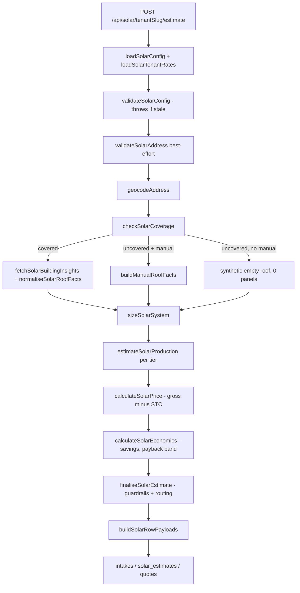
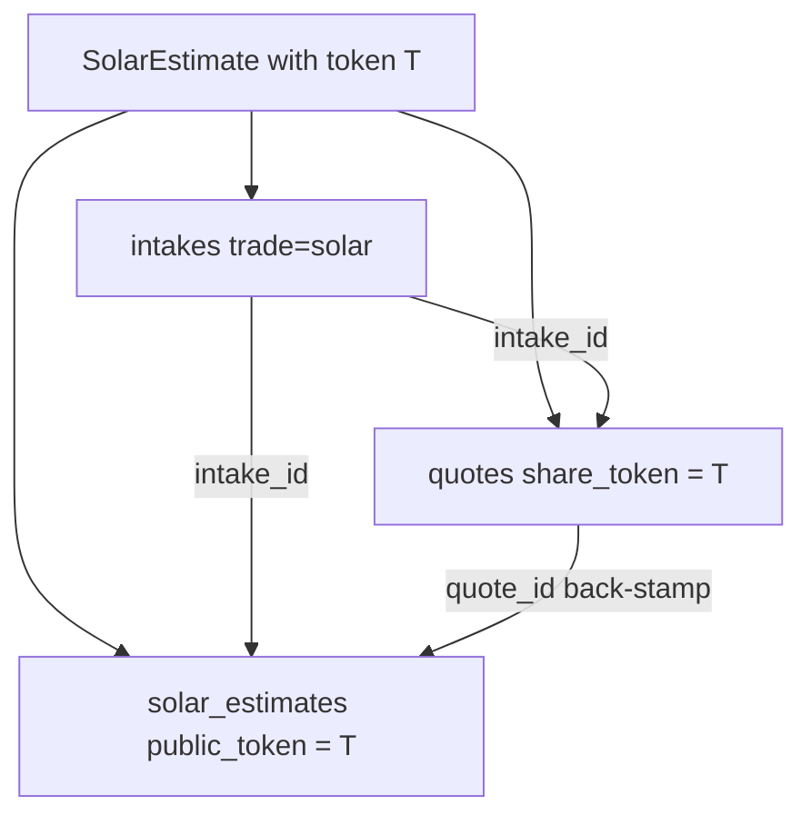

# Solar

Solar is the **largest** `lib/` module in the application — 131 files under
`quotemate-automation/lib/solar/` (about half of them `*.test.ts`) — and it is the
**only trade with no LLM anywhere on the money path and no SMS receptionist**. The
customer types an address into a public web form, a fully deterministic chain runs
in one request, and three database rows come out the other end.

It is also the trade with the sharpest live gaps: see
[[Solar Release Gate and Cross-Checks]] for the auto-release path that can text a
customer a **$0** quote, and for the token routes where "held for review" is
cosmetic.

- Engine mechanics, formula by formula: [[Solar Sizing and Pricing Engine]]
- Release, confirm, redraft, OpenSolar/Pylon cross-checks: [[Solar Release Gate and Cross-Checks]]
- The other three pipeline shapes: [[The Four Pipelines]]

---

## Shape of the trade

| Aspect | Solar | Contrast |
|---|---|---|
| Intake channel | Public web form only (`/solar/[tenantSlug]`) | Roofing/painting are SMS-led ([[SMS Channel Overview]]) |
| LLM in the flow | **None on the money path.** One AI feature: the roof-intelligence brief (`lib/solar/ai-brief.ts`), Felt-variant rows only, prompted with zero dollar figures | Electrical/plumbing are Opus-driven ([[Estimate Engine]]) |
| Pricing | Per-kW rate card × loadings, minus the STC rebate | Elec/plumb price from `pricing_book` assemblies |
| Rows written | **Three** — `intakes` + `solar_estimates` + a **twin** `quotes` row | Roofing writes `roofing_measurements` + `quotes` |
| Quote page | `/q/solar/[token]` (solar-specific) | ⚠ see Drift below |
| Booking + payment | Generic `/q/[token]` → `/r/[token]/[tier]` → `/book` → `/thanks` | Inherited free via the twin row |
| What the customer pays | A **tier deposit** (`quotes.deposit_pct`, DB default 30) — one of only two trades that still does | Roofing/painting/elec/plumb are flat $99 ([[What the Customer Pays by Trade]]) |
| Review gate | `SOLAR_AUTO_RELEASE` — clean estimates auto-release, flagged ones held | Painting auto-sends unconditionally since v21 |

---

## The chain, end to end

`runSolarEstimate` (`quotemate-automation/lib/solar/intake.ts:114`) is the whole
orchestrator. Every step below is a named function in `lib/solar/`; every I/O leg
is **injected** through `opts`, so the orchestrator is unit-testable with no
network and no database.

### Step by step, with the function names

| # | Step | Function | File |
|---|---|---|---|
| 0 | Config freshness gate — throws **before** any computation | `validateSolarConfig` | `lib/solar/config.ts` |
| 0b | Per-tenant rate-card overlay merged onto the defaults | `loadSolarTenantRates`, `depositPctFromOverlay` | `lib/solar/rate-card-overlay.ts` |
| 0c | Postcode → DNSP for feed-in tariff + export limit | `resolveNetworkFromPostcode` | `lib/solar/network-lookup.ts` |
| 1a | Google Address Validation (best-effort refinement) | `validateSolarAddress`, `addressValidationLocationUsable` | `lib/solar/address-validation.ts` |
| 1b | Forward geocode (address → lat/lng) | `geocodeAddress`, `parseGeocodeResponse` | `lib/solar/geocode.ts` |
| 2 | Google Solar coverage gate | `checkSolarCoverage` | `lib/solar/coverage.ts` |
| 3a | Roof facts from `buildingInsights` | `fetchSolarBuildingInsights` → `normaliseSolarRoofFacts` | `lib/solar/insights.ts`, `roof.ts` |
| 3b | Manual bucket fallback (uncovered addresses) | `buildManualRoofFacts` | `lib/solar/manual-fallback.ts` |
| 4 | 2–3 tiers, capped by roof area **and** DNSP export limit | `sizeSolarSystem` | `lib/solar/sizing.ts` |
| 5 | Annual AC kWh + CEC benchmark cross-check | `estimateSolarProduction` | `lib/solar/production.ts` |
| 6 | Gross − STC = net; CER postcode→zone table | `calculateSolarPrice`, `stcBreakdown` | `lib/solar/pricing.ts` |
| 7 | Savings + banded payback | `calculateSolarEconomics` | `lib/solar/economics.ts` |
| 8 | Deterministic output checks → `guardrail_flags` | `runSolarGuardrails`, `finaliseSolarEstimate` | `lib/solar/guardrails.ts`, `intake.ts:60` |

The arithmetic of steps 4–7 is documented in
[[Solar Sizing and Pricing Engine]].

### The coverage gate is never a hard fail

`checkSolarCoverage` (`lib/solar/coverage.ts:62`) returns a discriminated union.
The imagery floor is `HIGH | MEDIUM`, widened to include `BASE` when
`opts.expandedCoverage` is on (`coverage.ts:26-31`). Everything else — a 404, a
LOW-quality roof, a network error, an invalid body — maps onto a
`SolarCoverageFailureCode` and the orchestrator **branches**, it does not throw
(`lib/solar/intake.ts:215-254`):

1. `coverage.covered` → re-fetch the raw body and normalise real roof facts.
2. uncovered **and** the caller supplied `manual` → `buildManualRoofFacts`.
3. uncovered **and no** manual input → a synthetic manual roof forced to
   `max_panels_count: 0, panel_configs: []` (`intake.ts:247-253`).

⚠ Branch 3 is the one that hurts. Zero panels means `sizeSolarSystem` returns
`tiers: []` with `decision: 'inspection_required'` — and that decision is then
**overwritten** by `finaliseSolarEstimate`. See
[[Solar Release Gate and Cross-Checks]].

⚠ `apiFailureFallback` (`lib/solar/guardrails.ts:197`) exists to distinguish a
*transient provider outage* (`provider_unavailable`, `provider_rate_limited`,
`provider_quota_exhausted`, `provider_invalid_response`) from a genuine
"this address has no building". It is **dead code** — grep across `app/` and
`lib/` finds no non-test caller. So a Google Solar outage takes exactly the same
branch as a genuine no-coverage address, with none of the "we will have your
estimate shortly" customer messaging it was written to provide.

---

## The three rows — and the twin-quote design

`buildSolarRowPayloads` (`quotemate-automation/lib/solar/persist-helpers.ts:39`)
is pure: it shapes three insert payloads. The route
(`app/api/solar/[tenantSlug]/estimate/route.ts:196-258`) owns the inserts, in
this order:

### 1. `intakes` — `trade = 'solar'`, `job_type = 'solar_install'`

Roof facts land in `scope`, guardrail flags in `risks`, and the optional customer
contact in `caller` (`{name, phone, email}` — `persist-helpers.ts:119-123`). That
`caller.phone` is the ONLY place the customer's mobile lives; `sendCustomerSolarQuote`
reads it back on release (`lib/solar/release.ts:107-114`). No contact ⇒ no customer SMS,
silently.

⚠ `intakes` for solar are written **directly by this route**, not by
[[Intake Structuring]] — migration 100 says so explicitly: the migration
deliberately does not alter the `IntakeSchema` trade enum because "solar intake
runs through the separate `lib/solar/` pipeline, not `lib/intake/structure.ts`"
(`sql/migrations/100_solar_trade_phase1.sql:11-14`).

### 2. `solar_estimates` — the token-keyed row of record

Created by migration 100. Key columns: `public_token` (unique, base64url of 16
bytes — `generateSolarToken`, `intake.ts:320`), `intake_id`, `quote_id`,
`coverage_source`, `imagery_quality`, `confidence_band`, the jsonb payloads
`roof / sizing / production / price / economics`, `guardrail_flags` (jsonb,
default `[]`), `routing` (text), and `confirmed_at`. Later migrations add
`quote_variant` (111), `buildings` + `selected_building_id` (114),
`electrical_phase` + `requested_system_kw` (116/117, capped at 100 kW by 162).

The **whole** `SolarEstimate` object is also stored on the `estimate` jsonb column
so `/q/solar/[token]` re-renders without recomputation
(`persist-helpers.ts:158-160`).

### 3. The TWIN `quotes` row — the design that is easy to break

**Invariant: `quotes.share_token` MUST equal `solar_estimates.public_token`**
(`persist-helpers.ts:166` — `share_token: estimate.token`). Break that equality
and solar loses payment and booking entirely.

Why it exists: solar never built its own pay/book funnel. It borrows the generic
one. Because the twin `quotes` row carries the *same* token, the customer gets
`/q/[token]`, `/r/[token]/[tier]`, `/q/[token]/book` and `/q/[token]/thanks` for
free — see [[Pay-First Booking Funnel]] and [[Mint Routes and Guards]]. The
comment block at `lib/solar/publish.ts:60-71` records the history: a solar-specific
`/r/solar/[token]/[tier]` route once existed, selected columns that do not exist on
`solar_estimates` (`token`, `paid_at`, `scheduled_at`, `stripe_links` — the real
column is `public_token`), 404'd before its redirect, and was deleted on 2026-07-22.

Three further couplings on that row that a change can silently break:

- **`good` / `better` / `best` jsonb must be populated for the deposit mint.**
  `solarCheckoutTier` (`persist-helpers.ts:88-96`) writes
  `subtotal_ex_gst = net_inc_gst / 1.1` deliberately, because the generic mint
  re-applies GST as `subtotal_ex_gst × 1.10` (`lib/stripe/checkout.tierIncGstCents`).
  The round-trip reproduces the exact net-inc-GST figure the solar page showed.
  Before this existed the columns were NULL and every solar deposit link 404'd with
  "No payment link for this tier" — even on a clean, confirmed estimate.
- **`deposit_pct`** is stamped only when the tenant rate card sets one; otherwise
  the row keeps the DB default of 30 (`persist-helpers.ts:191-195`).
- **`quote_id` is back-stamped onto `solar_estimates`** after the quote insert
  (`route.ts:249-252`, FK from migration 100 with `on delete set null`). This link
  is what makes `/api/tenant/trade-jobs` hide the estimate behind its quote, and it
  arms the solar DELETE money guard. A failed stamp is logged, not fatal — the job
  double-renders on the dashboard until `scripts/backfill-solar-quote-links.mjs`
  runs.

⚠ Because `finaliseSolarEstimate` forces `routing.decision = 'tradie_review'`,
`inspection` at `persist-helpers.ts:61` is **always false**. So every solar
`quotes` row is written with `needs_inspection: false` and
`inspection_reason: null`, and every solar `intakes` row with
`inspection_required: false` — even the ones sizing routed to inspection. See
[[Solar Release Gate and Cross-Checks]].

---

## The entry route

`POST /api/solar/[tenantSlug]/estimate` —
`quotemate-automation/app/api/solar/[tenantSlug]/estimate/route.ts`.

- **PUBLIC.** No bearer, no Clerk. It is the customer entry point, like `/q/roof`.
- The `[tenantSlug]` segment is **not a slug** — it carries the tenant **UUID** and
  is looked up as `tenants.id` (`route.ts:64-68`). A suspended tenant 404s.
- `maxDuration = 120`, `dynamic = 'force-dynamic'`. Next 16 `params` is a Promise
  and is awaited (`route.ts:61`) — see [[Tech Stack]].
- Body is validated by `SolarEstimateRequestSchema` (`lib/solar/request-schema.ts`);
  a rejected shape is logged with its Zod issues before the 400
  (`route.ts:84-91`).
- Engine throw → **502 `engine_failed`** with the failing inputs logged
  (`route.ts:163-179`). Each row insert failure has its own 500 code:
  `intake_insert_failed`, `estimate_insert_failed`, `quote_insert_failed`.
- Response is `{ ok, token, shareUrl, coverage_source }` where
  `shareUrl = ${appUrl}/q/solar/${token}` (`route.ts:417`).

Everything after the customer response runs in `next/server` `after()`:
Pylon STC cross-check, OpenSolar supplement, sun/shade assets, building detection,
the auto-release decision, file-store ingest, the tradie notify, and (Felt rows
only) Felt map provisioning + the AI brief. See
[[Solar Release Gate and Cross-Checks]].

### Full solar route inventory

| Route | Auth | Purpose |
|---|---|---|
| `POST /api/solar/[tenantSlug]/estimate` | public | the front door (above) |
| `GET /api/solar/[tenantSlug]/static-map` | public | satellite thumbnail for the address form |
| `POST /api/solar/[tenantSlug]/detect` | public | building detection for the form's roof map |
| `GET /api/solar/places` | public | Google Places address autocomplete |
| `POST /api/solar/confirm/[token]` | signed-in ⚠ | tradie "Confirm & release" |
| `POST /api/solar/redraft/[token]` | signed-in ⚠ | re-run the engine on edited inputs |
| `GET /api/solar/q/[token]/buildings` | token | detected structures for the picker |
| `POST /api/solar/q/[token]/select-building` | token | re-estimate a different building |
| `GET /api/solar/q/[token]/static-map` | token | satellite hero |
| `GET /api/solar/q/[token]/flux-heatmap` | token | rendered irradiance PNG |
| `GET /api/solar/q/[token]/panels-after` | token | generated "panels on your roof" render |

⚠ The two `signed-in` routes check authentication but not **ownership** — detailed
in [[Solar Release Gate and Cross-Checks]].

---

## Customer and tradie surfaces

- **`/solar/[tenantSlug]`** (`app/solar/[tenantSlug]/page.tsx`) — the self-serve
  address form, with `_components/SolarAddressForm.tsx` and
  `_components/SolarRoofMap.tsx` (the building picker map that produces
  `target_building.centroid`).
- **`/q/solar/[token]`** (`app/q/solar/[token]/page.tsx`) — the solar quote page,
  with `BuildingPicker`, `BuildingPickerSection`, `SunShadeMap`, `SunShadeOverlay`
  and `HeatmapAutoRefresh`. Rendered from `solar_estimates.estimate`, gated by
  `canShowPrices` (`lib/solar/publish.ts:37`).
- **`/q/[token]` → `/r/[token]/[tier]` → `/book` → `/thanks`** — the generic
  funnel the twin row unlocks. See [[Quote Pages]].

⚠ **Drift.** `CLAUDE.md` states "Solar has no pages of its own — it books on the
generic `/q/[token]` funnel via a twin `quotes` row sharing the same token." Only
the second half is true. `app/q/solar/[token]/page.tsx` exists and is what the
estimate route links to (`route.ts:417`) and what the customer SMS links to
(`lib/solar/release.ts:140`). The correct statement is: **solar has its own quote
page; it has no pay or book pages of its own.**

---

## Configuration

`solar_config` (migration 100) is a dated, versioned table — one active row,
stamped onto every estimate as `config_version`. It holds `deeming_schedule`,
`zone_table` (postcode → STC zone rating), `stc_price_aud`, `feed_in`,
`export_limits`, `default_rate_card`, `derate_factor`, `self_consumption_pct` and
`retail_rate_aud_per_kwh` — the design rule being "no magic numbers in code".
`validateSolarConfig` refuses a stale config **before** any estimate is computed
(`intake.ts:143-148`), and `canShowPrices` withholds prices on a stale config even
after confirmation (`publish.ts:38-43`).

Env vars this trade reads (values never documented — see
[[Environment Variables and Feature Flags]]):

| Var | Effect |
|---|---|
| `SOLAR_AUTO_RELEASE` | `'false'` / `'0'` disables auto-release; **anything else, including unset, is ON** (`lib/solar/release.ts:68-75`) |
| `GOOGLE_GEOCODE_API_KEY` → `GOOGLE_MAPS_API_KEY` | forward geocode |
| `GOOGLE_ADDRESS_VALIDATION_API_KEY` → `GOOGLE_MAPS_API_KEY` | address refinement |
| `GOOGLE_SOLAR_API_KEY` → `GOOGLE_MAPS_API_KEY` | buildingInsights + dataLayers |
| `PYLON_ENABLED`, `PYLON_API_KEY`, `PYLON_LEAD_PUSH_TENANTS` | STC cross-check + CRM lead |
| `OPENSOLAR_ENRICHMENT_ENABLED` | hardware cards + pricing cross-check |
| `FELT_API_KEY` (+ the Felt tab gate) | interactive map variant |
| `APP_URL` | share + PDF links, defaults to `https://www.quotemax.com.au` |

---

## Open questions

- `apiFailureFallback` has no caller. Was it wired and removed, or written ahead of
  a branch that never landed? Either way, a Google Solar outage currently produces
  the same customer experience as a genuinely uncovered address.
- Is there any backfill or cron that reconciles `solar_estimates.quote_id` beyond
  `scripts/backfill-solar-quote-links.mjs` being run by hand?

## Related

- [[Solar Sizing and Pricing Engine]]
- [[Solar Release Gate and Cross-Checks]]
- [[The Four Pipelines]]
- [[Pay-First Booking Funnel]]
- [[What the Customer Pays by Trade]]
- [[Quote Pages]]
- [[Known Debt Register]]
- [[External Services and Integrations]]
