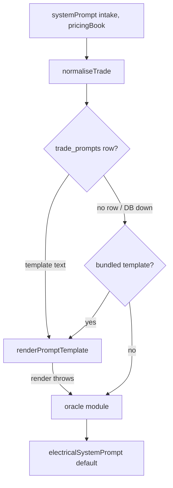
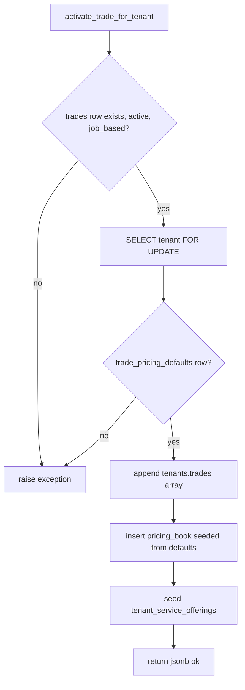

# Trades Registry

"A trade is a data row, not code." That is the design intent (`docs/strategy.md` v9). This
note documents what the four registry tables actually hold, which of them the running system
actually reads, and where the intent has not been realised.

The honest one-line summary: **the registry is real and load-bearing for onboarding,
activation and tenant pricing seeding. It is only partly load-bearing for prompts, and not at
all load-bearing for spec fields.**

## The four tables

| Table | Key | Created by | Read at runtime by |
|---|---|---|---|
| `trades` | `name` unique | `sql/migrations/046_trades.sql` | `lib/trades/manageable.ts:42`, `lib/onboard/trade-readiness.ts:96`, `app/api/admin/loader/upload/route.ts:139`, `app/api/admin/customers/[id]/route.ts:170` |
| `trade_pricing_defaults` | `trade_id` PK/unique | `sql/migrations/048_trade_prompts_and_pricing_defaults.sql` | `activate_trade_for_tenant()` (SQL), `lib/trades/manageable.ts:43` (existence only) |
| `trade_prompts` | `trade_id` PK | `sql/migrations/048_...sql` | `lib/estimate/prompt.ts:90`, `lib/onboard/trade-readiness.ts:108` |
| `trade_spec_defs` | `(trade, category, spec_key)` unique | `sql/migrations/083_trade_spec_defs.sql` | ⚠ nothing — see [Spec defs](#trade_spec_defs--registered-but-inert) |

### `trades`

```sql
create table trades (
  id uuid primary key default gen_random_uuid(),
  name text not null unique,        -- 'electrical', 'plumbing', 'roofing'
  display_name text not null,
  is_job_based boolean not null default true,
  active boolean not null default true,
  created_at timestamptz not null default now()
);
```
`quotemate-automation/sql/migrations/046_trades.sql`

Two columns carry all the policy:

- **`is_job_based`** — the loader and the activation function only serve trades that quote a
  discrete job (assemblies + materials + Good/Better/Best). Recurring-service trades (pool
  cleaning, garden maintenance) are deliberately out of scope. `activate_trade_for_tenant()`
  raises `trade "%" is not install/job-based — §2.1 puts it out of scope`.
- **`active`** — a soft kill switch. An inactive trade is invisible to the dashboard toggle
  list and rejected by activation.

**`trades.name` is a foreign-key target, not just a label.** Migration 051 dropped the old
`trade in ('electrical','plumbing')` CHECK constraint from **seven** tables and replaced each
with an FK to `trades(name)`:

`shared_assembly_bom`, `supplier_catalogue`, `tenant_assembly_bom`,
`tenant_custom_assemblies`, `tenant_licences`, `tenant_material_catalogue`, and **`tenants`
itself** (`sql/migrations/051_trade_fk_swap.sql`). The spec's original list named four tables;
an authoritative `pg_constraint` query found seven. Missing `tenants` would have meant a new
trade could never have a tenant.

> **Invariant.** A trade MUST have a `trades` row before any tenant can carry it, because
> `tenants.trade` is FK → `trades(name)`. This is not theoretical: roofing shipped in the
> onboarding wizard's trade list and passed every other readiness check for months while
> missing its registry row, so picking roofing as your first trade died at wizard step 04 with
> `violates foreign key constraint "tenants_trade_fk"` and the auth user already created
> (`sql/migrations/171_register_roofing_trade.sql`). Fixed by migration 171, and the failure
> mode is now gated by `hasRegistryRow()` in `lib/onboard/trade-readiness.ts:96`.

⚠ `pricing_book.trade` has **no** FK, and `tenants.trades[]` is a plain `text[]` — neither is
protected by the registry. Only the scalar `tenants.trade` is.

### `trade_pricing_defaults`

Per-trade seed values for a tenant's `pricing_book` row when they activate the trade:
`hourly_rate`, `call_out_minimum`, `apprentice_rate`, `senior_rate`, `default_markup_pct`,
`risk_buffer_pct`, `min_labour_hours`, `gst_registered`, `licence_label`
(`sql/migrations/048_trade_prompts_and_pricing_defaults.sql`).

This row is **the keystone of the whole registry**. `activate_trade_for_tenant()` hard-requires
it and raises `trade "%" has no trade_pricing_defaults row — cannot seed the tenant pricing_book`
without it. A tenant carrying a trade with no `pricing_book` row fails **every** quote for that
trade.

The values are honest about which trades actually use them:

| Trade | hourly | call-out | markup % | Actually prices from |
|---|---|---|---|---|
| electrical | 110 | 120 | 30 | the seeded book + assemblies (real) |
| plumbing | 120 | 150 | 18 | the seeded book + assemblies (real) |
| painting | 90 | 450 | 0 | `pricing_book.overlays.painting_rate_card` |
| solar | 100 | 0 | 0 | kW sizing engine, `lib/solar/*` |
| commercial_painting | 95 | 600 | 0 | `paint_rates` / `paint_runs` |
| roofing | 120 | 550 | 0 | `pricing_book.overlays.roofing_rate_card` |

Sources: `sql/migrations/155_register_activatable_trades.sql`, `sql/migrations/171_register_roofing_trade.sql`.
Migration 155 says it outright — for painting/solar/commercial painting these rows "exist
solely to satisfy the function's hard requirement". Roofing's `call_out_minimum` of 550 is
deliberately matched to `DEFAULT_ROOFING_RATE_CARD.call_out_minimum_ex_gst` in
`lib/roofing/pricing.ts` so the two numbers do not disagree.

⚠ Note the numbers **changed** between migrations 048 and 155 for electrical and plumbing
(electrical markup 28 → 30, plumbing call-out 110 → 150, both min_labour_hours 2.0/1.5 → 0.5).
155's inserts are `on conflict (trade_id) do nothing`, so on the live database the **048 values
survive** — 155's table is what a fresh install would get, not what production holds. Do not
read 155 as the current production defaults.

### `trade_prompts`

The per-trade prompt pack: `estimator_system_prompt`, `sms_scope_blurb`, `sms_trade_rules`,
`voice_greeting`, `voice_system_prompt` (`sql/migrations/048_...sql`).

Only **one** of the five columns is read at runtime.

- `estimator_system_prompt` — read by `loadEstimatorTemplate()` in `lib/estimate/prompt.ts:90`
  and by the readiness gate at `lib/onboard/trade-readiness.ts:108`. See
  [How the registry drives prompts](#how-the-registry-drives-prompts).
- ⚠ `sms_scope_blurb` and `sms_trade_rules` — written by the loader
  (`app/api/admin/loader/upload/route.ts:249-250`) and **never SELECTed anywhere** in `lib/`
  or `app/`. The SMS receptionists build their scope text in code
  (see [[LLM Receptionist]]).
- ⚠ `voice_greeting` / `voice_system_prompt` — `lib/vapi/voice-prompt.ts` defines a
  `VoicePromptOverride` type (`greeting` / `systemPrompt`) and both
  `buildVoiceFirstMessage()` and `buildVoiceSystemPrompt()` honour it verbatim when supplied.
  But **no caller anywhere passes one** — grep for `VoicePromptOverride` outside
  `lib/vapi/voice-prompt.ts` returns nothing. The hook exists; the wire from the table to the
  hook does not.

### `trade_spec_defs` — registered but inert

Migration 083 created a registry of which spec keys matter per `(trade, category)` — e.g.
`amperage` for `electrical/gpo`, `energy_source` + `litres` for `plumbing/hot_water`.

The design is careful: the **code seed** in `lib/estimate/spec-registry.ts:103` owns the
canonicalisation grammar, and the table may only **add** keys the seed does not have, never
redefine one (`getSpecDefs(trade, category, overrides)` at `lib/estimate/spec-registry.ts:135`).
The function is pure — it takes rows as an argument and never fetches them.

⚠ **Nothing fetches them.** There is no `.from('trade_spec_defs')` anywhere in `lib/` or
`app/`, so `getSpecDefs()` is always called with the code seed alone. `lib/quote/job-fields.ts:11`
states the position bluntly: "trade_spec_defs has 0 rows live and is never SELECTed". A new
trade cannot register spec keys as data today; it registers them by editing `SPEC_DEFS`.

## How the registry drives prompts

`lib/estimate/prompt.ts` is the data-driven estimator prompt router. It is a **three-level
fallback**, and the ordering is the safety property:



1. **DB `trade_prompts.estimator_system_prompt`** — primary. Rendered through
   `renderPromptTemplate()` (`lib/prompt-template/render.ts`) against the context built by
   `buildEstimatorContext(trade, pricingBook)`.
2. **The bundled template constant** — `ELECTRICAL_ESTIMATOR_TEMPLATE` /
   `PLUMBING_ESTIMATOR_TEMPLATE` in `lib/estimate/prompt-templates/`. Used when the DB is
   unavailable or the row is missing.
3. **The hand-written oracle module** — `electricalSystemPrompt()` / `plumbingSystemPrompt()`.
   Used when even the bundled template fails to render.

`renderEstimatorSystemPrompt()` (`lib/estimate/prompt.ts:110`) is pure and synchronous, which
is what makes the parity test possible: `lib/estimate/prompt-parity.test.ts` pins the bundled
templates byte-identical to the oracle modules across a matrix of pricing books, on **both**
the DB-template path and the no-template path. That test is why a trades-as-data refactor
could ship without risking the two pilot trades' prompts.

> **Invariant.** An unknown trade falls through to `electricalSystemPrompt` — see
> `ESTIMATOR_ORACLES[trade] ?? electricalSystemPrompt` at `lib/estimate/prompt.ts:127`, and
> `normaliseTrade()` at `:76` which defaults a null/blank `intake.trade` to `'electrical'`.
> This is deliberate (it preserves the pre-registry binary router's behaviour) but it means a
> misregistered trade quietly quotes with the **electrical** prompt rather than failing loudly.

The Supabase client used for the read is lazily memoised and returns `null` when
`NEXT_PUBLIC_SUPABASE_URL` / `SUPABASE_SERVICE_ROLE_KEY` are absent (`lib/estimate/prompt.ts:66`),
so importing the module in a unit test needs no environment.

## How the registry drives activation

`activate_trade_for_tenant(p_tenant_id uuid, p_trade text)`
(`sql/migrations/055_activate_trade_for_tenant.sql`) is the single atomic entry point. plpgsql
runs in one implicit transaction, so atomicity is by construction rather than by explicit
BEGIN/COMMIT.



Details that matter:

- **Step 1** appends to `tenants.trades[]` and only fills the legacy scalar `tenants.trade`
  when it is empty — it never overwrites the tenant's primary trade.
- **Step 2** uses an explicit `select exists(...)` rather than `ON CONFLICT`, because the
  `(tenant_id, trade)` unique index is PARTIAL on some databases and Postgres cannot always
  infer it as a conflict target. An existing `pricing_book` row is left **as-is** —
  re-activation must never clobber configured rates.
- **Step 3** seeds `tenant_service_offerings` from `shared_assemblies` where
  `retired_at is null`; a service with `default_enabled = true` lands enabled, opt-in extras
  land disabled, and `on conflict do nothing` means re-activation never silently re-enables a
  service a tradie turned off.
- **Vapi re-provision is deliberately NOT in the function** — it is external and non-fatal, so
  the API route fires it after the function returns
  (`app/api/tenant/trades/activate/route.ts`).

The whole function is idempotent: re-activating tops up missing offering rows and changes
nothing else.

## Which trades the dashboard will offer

`listManageableTrades()` (`lib/trades/manageable.ts:38`) is the single source of truth for both
`GET /api/tenant/trades/available` (renders the toggle list) and
`POST /api/tenant/trades/reconcile` (validates the desired set). The predicate is four-part:
`active = true` AND `is_job_based = true` AND a `trade_pricing_defaults` row exists AND the
registry read succeeded.

⚠ **A PostgREST shape bug that emptied the list in production.** `trade_pricing_defaults.trade_id`
is UNIQUE, so PostgREST detects the relationship as one-to-one and embeds it as
`object | null` — **not** the array both routes originally assumed
(`Array.isArray(defs) && defs.length > 0`). Array-shaped test mocks kept the suite green while
every trade vanished from the live dashboard. `hasPricingDefaults()`
(`lib/trades/manageable.ts:29`) now accepts both shapes so a schema-cache or
relationship-detection change can never empty the list again. That defensive shape check is
the reason the helper exists at all; do not "simplify" it back to one branch.

`listManageableTrades()` also **throws** on a registry read failure rather than returning `[]`,
so a caller returns a 500 instead of rendering a convincing but wrong "no activatable trades"
state.

## The readiness gate (onboarding)

`lib/onboard/trade-readiness.ts` answers a different question from `listManageableTrades()`:
not "can this tenant switch it on in the dashboard" but "is the whole quote pipeline wired
enough to onboard a new tradie into it". Six checks:

| Check | Satisfied by |
|---|---|
| `pricingDefaults` | `hasOnboardingPricingDefaults(trade)` — the code-side `defaultsForTrade` / schema enum in `lib/onboard/schema.ts` |
| `sharedAssemblies` | ≥1 `shared_assemblies` row for the trade |
| `estimatorPrompt` | a bundled template OR a `trade_prompts` row |
| `intakeRules` | membership of `ONBOARDING_TRADES` |
| `licenceSchema` | `hasLicenceSchema(trade)` — a per-state licence body label |
| `registryRow` | an ACTIVE `trades` row (added after the roofing FK incident) |

`CANDIDATE_TRADES` is `electrical, plumbing, painting, roofing, solar, commercial_painting`
(`lib/onboard/trade-readiness.ts:31`).

**The deterministic-trade exemption.** `DETERMINISTIC_TRADES = new Set(['painting','roofing'])`
(`:50`). For these two, BOTH the `estimatorPrompt` and the `sharedAssemblies` checks are
waived, because they price from a per-m² rate card in `pricing_book.overlays.*_rate_card`
rather than from an assembly catalogue and an Opus estimator. A painter has no
`shared_assemblies` rows and no system prompt to find, and neither absence should gate them
out. See [[Painting]] and [[Roofing]].

⚠ Aircon and signage are **not** in `CANDIDATE_TRADES` and not in `listManageableTrades()`'
result (they have no `trade_pricing_defaults` row from any migration read here) — they hang off
the dashboard and the generic funnel rather than the registry-driven activation path.

## Migration history

| Migration | What it did |
|---|---|
| `046_trades.sql` | Created `trades`; backfilled electrical + plumbing. Additive only — nothing read the table yet |
| `048_trade_prompts_and_pricing_defaults.sql` | Created both tables empty; backfilled elec/plumb defaults. Prompts deliberately left empty (the text lived in TypeScript and had to migrate string-identical via `scripts/backfill-trade-prompts.mjs`) |
| `051_trade_fk_swap.sql` | The one risky ALTER: dropped the 2-trade CHECK from 7 tables, added FKs to `trades(name)`, added `shared_assemblies.retired_at` |
| `053_loader_commit_trades_categories.sql` | Taught `commit_import_batch` / rollback the `trades` + `categories` tiers, in dependency order |
| `054_loader_commit_trade_defaults_prompts.sql` | Same for `trade_pricing_defaults` + `trade_prompts` |
| `055_activate_trade_for_tenant.sql` | The atomic activation function |
| `083_trade_spec_defs.sql` | Created `trade_spec_defs`; also dropped `tenant_material_catalogue_trade_check` so a v9 trade can hold catalogue rows |
| `149_register_painting_trade.sql` | Painting registry row |
| `155_register_activatable_trades.sql` | The five dashboard-activatable trades: elec, plumb, painting, solar, commercial_painting. Fixed solar (row but no defaults) and commercial_painting (no row at all) |
| `171_register_roofing_trade.sql` | Roofing registry row — fixed the onboarding FK violation 155 had left open |

Every one of these ends with `notify pgrst, 'reload schema'` so PostgREST's schema cache does
not serve a stale relationship graph. Keep that convention.

## ⚠ Drift

- `CLAUDE.md` presents the registry as fully realised ("Built and live... `docs/strategy.md`
  v9 is realised"). Three of the four tables are genuinely load-bearing. **`trade_spec_defs`
  is not** — zero rows, zero readers (`lib/quote/job-fields.ts:11`).
- `CLAUDE.md` says the registry "drives prompts (`trade_prompts`)". Only
  `estimator_system_prompt` is read. `sms_scope_blurb` / `sms_trade_rules` have no reader;
  `voice_greeting` / `voice_system_prompt` have a hook with no caller.
- `CLAUDE.md` lists **eight** live trades. Only six appear in `CANDIDATE_TRADES` and at most
  six carry `trade_pricing_defaults` from the migrations above — **aircon and signage are not
  registry-activatable trades**, whatever `tenants.trades[]` holds.

## Open questions

- Are `sms_scope_blurb` / `sms_trade_rules` intended to be wired into the LLM receptionist's
  scope text, or should the columns be dropped? They have been written-but-unread since the
  loader shipped.
- Does the live `trades` table hold `aircon` (migration 097) and `signage` rows, and if so with
  what `active` / `is_job_based` flags? Migrations 097 and 100 were not read for this note.
- Which of 048's or 155's `trade_pricing_defaults` values are actually in production for
  electrical and plumbing? The `on conflict do nothing` implies 048's, but that should be
  confirmed against the live row.

## Related
- [[Adding a Trade]]
- [[Electrical]]
- [[Plumbing]]
- [[Tenancy Model]]
- [[Tradie Onboarding]]
- [[Migrations]]
- [[Estimate Engine]]
- [[Admin Overview]]
