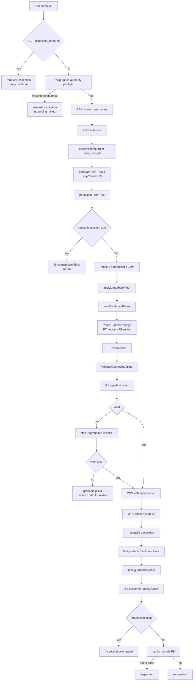

# Estimate Engine

`runEstimation()` in `quotemate-automation/lib/estimate/run.ts` — 3,198 lines and the
single most safety-critical function in the platform. It takes an intake row plus that
tenant's `pricing_book` row and returns an `EstimationResult`: a draft quote, plus flags
telling the route what it is allowed to do with it.

The one-sentence contract: **the model may choose products and write prose; it may never
originate a number.** Every dollar figure comes back from a tool call against
`pricing_book`, `shared_materials`, `shared_assemblies` or `tenant_custom_assemblies`, and
the [[Grounding Validator]] is the hard backstop that proves it after the fact.

```
runEstimation(intake, pricingBook, modelId = 'claude-opus-4-8', conversationState = null)
```

## Return shape — `EstimationResult`

| Field | Meaning |
|---|---|
| `draft` | The quote to persist. May already be downgraded to inspection-required. |
| `groundingFailures?` | The exact failing line items, for observability. |
| `downgradedToInspection?` | The route MUST NOT create three-tier Stripe sessions. |
| `inspectionCause?` | `site_conditions \| model_declared \| grounding_failed`. R4 — added because `downgradedToInspection` is far too coarse: five different paths set it and only some are our own validation failing. |
| `groundingHold?` | R3.2 — grounding failed but the draft is **still priced**. Persist the tiers, write `[grounding]` risk flags so `shouldHoldForReview` holds, and let the tradie approve or edit. |
| `specBlock?` | R15b — a hard spec mismatch blocked *some* tiers. Not an inspection downgrade; the quote ships with its spec-correct tier(s). |

**Invariant:** a grounding failure is *our* validation problem, never a "the site is too
complex" message to the customer. `inspectionCause` exists so the route can pick honest
copy. See [[Routing Decision]].

## The flow



## Terminal early exits — before any model call

Two guards run before RAG, prompt hints or Opus can reintroduce a price.

1. **EV inspection routing is terminal.** `job_type === 'ev_charger'` and
   `inspection_required === true` returns an inspection draft immediately, with
   `inspectionCause: 'site_conditions'`. Deliberately scoped to EV so the change did not
   silently alter another job type's routing contract. The intake asked for the visit
   (three-phase, switchboard risk, a safety rule) — a real fact about the site, so this is
   the one case where "Every site is different" is honest copy.
2. **Recipe price-authority preflight.** `loadDeterministicInputs()` resolves the job's
   recipe; a *present* recipe is a commitment to use the tenant's own catalogue for every
   required included category. If `buildDeterministicTiers` returns
   `code === 'missing_tenant_recipe_price'`, the job routes to inspection with
   `risk_flags: ['missing_tenant_recipe_price']` and **`inspectionCause: 'grounding_failed'`**
   — our price authority is missing, an internal gap, never dressed up as site complexity.
   A thrown error takes the same route with `recipe_authority_check_failed`.

## Soft context blocks — advisory, never a price source

All six are appended to the **user** message, deliberately keeping the system message
fully cacheable. **Invariant:** none of these is ever fed to the tools, the candidate
loader, or the grounding validator, so none can become a price source.

| Block | Builder | Gate |
|---|---|---|
| Similar past quotes (RAG) | `fetchSimilarPastQuotesContext()` | `RAG_DISABLED`; null on cold start — see [[RAG and Retrieval]] |
| Brand preferences | `buildPreferencesBlock()` | migration 022; scoped to `intake.trade` |
| Operator catalogue (WP2) | `buildCatalogueHint()` | null when the tenant has no catalogue |
| Structured BOM (WP3) | `buildBomHint()` | null when the BOM table is unseeded |
| Price history (WP2) | `buildPriceHistoryHint()` | `PRICE_HISTORY_HINT=1`, default off |
| Per-tenant file-store grounding | `buildTenantGroundingHint()` | `TENANT_FILESTORE_ENABLED=true`, default off |

Preferences are a soft bias, never a hard filter: "the grounding validator keeps the safety
guarantees regardless of which brand Opus picks" (`run.ts`).

## The system prompt is data

`systemPrompt(intake, pricingBook)` (`lib/estimate/prompt.ts`) is a **data-driven router**,
not an `if plumbing … else electrical`. Three-level fallback:

1. `trade_prompts.estimator_system_prompt` for the trade, joined via `trades.name`.
2. The bundled template constant (`prompt-templates/electrical-estimator.ts`,
   `plumbing-estimator.ts`) when the DB read fails or the row is missing.
3. The hand-written oracle module (`electrical-prompt.ts`, `plumbing-prompt.ts`) when the
   template is missing or fails to render.

A `prompt-parity` test pins the bundled templates byte-identical to the oracle modules, so
every path produces exactly today's prompt for the two pilot trades. A **new trade added by
the admin loader needs no code change here** — see [[Trades Registry]].

Rendering runs through `renderPromptTemplate` against `buildEstimatorContext(trade, book)`
(`prompt-context.ts`), which computes every `{{placeholder}}` including derived values:
the after-hours multiplier (`after_hours_multiplier ?? 1.5`), the markup factor, and
`min_labour_hours` with per-trade fallbacks (electrical 2, plumbing 1.5).

⚠ Tenant brand preferences are deliberately **not** injected into the system prompt — they
go in the per-call user prompt, so the system prompt stays identical across tenants and the
Anthropic **ephemeral prompt cache** stays warm (`cacheControl: { type: 'ephemeral' }`).
Cache invalidates automatically when any `pricing_book` field changes, because the prompt
content changes.

### The prompt's own grounding rules (electrical, 16 numbered)

The load-bearing ones, all from `electrical-prompt.ts`:

- **1** — every `unit_price_ex_gst` MUST come from a tool result. Never compute or invent.
- **3** — every tier must use a real assembly from `lookup_assembly`. No row → set that
  tier to `null`; do not fabricate a "premium" assembly the DB does not carry.
- **8** — "If you cannot find a tool result that supports a line item, OMIT THAT LINE ITEM
  ENTIRELY. Do not approximate."
- **10** — never invent indicative price ranges. "Two identical intakes must produce two
  identical quotes; fabricated ranges break that determinism."
- **11** — strict markup: `apply_markup` must use exactly `default_markup_pct`, even when a
  RAG block shows past quotes at 15% or 30%. Past quotes were drafted under older policy.
- **12** — every priced tier must sum to at least `min_labour_hours` of labour, topped up
  with an explicit "minimum job allowance" line. Hard-enforced by the validator.
- **14** — every lookup MUST pass `trade`, because the DB carries both trades.
- **15** — install-kit naming: the description MUST name the source assembly in parentheses,
  because the validator does a **category match against the line description**. A generic
  "Install kit — terminate and test each alarm" priced from the "Hardwire 240V smoke alarm"
  row is REJECTED: the description categorises as `[general]` while the source row is
  `[smoke_alarm]`.
- **16** — three-tier discipline. A 2-tier or 1-tier output reads as broken; the prompt
  gives patterns for categories with only 2 SKUs.

## The tier shape

The model emits strict JSON (parsed by `parseJsonFromText`, which tolerates prose around
the object). Top level:

```
scope_of_works, scope_short (≤80 chars, SMS-ready), assumptions[], risk_flags[],
good | better | best, optional_upsells[], estimated_timeframe,
needs_inspection, inspection_reason, gst_note
```

Each tier is `{ label, line_items[], subtotal_ex_gst, timeframe }` and is stored **as jsonb
on the `quotes` row** in columns `good` / `better` / `best`. There is no
`quote_line_items` table — the tiers are not normalised. See [[Key Columns and Invariants]].

### Line item shape and the `source` tag

```
description, quantity, unit ("each" | "hr" | "lm"),
unit_price_ex_gst, total_ex_gst, source, supplied_by?, safety_note?
```

`source` is REQUIRED and is the whole grounding contract:

| `source` | Rule |
|---|---|
| `material:<id>` | The exact id from a `lookup_material` row. Strict UUID grounding (R-4): the validator looks up **that row** and accepts only its raw price or raw × `default_markup_pct` (±$0.50). |
| `assembly:<id>` | Same, for `lookup_assembly` rows. |
| `labour` / `after_hours` | `unit="hr"` lines at the standard or after-hours rate. |
| `callout` / `after_hours_callout` | The call-out fee line. |
| `risk_buffer` | An explicit "Risk allowance" labour line. |
| `tradie_edit` | Never emitted by the model — stamped by `/api/quote/[id]/edit` on hand-edited lines (loose grounding). |

⚠ "Mis-stamp the id and the WHOLE quote downgrades to a $99 inspection." The after-hours
tags matter for the same reason: they are "the ONLY thing that lets the validator ground
[an inflated] rate", and a standard-hours job must never carry them.

## The tools — the only price source

`makeTools(tenantId, { jobType })` (`lib/estimate/tools.ts`) returns four tools. The
factory is tenant-scoped so one tradie's "Install pool light" never leaks into another's
quote.

| Tool | Reads | Notes |
|---|---|---|
| `lookupAssembly` | `shared_assemblies` UNION this tenant's `tenant_custom_assemblies` | Both filtered `always_inspection = false`; custom rows also `enabled = true`. Name search is synonym/token expanded via `buildAssemblyOrFilter()` so "power point" finds "Replace double GPO". |
| `lookupMaterial` | `shared_materials` UNION `tenant_material_catalogue` (`active = true`) | Tenant rows alias `unit_price_ex_gst → default_unit_price_ex_gst` so the model reads one field regardless of source. |
| `applyMarkup` | pure | `basePrice × (1 + pct/100)`, `pct` defaults to 28 (AU electrical median) only as a safety net. |
| `flagInspectionNeeded` | pure | Records a reason. |

**Invariant:** `always_inspection = true` rows are excluded from BOTH tools and from the
validator's candidate set, so the model cannot ground a price on a service the tradie wants
always inspected (migration 067 added the column; 068 sets it on "Install gas HWS" per
AS/NZS 5601).

### Reranking

`FETCH_LIMIT = 12`, `RETURN_LIMIT = 5`. A wide SQL pool is narrowed by a cross-encoder
reranker (`getReranker()`, `lib/estimate/rerank.ts`) so the best semantic match is row #1 —
because "Opus's natural 'pick the first row' instinct" would otherwise land on whatever
arbitrary order Postgres returned. Degrades to raw SQL order when the key is missing,
`RAG_RERANK_DISABLED` is set, or the call fails. Rows ≤ 2 skip reranking entirely.
Tenant/custom rows are placed first in the input array so the reranker can promote them.

⚠ `ASSEMBLY_FETCH_LIMIT = 12` in `run.ts:71` mirrors `FETCH_LIMIT` deliberately: the old
`.limit(5)` became a truncation bug once the OR filter widened — with no `ORDER BY`,
Postgres could return any 5 matches and drop the right row before JS ever saw it.

### Property filters

`applyPropertyFilters()` maps `intake.scope.specs` straight onto SQL. Asymmetric on
purpose: `dimmable: true`, `smart: true`, `weatherproof: true` are **strict** (the row must
be true); `false`/`undefined` are no-ops, so asking for "non-dimmable" does not reject
dimmable rows. `color_temp` matches rows whose `properties->color_options` contains it OR
that have none set (generic). `supplied_by` is exact-match either way.

`assemblyPropertyFiltersForJob()` strips `supplied_by` for `ev_charger` **assembly** lookups
only: the EV assembly prices installation work, and charger ownership affects the optional
unit, not which install assembly applies.

### H-1 — the customer-supply double-bill

`applyCustomerSupplyMode(row, wantCustomerSupply)` is pure and unit-tested. When the caller
asks for customer-supply pricing and the tenant row has **no valid**
`customer_supply_price_ex_gst`, the row is **dropped**, not silently priced at the full
supply-and-install rate. Before 2026-05-25 that fallthrough double-billed customers for
materials they were already supplying — and the grounding validator could not catch it,
because the resulting price genuinely *is* in the candidate set. See
[[EV Charger Jobs]].

## Post-draft transforms, in order

Each is best-effort and must never break an already-grounded quote.

| # | Step | Effect |
|---|---|---|
| 1 | **Phase 2 — deterministic BOM** | `deterministicBomEnabled(tenantId)` (a per-tenant allow-list, not a global `=== '1'`, so one misbehaving tenant can be isolated). Rebuilds `good/better/best` line items from the tenant's own recipe × catalogue; keeps the model's `scope_of_works`/`assumptions`. Stamps `pricing_path = 'deterministic'`. Any safe-failure falls back to the model draft. |
| 2 | **Min-labour floor** | `applyMinLabourFloor(draft, pricingBook)` runs **before** grounding on purpose, so a small correctly-priced job (one GPO) is quoted at the tradie's own minimum instead of bounced to a $99 inspection. Deterministic, tops up at `hourly_rate`, never undercharges, never fabricates. |
| 3 | **Candidate load** | `loadCandidatePrices()` — see [[Grounding Validator]]. Loaded here, before the recipe merge, so the R9 micro-validation and the main pass share one candidate set and one DB round trip. R10: a `deterministic` draft grounds with **exact** markup, no ±5pp band, because any drift is a real bug rather than model rounding. |
| 4 | **Phase 3 — price-bands recipe merge** | `mergeRecipesIntoDraft()` appends recipe extras (extra labour, cable per metre, risk flags, optional base-assembly swap) evaluated against `buildRecipeSlots(intake, conversationState)`. SMS callers thread `sms_conversations.conversation_state` so live slot answers win over `intake.scope`. |
| 5 | **KB verification** | `runKbEstimateVerification()`, `KB_VERIFY_ESTIMATES = off \| shadow \| apply`. `shadow` only appends `[kb-verify]` risk flags. R10 stamps KB-rewritten lines with an origin marker — and they still have to survive the main grounding pass afterwards. |

### R7 and R9 — recipe-merge integrity

Both are **enforced**, not advisory. Before merging, the tiers are deep-cloned and the
per-tier model line counts recorded (`preCounts` marks the model-drafted prefix).

- **R7** — `dropDuplicateAppendedLines()` drops an appended extra that double-charges a
  model-drafted line (same catalogue id / product, qty, unit).
- **R9** — `validateAppendedLines()` micro-validates *only* the appended extras against the
  same candidate set. If ANY appended line is ungrounded the **whole tier's** merge is
  reverted to its exact pre-merge clone, with a CRITICAL log. A throw inside the
  micro-validator **fails closed**: every merged tier reverts, so a crash cannot leave a
  partially-merged tier in the draft.

### The success branch, in order

`validateQuoteGrounding` → `applyTypedRefRetags` (R1) → upsell guard → then, only when
valid:

1. **WP4** — `enrichLinesWithCatalogue()` links each grounded material line back to the
   catalogue product that priced it (`catalogue_id` + `image_path`). Strictly render-only:
   runs after grounding, mutates only render metadata, never a price/total/route.
2. **WP9 / tradie pin** — `applyChosenProduct()` forces a customer's mid-chat pick, or a
   tradie's dashboard pin, into the headline line of each priced tier, re-resolving the
   **live** photo and description by catalogue id so a stale SMS snapshot never wins. A
   `SPEC_GUARD_MODE=enforce` contradiction skips the lock rather than forcing a wrong-spec
   product. ⚠ A tradie pin runs **regardless of** `WP9_PRODUCT_OPTIONS`, because that flag
   is the kill switch for the customer-facing SMS picker only and is absent from
   `.env.local` — gating the tradie path on it would make the pin inert in dev.
3. **Reconcile backstops** — `reconcileInflatedLabour` (undoes the picker billing the item
   count as hours) → `reconcileTierMath` → `collapseDuplicateTiers` →
   `checkQuantityVsItemCount`. Grounding proves each *unit* price; these make the *bill*
   consistent with those proven prices without fabricating one.
4. **Shadow checks** — `checkTierMonotonicity` (Good ≤ Better ≤ Best) and
   `checkRecipeCoverage` (`PHASE5_EXTRAS_ALLOWANCE = 2`) both only append risk flags. ⚠ Both
   are deliberately shadow: "an inverted ladder is a presentation fault, not a fabricated
   price, and this phase has already produced one bug that billed a correct quote as a $99
   inspection."
5. **R14 post-reconcile re-check** — whenever reconciliation changed anything or a chosen
   product was applied, `validateQuoteGrounding` runs **again**. Reconciliation is
   arithmetic-only and reduce-only by design; R14 is the backstop that proves it.
6. **Main-path spec guard** — covers the ~95% of quotes where the model picked the product.
   `enforce` nulls the contradicting tiers (`specBlock.partial`), or routes the whole quote
   to inspection when every priced tier contradicts the agreed spec (R15).
7. **EV charger customer-supply fence** — see [[Grounding Validator]].
8. **Sanity bounds (R9)** — `checkDraftSanityBounds` against `job_type_bounds`. An
   out-of-band total routes to inspection and is deliberately **not** auto-corrected: it
   signals a misread scope (the "6-downlight-17.5h class"). Inert where no bounds row exists.

## The two failure endings

| Ending | `needs_inspection` | Tiers | Signal |
|---|---|---|---|
| **Grounding hold (R3.2)** | `false` | **kept, priced** | `groundingHold: true` + a `[grounding]` risk flag |
| **Forced inspection** | `true` | nulled | `downgradedToInspection` + `inspectionCause` |

⚠ **Drift with `docs/strategy.md` and the root `CLAUDE.md`**, which both state that any
grounding failure "downgrades the whole quote to the $99 inspection route". Since R3.2
(2026-09-02) that is **no longer the default**. The code now keeps the priced tiers and
holds the quote for tradie review, because nulling them "put a site-conditions story in
front of the customer for what was our own validation error — and threw away a draft the
tradie could have corrected in seconds (live 2026-09-01, quote `7zNJCjsaxBOL_N3cATDNvQ`:
three optional lines sank a good EV quote)". The `[grounding]` risk flags make
`shouldHoldForReview()` hold, so the customer is never auto-sent the draft. The $99
downgrade still happens on the *other* paths: the two terminal preflights, a self-declared
`needs_inspection`, R14, R15, the EV fence and sanity bounds.

`pricing_path` is CHECK-constrained to `deterministic | opus_fallback | inspection`
(migration 127) and answers "how was this priced" — a held draft was genuinely priced by the
model path, so it is deliberately left alone; the hold is carried by `groundingHold`, the
risk flags and `grounding_result`.

## Observability

Every transition writes to `pipeline_traces` via `createTracer(supabase, { tenant_id,
intake_id })` with a `substep` (`start`, `llm_draft`, `min_labour_floor`, `recipe_merge`,
`recipe_dedup`, `recipe_merge_isolation`, `kb_verify`, `validate_grounding`,
`typed_ref_retagged`, `upsell_guard`, `spec_block_partial`, `route_to_inspection`, `done`)
and a `duration_ms`. Fire-and-forget, additive to the scannable `pipelineLog` lines. The
model call is opted into the AI SDK's OTel spans with `functionId: 'estimate.run'` and
`recordInputs/recordOutputs: false` — prompts and drafts carry customer PII. See
[[Observability and Tracing]].

## Open questions

- `intakeForModel(intake)` strips fields before serialising the intake into the user
  prompt; the exact redaction list is not covered here.
- `SPEC_GUARD_MODE` values (`off | shadow | enforce`) are read via `specGuardMode()`; the
  default is not documented in this note.

## Related

- [[Intake Structuring]]
- [[Grounding Validator]]
- [[RAG and Retrieval]]
- [[Routing Decision]]
- [[EV Charger Jobs]]
- [[Model and Prompt Inventory]]
- [[Trades Registry]]
- [[Observability and Tracing]]
