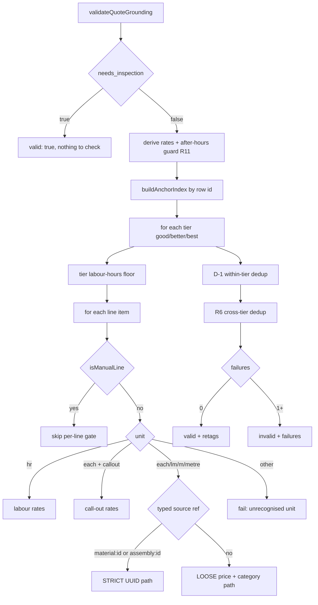

# Grounding Validator

`validateQuoteGrounding(draft, pricingBook, candidates)` in
`quotemate-automation/lib/estimate/validate.ts:742`. The only deterministic,
machine-checkable layer standing between a language model and a customer's bill.

Its own header states the defence stack it terminates:

1. STRICT GROUNDING in the system prompt
2. NON-NEGOTIABLE RULES in the system prompt
3. Route-level forced null tiers when `needs_inspection` is true
4. **This validator** — the only deterministic, machine-checkable layer

It is **pure**. It reads a draft, a `pricing_book` row and a pre-loaded candidate set, and
returns `{ valid: true }` or `{ valid: false, failures[] }` plus two advisory arrays
(`retags`, `ambiguousTypedRefs`). It never touches the database and never mutates the draft
— all corrections are applied by the caller in [[Estimate Engine]].

## What must be true for a line item to survive

A line item survives when **all** of the following hold:

1. The tier it lives in bills at least `pricing_book.min_labour_hours` of `unit='hr'`
   labour in total.
2. `unit_price_ex_gst` parses to a finite number.
3. Its `unit`, lowercased and trimmed, is one of `hr`, `each`, `lm`, `m`, `metre`,
   `metres`. Anything else fails outright.
4. Its price is **derivable** from the candidate set by whichever of the three routes below
   applies to it.
5. No earlier line in the same tier already anchored to the same catalogue row (D-1).
6. It is not part of an unframed cross-tier quantity duplicate (R6).

Failing any one of them appends a `GroundingFailure` — and a single failure anywhere in the
quote makes the whole result invalid.

### The candidate set — what "derivable" means concretely

`loadCandidatePrices(pricingBook, trade, tenantId, strictMarkup)` (`run.ts:1716`) loads four
tables and merges them into two lists (`material[]`, `assembly[]`):

| Table | Scope | Filters |
|---|---|---|
| `shared_materials` | `trade` | none (no enabled/active column) |
| `shared_assemblies` | `trade` | none |
| `tenant_custom_assemblies` | `tenant_id` + `trade` | `always_inspection = false` |
| `tenant_material_catalogue` | `tenant_id` + `trade` | none — expanded into supply + customer-supply price variants |

**Invariant — the trade scope.** Every query is `.eq('trade', trade)` where `trade` comes
from `intakes.trade`. Without it "an electrical quote could 'pass' validation by
coincidentally matching a plumbing price". The `trade` column is the canonical scope.

**⚠ M-6 — the validator deliberately diverges from the lookup tools.** The tools filter
`enabled = true` / `active = true` so a disabled row is never offered to a *new* quote. The
validator's job is different: it accepts prices the model has *already* chosen. If a tradie
disables a product seconds after a draft grounded on it, the row would vanish from the
candidate set and an otherwise-valid quote would dump to a $99 inspection over a purely
time-based race nobody can see. So `.eq('enabled', true)` and `.eq('active', true)` are
**removed here on purpose**. `always_inspection = true` stays excluded — that is a different
semantic (a service the tradie explicitly wants inspected, not "I deactivated this
product").

Every query uses `select('*')` rather than a column list, so a pre-migration production
where `category` does not yet exist cannot turn into a PostgREST missing-column error →
`null` data → **zero candidates → every quote dumped to inspection**. Deploy-order safety is
a stated design goal.

### `buildCandidatePrices` — the markup expansion

Each raw row `(id, name, price, category)` is expanded into one `CandidatePrice` per markup
variant, all carrying the same `sourceId` and the same category tag set:

```
markups = { 0, default − 5pp, default, default + 5pp }
```

⚠ **The ±5pp band is a scar, not a default.** History in the code: an early version allowed
`[0,10,15,20,25,28,30,35,40]%` (too much slack); it was tightened to exactly `[0, default]`,
which then killed clean plumbing quotes when the model rounded to 20% on a 15%-configured
book — a $580 wall-faced toilet at 15% is $667 vs $696 at 20%, $29 over the $0.50
tolerance, so every material line failed and the whole quote downgraded to inspection.
±5pp forgives rounding and anchor bias while still rejecting a 30%-tradie price on a
15%-tradie's book (15pp apart).

**R10 exception**: when `draft.pricing_path === 'deterministic'`, the caller passes
`strictMarkup: true` and the drift band collapses to 0. The deterministic builder marks up
at exactly `default_markup_pct` by construction, so any drift is a real bug rather than
model rounding.

`PRICE_TOLERANCE = 0.5` — ±$0.50, because Stripe stores cents and markups round.

Row categories are folded in via `granularToGroundingCategory(row.category)` — additively,
never dropping a name-derived tag. ⚠ This replaced an `isCategory(row.category)` test that
**cost a real customer a $99 inspection on 2026-07-31**: `shared_materials.category` says
`'sundries'` while this module's `Category` union says `'sundry'`, so `isCategory` returned
false, the column was dropped, and a $6.40 "Cable, terminals, clips" line — exactly the
$5.00 sundries TPS-cable row × 28% — was rejected as "a different category" against the very
row it came from. **Translate, don't test.** An unknown value returns `null` and adds
nothing (deliberately *not* `'general'`, which would hand every unrecognised row the
catch-all tag and quietly widen the validator).

## The ordering of passes



The order matters and is not arbitrary:

1. **Inspection short-circuit.** `needs_inspection === true` returns `{ valid: true }`
   immediately — such quotes carry no line items to validate.
2. **Rate derivation, including the R11 after-hours guard.**
3. **Anchor index build** — one pass over candidates, indexed by row id, reused by the
   strict path, the within-tier dedup and the cross-tier dedup.
4. **Per tier**: the labour floor first (it is a tier-level failure with `lineIndex: -1`),
   then every line item, then the within-tier dedup.
5. **After all tiers**: the cross-tier dedup, which needs all three tiers resolved.
6. Assemble `failures`, `retags`, `ambiguousTypedRefs`.

### 1. The tier labour floor

Sum every `unit='hr'` line's quantity in the tier. If the tier has any line items at all and
the total is below `min_labour_hours − 0.05`, the tier fails. The failure message
distinguishes "tier has no labour lines" from "tier-level labour total", because a tier with
zero `hr` lines is a different kind of model mistake to forgetting the small-job floor
(L-1.2).

⚠ Note the interaction with [[Estimate Engine]]: `applyMinLabourFloor()` runs **before** the
validator specifically so a correctly-priced small job is topped up to the tradie's minimum
rather than bounced here.

### 2. Labour lines (`unit = hr`)

Accepted at `hourly_rate`, `apprentice_rate`, or `senior_rate` when configured. **No
category check** — labour lines are intrinsically generic. `senior_rate` was added because
the model picking the senior tier for "Best" is the *right* call and was downgrading whole
quotes.

**After-hours (P-1 + R11).** `hourly_rate × after_hours_multiplier` is also accepted, but
only when the line is *tagged* after-hours. The multiplier itself is validated hard:

- must be a finite number (NaN, Infinity, "" or a non-numeric string → branch dormant);
- must be strictly `> 1` — an after-hours rate is a surcharge, so `≤ 1` is meaningless and a
  `< 1` would let an under-cost rate ground under an after-hours tag;
- must be `≤ AFTER_HOURS_MAX_MULTIPLIER = 2.5` — real AU trade loadings top out around
  ×2–2.5; beyond that is treated as forged and the branch stays dormant so the inflated
  price falls through to a normal grounding failure.

⚠ **C-2 — the description-side leak.** `isAfterHours(li)` reads the **`source` field only**.
Before C-2 it also matched any description containing "after-hours" or "emergency", which
let the model pass an inflated rate by writing the word into any description ("Emergency-
capable wiring", "After-hours capable LED install"). Belt-and-braces that turned into a leak.

Accepted `source` values: `after_hours`, `after-hours`, `emergency`, `emergency_callout`,
`after_hours_callout`.

### 3. Call-out lines

`source === 'callout'`, or `unit='each'` at `call_out_minimum` (±$0.50), or the after-hours
call-out when tagged.

### 4. Material and assembly lines — two routes

#### STRICT UUID path (R-4), when `source` matches `^(material|assembly):([A-Za-z0-9_-]+)$`

The id is resolved against the anchor index and **only** that row's own price variants
(raw + markup band) are accepted. No category fallback, no loose match. Placeholder ids
(empty, shorter than 4 chars, or the literal `"uuid"` copied from a prompt example) fall
through to the loose path rather than failing.

Two failure messages, both diagnostic:

- id not in the candidate set → "row may have been deleted, fabricated by the model, or the
  id belongs to another trade/tenant".
- id found, price wrong → lists the exact allowed prices and says "Either Opus emitted a
  price that doesn't match the row it picked, or it stamped the wrong row id."

**R1 cross-type resolution (2026-09-02).** The declared type always wins when it resolves.
Only when the declared map has no such row does the validator look in the other table — a
real, in-scope row tagged with the wrong prefix is a *typing* mistake, not an ungrounded
price. ⚠ Live 2026-09-01: "Add RCBO safety switch" was tagged
`material:5b48eed9-…e20`, which is the `shared_assemblies` row "Install 20A dedicated GPO"
(enabled for that tenant) — two tiers failed and a fully priced EV quote became a $99
inspection. A successful cross-type resolution emits a `TypedRefRetag`, which the caller
applies via `applyTypedRefRetags()` so downstream readers (catalogue enrichment, dedup, the
tradie edit UI) see the same ref the validator grounded against.

**Invariant:** the price rule is untouched by R1. The row's own raw/markup variants still
have to match within tolerance, so cross-type resolution never widens what counts as a
grounded number.

An id present in **both** tables keeps the declared prefix and is reported as an
`AmbiguousTypedRef` — two rows sharing an id should not happen and is worth surfacing.

#### LOOSE path — price match AND category match

The original path, for lines with no typed ref. Two conditions:

1. The price matches at least one candidate in `material[]` or `assembly[]` (±$0.50).
2. Of those price matches, at least one also matches **categorically** against the line
   description via `categorise(description)`.

Without (2) a "smoke alarm" line could be priced from a "downlight" row at the same dollar
amount × a different markup. That was the 2026-05-06 hole this whole layer was rebuilt to
close.

### `categoriesMatch()` — the semantic gate

Base rule: the line and the row share at least one specific tag, **or** the line is purely
`general` and the row is `sundry`-only (so "Disposal of old fittings" can be priced from the
Sundries row).

Two hardening rules sit on top:

**R12.1 — safety-critical row veto.** `SAFETY_CRITICAL = { smoke_alarm, gas, switchboard,
rcbo }`.

- A row whose tags are **purely** safety-critical can only be grounded by a *shared safety
  tag* — the line must independently describe that same safety category. A
  `[smoke_alarm]`-only row never grounds a non-smoke line.
- A **mixed** row (safety plus at least one non-safety tag) may ground via a genuine shared
  non-safety specific tag or a shared safety tag. This carve-out removed a false positive:
  an `[oven_cooktop]` line grounding a row tagged `[oven_cooktop, gas]` used to be rejected
  because the row happened to also carry `gas`.

The rationale is stated plainly: for ordinary categories a near-miss is a pricing bug; for
safety-critical ones "a wrong-category ground is a LIABILITY: a customer could be sold
'smoke alarm work' priced off a downlight row."

**R12.2 — line-side safety + cross-trade guard.** A line carrying a safety tag that the row
does not carry is rejected. And when the line and the row resolve to a single, *different*
trade with no shared specific tag, the match is rejected regardless of a coincidental price
match — an electrical price must never ground a plumbing line. `CATEGORY_TRADE` maps each
category to its trade; `sundry` and `general` belong to neither and never trip the guard.
This is mostly already enforced by trade-scoped candidate loading, but the validator makes
it "a hard, testable invariant rather than relying solely on the caller."

### 5. Manual lines are exempt — narrowly

`MANUAL_LINE_SOURCE = 'tradie_manual'`. A line with exactly this source is "grounded by the
human who typed it, not the catalogue" and skips the per-line price/unit/category gate.
`resolveLineAnchor` also refuses to anchor it, so a coincidental price match never trips
duplicate detection.

**Invariant:** the exemption is scoped **strictly** to this one sentinel. Every other source
— `material:`/`assembly:`, `labour`, `callout`, `after_hours`, `tradie_edit` — validates
exactly as before. A manual line does **not** substitute for required labour: the tier
labour floor is unaffected.

### 6. D-1 — within-tier duplicate guard

Each line resolves to an *anchor* (the catalogue row id it maps to) via `resolveLineAnchor`,
which is sourceId-first, then name+price, then a conservative price-only lookup. Two lines
with the same anchor in one tier → the later one fails.

⚠ The bug it closes: the model emitting the same product twice, once at raw cost
(`source: "material"`) and once marked up (`source: "material:<id>"`). Each passes
*individually* — the raw price via the loose path, the marked-up price via the strict path —
so the customer pays twice. Real example cited in the source: quote `3669a680…` charged a
customer for a Dux Proflo 315L at both $1,645 raw and $2,237.20 (×1.36), inflating the
total by roughly $1,810 inc GST.

R5 added the price-only fallback so the same row emitted twice with *different* descriptions
("Dux Proflo 315L" vs "Premium HWS 315L") and in different markup bands still anchors to one
row. The failure message tells the model the fix: "If the customer needs two of this
product, set quantity=2 on a single line."

### 7. R6 — cross-tier duplicate guard

Runs once across all three tiers. The same catalogue row appearing across Good/Better/Best
at the **same quantity** is ordinary tier progression and is allowed. The same row at
**different quantities** across tiers is flagged **unless** `scope_of_works` or `assumptions`
explicitly frame the quantity difference. Surfaced against the first occurrence's tier and
line, so an unframed cross-tier over-charge downgrades like any other integrity violation.

## What happens on failure

⚠ **This is the biggest single drift between the docs and the code.** The root
`CLAUDE.md` and `docs/strategy.md` both state that any grounding failure downgrades the whole
quote to the $99 inspection route. That was true, and the validator's own header comment
still says it. Since **R3.2 (2026-09-02)** it is no longer the default path.

The caller's failure ladder in `run.ts`:

1. **Upsell guard (R2 / R3.1) first.** `stripUngroundedUpsellLines(draft, check.failures)`
   moves an *optional upsell* the prompt itself offered ("Switchboard health check", "Add
   RCBO safety switch") — which the model folded into a tier at a price no catalogue row
   carries — into `optional_upsells[]` unpriced, then **re-validates**. The customer keeps
   their real, fully grounded quote and still sees the extra offered. A stripped line
   appends an `[upsell-guard]` risk flag.
2. **Still failing → hold, do not downgrade.** The tiers are kept, `needs_inspection` stays
   `false`, and one `[grounding]` risk flag is appended naming the failure count. The route
   receives `groundingHold: true` and `groundingFailures[]`. Those flags make
   `shouldHoldForReview()` hold (`review-policy.ts` `safetyReviewReasons`), so the customer
   is never auto-sent the draft — the tradie approves or edits it.

The reasoning, verbatim in the source: a grounding failure is an **internal** fact — "the
model quoted a number this tenant's price rows cannot justify". Nulling the tiers "put a
site-conditions story in front of the customer for what was our own validation error — and
threw away a draft the tradie could have corrected in seconds (live 2026-09-01, quote
`7zNJCjsaxBOL_N3cATDNvQ`: three optional lines sank a good EV quote)".

The $99 inspection downgrade still fires on every **other** integrity path: the two terminal
preflights, a self-declared `needs_inspection`, R14 (post-reconcile re-check), R15 (all
tiers spec-mismatched), the EV customer-supply fence, and R9 sanity bounds. Those set
`downgradedToInspection` with an `inspectionCause`, and the route must not mint three-tier
Stripe sessions. See [[Routing Decision]] and [[Mint Routes and Guards]].

## Worked example — the EV charger customer-supply fence

`lib/estimate/ev-charger-supply.ts`. The cleanest illustration of a **post-validation
transform** and of why re-validation must follow one.

### The problem grounding cannot solve

The seeded "Install EV charger" assembly explicitly excludes the charger unit. When
`intake.scope.specs.supplied_by === 'customer'`, the customer already owns the unit — so
billing them for it is a double charge. But: *grounding proves a material price exists; it
cannot prove the customer did not already buy that material.* The price is genuinely in the
candidate set. The validator will happily pass it. Something else has to remove it.

### How the fence decides

`enforceEvChargerCustomerSupplyFence({ jobType, chargerSupply, draft, candidates })`. It
no-ops unless `jobType === 'ev_charger'`, `chargerSupply === CUSTOMER_SUPPLIES_EV_CHARGER`
(`'customer already has the charger'`), and the draft is not already an inspection.

**Invariant — removal is authorised by catalogue anchor, never by words.** A line is removed
only when its `catalogue_id` or its `source: material:<id>` resolves to a material candidate
whose categories contain `ev_charger` (or a raw `materialRows` entry with
`category === 'ev_charger'`). Description text can never authorise a removal.

Description matching exists for exactly one purpose: **fail-closed ambiguity detection**.
`looksLikeEvChargerUnit()` is a narrow regex set (EV/electric-vehicle near
charger/wallbox/wall connector, Tesla/BYD near charger, bare "wall connector"). A line that
*looks* like a charger unit but carries **no** catalogue anchor returns
`status: 'inspection_required'` with code `unanchored_ev_charger_line` — the whole quote
goes to human review rather than guessing.

`isProtectedInstallationLine()` shields labour, callout, sundries, risk buffer, after-hours,
`tradie_manual` and any `assembly`/`assembly:` line from both removal and ambiguity
detection. Installation work is never at risk.

Two more fail-closed exits, checked per tier **before** anything is written:

| Code | Condition |
|---|---|
| `missing_installation_work` | after removal the tier has no surviving `labour`/`assembly` line with a positive quantity — an "install-only" quote with no install left is not a quote |
| `invalid_surviving_line_price` | any survivor has a non-finite quantity or unit price, so the subtotal cannot be recomputed honestly |

The whole draft is validated before cloning or removing anything, and the input object is
never mutated — a violation returns the **exact input** for diagnostics.

### Why re-validation runs afterwards

On `status: 'stripped'` the caller does not trust the transform:

```
draft = fence.draft
const recheck = validateQuoteGrounding(draft, pricingBook, candidates)
if (!recheck.valid) forcedInspection = { reason: 'Customer-supplied EV charger installation
  failed the post-removal grounding check…', groundingFailures: recheck.failures }
```

The reason is structural. Removing lines **recomputes `subtotal_ex_gst`** and changes the
tier's composition. The earlier grounding pass proved the *pre-removal* draft; it says
nothing about the post-removal one. The general rule the estimator follows — and the same
rule behind R14's post-reconcile re-check — is:

> **Invariant: any transform that rewrites a priced tier after grounding MUST be followed by
> a re-run of `validateQuoteGrounding` before the draft is returned.** Grounding is a
> statement about a specific set of numbers, not a permanent property of the draft.

A thrown error inside the fence also routes to inspection ("Customer-supplied EV charger
pricing could not be verified safely"), so the fence has no silent-failure mode.

### The mirror case — R7, tradie supplies but stocks nothing

`ensureChargerSuppliedSeparatelyAssumption()` runs **before** the fence so the two branches
never both touch the same draft. When the tradie supplies, no tenant stocks a charger, and
no priced tier carries a unit line, it appends exactly one assumption:

> "Charger unit supplied separately — model and price confirmed before booking."

Pure, idempotent (skips if a matching assumption already exists), and deliberately **not** a
route to inspection: a missing product price is a gap in the price book, not a hazard on
site, and the installation price is still the honest answer. It is stamped deterministically
because "a customer reading 'supply and install a 7kW EV charger' while no unit is priced is
exactly the confusion the 2026-09-01 incident produced." See [[EV Charger Jobs]].

## Reuse outside the estimator

`loadCandidatePrices` and `validateQuoteGrounding` are exported and reused by
`/api/quote/[id]/edit` (H-2, 2026-05-25) so **tradie hand-edits get the same grounding gate
the model draft gets** — with `tradie_edit` as a loose-grounding source and `tradie_manual`
as the explicit exemption.

## Open questions

- `categorise()` covers roughly 30 categories across both trades plus shared sundries; the
  full keyword list lives in `lib/estimate/categories.ts` and is not enumerated here.
- `detectCrossTierDuplicates` decides "framing" by scanning `scope_of_works`/`assumptions`;
  the exact matching rule is not covered in this note.

## Related

- [[Estimate Engine]]
- [[Intake Structuring]]
- [[Routing Decision]]
- [[EV Charger Jobs]]
- [[Key Columns and Invariants]]
- [[Known Debt Register]]
- [[Mint Routes and Guards]]
