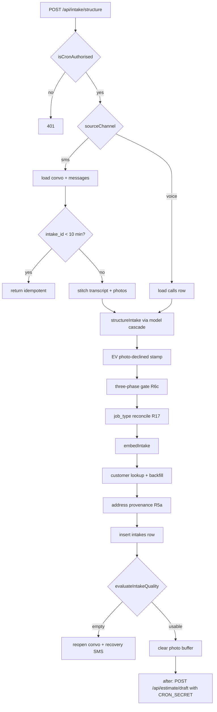

# Intake Structuring

The first stage of the electrical/plumbing pipeline (see [[The Four Pipelines]]). It turns a
raw transcript plus photos into a **canonical intake row** — a Zod-validated object with a
`trade`, a `job_type`, structured pricing specs, risks, and a confidence band. Everything
downstream ([[Estimate Engine]], [[Grounding Validator]], [[Routing Decision]]) grounds on
this row and on nothing else the customer said.

Two artefacts:

| Artefact | Where |
|---|---|
| The LLM call + pure post-processing | `quotemate-automation/lib/intake/structure.ts` |
| The channel-agnostic handler that persists it and hands off | `quotemate-automation/app/api/intake/structure/route.ts` |

## The canonical shape (`IntakeSchema`)

`quotemate-automation/lib/intake/schema.ts` defines the whole contract. Root fields:
`trade` (`electrical | plumbing`), `job_type` (a 22-member enum plus `other`), `address`,
`suburb`, `scope`, `access`, `property`, `risks[]`, `inspection_required`, `caller`,
`timing`, `confidence` (`LOW | MEDIUM | HIGH`), `confidence_reason`.

⚠ **The 24-optional-field cap is a live design constraint, not trivia.** Anthropic's
`generateObject` caps optional parameters at 24 across the whole schema, and `IntakeSchema`
sits exactly at the cap (`schema.ts:51-54`). Two consequences visible in the code:

- `brand_preference` and `access.notes` were **deleted** on 2026-05-07 to get under the cap.
  Brand mentions now travel as free text inside `scope.description`, which the estimator
  reads when narrowing material lookups.
- `scope.specs.system_type` is a first-class field on the canonical intake but is
  **deliberately omitted** from the schema the model sees (`structure.ts:27-38`). Adding it
  would make 25 optionals. It is captured instead through a **required** string field,
  `scope.requested_specs_json`, and promoted server-side.

**Invariant:** any new intake field MUST be either required, or promoted server-side out of
`requested_specs_json`. Adding a 25th optional breaks `generateObject` outright.

### `scope.specs` — the pricing-critical block

| Field | Applies to | Purpose |
|---|---|---|
| `color_temp` | downlights, outdoor lighting | SQL filter on the materials library |
| `dimmable` | downlights, fans, lighting | ditto |
| `smart` | downlights, GPOs, fans | ditto |
| `weatherproof` | GPOs, outdoor lights | ditto; also implied by `indoor_outdoor='outdoor'` |
| `supplied_by` | any job where the customer may supply the fitting | `tradie \| customer` — drives the EV-charger customer-supply fence, see [[Grounding Validator]] |
| `system_type` | plumbing `hot_water` only | `electric \| gas \| heat_pump` — selects the HWS assembly family |
| `requested_specs` | all | free-form flat string map parsed out of `requested_specs_json` |

The prompt states plainly why these matter: "Missing a spec means the estimation engine has
to guess the SKU — which is exactly the hallucination class we are trying to eliminate"
(`structure.ts`, SPEC EXTRACTION block).

## The model call

`structureIntake(transcript, photoUrls, tradeHint, modelId = 'claude-opus-4-8')` calls
`generateObject` from the Vercel AI SDK against `anthropic(modelId)` with
`maxRetries: 0` — retries are the caller's job so failures get logged once, not twice.

Temperature is deliberately **not** set: Opus 4.7+ is an extended-thinking model that
ignores it and the SDK warns on every call. Determinism comes from strict grounding plus
structured output.

Photos arrive as `{ type: 'image', image: url }` parts on the user message — this is the
vision step. Rule 8 of the system prompt forbids describing imagined photos.

### The strict-grounding preamble

Nine numbered rules head the system prompt and are marked "non-negotiable, supersedes
everything below". The load-bearing ones:

1. Extract only what was said or is visibly present. Never infer from "what jobs like this
   usually involve."
3. Never invent `caller.name`, address, suburb, `item_count`, or any access/property field.
5. `risks[]` is grounded only in the customer's own trigger words.
6. `scope.description` must quote or closely paraphrase the caller's wording.
7. No placeholder strings — no "Unknown", "N/A", "TBD". Empty string is the only acceptable
   placeholder; numbers and booleans are omitted entirely.

### Trade-branched prompting

`TradeHint` is `'electrical' | 'plumbing'`. The system prompt forks on it, so Opus sees only
one trade's job-type vocabulary, customer-language mapping, risk model and
always-inspection list. The hint comes from the SMS dialog's already-classified
`conversation_state.slots.job_type` (route.ts, SMS branch) or is pinned to `electrical` on
the voice path, because the Vapi persona is electrical-only. See [[Voice Channel (Vapi)]]
and [[SMS Channel Overview]].

Always-inspection sets stated in the prompt:

- **Electrical**: switchboard, renovation, rewire, mains/underground/three-phase, and any
  `oven_cooktop`/`power_points`/`outdoor_lighting` job mentioning a new circuit, mains or
  switchboard work. EV charger and fault finding are explicitly `inspection_required=false`
  when they map to an enabled priced service row and no safety/load/switchboard risk is
  stated.
- **Plumbing**: gas leak/smell, `burst_pipe`, `bathroom_renovation`, hidden pipework, water
  damage, unknown gas-line sizing, access through concrete or tile.

## Pure post-processing — `finaliseIntake()`

`structureIntake` does exactly one thing after the model returns: it calls
`finaliseIntake(object)` (`structure.ts:113`). That function is pure — no LLM, no DB — and
therefore unit-testable. Three jobs plus a backstop:

1. **Parse** `requested_specs_json` → `scope.specs.requested_specs` via
   `parseRequestedSpecs()`. Robust by construction: malformed JSON, non-objects, arrays and
   nested values all degrade to `{}` and never throw. A capture miss must never break the
   intake or trigger a false spec mismatch downstream — "degrade-never-block".
2. **Promote** a stated hot-water fuel to the typed `scope.specs.system_type` via
   `deriveSystemType()`, which reads `system_type` and the legacy synonym `energy_source`,
   both normalised by `normaliseSystemType()`. Heat pump is matched **first** because it
   contains electric-adjacent wording and must not collapse to plain `electric`.
   Unrecognised wording returns `undefined` — never a guess.
3. **Derive** `trade` from `job_type` via `deriveTradeFromJobType()` (`schema.ts`). An
   11-member plumbing set; everything else, including `other` and `renovation`, is
   electrical. The model never classifies the trade.

### ★ The E8 hot-water backstop

`structure.ts:154-181`. If `trade === 'plumbing'` and `job_type === 'hot_water'` and no
`system_type` was captured, the intake is forced to `inspection_required: true` and
`confidence: 'LOW'` with a reason naming the missing fuel.

**Invariant:** an unknown hot-water fuel MUST escalate to inspection, because picking
electric/gas/heat-pump would ground the whole quote on the wrong HWS assembly. The prompt
tells the model the same rule; the backstop exists because the code never trusts the model
alone. It preserves the model's own `confidence_reason` only when that reason already names
the gap (checks for `system_type`, `energy source`, `fuel`, or "hot" plus a fuel word).

## The route — `POST /api/intake/structure`

`maxDuration = 300`. Channel-agnostic; body is either `{ callId }` (voice) or
`{ conversationId, sourceChannel: 'sms' }`.

**Auth first, before `req.json()`.** `isCronAuthorised(req)` (`lib/agents/cron.ts`) returns
401 otherwise. The route structures an intake with Opus, inserts the row and self-calls
`/api/estimate/draft`, so an anonymous caller would reach the whole money path.
`proxy.ts` is a bare `clerkMiddleware()` and gates nothing — this guard is the only gate.
See [[API Overview]] and [[Environment Variables and Feature Flags]] (`CRON_SECRET`).

### Ordered stages

### SMS idempotency short-circuit

`route.ts` (SMS branch). The inbound webhook fires this endpoint inside `withRetry`; if
Vercel terminates the in-flight outbound fetch, the inbound retries even though the server
finished the whole pipeline. Prod symptom: two intake rows ~12s apart and two recovery
SMSes. Guard: if `sms_conversations.intake_id` points at an `intakes` row created inside a
**10-minute window**, return `{ idempotent: true }` and skip everything. The window is
generous on purpose — running Opus twice and double-dispatching SMS is the worse failure.

### Model cascade

`INTAKE_MODEL_CASCADE = [claude-opus-4-8, claude-opus-4-7, claude-sonnet-4-6]`, driven by
`withRetry({ maxAttempts: 3, baseDelayMs: 2000 })`. Each attempt steps one model down the
list. See [[Model and Prompt Inventory]].

### Deterministic gates applied after structuring

| Gate | Function | Rule |
|---|---|---|
| EV photo declined (R9) | inline | `job_type === 'ev_charger'` + customer declined the photo ask + zero photo paths → stamp `scope.specs.photo_declined = true`, so the tradie sees **why** the estimate has no photo. Never inferred by the model. |
| Three-phase (R6c) | `enforceSmsThreePhaseInspection()` | Only the customer's **own exact** slot answer (`three-phase`, `three phase`, `3 phase`, `3-phase`) counts. Pure; can only ever *set* `inspection_required`, never clear a decision a safety rule already made. The old "any Tesla/EV mention implies three-phase" inference is gone and is deliberately not resurrected. |
| job_type reconcile (R17) | `reconcileJobType()` | Compares the dialog's `job_type` against the structurer's. A genuine `conflict` downgrades `confidence` to LOW and appends the conflict to `confidence_reason`, so the quality gate fires a focused clarifying SMS rather than grounding against the wrong assembly. |
| Gas HWS override | inline, env-gated | `FORCE_GAS_HWS_SITE_VISIT=1` forces `hot_water` + gas keywords to inspection per AS/NZS 5601. **Default OFF** — gas HWS rows are now priced in the catalogue. Legacy safety valve only. |

`reconcileJobType` is a small voting machine: unanimous or single → `use`; clear majority
(>50%, no tie) → `use`; a tie or no majority → `conflict` with action `clarify`, and it
**never silently picks**. `unknown`/`other`/`out_of_scope`/`unsure`/blank do not vote.

### Address provenance (R5a)

`resolveAddressProvenance(threadAddress, customerAddress)` runs **unconditionally** and
stamps `scope.address_source` (`'thread' | 'none'`) plus an optional
`scope.remembered_address`.

⚠ **Live incident 2026-09-01**: a remembered street address captured six weeks earlier in a
roofing thread ("652 London Rd, Chandler") printed as the site for an EV-charger enquiry
whose customer had only ever texted a suburb. Fix: **the job address comes from this thread
or not at all.** A suburb is a stable fact about a customer; a street address is a fact
about one job. Memory's address still travels, but labelled and tradie-only.

Customer-memory backfill still fills blank `caller.name`, `suburb` and `caller.email` from
the `customers` row — never overwriting a value Opus extracted. This exists because
`formatCustomerContext()` tells the dialog agent to skip questions it already knows the
answer to, which means the transcript contains no name and Opus has nothing to extract.

## The quality gate

`evaluateIntakeQuality()` (`lib/intake/quality.ts`) returns `'usable' | 'empty'` and decides
whether the estimator runs at all. Two layers, applied in order:

- **HIGH is sacrosanct** — returned `usable` without running either gate.
- **Layer 1, universal gate (LOW only).** A LOW intake with a `scope.description` shorter
  than 10 characters is `empty`. ⚠ Note what is *not* here: since R18 a missing customer
  **name** no longer fails the gate (the phone number is already known; the name is
  collected at booking), and `job_type='other'` is not on its own a failure — the 2026-05-19
  "bug zapper" incident showed tenant-custom assemblies legitimately fall outside the enum.
- **Layer 2, per-job gate (R28, LOW *and* MEDIUM).** `PER_JOB_REQUIRED_FIELDS` currently
  demands a `count` for the electrical easy-5 (`downlights`, `power_points`,
  `ceiling_fans`, `smoke_alarms`, `outdoor_lighting`). `hasCountSignal()` accepts either a
  positive `scope.item_count` **or** any digit in `scope.description`, so a customer who
  already said "5 downlights in the kitchen" is never re-asked.

**Invariant:** the per-job gate ONLY downgrades. It never promotes an intake the universal
gate rejected, never raises confidence, and never touches HIGH.

On `empty` the route: (1) computes the exact missing fields, folding in
`missingRequiredFields()` so a structured-field gap produces the precise question rather
than a generic "describe the work" ask-loop; (2) **synchronously** flips
`sms_conversations.status` back to `'open'` *before* returning, so a fast customer reply
does not land in the <60s inflight window and hit the canned "just finalising" hold;
(3) dispatches a focused recovery SMS in `after()` from the **tenant's own** number via
`resolveOutboundFromNumber()` and persists it as an outbound `sms_messages` row so the
dialog agent knows it asked.

⚠ Live incident 2026-07-23: voice-path sends defaulted to the platform env number, so the
customer saw two different senders. Every send in this route now resolves the tenant number
first.

## Embedding

`embedIntake(intake)` (`lib/intake/embed.ts`) builds a one-line summary —
`trade=… job_type count=… new=… indoor_outdoor risks…` — and embeds it with Voyage
`voyage-3-large` at **1024 native dims** (`VOYAGE_API_KEY`, `VOYAGE_EMBED_MODEL`).
Migration 057 collapsed `intakes.embedding` from `vector(1536)` to `vector(1024)`; there is
no more zero-padding. `trade` is in the summary so cross-trade similarity is explicitly
distinguished, belt-and-braces on top of `match_intakes`' `job_type` pre-filter.

Without a key it returns a **deterministic FNV/xorshift stub** so dev runs complete
end-to-end. The stub is stable per input but not semantic — RAG retrieval is garbage on
stub, which is fine locally where there is no real history. Same fallback on a non-200 or a
wrong-dimension response.

⚠ **Drift**: `route.ts` logs `'embedding intake (1536-dim) for similarity search'`. The
vector is 1024-dim. The log string is stale, the code is right.

## Hand-off

On `usable` the route clears the conversation's photo buffer (`photo_urls`, `photo_paths`,
`photo_request_sent_at`, `photos_completed_at`) — deferred to *this* branch on purpose so
the recovery flow above can preserve photo state across its second pass — then in `after()`
POSTs `{ intakeId }` to `${APP_URL}/api/estimate/draft` with
`Authorization: Bearer ${CRON_SECRET}`, wrapped in `withRetry({ maxAttempts: 3 })`.

**Invariant:** if that hand-off exhausts its retries, the route MUST NOT leave the customer
silent — it sends `buildQuoteFailureSms()` so they know to expect a callback. The intake row
exists either way.

## Open questions

- `WP9_PRODUCT_OPTIONS` (mid-chat product pick injected into the transcript and force-applied
  as `scope.chosen_product`) is flag-gated and defaults OFF; its downstream force-apply lives
  in the estimator and is not covered here.
- `photo_declined` is written into `scope.specs` but is not a field on `IntakeSchema` — it
  survives only because `scope` is jsonb.

## Related

- [[Estimate Engine]]
- [[Grounding Validator]]
- [[RAG and Retrieval]]
- [[Routing Decision]]
- [[The Four Pipelines]]
- [[SMS Channel Overview]]
- [[Voice Channel (Vapi)]]
- [[Model and Prompt Inventory]]
