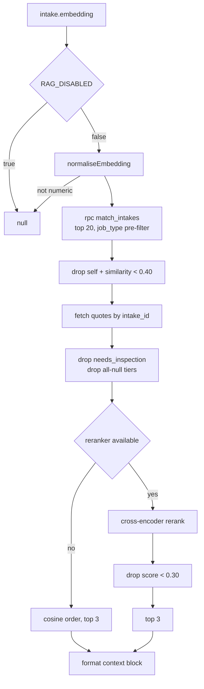

# RAG and Retrieval

Two independent retrieval systems run inside the electrical/plumbing pipeline, and they are
easy to confuse because both use the same reranker module:

| | **Quote RAG** | **Price-lookup rerank** |
|---|---|---|
| Module | `lib/estimate/rag.ts` | `lib/estimate/tools.ts` |
| Retrieves | similar **past intakes → their quotes** | candidate **catalogue rows** |
| Vector store | Supabase `pgvector`, `intakes.embedding` | none — SQL `ilike` + property filters |
| Feeds | the **user prompt** as advisory text | the **tool result** the model reads prices from |
| Can it originate a price? | **No.** Never fed to the tools, the candidate loader or the validator. | Only rows that already exist in the DB. |

**Invariant:** RAG output is advisory context only. It shows the model *how this tradie has
priced similar work*; it can never become the source of a line item's price. Every dollar
still has to survive [[Grounding Validator]].

## Quote RAG — `fetchSimilarPastQuotesContext()`

Called once per estimation, wrapped in try/catch by [[Estimate Engine]]: "RAG must never
block estimation. Log + carry on."



### Tuning constants

| Constant | Value | Why |
|---|---|---|
| `VECTOR_FETCH_COUNT` | 20 | Enough room for the reranker to refine, inside Voyage Rerank's batch sweet spot for short docs |
| `FINAL_CONTEXT_COUNT` | 3 | "Empirically 3 is enough to anchor pricing patterns without bloating the prompt or burying the 'do NOT copy verbatim' instruction" |
| `MIN_SIMILARITY` | 0.40 | A pre-rerank floor only — stops obviously orthogonal junk from wasting a rerank API call. The reranker is the real gate. |
| `MIN_RERANK_SCORE` | 0.30 | Below this a candidate is dropped even if it made the top-K — "not really related" in practice |

### Five ways RAG returns `null`

All of them are silent and safe; the estimator proceeds without the block.

1. `RAG_DISABLED=true` — an explicit kill switch so quote quality can be rolled back
   without a deploy.
2. The intake carries no embedding (defensive; should not happen).
3. `match_intakes` returns nothing.
4. Every match resolved to an inspection-required quote (no real pricing).
5. Every match resolved to a draft with all-null tiers.

### The vector search — `match_intakes`

A Postgres function, currently defined by migration 057:

```sql
create or replace function match_intakes(
  query_embedding vector(1024),
  match_count int default 5,
  job_type_filter text default null
) returns table (id uuid, scope jsonb, similarity float)
language sql stable as $$
  select id, scope, 1 - (embedding <=> query_embedding) as similarity
  from intakes
  where embedding is not null
    and (job_type_filter is null or job_type = job_type_filter)
  order by embedding <=> query_embedding
  limit match_count;
$$;
```

`<=>` is pgvector's cosine-distance operator; `similarity = 1 − distance`.

**The `job_type` pre-filter (migration 006) is a SQL-layer scope, not a nicety.** "A
'downlights' query never even sees smoke alarm or GPO history. Sharper candidate pool, fewer
wasted Voyage Rerank API calls." `job_type_filter = null` disables it for back-compat when
`intake.job_type` is missing.

⚠ **The embedding is 1024-dim, not 1536.** Migration 057 nulled every existing embedding,
collapsed `intakes.embedding` from `vector(1536)` (voyage-3 zero-padded) to `vector(1024)`
(voyage-3-large native), and recreated `match_intakes` with the new signature. Two stale
statements survive in the code and should not be trusted:

- `lib/estimate/rag.ts` header: "with its 1536-dim embedding already populated".
- `app/api/intake/structure/route.ts` log line: `'embedding intake (1536-dim) for similarity
  search'`.

The column comment written by 057 is authoritative: *"Voyage voyage-3-large embedding (1024
native dims). See lib/intake/embed.ts. Generated by structureIntake() and consumed by
match_intakes() / RAG."*

`normaliseEmbedding()` handles pgvector coming back as either a JSON string
(`"[0.1, 0.2, …]"`) or a number array, depending on the Supabase client version, and returns
`null` for anything else.

### Embedding generation

`embedIntake()` (`lib/intake/embed.ts`) — covered in [[Intake Structuring]]. The summary
embedded is deliberately terse:

```
trade=<trade> <job_type> count=<item_count> new=<is_new_install> <indoor_outdoor> <risks…>
```

`trade` is in the string so cross-trade similarity is explicitly distinguished —
belt-and-braces on top of the SQL `job_type` pre-filter. `VOYAGE_EMBED_MODEL` defaults to
`voyage-3-large`.

⚠ Without `VOYAGE_API_KEY` the module returns a **deterministic FNV/xorshift stub** so dev
runs complete end-to-end. The stub is stable per input but carries no semantics — RAG
retrieval on stub vectors is garbage. That is accepted locally (no real history) but would
be silent and harmful in production, and the same fallback fires on a non-200 response or a
wrong-dimension vector.

### Hydration and the two exclusions

Matched intake ids are used to fetch `quotes` rows (`id, intake_id, scope_of_works,
needs_inspection, good, better, best, selected_tier`). A candidate is dropped when
`needs_inspection` is true (no real pricing to learn from) or when all three tier columns are
null (a draft that never priced).

### The prompt block

Formatted as plain text prepended to the **user** message — never the system message, so the
Anthropic ephemeral prompt cache stays warm across tenants:

```
SIMILAR PAST QUOTES (anchor to these pricing patterns; do NOT copy verbatim if the new intake differs)

1. similarity 84% · rerank 71% — x6, replacing existing, indoor
   scope: <one line, truncated to 140 chars>
   tiers (inc GST): GOOD $1,240 / BETTER $1,690 (rec) / BEST $2,150

END SIMILAR PAST QUOTES
```

Prices are shown **inc GST** here on purpose — "that's how the tradie thinks about it on
the SMS" — even though the platform stores ex-GST everywhere else. See
[[Key Columns and Invariants]].

⚠ **RAG and the markup policy collide, and the prompt resolves it explicitly.** Rule 11 of
the estimator prompt tells the model to use exactly `default_markup_pct` "even if a 'SIMILAR
PAST QUOTES' block in the user message shows past quotes that used different markups (15%,
30%, etc.). Past quotes were drafted under older policy; the current single-rate policy is
binding." The validator enforces the same thing.

### What the reranker actually sees

The cross-encoder reads only two strings, so both are built dense with the fields that
distinguish jobs.

`buildRerankQuery(intake)` — `job_type`, `item_count`, new-vs-replace, `indoor_outdoor`, the
first 200 chars of `scope.description`, `ceiling_type`, `wall_type`, `roof_access`, and the
first 120 chars of `risks`, joined with `·`.

`buildRerankDoc(match, quote)` — the past intake's scope descriptor, the first 200 chars of
its `scope_of_works`, and its tier prices.

## The reranker — provider-agnostic

`lib/estimate/rerank.ts` exports a `Reranker` interface with one method,
`rerank(query, docs, topN)`, whose implementations "MUST be deterministic for the same
(query, docs, topN) tuple".

| Provider | Endpoint | Default model | Key |
|---|---|---|---|
| Voyage | `https://api.voyageai.com/v1/rerank` | `rerank-2.5` (`VOYAGE_RERANK_MODEL`) | `VOYAGE_API_KEY` |
| Cohere | `https://api.cohere.com/v2/rerank` | `rerank-v3.5` (`COHERE_RERANK_MODEL`) | `COHERE_API_KEY` |

`getReranker()` resolves the configuration:

- `RAG_RERANK_DISABLED=true` → `null`, and the caller degrades to cosine ordering.
- `RAG_RERANK_PROVIDER` (default `voyage`) picks the primary.
- If the configured primary has no API key → `null`. Deliberate: the caller degrades cleanly
  rather than throwing on every call.
- When **both** keys are present and `RAG_RERANK_FALLBACK !== 'false'`, the primary is
  wrapped by `chainWithFallback(primary, secondary)`.

`chainWithFallback` tries the primary and, on **any** thrown error, logs and falls through to
the secondary. If the secondary also throws it re-throws so `rag.ts` still degrades to cosine
ordering. The primary failure is logged specifically so the platform logs "show whether we're
being kept alive by the secondary — actionable signal when one provider is degraded".

Cohere and Voyage both score roughly 0.0–1.0, close enough that `MIN_RERANK_SCORE = 0.30`
carries over untuned. The stated policy on drift is to **calibrate the floor in `rag.ts`
rather than warp scores in the provider adapter**.

## Price-lookup rerank — the second system

Inside `lookupAssembly` and `lookupMaterial` (`lib/estimate/tools.ts`), the same
`getReranker()` narrows a SQL candidate pool before the model ever sees it:

- `FETCH_LIMIT = 12` rows per source table (shared + tenant), `RETURN_LIMIT = 5` returned.
- Rows ≤ 2 skip reranking entirely.
- Tenant/custom rows are placed **first** in the input array so the reranker can promote
  them, but "the reranker decides the final order regardless".
- Documents are `"<name> — <description>"` for assemblies and `"<brand> <range> <name>"` for
  materials.
- Any failure logs `[tools] reranker failed; falling back to SQL order` and returns
  `rows.slice(0, topN)`. Never blocks the estimator.

The purpose is bluntly stated in the source: without it "Opus gets 5 rows in arbitrary SQL
order and may pick a poor match (e.g. surfacing 'USB GPO' when the customer asked for
'weatherproof outdoor GPO'). With the reranker, the right SKU is always row #1."

⚠ Related fix: `ASSEMBLY_FETCH_LIMIT = 12` in `lib/estimate/run.ts:71` mirrors `FETCH_LIMIT`
because the old `.limit(5)` became a truncation bug once the OR filter widened — with no
`ORDER BY`, Postgres could return any 5 of the matches and drop the right row before JS ever
saw it.

## Other retrieval surfaces in the estimator

These are separate from RAG proper but reach the same user prompt as advisory blocks. All
are flag-gated and all are excluded from the tools, the candidate loader and the validator.

| Surface | Builder | Flag |
|---|---|---|
| Per-tenant file-store grounding | `buildTenantGroundingHint()` (`run.ts`), `searchTenantStore()` (`lib/filestore/tenant-store.ts`) | `TENANT_FILESTORE_ENABLED=true` |
| Historical price hint | `buildPriceHistoryHint()` / `summarisePriceHistory()` | `PRICE_HISTORY_HINT=1` |
| MT-QM-PRICING-KB verification | `runKbEstimateVerification()` (`lib/estimate/kb-verify.ts`) | `KB_VERIFY_ESTIMATES = off \| shadow \| apply` |

The file-store hint carries three explicit guarantees in the source: flag-gated (no DB read
or KB call when off), best-effort (any error or timeout → `null`), and **additive only** —
scoped to this tenant's `file_store_id`, never a price source. `TENANT_GROUNDING_MAX_CHARS =
1800` caps how much reaches the prompt.

KB verification is the exception that *does* touch prices, in `apply` mode — and it is
deliberately sequenced **before** the grounding pass so any price it rewrites still has to
ground. R10 stamps rewritten lines with an origin marker so a stale KB price cannot launder
through the loose category path unnoticed.

## Environment variables

| Var | Effect |
|---|---|
| `RAG_DISABLED` | `true` → no similar-quote block at all |
| `RAG_RERANK_DISABLED` | `true` → cosine ordering only, in both systems |
| `RAG_RERANK_PROVIDER` | `voyage` (default) or `cohere` |
| `RAG_RERANK_FALLBACK` | `false` → primary only, no cross-provider fallback |
| `VOYAGE_API_KEY` | embeddings **and** Voyage rerank |
| `VOYAGE_EMBED_MODEL` | default `voyage-3-large` |
| `VOYAGE_RERANK_MODEL` | default `rerank-2.5` |
| `COHERE_API_KEY` / `COHERE_RERANK_MODEL` | Cohere rerank, default `rerank-v3.5` |
| `TENANT_FILESTORE_ENABLED`, `PRICE_HISTORY_HINT`, `KB_VERIFY_ESTIMATES` | the advisory surfaces above |

See [[Environment Variables and Feature Flags]] and [[External Services and Integrations]].

## Open questions

- Nothing prunes old `intakes` rows from the vector index, so RAG's candidate pool grows
  monotonically; whether an aged-out or tenant-scoped filter is wanted is not addressed in
  the code. `match_intakes` filters on `job_type` only — **not** on `tenant_id`, so one
  tenant's past quote prices can appear in another tenant's prompt context as advisory text.
  Worth confirming against the intended tenancy model in [[Tenancy Model]].

## Related

- [[Estimate Engine]]
- [[Intake Structuring]]
- [[Grounding Validator]]
- [[Database Overview]]
- [[Migrations]]
- [[External Services and Integrations]]
- [[Environment Variables and Feature Flags]]
