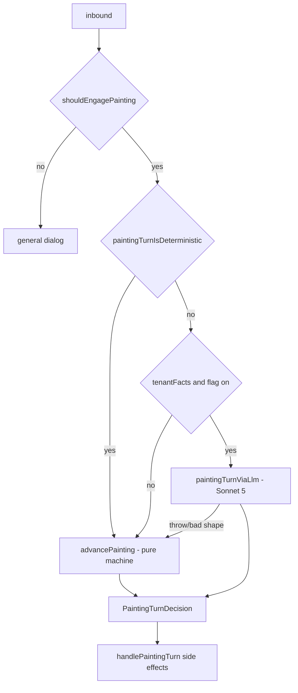

# Painting Receptionist

The residential-painting SMS flow. One of the four receptionists that live inside
`app/api/sms/inbound/route.ts`; see [[SMS Inbound Route]] for how the route picks
between them and [[SMS Channel Overview]] for the channel as a whole. Its twin is
[[Roofing Receptionist]] — the two are deliberately mirrored, and most of the
comments in the painting modules are written as "the roofing twin does X, painting
did not, here is the incident".

The money contract this flow ends in is documented separately in
[[Painting Auto-Send and Release Gates]]. Read that one before touching anything
that sends a quote.

## ⚠ Drift: the whole in-app receptionist is off by default

`app/api/sms/inbound/route.ts:1668` reads:

```
const RECEPTIONIST_ENABLED = process.env.SMS_RECEPTIONIST_ENABLED === '1'
```

and the `POST` handler returns an empty-TwiML `200` before doing anything at all
when that flag is unset (`route.ts:1672-1689`). The comment block at
`route.ts:1644-1667` states the in-app receptionist was **retired 2026-08-05**:
every tenant-owned number is meant to point at a separate Front Desk service
(`qm-front-desk` → `qm-<trade>-receptionist` on Railway), and the logged
`expected_webhook` is `https://qm-front-desk-production.up.railway.app/api/sms/inbound`
(`route.ts:1686`). The code here is retained as the **rollback path**: restoring it
needs both `SMS_RECEPTIONIST_ENABLED=1` **and** repointing the Twilio numbers.

`CLAUDE.md` and `docs/strategy.md` (v17, v21) describe this receptionist as the
live customer-facing path with `SMS_LLM_RECEPTIONIST_ENABLED` default-on. That is
now one layer down: the flag still governs *which brain answers a turn* if the
route runs at all, but the route itself is default-off. Everything below documents
the code as written, because it is the rollback target and because the extracted
Front Desk services were built from it.

## Where the flow lives

| Concern | File |
|---|---|
| Pure per-turn decision | `quotemate-automation/lib/sms/painting-receptionist.ts` |
| Slots, steps, parsers, readiness | `quotemate-automation/lib/sms/painting-intake.ts` |
| Every outbound string | `quotemate-automation/lib/sms/painting-compose.ts` |
| Estimate → save → send → notify | `quotemate-automation/lib/sms/painting-estimate-dispatch.ts` |
| LLM turn + tool mapping | `quotemate-automation/lib/sms/llm-receptionist.ts:1475` (`paintingTurnViaLlm`) |
| I/O, persistence, notifies | `handlePaintingTurn`, `app/api/sms/inbound/route.ts:1215-1642` |

The split is strict: `painting-receptionist.ts` is pure and fully unit-tested
(`painting-receptionist.test.ts`), and the route owns every side effect — minting
the form token, running the estimate, persisting `painting_state`, dispatching SMS
(`painting-receptionist.ts:24-25`).

## Engagement — when painting takes the turn

The route reaches painting only after the roofing handler has declined
(`route.ts:2667-2704`), and only when the tenant actually holds the trade:

```
const paintingEnabled = tenant ? tenantHasFeature(tenant.trades, 'painting') : SMS_PAINTING_ENABLED
```

(`route.ts:2676-2678`) — the env flag `SMS_PAINTING_ENABLED` is only the
no-tenant fallback. `inflightContinuation` also suppresses the handler.

`shouldEngagePainting` (`painting-receptionist.ts:451-476`) then decides, on four
inputs:

1. `declined_trades` contains `'painting'` → **never** engage again on this thread
   (`:463`). Set by the LLM layer's `hand_to_other_trade`.
2. `canResume = isActivePaintingFlow(prev) && !followupPinActive` — an active flow
   resumes, unless the tradie has pinned a follow-up on a *different* quote, in
   which case a stale `painting_state` must not wake up (`:464`).
3. `isNewEnquiry = !generalMidGather && looksLikePaintingEnquiry(inbound)` (`:474`).
   The `generalMidGather` gate is the hijack fix: a fresh painting keyword must
   **not** outrank a gather already in progress on the electrical/plumbing dialog.
   The comment at `:465-473` is explicit that painting has *no* `namesOtherTrade`
   escape hatch, so once it wrongly engages a live electrical thread the customer's
   corrections are parsed as failed painting answers.
4. Otherwise: return `false`, and the route falls through to the general dialog.

`looksLikePaintingEnquiry` (`painting-intake.ts:134-154`) has two carve-outs worth
knowing: any message mentioning `roof` is left to roofing (`:138`, so "paint the
roof" is roofing and "paint the house" is painting), and the bare capability
question ("do you do painting?") is handed to the general dialog rather than
starting an intake — a live 2026-07-25 incident where "You do paint?" minted a form
link (`:139-150`).

⚠ This is the mirror-image of the roofing capture bug `CLAUDE.md` documents: the
roofing handler runs first and resumes on `isActiveRoofingFlow` alone, so on a
multi-trade tenant an open roofing thread swallows the turn before painting is
ever consulted.

## Which brain answers the turn



`paintingTurnIsDeterministic` (`painting-receptionist.ts:126-132`) pre-empts the
model on exactly two turns regardless of the flag:

- **the opener** (`!isActivePaintingFlow(prev)`), so `buildPaintingFormOffer` — the
  form link *and* "or just reply here" — goes out identically on both paths;
- an explicit "use the form" reply parked at `offer_form`, which must resolve to
  `await_form` with the standard acknowledgement.

Everything else goes to `claude-sonnet-5` when `llmReceptionistEnabled(tenantId)`
and `tenantFacts` are both present (`route.ts:1250-1253`). Any throw, timeout, bad
shape or grounding violation falls back to `advancePainting` **for that turn only**
(`llm-receptionist.ts:1502` `fallback: () => advancePainting(...)`). See
[[LLM Receptionist]] and [[Grounding and Safe Replies]].

### LLM tool → decision mapping

`mapPaintingTool` (`llm-receptionist.ts:1523-1650`) is the only place a model
output becomes an action:

| Tool | Decision |
|---|---|
| `ask_for_detail` | `ask` at `nextPaintingStep(slots)` |
| `answer_business_question` | `ask`, step **held** where it was |
| `deflect_and_notify` | `ask` held, reply from `composeDeflect` |
| `hand_to_other_trade` | `passthrough` with `close: true` |
| `end_conversation` | `ask` at `closed` |
| `verify_address` | `ask`/`confirm_address`, or carries on if already confirmed |
| `price_painting` | `estimate`, or `inspection`, or the next `ask` |
| `book_inspection` | `booking` (yes/no), else a bounded re-ask |
| `measure_and_price_roof`, `send_saved_quote` | `null` — wrong trade |

Three code-owns-it corrections sit in that mapper because the model cannot be
trusted with them:

- **floor-area skip** (`:1553-1560`): `applyPatch` drops null patch values, so a
  "not sure" at `floor_area` left the slot `undefined` and the question re-asked
  forever. Code folds `parseFloorAreaM2(inbound)` instead — and deliberately
  **excludes** `verify_address`, because an address correction's street number
  would read as a plausible m² and silently override the footprint lookup.
- **already-confirmed address** (`:1585-1595`): roofing had this guard since
  2026-07-26, painting never did, so the model could un-confirm a settled address
  and re-ask the read-back on any turn.
- **`book_inspection` budget** (`:1512-1517`): only a booking answer spends
  `booking_reask`; a greeting never books however many re-asks have happened.

## The steps

`PaintingStep` (`painting-intake.ts:90-121`) is both the gather cursor and the
lifecycle state persisted on `sms_conversations.painting_state`.

| Step | Question / meaning |
|---|---|
| `address` | property address incl. suburb + postcode |
| `confirm_address` | read-back, "is that right?" |
| `location` | postcode + state, only if not in the address line |
| `scopes` | interior walls / ceilings / trim / exterior |
| `coats` | 1 refresh, 2 standard, 3 premium |
| `condition` | sound / minor / bare / **poor** |
| `ceiling_height` | standard / high / **raked** / **extra_high** (or metres) |
| `storeys` | single / double / **3+** |
| `floor_area` | optional m², asked once; "not sure" = skipped |
| `colour_change` | "Last one — are you changing the colour?" |
| `ready` | enough gathered → estimate |
| `inspection` | a declared trigger forces a site visit |
| `offer_form` | form link sent, awaiting a choice |
| `await_form` | customer chose the form; quote arrives out of band |
| `await_booking` | awaiting "yes, book the measure" |
| `quoted` | quote sent, thread stays warm |
| `closed` | cancelled or booked |

The exact question strings are in `QUESTIONS` (`painting-intake.ts:521-541`) —
dropdown options are inlined in the question text, so the customer never needs the
form to answer.

**Inspection triggers** (`paintingReadiness`, `:503-519`, and `nextPaintingStep`,
`:549-592`): `condition === 'poor'`, `ceiling_height === 'raked'`,
`ceiling_height === 'extra_high'`, `storeys === 3`. `nextPaintingStep`
short-circuits the moment one appears rather than finishing the gather. Note the
tri-state on `manual_floor_area_m2`: `undefined` = not asked, `null` = asked and
skipped (`:511-512`, `=== undefined, NOT == null`).

## The turn machine

`advancePainting` (`painting-receptionist.ts:177-347`) in order:

1. **stop/cancel first**, at any step (`:185`). `isStopRequest`
   (`painting-intake.ts:179-184`) carves out `STOP_OUTCOME` — "stop the leak" is an
   outcome the customer wants, not an opt-out — and treats explicit frustration as
   a stop. A bare "no" is *not* a stop, because it is a valid confirm answer.
2. **`await_booking`** (`:194-204`): a correction to the slot that *caused* the
   inspection is not consent. `correctInspectionSlot` (`:151-162`) re-parses only
   `storeys` and `condition`, strips `not <word>` clauses so "sound not poor" takes
   the kept value, and re-prices. Live 2026-08-05: "3" storeys routed to inspection,
   the customer replied "Oh sorry its 1 storey only", it was read as consent and a
   painter was promised for a job that no longer needed a visit.
3. **`offer_form`** (`:207-214`): `customerWantsForm` (`:111-116`) needs an
   explicit form cue and no decline; a bare "yes" deliberately starts Q&A instead,
   and a decline that already carries an address captures it
   (`captureOpeningAddress`, `:138-142`).
4. **`await_form`** (`:217-219`): they were sent the form and are texting anyway →
   switch to Q&A.
5. **`quoted`** (`:224-227`): a warm thread. Only a fresh painting enquiry reopens
   (re-offering the form with empty slots); anything else is `passthrough` — never
   trapped, never re-quoted.
6. **opener / `closed`** (`:232-235`): offer the form if it reads like painting,
   else passthrough.
7. **gathering** (`:241-344`), in this deliberate order:
   1. a clear street address **anywhere** wins first, before any interrupt word
      (`:252-266`). Once `address_confirmed`, only an explicit correction cue or a
      leading negation over a real street re-folds it — a bare restatement inside a
      step answer must not clobber it.
   2. a rejected read-back with no replacement consumes the shared budget
      (`:275-284`).
   3. a **question** or a topic switch / interrupt bails to the general dialog
      *before* the parser can mis-commit it (`:295-302`). `scopes` is excluded
      because "also"/"as well" are idiomatic scope enumerators — it bails *after*
      the parse instead (`:340-343`).
   4. parse the step; an unparseable address, or a read-back answered with neither
      yes nor no, consumes the budget with different wording (`:310-335`).

### The address-confirm loop budget

`addr_confirm_rejects`, `addr_confirm_misses` and `addr_verify_misses` all ride in
`painting_state` jsonb (`painting-intake.ts:64-74`). The comment is blunt: painting
had **neither** counter, so the bound could never fire on the trade the incident
actually happened on — each rejection cleared the address, we re-asked, forever,
and nobody was ever handed the lead. The shared consumers are
`consumeAddressRejection` / `consumeAddressMiss` in `lib/sms/verify-address.ts`
(spec `specs/address-confirm-loop.md` req 1, 2, 4, 5).

When the budget is spent the decision carries `handoff: true`
(`painting-receptionist.ts:87`), and **the route must notify the tradie on it** —
the reply promises the customer a human. `route.ts:1599-1605` does that via
`notifyUnansweredQuestion`.

Two backstops in the route re-assert this even when the model drove the turn:

- `route.ts:1320-1348` — a rejection of the address read-back that was **not**
  consumed is forced through the budget. Keyed on the *transcript*
  (`lastOutboundAskedAddress`), not on `last_step`, because the incident state was
  `last_step = 'coats'` and a step-keyed guard was dead code there.
- `route.ts:1354-1381` — `dedupeConsecutiveReply` prefixes (never drops) a
  byte-identical repeat and logs at error level.

### Re-estimate guard

`route.ts:1287-1306`. With the LLM driving, `turn.decision` was taken verbatim, so
nothing stopped a second `estimate` on a thread that already holds a quote — the
roofing twin minted four measurement rows for one property in eight minutes. The
guard is keyed on **same property** (`normPaintAddr` of `prevState.slots.address`
vs the decision's, plus a `pending_quote_token`), not on `last_step`, because the
step a re-estimate leaves is not `quoted`. A *different* address is untouched: a
second property is a real job.

**Invariant.** Deciding to SPEND is not a conversational judgement, so it is never
the model's to make (`route.ts:1282`).

## Persistence and lifecycle

`nextPaintingConversationState` (`painting-receptionist.ts:381-401`) maps decision
→ persisted step. The route's `persist` closure (`route.ts:1382-1417`) merges
`declined_trades` and `booking_reask` forward over every branch's explicit write,
deletes `booking_reask` when the step leaves `await_booking`, and — critically —
**checks the write's `error`**:

> supabase-js RESOLVES `{data, error}` on failure — it does not throw, so the
> try/catch below never saw a rejected write. Every bound this flow owns
> (`addr_confirm_rejects`, `addr_confirm_misses`, `addr_verify_misses`,
> `booking_reask`) rides in this jsonb: a silently-dropped update restarts every
> counter at zero next turn, which is precisely how a bounded loop keeps not
> ending. — `route.ts:1397-1402`

The same rule applies to the outbound `sms_messages` insert (`route.ts:1369-1379`),
because the repeat backstop reads that history on the next turn.

**Staleness.** `PAINTING_STALE_IDLE_MS` is 60 minutes (`:415`), and only the
`quoted` step is stale-replayable (`PAINTING_STALE_REPLAY_STEPS`, `:421`).
`await_form`, `await_booking` and mid-gather must survive idle so a genuine late
reply still lands. `expireIdlePaintingState` (`:427-442`) returns a closed state
that **keeps `declined_trades`** — a refusal outlives the gather it interrupted.
The route applies it at `route.ts:2071-2082`.

## What the route does per decision

| Decision | Route behaviour (`route.ts`) |
|---|---|
| `passthrough` | return `false`; persists `closed` only when `close` or the thread was `quoted` (`:1501-1509`) |
| `cancel` | `composePaintingCancel`, persist `closed`/`done` (`:1512-1516`) |
| `booking` | `composePaintingBooking`, persist `closed`/`done`, and on `confirmed` **notify the painter** (`:1519-1530`) |
| `offer_form` | mint a 16-byte hex token, insert `painting_lead_requests`, send `buildPaintingFormOffer`, park at `offer_form` (`:1533-1550`) |
| `await_form` | send the ack, park (`:1553-1557`) |
| `ask` | `screenConfirmAddress` map check on `confirm_address`; persist **then** send; notify on `handoff` or `notify === 'question_asked'` (`:1560-1607`) |
| `inspection` | `buildPaintingInspectionSms`, park at `await_booking` (`:1610-1615`) |
| `estimate` | `estimateAndDispatchPainting` → see below (`:1618-1639`) |

The `booking` notify was added after a live 2026-08-05 miss: painting closed the
thread and told **nobody**, so every "a painter will be in touch shortly" was a
promise made to no one and the lead died silently (`route.ts:1522-1525`). Both
notify closures are wrapped so a notify failure never costs the customer their
reply.

## The estimate hand-off

`estimateAndDispatchPainting` (`lib/sms/painting-estimate-dispatch.ts:37-154`) is
shared with the **voice** path (`runVoiceTradeHandover`) so both run the identical
sequence — see [[Voice Channel (Vapi)]].

1. `toPaintingRequest(slots)` → `null` means an incomplete brief, `ok: false`.
2. `runAndSavePaintingQuote` (see [[Painting Auto-Send and Release Gates]]).
3. **inspection-routed** → send `buildPaintingInspectionSms` with the quote URL,
   park at `await_booking`, keep `pending_quote_token` (`:62-84`).
4. **priced** → `autoSendPaintingQuote`, then `notifyPaintingTradie` with
   `customerTexted: sent`, park at `quoted` (`:86-153`).
5. On `!sent`, a holding SMS (`buildPaintingHoldingSms`) sets expectations without
   leaking a price (`:117-126`).

If the dispatch returns `ok: false` the route sends "our team will confirm your
quote shortly" and closes the thread (`route.ts:1636-1637`).

## Outbound message inventory

All in `lib/sms/painting-compose.ts`:

| Builder | Sent when |
|---|---|
| `buildPaintingFormOffer` (`:66`) | opener — form link **and** "or just reply here" |
| `buildPaintingQuoteSms` (`:81`) | priced auto-send: tiers, `/q/paint/<token>`, PDF, the one `$99` link |
| `buildPaintingInspectionSms` (`:124`) | inspection route — no price, reason, "reply YES" |
| `composePaintingBooking` (`:140`) | answer to "shall we book?" |
| `composePaintingCancel` (`:147`) | stop / cancel |
| `buildPaintingFormThankYou` (`:152`) | self-serve form submit |
| `buildPaintingHoldingSms` (`:162`) | ⚠ now the **error** fallback — a send that failed |
| `buildPaintingTradieNotification` (`:180`) | tradie alert; `customerTexted: false` says in plain words the customer got nothing |

The quote SMS carries exactly one payment link:
`{appUrl}/r/paint/{token}/inspection` — the flat refundable site visit, worded
identically to roofing's so the two trades promise the same thing
(`painting-compose.ts:106-112`). The per-tier 30% deposit links this message used
to carry are retired. See [[What the Customer Pays by Trade]] and
[[Mint Routes and Guards]].

## Open questions

- The Front Desk services (`qm-front-desk`, `qm-<trade>-receptionist`) are not in
  this repository. Whether the extracted painting receptionist there is a copy of
  these modules or a re-implementation is not determinable from this codebase.
- `SMS_PAINTING_ENABLED`'s default is set outside the excerpts read here; it only
  matters on a tenant-less inbound.

## Related

- [[Painting Auto-Send and Release Gates]]
- [[SMS Inbound Route]]
- [[Roofing Receptionist]]
- [[LLM Receptionist]]
- [[Grounding and Safe Replies]]
- [[Painting]]
- [[SMS Channel Overview]]
- [[Known Debt Register]]
