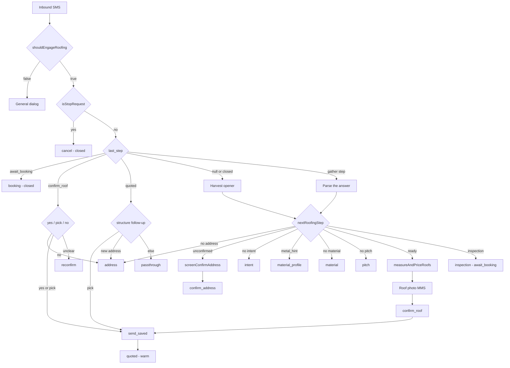

# Roofing SMS Flow Steps

Every step of the roofing SMS conversation, in the order a customer walks it, with the
function that performs it and the `roofing_state` key it writes. The decision layer,
`shouldEngageRoofing`, and the known blockers are in [[Roofing Receptionist]].

Ten steps: engage → address → map verify → confirm address → intent → material →
Colorbond profile → pitch → measure and price → photo → confirm roof → priced SMS.

## The persisted state

One jsonb column: `sms_conversations.roofing_state`. Shape is
`RoofingConversationState` (`quotemate-automation/lib/sms/roofing-receptionist.ts:57-92`):

| Key | Written by | Meaning |
|---|---|---|
| `slots` | `applyRoofingAnswer`, `tryAddressFold`, `crossStepFold`, `screenConfirmAddress` | the gathered brief (`RoofingSlots`, `roofing-intake.ts:36-76`) |
| `last_step` | `nextRoofingConversationState` (`:927`) + route overrides | the step we asked about last turn; `null` = cold |
| `pending_quote_token` | route only (`route.ts:938`, `:1031`) | `roofing_measurements.public_token` this thread is parked on |
| `pending_lead_measure_token` | route only (`route.ts:1194`) | `measure_token` of an **unmeasured** lead row — tradie-facing, never served to a customer |
| `pending_structure_count` | route only | how many structures were measured, so a numbered pick can be validated |
| `last_served_structures` | route (`:1035`) | 1-based indices already sent, so "the others" can compute the complement |
| `declined_trades` | LLM receptionist via `TurnCarry` | trades refused in this conversation; checked first in `shouldEngageRoofing` |
| `booking_reask` | `roofingTurnViaLlm` (`llm-receptionist.ts:1035`) | bounded at one re-ask of an unclear booking reply |

`slots` fields worth naming: `address`, `postcode`, `state`, `address_confirmed`,
`addr_verified`, `addr_verify_misses`, `addr_confirm_rejects`, `addr_confirm_misses`,
`material`, `pitch`, `intent`, `year_built`, `metal_hint`, `commercial`, `misses`.

**Invariant:** every counter this flow owns (`misses`, the three `addr_*` budgets,
`booking_reask`) rides in this one jsonb. A silently dropped update restarts every counter at
zero next turn, which is exactly how a bounded loop keeps not ending — which is why the route
checks `persistError` explicitly (`route.ts:722-729`); supabase-js **resolves** `{data, error}`
on failure rather than throwing.

## State machine

## Step 0 — Engage

| | |
|---|---|
| Function | `shouldEngageRoofing` (`roofing-receptionist.ts:1046`) |
| Called from | `handleRoofingTurn` (`route.ts:513`) |
| Writes | nothing |

Before it runs, two things shape the input:

- `roofingTurnInput(prevLastStep, turns)` (`:510`) splits the coalesced burst into two
  strings. `engage` is the **whole burst** so a multi-message opener is seen whole;
  `decision` is the whole burst only on a cold start or while awaiting the address, and the
  **newest line alone** on an active flow — otherwise a stray digit in an earlier burst line
  hijacked a structure pick and a deny token flipped a booking.
- `seedRoofingSlots(prevSlots, generalAddress)` (`roofing-intake.ts:571`) seeds a **cold**
  flow only, from the general dialog's address — and the route strips `from_memory` slots
  first (`route.ts:2622-2635`), because those come from the `customers` row keyed on phone
  number alone and could carry a suburb from an unrelated job.

Returning `false` returns `false` all the way out of `handleRoofingTurn`, and the general
dialog takes the turn.

## Step 1 — Address capture

| | |
|---|---|
| Question | "Happy to sort a roofing quote for you. What's the property address, including suburb and postcode?" (`roofing-intake.ts:723`) |
| Parser | `extractStreetAddress` (`roofing-intake.ts:524`) via `applyRoofingAnswer(slots,'address',msg)` (`:606`) |
| Writes | `slots.address`, `slots.postcode`, `slots.state`, `slots.address_confirmed = false`; `last_step = 'address'` |
| Budget | `missBudget('address') = 3` (`roofing-receptionist.ts:271`) — one more than every other step |

`extractStreetAddress` takes everything from the **first street number** onward, so "Address
is 31 greens rd coorparoo" stores "31 greens rd coorparoo". The street number is also the
validity test: "Address above postcode 4151" has a postcode but no street number and is
rejected. Whitespace is collapsed first (`:527`) — a wrapped two-line SMS lost everything
after the first line and "15 schfofieod\nDrive" was stored, confirmed and measured as
"15 schfofieod".

An unparsed answer does not store junk: `advanceRoofing` returns `addressRetry(misses)`
(`:132`), two **different** wordings so the second re-ask is not byte-identical. At three
misses the decision becomes `inspection` with reason "we couldn't confirm the property
address" (`:891`) — address is the one step whose budget exit is a handoff rather than an
`'unknown'` sentinel, because with no address there is nothing to measure and nothing to put
on a job sheet.

Cold openers are harvested rather than asked twice: the `else` branch at `:850-921` pulls
intent, address, material (or `metal_hint`), commercial, pitch and year from the opening
message. Everything harvested is still read back once, so a mis-parse costs one "no".

## Step 2 — Map verification

| | |
|---|---|
| Function | `screenConfirmAddress` (`verify-address.ts:672`), awaited inline at `route.ts:862` |
| Providers | Google Address Validation (`verifyWithGoogle`, `:150`) then Geoscape G-NAF (`lookupGeoscapeAddress`, `:211`); `suggestAuAddress` (`:299`) on a miss |
| Writes | `slots.address` (normalised), `slots.postcode`, `slots.state`, `slots.addr_verified`, `slots.addr_verify_misses` |

Runs **before** the read-back goes out, on every turn whose step is `confirm_address` and
which is not an answering turn (`answeringTurn`, `route.ts:861`).

Two sources because neither alone is enough: Google catches typos but **echoes** a suburb it
could not confirm; Geoscape is the authoritative AU register **and the exact source
`measureAndPriceRoofs` resolves the parcel against**, so agreeing with it means the address
the customer says yes to is the address that gets measured.

**Money-path guard** (`verify-address.ts:130-137`): Geoscape `/addresses` is a fuzzy top-1
match with no score — "223 Archer Street, Chandler QLD 4155" returns "33 ARCHER ST, GUMDALE".
A street-number disagreement is a **refusal**, not a suggestion.

`addr_verified` caches the exact verified string so re-entering the step does not call the
API again (`:679`). `consumeAddressRejection` clears it (`:614`) — leaving it behind would
re-bless the address the customer just refused.

Outcomes (`planConfirmAddress`, `:533`):

| Plan | Reply | Step |
|---|---|---|
| `confirm` | `confirmAddressQuestion` — two wordings, "closest address I can find" when corrected (`:460`) | `confirm_address` |
| `reject` + suggestion | `addressSuggestionQuestion` (`:521`) | `confirm_address` |
| `reject`, no suggestion | `addressNotFoundReply` (`:466`) | back to `address` |
| `reject` at budget | `addressHandoffReply` (`:527`), `handoff: true` | `await_booking` + tradie notify (`route.ts:872-881`) |
| `keep` | API unavailable — plain read-back, lead never dead-ended | unchanged |

⚠ All three provider calls use a bare `fetch` with **no `AbortSignal` and no timeout**
(`:166`, `:224`, `:314`), inline in the SMS turn. See [[Roofing Receptionist]] blocker 7.

## Step 3 — Confirm address

| | |
|---|---|
| Question | `Just to confirm, the property is "X". Is that right? Reply yes or no.` (`roofing-intake.ts:753`) |
| Parser | `applyRoofingAnswer(slots,'confirm_address',msg)` (`:617-655`) |
| Writes | `slots.address_confirmed`, or clears `address`/`postcode`/`state`/`addr_verified`; `addr_confirm_rejects`, `addr_confirm_misses` |

Answer precedence inside `applyRoofingAnswer`, in order:

1. a **bare postcode** completes the read-back address instead of answering it (`:620`)
2. a **new street address** is a correction, checked before yes/no (`:630`)
3. `isAffirmative && !rejectsReadBack` → `address_confirmed = true` (`:641`)
4. `rejectsReadBack` → clear the address and re-ask (`:644`)

`rejectsReadBack` (`:448`) is `isNegative || NEGATION_CUE` — the cue exists because "not quite
right" / "isn't right" carry an affirm token but no deny token, and on 2026-07-24 they
confirmed and measured the wrong roof.

`deEmphasise` (`:468`) collapses runs of 3+ so "Noooo" parses as a deny. Before it, the
elongated rejection parsed as neither, nothing cleared the address, `address_confirmed` was
already `true` from an earlier turn, and `nextRoofingStep` went straight to `ready` and
measured the roof the customer had rejected three times (2026-08-07, QM Sparky).

`isGreetingOnly` is deliberately **not** honoured at this step (`roofing-receptionist.ts:796`):
the free re-ask there is a verbatim repeat of the read-back with no budget spent, which is
the loop itself. It falls through to `addressRecheckQuestion` (`verify-address.ts:479`),
which asks the same thing in different words and escalates.

U5c ("no wait yes" should confirm) was attempted and **reverted** — the note at
`roofing-intake.ts:481-489` records that three adversarial reviews each proved every
last-signal heuristic false-confirms a real rejection on the wrong-roof money path.
"no wait yes" safely re-asks.

## Step 4 — Intent

| | |
|---|---|
| Question | "What do you need done? A full re-roof, a repair or patch, a leak traced, or gutters and downpipes?" (`roofing-intake.ts:725`) |
| Mapper | `mapIntent` (`:371`) |
| Writes | `slots.intent`; `last_step = 'intent'` |

Maps to `full_reroof`, `leak_trace`, `gutter_replace`, `ridge_cap`, `flashing_repair`,
`patch_repair`. Verb **stems**, never `\breplace\b` — "Roof replacement" and "replacing" read
as unrecognised and re-asked the same question until that was fixed. `re[-\s]?roof` covers
the space form voice STT produces.

At `missBudget('intent') = 2` the slot is set to `'unknown'`, and `nextRoofingStep` (`:764`)
routes to inspection with "we couldn't confirm what work is needed" — the pricer has no rule
for an unknown intent and would silently price whatever the tiers default to.

## Step 5 — Material

| | |
|---|---|
| Question | "What's the roof made of? For example Colorbond or metal, concrete or terracotta tiles, or fibro / cement sheet." (`roofing-intake.ts:726`) |
| Mapper | `mapMaterial` (`:319`), plus `isAmbiguousMetal` (`:311`) |
| Writes | `slots.material` or `slots.metal_hint`; `last_step = 'material'` |

Order inside `mapMaterial` matters:

1. `UNSURE` → `'unknown'`
2. asbestos-suspect (`asbestos|fibro|cement sheet|super six|fibrolite|ac sheet`) →
   `'cement_sheet'` — **safety wins over any metal or tile token**
3. materials with no rate card (`slate|shingles|asphalt|shake|thatch|polycarbonate|fibreglass`)
   → `'unknown'`, which routes on site rather than guessing the nearest priced material
4. named profiles → `colorbond_kliplok` / `colorbond_spandek` / `colorbond_corrugated` /
   `colorbond_trimdek`. "Iron" and "galv" map to corrugated — AU vernacular
5. **bare "Colorbond" / "metal" / "tin" returns `null`** so the profile question is asked.
   It used to return Trimdek, quoting a roof the customer never described
6. `terracotta` → `terracotta_tile`; generic "tiles" → `concrete_tile` (the AU default)

`answerLanded` (`roofing-receptionist.ts:278`) counts `metal_hint === true` as a landed answer
(`:299`) — "it's Colorbond" was understood, we just need to know which, and counting it as a
miss burnt the budget on an answer we did understand.

## Step 6 — Colorbond profile

| | |
|---|---|
| Question | "Righto — which Colorbond profile is it? Corrugated (the classic wavy sheets) or Trimdek (flat panels with square ribs)? If you're not sure, just say so and we'll check it on site." (`roofing-intake.ts:727`) |
| Entry | `nextRoofingStep`: `!slots.material && slots.metal_hint` (`:770`) |
| Writes | `slots.material`, clears `metal_hint`; `last_step = 'material_profile'` |

`applyRoofingAnswer` for this step (`:672-683`) **always resolves**: a named profile, or
`'unknown'` on the second go. It never guesses between two differently priced sheets —
corrugated and Trimdek are $90 vs $95/m² and look nothing alike. `'unknown'` routes to
inspection at `nextRoofingStep:767`.

## Step 7 — Pitch

| | |
|---|---|
| Question | "Roughly how steep is the roof? Flat, standard, or steep?" (`roofing-intake.ts:729`) |
| Mapper | `mapPitch` (`:349`) |
| Writes | `slots.pitch`; `last_step = 'pitch'` |

An explicit angle is classified by the pricer's own boundaries via `pitchBucketFromDegrees`
(imported from `lib/roofing/pricing`) — one source of truth for what "25 degrees" means.

Negation is checked **before** the steep stem (`:359`) or "not too steep" matched the bare
word and priced fall protection twice. The steep test is a stem (`steep\w*`) so "steeper than
normal" cannot fall through to the standard rule and match "normal".

`very_steep` or `unknown` routes to inspection (`nextRoofingStep:775`).

## Readiness

`roofingReadiness` (`roofing-intake.ts:716`) and `nextRoofingStep` (`:744`) are the gate.
Required: confirmed address, intent, material, pitch. Inspection short-circuits, in the order
`nextRoofingStep` checks them:

| Condition | Reason string |
|---|---|
| `slots.commercial` | "commercial roofs are quoted on site" |
| `intent === 'unknown'` | "we couldn't confirm what work is needed" |
| `material === 'cement_sheet'` | "cement sheet or fibro roofs may contain asbestos" |
| `material === 'unknown'` | "we couldn't confirm the roof material" |
| `pitch === 'very_steep' \|\| 'unknown'` | "the roof pitch is steep or unknown" |

`looksCommercial` (`:194`) matches warehouse, factory, industrial, strata, body corporate,
apartment block, shopping centre, childcare, school, church, hangar — the residential rate
card and per-building measure do not apply.

A brief-routed inspection with an incomplete slot set never reaches the measure call: the
route checks `!toRoofingRequest(decision.slots)` at `route.ts:1102` and sends
`composeInspectionReasonMessage` (`roofing-compose.ts:299`), so the customer hears the real
reason rather than the untrue "I couldn't pull an automatic measurement".

## Step 8 — Measure and price

| | |
|---|---|
| Function | `measureAndDispatchRoofing` (`roofing-measure-dispatch.ts:88`), called at `route.ts:1114` |
| Engine | `measureAndPriceRoofs(address, inputs, { rateCard })` — see [[Roofing]] |
| Writes | a `roofing_measurements` row; `last_step = 'confirm_roof'`, `pending_quote_token`, `pending_structure_count` |

Sequence inside `measureAndDispatchRoofing`:

1. `toRoofingRequest(slots)` (`roofing-intake.ts:794`) — null means incomplete, `ok: false`
2. `loadTenantRoofingPricingContext(supabase, tenantId, tenantTrade)` — null means
   "tenant roofing pricing setup required". ⚠ `tenantTrade` is `tenants.trade`, **not** the
   literal `'roofing'`: a cross-trade tenant keeps its roofing card on its primary-trade
   `pricing_book` row (Atomic Electrical's sits on `electrical`)
3. `measureAndPriceRoofs` — Geoscape primary, per [[External Services and Integrations]]
4. `newMeasurementTokens()` mints the **pair**: customer `public_token` (`/q/roof/...`) and
   tradie `measure_token` (`/m/...`)
5. `pricing_authority` is stamped onto the quote
6. when `isInspection`, `routing` is overwritten to `inspection_required` with the gate's own
   reason
7. insert into `roofing_measurements` — `structure_count`, `combined_area_m2`,
   `combined_better_inc_gst` (solar-adjusted via `applySolarToTiers`), `structures`, `quote`
8. `sendRoofPhotoMms` (step 9)
9. the confirm or inspection SMS

Any failure returns `{ ok: false }` and the route falls to the unavailable path
(`route.ts:1129-1197`): it **inserts an unmeasured lead row** (`structure_count: 0`,
`routing: 'inspection_required'`), keeps only `pending_lead_measure_token`, sends
`composeMeasureUnavailableMessage` and parks at `await_booking`.

**Invariant:** `pending_quote_token` stays **null** on that path deliberately —
`/q/roof/[token]` is headlined "Your roof, measured", which this lead is not. The tradie link
uses `pending_lead_measure_token` so the booking notify points at `/m/<measure_token>` rather
than the bare dashboard. The insert's `error` is checked before the token is kept
(`route.ts:1188`), because supabase-js resolves on failure.

Live case behind this: 223 Archer St, Gumdale — Geoscape resolves the address but holds zero
building footprints, so no measurement is possible at any time. Before 2026-07-23 nothing was
written here at all and the job never reached the tradie's roofing queue.

## Step 9 — Roof photo

| | |
|---|---|
| Function | `sendRoofPhotoMms` (`roofing-measure-dispatch.ts:49`) using `buildRoofPhotoMedia` (`roofing-compose.ts:49`) |
| Media URL | `${baseUrl}/api/roofing/q/${token}/static-map`, plus `?b=N` per structure |
| Writes | `sms_messages` rows bodied `[roof photo] <label>` |

One image for a single building, one per building capped at 3 for several, each centred on
that structure. Captions are the structure labels and are **price-free**.

Uses `sendSms` directly, **not** `dispatchQuoteMessage` — a failure or a non-MMS number means
no photo, never a plain-SMS fallback. Never throws (`:57`, `:76`, `:78`). AU long-code MMS
delivery is unreliable, so the canonical message is always the SMS plus the page link.

## Step 10 — Confirm the roof

| | |
|---|---|
| Message | `composeConfirmMessage` (`roofing-compose.ts:237`) |
| Handler | `advanceRoofing` arm (3) (`roofing-receptionist.ts:586-644`) |
| Writes | `last_step` stays `confirm_roof` on `reconfirm`; `send_saved` moves it on |

Single building: "is this your roof at X? ... Reply YES and I'll send your quote, or NO if
it's the wrong building." Multiple: a numbered list `1) Main dwelling (~180 m²)` with
"Reply YES to quote all of them, the number for just one, or NO if none are right."

The link is the **picker** URL — `pickerUrl` (`:231`) appends `?pick=1`. Without it the page
flips to the narrowed priced view the moment the customer replies, so re-opening the message
showed one building and no way to choose while the message still offered a choice
(reported 2026-07-27).

Reply precedence in arm (3), in order — the order is load-bearing:

1. `isNegative` → reset address and re-ask (`:588`)
2. a **clear new address** (street number **and** postcode) → restart the whole gather
   (`:610`). Checked before the pick parser so "2 Smith St ... 2026" is not read as
   structure 2; the postcode requirement keeps "2 and 3" and "yes, built 1990" out
3. `parseStructureFollowup` when it names **two or more** (`:621`) — running the single-pick
   parser first silently narrowed "2 and 3" to structure 2
4. `parseStructureChoice` (`:625`) — accepts a bare number, `#2`, "number 2", an ordinal,
   "Main", "the big one", or a named secondary ("shed" → 2)
5. `multi === 'all'` (`:630`)
6. `isAffirmative` → serve all (`:635`). An affirmation **wins over** a roofing keyword:
   "yeah do the re-roof" is a yes, not a request to start over
7. `looksLikeRoofingEnquiry` → restart (`:640`)
8. otherwise `reconfirm`

## Step 11 — Priced SMS, quote link, PDF

Handled at `route.ts:930-1096` on `send_saved`.

| Order | What | Function |
|---|---|---|
| 1 | Load the saved measurement by `public_token` | `loadPending` (`route.ts:781`) |
| 2 | Narrow the quote to the picks | `narrowQuoteToStructures` (`roofing-compose.ts:333`) |
| 3 | Build the served URL — `?s=2,3` when narrowed, bare when all | `route.ts:945` |
| 4 | Stamp `confirmed_at`, `confirmed_structure`, `included_indices` | `confirmedIncludedIndices` (`roofing-receptionist.ts:320`) |
| 5 | Regenerate the PDF | `ensureRoofQuotePdf(token, { quote, regenerate: true })` |
| 6 | Resolve the tier mode from `pricing_book.quote_tier_mode` for `trade='roofing'` | `asQuoteTierMode` (`route.ts:1003-1014`) |
| 7 | Send | `buildRoofingReplyMessage` (`roofing-compose.ts:183`) |
| 8 | Persist the step **that follows the message** | `shouldSendRoofInspectionMessage` (`:208`) |
| 9 | Tradie notify — **not** on an inspection-only send | `notifyTradie('quote_sent', ...)` |
| 10 | File-store ingest, then pre-warm the AI "after re-roof" image | `archiveAndIngestQuote`, `generateRoofAfterImage` |

Four invariants live in this block:

- **`included_indices` MUST be written, not left to the `?s=` link.**
  `resolveEffectiveIndices` only ever *narrows*, falling back to main-dwelling-only when
  `included_indices` is NULL, so a bare link cannot express "all". Live 2026-07-22: a customer
  replied YES to 3 buildings, the SMS quoted 2 at $115,117 and the page showed the main
  dwelling alone at $69,652 (`roofing-receptionist.ts:311-319`).
- **The persisted step MUST follow the message just sent**, keyed on the *same* predicate the
  composer used (`shouldSendRoofInspectionMessage`). An inspection-only send ends "Reply YES
  and we'll book a time" — parking that `quoted` made the YES a structure-pick miss →
  passthrough to the electrical LLM, which improvised "you're all booked in" and ran an
  electrical intake on the roofing thread (2026-07-23).
- **PDF regeneration MUST pass `regenerate: true`** — the `-v5` path marker short-circuits, so
  a second confirmed send ("give me 2 and 3") would attach the first pick's PDF while the SMS
  body showed the new numbers.
- **No tradie notify on an inspection-only send** — its combined better tier is $0, so the
  alert read "roofing quote sent at $0 inc GST" while the customer read an indicative $32k
  range. The booking arm sends the real `inspection_booked` notify instead.

The PDF rides along as best-effort MMS media **only** where `quotePdfMmsEnabled()` — on an AU
long code without MMS, Twilio accepts the send, the status sticks at `sent`, and the whole
estimate including the body never reaches the handset. The body's "PDF copy:" link makes the
attachment redundant.

`composeEstimateMessage` (`:97`) lists only the tiers the tenant's mode surfaces, appends the
page link and the PDF link, flags any `inspection_structures` separately, and always closes
"Prices inc GST. A roofer reviews every quote before we book anything."

## Terminal and warm states

| Step | Reachable from | Behaviour |
|---|---|---|
| `quoted` (**warm**) | a priced `send_saved` | a structure follow-up re-serves the SAVED measurement without re-measuring; a new address reopens; anything else is `passthrough` and **closes** the thread |
| `await_booking` | a routed inspection, a spent address budget, an unmeasurable brief | any reply that is not an explicit decline is `confirmed: true` — a question, a proposed time or anything unclear is a live lead |
| `closed` | `cancel`, `booking` | only a fresh roofing enquiry reopens |

The booking rule at `roofing-receptionist.ts:576-583` is deliberate: the old
`isAffirmative && !isNegative` dropped every non-"yes" reply with a dismissive "text us
whenever" and **no tradie notify** (audit 2026-07-23). `isStopRequest` is handled first, so a
genuine opt-out never lands there.

Idle expiry: `ROOFING_STALE_IDLE_MS` is 1 hour (`:954`), against a conversation reuse window
of 4 hours — a customer who walked away starts fresh rather than resuming a previous session's
measurement. `await_booking` is excluded from expiry so a late "yes book it" still books.

## Open questions

- `expireIdleRoofingState` is exported and unit-tested; the call site that supplies `idleMs`
  was not located in `route.ts` during this pass. Worth confirming whether idle expiry is
  actually wired into the inbound path or only exercised in tests.
- Whether the roofing turn writes a `pipeline_traces` row, and under which stage name — see
  [[Observability and Tracing]].

## Related

- [[Roofing Receptionist]]
- [[SMS Inbound Route]]
- [[Roofing]]
- [[Quote PDFs and Reports]]
- [[Quote Pages]]
- [[Tables by Domain]]
- [[Grounding and Safe Replies]]
- [[The Four Pipelines]]
