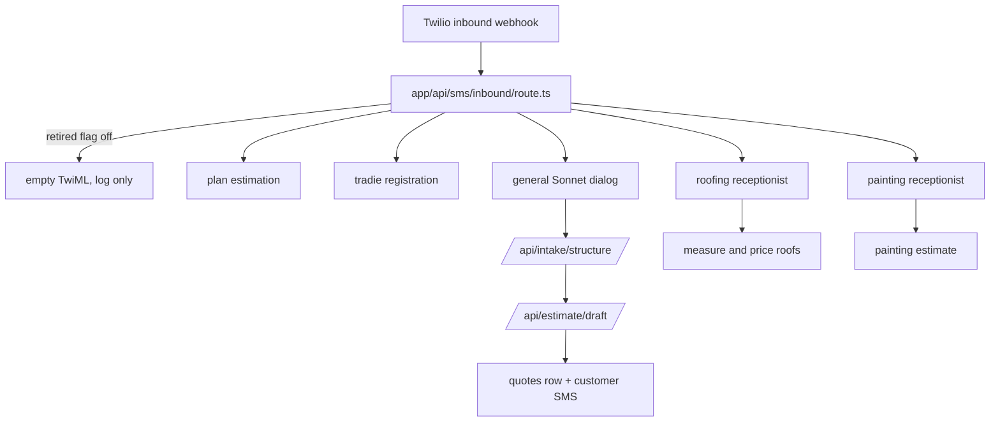

# SMS Channel Overview

SMS is the highest-traffic customer intake channel in QuoteMax. One Next.js route —
`quotemate-automation/app/api/sms/inbound/route.ts`, **4792 lines** — receives every inbound
message from every tenant number, decides which of several receptionists owns the turn, runs
the AI dialog, and dispatches the reply. Everything else in `lib/sms/` (about 60 non-test
modules) exists to be called by that one file.

This note is the map. [[SMS Inbound Route]] is the line-by-line walk of the handler,
[[SMS Dispatch and Twilio]] covers the outbound side, and [[SMS Conversation State]] covers
what is persisted between turns.

---

## ⚠ The headline fact: the in-app receptionist is RETIRED and OFF by default

Before anything else about how the route works: **it does not run in production unless an env
var is set.**

```
quotemate-automation/app/api/sms/inbound/route.ts:1668
const RECEPTIONIST_ENABLED = process.env.SMS_RECEPTIONIST_ENABLED === '1'
```

```
:1673   if (!RECEPTIONIST_ENABLED) {  ...log... return RETIRED_ACK }
```

The comment block at `:1644-1667` records the change (dated 2026-08-05 in the source):

- Every tenant-owned number was repointed at a **Front Desk service** which identifies tenant
  and trade and forwards to a per-trade receptionist service. The route's own log names the
  expected webhook target as a `qm-front-desk-production.up.railway.app/api/sms/inbound`
  endpoint (`:1691`).
- The flag is **default-off deliberately**, so retirement was atomic with the deploy rather
  than depending on someone setting a dashboard variable. An env-var-to-*disable* would have
  left a window where two brains could answer the same customer.
- The code is **kept as the rollback path**. Restoring it needs BOTH `SMS_RECEPTIONIST_ENABLED=1`
  in Vercel AND repointing the Twilio numbers. The flag alone changes nothing while Twilio
  points elsewhere.
- The retired branch answers **200 with empty TwiML**, on purpose: a 4xx/5xx would make Twilio
  retry a stray inbound on a schedule, and a stray here means a misconfigured number, which a
  retry cannot fix. The `console.error` is the alarm.

> ⚠ **Drift.** `CLAUDE.md` and `docs/strategy.md` describe the in-app SMS receptionist as the
> live SMS channel ("Twilio → `/api/sms/inbound`", "four different receptionists"). In the code
> as it stands that route is a **dormant rollback path**. Everything documented in this folder
> is therefore true *of the code*, and is what comes back the moment the flag flips — but do
> not assume a message sent to a tenant number today is executing it. Verify the Twilio
> webhook URL on the number before debugging this route.

The rest of this note documents the route as written, because that is the artefact and the
rollback target.

---

## Handler inventory — who can own a turn

Inside the enabled path there are **six** distinct handlers that can claim an inbound, plus the
general dialog. They are not peers: each is an early return, and the order is fixed.

| # | Handler | Where | Gate | On claim |
|---|---|---|---|---|
| 1 | Plan estimation | `route.ts:1841-1848`, `lib/sms/plan-estimation.ts` | `tenant.sms_estimator_enabled` AND the text asks for a plan take-off | `return ackTwiml()` — inline, before any conversation row |
| 2 | Tradie registration | `route.ts:1866-1870`, `maybeHandleTradieRegistration` at `:4625` | only when **no tenant** resolved for the destination number | returns its own Response |
| 3 | Global opt-out | `route.ts:2522`, `isGlobalOptOut` in `lib/sms/inbound-helpers.ts:43` | whole-message STOP keyword | confirm once, close thread, `return` |
| 4 | Roofing receptionist | `handleRoofingTurn` at `route.ts:459`, called `:2597` | tenant has `roofing` in `trades[]` (else env `SMS_ROOFING_ENABLED`) AND `shouldEngageRoofing` | `return` from `after()` |
| 5 | Painting receptionist | `handlePaintingTurn` at `route.ts:1215`, called `:2681` | `tenantHasFeature(tenant.trades, 'painting')` (else env `SMS_PAINTING_ENABLED`) AND `shouldEngagePainting` | `return` from `after()` |
| 6 | General dialog (electrical / plumbing / everything else) | `decideNextTurn` at `route.ts:3274`, `lib/sms/dialog.ts` | reached only when nothing above claimed the turn | falls through to slot extraction, dialog, dispatch, intake handoff |

Note what is **not** in this list: there is no solar SMS receptionist, no aircon SMS
receptionist and no signage SMS receptionist. "Solar quote please" texted to a solar tenant
reaches the general dialog, which cannot quote solar — [[Solar]] is a web-form pipeline only.

## The model behind all of them

One constant, `lib/sms/model.ts:33`:

```ts
export const SMS_RECEPTIONIST_MODEL = 'claude-sonnet-5'
export const SMS_RECEPTIONIST_MAX_TOKENS = 8192   // :57
```

Three call sites share it — the customer dialog (`lib/sms/dialog.ts`), the slot extractor
(`lib/sms/extract-slots.ts`) and the intent classifier (`lib/sms/intent.ts`). It lives in its
own module because `dialog.ts` already imports `extract-slots.ts`, so hanging the constant on
either would make the other's import circular (`lib/sms/model.ts:9-12`).

`SMS_RECEPTIONIST_MAX_TOKENS` **MUST be passed explicitly at every call site**, and the reason
is documented at `lib/sms/model.ts:35-55`: the pinned `@ai-sdk/anthropic@3.0.71` resolves
per-model limits from a hardcoded table that predates Sonnet 5. The id `claude-sonnet-5`
matches no branch (notably **not** the `claude-sonnet-4-` prefix), so it falls to the
unknown-model default of 4096. Sonnet 5 also runs adaptive thinking when the request omits a
`thinking` field, and this provider version never sends one — so thinking tokens draw from the
same ceiling as the reply. Omitting the value is a correctness bug, not a tuning choice. See
[[Model and Prompt Inventory]].

⚠ The header comment in `lib/sms/model.ts:18-20` still says `SMS_LLM_RECEPTIONIST_ENABLED`
defaults **OFF**. The implementation says otherwise:

```
quotemate-automation/lib/sms/llm-receptionist.ts:104-110
if (/^(0|false|off|no)$/i.test(raw)) return false
if (!raw || /^(1|true|on|yes|all)$/i.test(raw)) return true   // unset ⇒ ON
if (!tenantId) return false
return raw.split(',')...includes(tenantId)                     // CSV ⇒ pilot allowlist
```

Unset means **on**. `0`/`false`/`off`/`no` is the kill switch. A comma-separated list narrows
to named tenant ids. The docstring in `model.ts` is stale; `CLAUDE.md` is correct on this one.

## Grounding: the model never states a number

Every receptionist that runs the LLM path returns a **tool choice**, never prose containing a
figure. `assertGroundedReply` / `enforceDialogGrounding` (`lib/sms/dialog-grounding.ts`) discard
any turn whose text states a price, area, structure count, measured address, quote link or
booking confirmation that no tool produced. On any throw, timeout, bad shape or grounding
violation the route falls back to the pure state machine **for that turn only** — see
`route.ts:497-540` (roofing) and `:1244-1268` (painting). Detail lives in
[[Grounding and Safe Replies]] and [[LLM Receptionist]].

## Numbers, provisioning and the outbound sender

- Tenant numbers are auto-provisioned by `lib/twilio/provision.ts`; the SMS webhook URL is
  written once at provision time by `lib/twilio/set-sms-webhook.ts` and is not re-asserted
  later. That is why a fleet can end up split across two hostnames.
- The route's customer reply always sends **from the number the customer texted**:
  `dispatchQuoteMessage({ to: fromNumber, from: toNumber, ... })` (`route.ts:4166-4170`).
  It does not use `resolveOutboundFromNumber`.
- `lib/sms/outbound-from.ts` is the *other* channels' policy (voice webhook, intake/structure,
  estimate/draft): tenant number wins on every channel; env fallbacks
  (`TWILIO_SMS_NUMBER` for sms, undefined → `TWILIO_PHONE_NUMBER` for voice) apply only to
  legacy tenant-less traffic. It exists because a 2026-07-23 incident sent a voice-fallback SMS
  from a number the customer had never seen.

## Where the channel sits in the platform



The general-dialog branch is the entry to [[The Four Pipelines]] pipeline 1
([[Intake Structuring]] → [[Estimate Engine]] → [[Grounding Validator]] →
[[Routing Decision]]). The roofing and painting branches run their own deterministic pricers
and never touch that chain.

## Reliability posture in one paragraph

The route fast-acks Twilio with empty TwiML and moves all heavy work into `next/server`
`after()` (`route.ts:2424`), with `export const maxDuration = 300` (`:388`). Duplicate
suppression is layered: MessageSid application-level dedupe, a unique partial index catching
the same-millisecond race, an idempotent conversation-create RPC, and a 60s per-conversation
row lock. Delivery is SMS-first with WhatsApp fallback and two levels of retry. Every one of
those has a documented failure mode, and they are set out in [[SMS Inbound Route]] and
[[SMS Dispatch and Twilio]].

## Open questions

- The Front Desk / per-trade receptionist services on Railway (`qm-front-desk`,
  `qm-<trade>-receptionist`) live outside this repository. Nothing in
  `quotemate-automation/` implements them, so their routing, grounding and state model are
  undocumented here.
- Whether `SMS_RECEPTIONIST_ENABLED` is currently set in the Vercel project is not knowable
  from source; check the deployment env, not this repo.

## Related

- [[SMS Inbound Route]]
- [[SMS Dispatch and Twilio]]
- [[SMS Conversation State]]
- [[LLM Receptionist]]
- [[Roofing Receptionist]]
- [[Painting Receptionist]]
- [[Grounding and Safe Replies]]
- [[Environment Variables and Feature Flags]]
