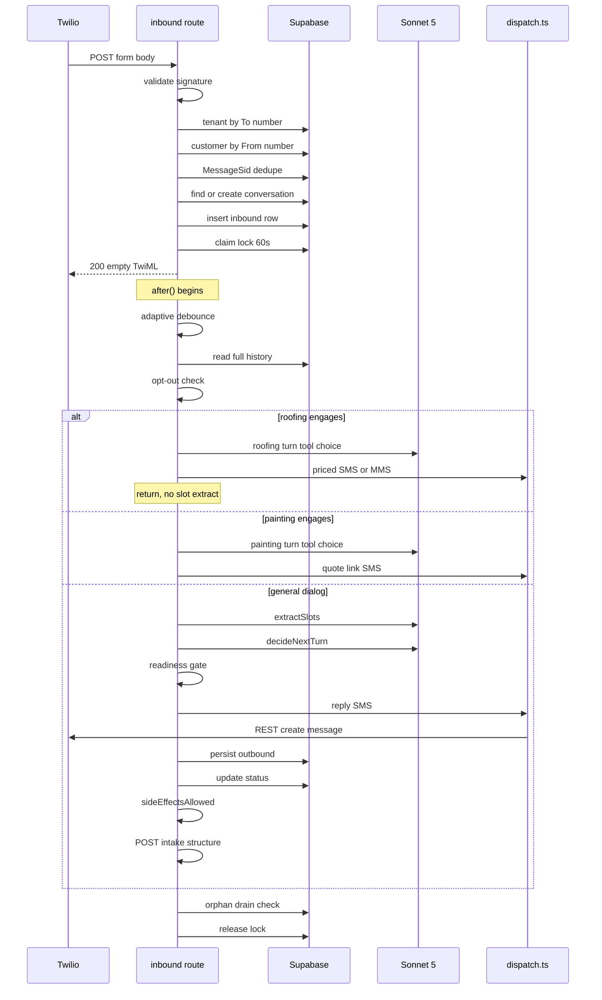

# SMS Inbound Route

`quotemate-automation/app/api/sms/inbound/route.ts` — 4792 lines, one `POST` handler
(`:1672`), two large in-file handlers (`handleRoofingTurn` `:459`, `handlePaintingTurn` `:1215`)
and one tail helper (`maybeHandleTradieRegistration` `:4625`).

All line numbers below were read from the file at the commit in the working tree
(`75a64a40` plus uncommitted work). They are cited because ordering is the whole subject of
this note — the behaviour of this route is almost entirely a function of *which check runs
first*.

> ⚠ Before reading further: this whole handler is behind
> `SMS_RECEPTIONIST_ENABLED === '1'` (`:1668`) and returns an empty-TwiML 200 without doing
> anything when the flag is not set (`:1673-1688`). See [[SMS Channel Overview]].

---

## Phase A — inline (must finish in well under Twilio's timeout)

| Order | Line | What | Early exit |
|---|---|---|---|
| A0 | `:1673` | Retired-receptionist gate. Parses the body only to name the number in the log. | `200` empty TwiML |
| A1 | `:1691-1694` | Read raw body, `parseTwilioForm` into a flat `Record<string,string>` | — |
| A2 | `:1702-1722` | Twilio signature check | `403 Invalid signature` |
| A3 | `:1738-1744` | Field validation, with the media-only carve-out | `400 Missing required Twilio fields` |
| A4 | `:1747-1781` | Tenant lookup by destination number + **status gate** | `200` if tenant not transactable |
| A5 | `:1783-1806` | Customer memory lookup + cross-tenant memory scoping | — |
| A6 | `:1808-1833` | **MessageSid idempotency** | `200` on duplicate |
| A7 | `:1835-1852` | Plan-estimation short-circuit | `200` if handled |
| A8 | `:1854-1871` | Tradie-registration short-circuit (only when **no** tenant) | its own Response |
| A9 | `:1873-2200` | Conversation lookup / classify `inflight` \| `reuse` \| `new` | `500` on DB failure |
| A10 | `:2216-2260` | MMS media fetch + upload to storage |  — |
| A11 | `:2286-2308` | Persist the inbound `sms_messages` row | `200` on 23505, `500` otherwise |
| A12 | `:2311-2362` | **Per-conversation lock claim** | `200` if another webhook holds it |
| A13 | `:2365-2422` | Snapshot closure variables for `after()` | — |
| A14 | `:2424` | `after(async () => { ... })` registered | — |
| A15 | `:4596-4597` | Return empty TwiML ack | `200` |

### A2 — signature validation and the URL reconstruction

`validateTwilioSignature` (`lib/sms/twilio-validator.ts:8`) is a thin wrapper on
`twilio.validateRequest`. It returns **false** when the header is missing and false (with an
error log) when `TWILIO_AUTH_TOKEN` is unset — fail-closed.

The URL fed to it is rebuilt from forwarded headers (`:1703-1707`):

```
x-forwarded-host ?? host, x-forwarded-proto ?? 'https', + pathname + search
```

**Invariant.** The reconstruction MUST happen before validation, because on Vercel `req.url`
can carry an internal deployment URL while the original request hit the production alias.
Signing is over the exact URL Twilio called, so validating against `req.url` silently 403s
every real message on a deployment behind an alias.

### A3 — a media-only message is not an empty message

```
:1738  const inboundNumMedia = Number.parseInt(params.NumMedia ?? '0', 10)
:1741  const inboundBody = inboundRawBody || (inboundHasMedia ? '[photo]' : '')
```

Twilio posts `Body=""` when the customer attaches a photo and types nothing — the single most
natural reply to "send us a photo of the spot". The comment at `:1725-1737` records what that
cost: the old code 400'd here, roughly 480 lines before `NumMedia` is read at `:2221`, so the
media was never fetched, no `sms_messages` row was written, no reply went out, and Twilio
retried into the same 400. The synthetic `[photo]` body keeps the transcript, the dedupe key
and the LLM turn working on text. Related: [[EV Charger Jobs]].

### A4 — the tenant status gate

```
:1766  if (!isTransactableTenantStatus(tenant.status)) { ...warn...; return ackTwiml() }
```

A suspended or still-onboarding tenant's number behaves like a disconnected number: ack Twilio
so it stops retrying, and do nothing else — no customer row, no AI reply. Before this
(audit item US-001, 2026-07-23) status was logged but never gated, and a suspended tenant's
number kept quoting. No tenant match is **fail-soft**: `tenant = null`, warn-level log, and
the legacy single-`pricing_book` path is used (the resulting quote PDF has no logo). See
[[Tenancy Model]].

### A5 — cross-tenant customer memory

`customers` is globally unique by phone and shared by every tenant that number ever texts.
`customerMemoryAllowed(customerRaw.tenant_id, tenant.id)` decides, and
`stripCustomerMemory` withholds the remembered profile at the **single point every downstream
read flows from** (`:1795-1797`). Identity (`id`, phone) is kept so intake/quote linking still
works; name, suburb, address, history are not. Tenant B must not greet tenant A's customer by
name.

### A6 — MessageSid idempotency

```
:1818  select id, conversation_id from sms_messages where twilio_message_sid = ? and direction = 'inbound'
:1824  const dedup = decideSidDedup(messageSid, existingMsg)
:1826  if (dedup.action === 'skip_duplicate') return ackTwiml()
```

`decideSidDedup` (`lib/sms/inbound-helpers.ts:80`) is pure and tested. A **missing** SID falls
through to normal processing rather than failing closed — one stray message beats silently
dropping a real customer.

This is the *application-level* layer. The racy same-millisecond window is caught later by a
unique partial index (migration 004) at the insert, classified by `classifyInboundInsert`
(`inbound-helpers.ts:110`) which maps Postgres `23505` to `ack_duplicate` and anything else to
`db_error`. Both layers are needed; neither is sufficient alone.

### A9 — conversation lookup and the three modes

The prior-conversation query (`:1911-1921`) is scoped by `from_number` **and** by tenant — or
by `to_number` when no tenant resolved. Without that scoping, a customer who texts a plumber
about hot water and later texts a sparky about downlights would reuse the plumbing
conversation and drag `job_type='hot_water'` and its location slots across tenants.

Mode classification (`:1938-1975`), **first matching rule wins**:

| Mode | Rule | Effect |
|---|---|---|
| `inflight` | `isQuoteInflight(prior, ageMs)` — `status='structuring'` AND age < 5 min (`lib/sms/inflight.ts:47`) | dialog still runs, but photo gate, WP9, status write and intake handoff are all skipped |
| `reuse` | `status` in (`open`,`structuring`) and age < 4h (`REUSE_OPEN_WINDOW_MS`, `:1896`), **or** `status='done'` and age < 5 min (`REUSE_DONE_GRACE_MS`, `:1895`) | continue the thread |
| `new` | anything else | idempotent create RPC |

`isQuoteInflight` is `status === 'structuring'` **only**. The docstring in `lib/sms/inflight.ts`
records why `done` was removed on 2026-05-22: the old rule keyed a 60s "quote SMS in transit"
window off `last_message_at`, but *every* message — including the bot's own replies — resets
that column, so once a conversation had ever produced a quote every quick customer reply
registered as in-flight and got a canned hold-on. The conversation oscillated between real
dialog turns and bogus hold-ons.

Three freshness resets run on the `reuse` path, all because the reuse window is 4h:

- **Photo state** (`:2016-2044`) — 15 minutes idle wipes `photo_urls`/`photo_paths`, clears
  `photo_request_sent_at`/`photos_completed_at`, and mints a **fresh** `photo_request_token`.
  Without it a second job silently inherits the first job's photos.
- **Roofing state** (`:2056-2069`, `expireIdleRoofingState`) and **painting state**
  (`:2071-2084`). Live on 2026-07-24: a `confirm_roof` step reused hours later re-sent
  "3 buildings at 670 London Road" on the next "Hi Mate", then again on a new address, then on
  "Hey".

`new` uses the RPC `create_sms_conversation_idempotent` (`:2136`, migration 122), which does a
predicate-qualified `ON CONFLICT DO NOTHING` against a **partial** unique index (at most one
active `customer_quote` conversation per `(from_number, to_number)`) and returns the existing
row on a lost race. `supabase-js`'s `.upsert` cannot infer a partial index — a bare column-list
`ON CONFLICT` is rejected — hence the RPC. If migration 122 is missing the route logs an
`[ALERT]` (`:2166`) and falls back to a plain insert, accepting split-brain risk for
availability. See [[Migrations]].

### A11/A12 — persist BEFORE lock

**Invariant (R43).** The inbound `sms_messages` INSERT (`:2286`) MUST run before the lock claim
(`:2332`), because a webhook that loses the lock has already persisted its message and the
leader will pick it up in the post-debounce history read. Reversing the order would drop the
loser's message entirely.

The lock is a compare-and-set on `sms_conversations.processing_until`:

```
:2328  const LOCK_DURATION_MS = 60 * 1000
:2332  update({ processing_until: now+60s }).eq(id).or('processing_until.is.null,processing_until.lt.<now>')
```

Three outcomes (`:2340-2362`):

1. `lockErr` set → **fail open**, process without dedup. The common cause named in the code is
   migration 007 not applied → `processing_until` column missing → `PGRST204`.
2. `lockedRow` set → we are the leader.
3. `lockedRow` null, no error → another webhook holds it → `return ackTwiml()` and coalesce.

⚠ **The 60s lock is shorter than the worst-case turn.** `maxDuration` is 300s (`:388`), and the
route's own comments put a roofing measure + sends + PDF run at around 90s and a worst-case
"finish" turn at about 200s. Once the lock lapses mid-run a second webhook can claim it and run
concurrently. The orphan drain (below) explicitly re-checks lock ownership before acting,
precisely because it usually no longer holds it.

---

## Phase B — inside `after()` (`:2424`)

The 200 has already gone back to Twilio. Everything below runs on borrowed time against the
300s budget, and `afterStartedAt` (`:2428`) is captured so `isNearMaxDuration` can alert.

### B1 — adaptive debounce (`:2461-2476`)

Read every message's `direction`/`created_at`, pass through
`arrivalTimestampsFromTurns` → `adaptiveDebounceMs` (`lib/sms/send-reliability.ts`), sleep. A
lone text waits the base window; a fast burst *extends* the wait, capped at about 4× base, so a
trailing text is not missed. This sets only a **wait** — the authoritative history read happens
after it, so coalescing never drops a message.

### B2 — history read (`:2489-2496`) and why its error matters

```
if (historyError) console.error('... transcript-keyed guards are blind this turn')
```

`supabase-js` **resolves** `{data, error}` on failure rather than throwing. An unchecked read
here does not merely lose a log line: `turns` becomes `[]`, so `lastOutboundAskedAddress()`
reads "we never asked for an address" and `dedupeConsecutiveReply()` has no previous outbound
to compare — both backstops silently switch themselves off, every turn.

### B3 — global opt-out (`:2515-2555`)

`isGlobalOptOut(lastInboundBody)` (`inbound-helpers.ts:43`) matches
`/^\s*(stop|stopall|unsubscribe|cancel|end|quit)\s*[.!]*\s*$/i` — the keyword must be the
**whole message**. So "let's cancel the booking" stays conversation.

On a match: send `OPT_OUT_CONFIRMATION` once, persist the outbound row **only if the send
succeeded** (`:2526-2533`), close any active roofing state via `closeStaleRoofingState`, set
`status='done'`, and `return`.

The confirmation exists because Twilio's default opt-out handling covers US/CA long codes and
toll-free — **not the AU long codes this stack sends from** (`inbound-helpers.ts:47-51`). The
carrier has not blocked the number, so silence would be the exact failure mode the retry work
exists to prevent. Any later text from the customer re-engages normally.

⚠ This is a *different* predicate from the receptionists' own `isStopRequest`
(`lib/sms/roofing-intake.ts`), which is looser and is the one behind the known
"stop-word false-positives cancel live threads" debt. Both appear in the orphan drain at
`:4540`.

### B4 — the follow-up pin, read once (`:2563-2566`)

`isFollowupContextActive(parseFollowupQuoteContext(conversation.followup_quote), Date.now())`.

**Invariant.** The pin MUST be read **before** the receptionists, so a stale
`roofing_state`/`painting_state` on a shared phone thread cannot hijack a reply to a follow-up
about a different quote ("Yes" → "how steep is the roof?"). It lives in its own
`followup_quote` column (migration 030) rather than in `conversation_state`, because the
slot-merge writes replace `conversation_state` **wholesale** and would wipe it on the first
reply.

### B5 — ROOFING receptionist (`:2592-2665`) — first refusal

```
:2592  const roofingEnabled = tenant ? tenantHasRoofingTrade(tenant.trades) : SMS_ROOFING_ENABLED
:2595  if (roofingEnabled && !inflightContinuation) {
:2597    const handledRoofing = await handleRoofingTurn({ ... })
:2638    if (handledRoofing) { log; return }        // ◀ EARLY RETURN
:2645  } catch (e) { log; fall through to standard dialog }
:2646  } else if (!roofingEnabled) { closeStaleRoofingState(...) }
```

The gate is the **tenant's own `trades[]`**, which is what `/api/tenant/trades/{activate,reconcile}`,
the admin customers page and plan grants all write. The env flag `SMS_ROOFING_ENABLED` survives
only for inbounds that map to **no** tenant (the dev shared number).

The `else if (!roofingEnabled)` arm (audit US-006) closes a stale `roofing_state` when roofing
was turned off mid-thread, so the general dialog does not inherit a warm roofing thread it
cannot speak to and a later re-enable does not resume a zombie flow.

Inside `handleRoofingTurn`, the engage decision is
`shouldEngageRoofing(prevState, engage, followupPinActive, roofingOnly, generalMidGather)`
(`route.ts:515`, definition `lib/sms/roofing-receptionist.ts:1046`).

### B6 — PAINTING receptionist (`:2676-2705`)

Same shape, one gate later:

```
:2676  const paintingEnabled = tenant ? tenantHasFeature(tenant.trades, 'painting') : SMS_PAINTING_ENABLED
:2679  if (paintingEnabled && !inflightContinuation) {
:2697    if (handledPainting) { log; return }       // ◀ EARLY RETURN
```

Ordering consequence: **roofing gets first refusal on every turn on a tenant that holds both
trades.** Painting only ever sees a turn roofing declined.

### B7 — WP9 product-choice capture (`:2706-2783`)

Flag-gated on `WP9_PRODUCT_OPTIONS === '1'` (`:191`), off by default. Reads the dedicated
`product_choice` column (immune to the wholesale `conversation_state` overwrite, same reasoning
as `followup_quote`), applies the pick, and then **rewrites `lastInbound.body`** so the dialog
sees "I'd like the &lt;product&gt;, thanks" instead of a bare "1". No extra SMS, no
short-circuit.

### B8 — slot extraction (`:2791-2941`)

`extractSlots` (`lib/sms/extract-slots.ts`, Sonnet 5) against the coalesced burst: every inbound
after the most recent outbound, joined with `\n---\n` (`:2804-2818`). Feeding only the last body
silently dropped the first two messages of a rapid-fire burst.

`tenantTrades` is passed so a wrong-trade `job_type` never pollutes state. Failure is
**fail-open** and logs a deliberately rich payload (`:2926-2940`) — conversation, inbound
preview, the stale slots Sonnet is about to see, error name and first stack frame.

The **eager profile write-back** (`:2852-2911`) persists corrected persistent slots
(`first_name`, `suburb`, `address`, `email`) to the `customers` row immediately rather than
waiting for finish, so the correction survives an `end_conversation` / `escalate_inspection`
exit. A corrected **address** is map-verified first (`verifyAuAddress` on `address + suburb`)
and dropped on `not_found` via `gateUnverifiedProfileAddress`, so a bogus street can never
become the stored address. A map outage keeps the write (fail-open).

### B9 — the dialog call (`:3274-3310`)

`decideNextTurn` (`lib/sms/dialog.ts`) receives: full `history`, `inboundCount`,
`customerHistory` (`first_time`/`returning`/`continuing`, drives the opener), `photoLink` hint,
the tenant's enabled `customAssemblies` and `declinedServices`, `conversationState`,
`tenantTrades`, `customerContext`, `followupContext`, and `quoteInProgress`
(= `inflightContinuation`). It returns an action of `ask` | `finish` | `escalate_inspection` |
`end_conversation` plus `reply_to_send`.

On a throw the route builds a personalised fallback (`buildDialogFallbackReply`, `:406`) that
acknowledges whatever was extracted this turn rather than a generic brush-off.

### B10 — the four side-effect signals (`:3619-3670`)

One fresh read supplies three of them:

```
:3619  select intake_id, roofing_state, painting_state from sms_conversations where id = ?
:3625  const hasExistingIntake = !!freshIntakeId || quoteAlreadyDrafted
:3642  const otherTradeActive =
:3643      isActiveRoofingFlow(convoState?.roofing_state) ||
:3644      isActivePaintingFlow(convoState?.painting_state)
```

`quoteAlreadyDrafted` comes from `computeQuoteAlreadyDrafted(mode, prior)`
(`lib/sms/quote-already-drafted.ts`, captured at `:2394`) — the pre-reuse status snapshot, so a
`done`-grace reuse that was flipped back to `open` still remembers a quote existed.

### B11 — the quote-readiness / clarify gate (`:3676-3847`)

Runs only when `!hasExistingIntake && decision.action === 'finish'`. `evaluateQuoteReadiness`
decides whether the slot state carries the price-critical facts. If not, `decideClarifyGate`
picks one of three modes (`lib/sms/quote-readiness.ts`):

| mode | behaviour |
|---|---|
| `allow` | kill switch `SMS_ENFORCE_CLARIFYING_QUESTIONS` off — leave the model's finish alone |
| `ask` | rewrite `decision` to `action='ask'`, block finish, ask one more question |
| `escalate` | cap reached — rewrite to `escalate_inspection` and offer the $99 visit rather than loop forever |

Progress is measured as the outstanding set **changing**, not shrinking (`:3766-3769`), because
service questions are asked one at a time and swapping `service_question:0` for
`service_question:1` is real progress at identical length. The counter and the missing-fact
snapshot are persisted onto `conversation_state` (`clarify_gate_count`, `clarify_missing`)
because the step-9 conversation update does **not** write `conversation_state`.

On the `ask` path `request_photo_link` is set to `blockedOnEvPhoto` rather than blanket-false —
otherwise the one turn that tells a customer a photo is required is the turn that gives them no
link to send it with.

### B12 — photo gate, WP9 offer, reply dispatch (`:3860-4262`)

- `computeShouldSendPhotoRequest` (`lib/sms/photo-request-trigger.ts`) composes three triggers
  (Sonnet's flag / a finish fallback / the WP9 picker) against seven negative gates.
  `PHOTO_ELIGIBLE_JOB_TYPES` (`:268`) is the easy-5 **plus** `ev_charger` — EV deliberately does
  not join `EASY_5_JOB_TYPES` itself because that set also drives assumption rules and quoting.
- The photo link goes **before** the reply on a `finish` turn and **after** (with a 2s gap for
  AU long-code ordering, `:4282`) on a verification-handshake turn.
- WP9 interlock (`:4135-4144`): while a product choice is pending the reply is replaced with a
  pick-prompt, because "quote on its way" would be false — it is held.
- The reply send (`:4166-4189`) is wrapped in `retryWithBackoff` with
  `throwIfDispatchFailed` converting `{ok:false}` into a classifiable throw. A duplicate SMS
  reply is benign next to customer silence, so transient aborts/timeouts/429/5xx **are**
  retried here — unlike the intake handoff below.

### B13 — conversation update (`:4300-4339`)

```
newStatus = wp9HoldingForChoice ? 'open'
          : hasExistingIntake  ? 'done'
          : action==='finish'  ? 'structuring'
          : action==='escalate_inspection' ? 'done'
          : action==='end_conversation'    ? 'done'
          : 'open'
```

**Invariant.** On an in-flight continuation the update MUST omit `status` (`:4328`), because the
in-progress draft pipeline owns the `structuring → done` transition and this turn would clobber
it mid-flight.

### B14 — the trade guard and the intake handoff (`:4360-4475`)

```
:4360  if (sideEffectsAllowed({
         decisionIsFinish, hasExistingIntake, wp9HoldingForChoice,
         inflightContinuation, otherTradeActive,
       })) { ...POST /api/intake/structure... }
```

`sideEffectsAllowed` (`lib/sms/inbound-helpers.ts:145-162`) is a plain AND of five signals. Its
docstring carries the incident this exists to prevent, and it is worth quoting in full because
it is the sharpest money-path invariant in the SMS channel:

> The handoff mints an intake, and `IntakeSchema.trade` is `z.enum(['electrical','plumbing'])`
> — it cannot represent roofing or painting. `deriveTradeFromJobType` then maps anything
> unrecognised, INCLUDING `'other'`, to `'electrical'`. So an unguarded handoff on a roofing
> thread produced a junk electrical intake and a real $99 electrical inspection quote.
> Verified in prod: `8d02aa98` PAID and `d1d3cc6c` ACCEPTED against re-roof enquiries,
> `530bd60b` left at $0.00.

**Invariant.** `otherTradeActive` MUST be derived from the trade state
(`roofing_state.last_step` / `painting_state.last_step`) and never from
`conversation_state.slots.job_type` — that field is null on every conversation since
2026-07-08, so deriving it there would suppress **all** SMS quoting.

**Invariant.** `'closed'` is a *value* of `last_step`, not its absence
(`isActiveRoofingFlow`, `roofing-receptionist.ts:1029-1033`, returns
`step !== null && step !== 'closed'`). The route's comment at `:3631-3641` spells out why that
matters: roofing writes `last_step:'closed'` on the sanctioned trade-switch path and then
returns false to hand the turn over, so step 10 is reached almost exclusively *after* roofing
declined. Treating `'closed'` as active would permanently suppress the handoff for a customer
switching from re-roof to downlights mid-thread — the dialog would promise a quote that never
comes, for the life of the conversation row.

The POST carries `Authorization: Bearer ${CRON_SECRET}` (`:4415`) because
`/api/intake/structure` is internal-only and guarded by `isCronAuthorised`. See
[[API Overview]].

Retry policy: 3 attempts, 2s base — but `shouldRetry` **excludes aborts and timeouts**
(`:4404-4412`). If the fetch aborted client-side the server may still be running the full
Opus + dispatch + DB pipeline, and a retry would produce a duplicate intake and a duplicate
recovery SMS. Exhaustion sends a `buildQuoteFailureSms` and flips `status` back to `open` so
the customer can re-engage.

### B15 — `finally`: orphan drain, then lock release (`:4499-4592`)

The leader holds the lock for the whole pipeline but read history near the start. A follow-up
landing in that window loses its own lock claim and bails, and the leader never sees it —
so nobody replies. Live on 2026-07-25: a price objection, a clarifying question and a
second-property request after a quote all got total silence.

`hasUnrepliedInbound(drainRows, historyReadAt)` (`inbound-helpers.ts:212`) is **time-based, not
position-based** — the leader's own later outbounds sit after the orphan in the table, so
"is the last row inbound?" would mask exactly the case this catches.

Four conditions must all hold before it acts (`:4544`): `roofingActive && stillOwnLock &&
!optedOut && !outOfBudget`. It sends **one acknowledgement only** and deliberately does *not*
re-run the roofing state machine — doing so would re-enter the measure/quote pipeline outside
the `roofingEnabled`/inflight guards and, since the 60s lock has usually expired by the end of
a ~90s run, could race a second webhook into a duplicate measurement, a duplicate priced SMS
and a second mintable quote link.

The lock release (`:4571-4581`) always runs, logs but never throws on error, and relies on the
60s auto-expiry as the backstop.

---

## ⚠ The routing hazard, verified

`CLAUDE.md` states the hazard as: *"`shouldEngageRoofing` (`lib/sms/roofing-receptionist.ts:968`)
resumes on `isActiveRoofingFlow(prev)` alone, never inspecting the inbound text for another
trade. `route.ts:2185-2187` then returns before `extractSlots` (`:2353`)."*

**The line numbers in `CLAUDE.md` are all stale.** Verified positions in the current file:

| Claim | `CLAUDE.md` | Actual |
|---|---|---|
| `shouldEngageRoofing` | `roofing-receptionist.ts:968` | `roofing-receptionist.ts:1046` |
| roofing early return | `route.ts:2185-2187` | `route.ts:2638-2641` |
| `extractSlots` | `route.ts:2353` | `route.ts:2824` |

**The hazard itself is half-fixed.** The keyword arm was closed; the resume arm was not.

```
lib/sms/roofing-receptionist.ts:1064   if ((prev?.declined_trades ?? []).includes('roofing')) return false
:1065   const canResume = isActiveRoofingFlow(prev) && !followupPinActive
:1066   if (canResume) return true                       // ◀ still text-blind
:1095   if (!generalMidGather && looksLikeRoofingEnquiry(inbound)) return true   // ◀ now gated
```

What changed: a `generalMidGather` parameter now gates the **keyword** arm. It is computed in
the route as `generalDialogIsMidGather(conversation.conversation_state)` and passed at `:2606`
(roofing) and `:2685` (painting). The source comment (`:1067-1095`) records the 2026-07-31
incident it closes — conversation `b2625cbe`, Atomic Electrical: the general dialog had already
gathered `count=16 / room=patio / job_type=downlights` and asked about ceiling type; the
customer answered *"It's a 125mm insulated panel roofing"*; the bare substring `roofing`
matched, roofing engaged cold on an electrical job, and then held the thread via `canResume`
for nine more messages telling an electrical customer a roofer would call. The comment also
notes four earlier vocabulary patches (22, 24, 25 July, 3 August) and states plainly that only
this guard changes the shape of the problem.

The accepted trade-off is documented at `:1089-1094`: a customer mid-electrical-gather who
genuinely adds *"and can you quote my roof"* now stays with the general dialog. A missed upsell
is recoverable; quoting the wrong trade is not.

**What remains true:**

1. `canResume` (`:1065-1066`) still returns true on `isActiveRoofingFlow(prev)` alone. Once a
   roofing thread is genuinely open, every later turn is captured regardless of what the
   customer writes — the only escapes are `declined_trades` containing `roofing`, an active
   follow-up pin, or the flow reaching `last_step:'closed'`.
2. The route still returns at `:2638-2641` **before** `extractSlots` at `:2824`. So on a
   captured turn, `conversation_state.slots` is not updated at all: no `job_type`, no address,
   no name from that message. Everything a captured turn says is invisible to the general
   dialog if it later regains control.
3. Painting has the same shape one gate later (`shouldEngagePainting`,
   `lib/sms/painting-receptionist.ts:451`), whose own comment at `:467` says it carried
   *"the same structural hole shouldEngageRoofing had, and worse on this side"*.

> ⚠ **Drift.** `CLAUDE.md` and `docs/strategy.md` v18 describe this as fully open ("never
> inspecting the inbound text"). That is now accurate only for the **resume** arm. The
> keyword arm is gated by `generalMidGather`. Neither doc mentions `generalMidGather` at all,
> and both cite line numbers that no longer exist.

---

## One inbound turn, end to end



## Open questions

- `SMS_ENFORCE_CLARIFYING_QUESTIONS` and the clarify cap are read through
  `clarifyingEnforcementEnabled()` / `clarifyingTurnCap()` in `lib/sms/quote-readiness.ts`;
  their default values were not read for this note.
- `maybeHandlePlanEstimation` (`lib/sms/plan-estimation.ts`) and
  `maybeHandleTradieRegistration` (`route.ts:4625`) each deserve their own note; only their
  position in the ordering is documented here.

## Related

- [[SMS Channel Overview]]
- [[SMS Dispatch and Twilio]]
- [[SMS Conversation State]]
- [[Roofing Receptionist]]
- [[Painting Receptionist]]
- [[LLM Receptionist]]
- [[Intake Structuring]]
- [[Known Debt Register]]
