# Voice Channel (Vapi)

The third intake channel. A customer dials the tradie's provisioned Twilio number, Twilio hands the
call to Vapi, Vapi runs a per-tenant AI assistant ("Jon"), and when the call ends Vapi POSTs an
end-of-call report to `POST /api/vapi/webhook`. Everything the customer gets after that — photo
link, quote, pay link — arrives by SMS. **Nothing is priced on the call.**

This note covers the runtime chain, the tenant resolution, provisioning and the prompt-sync path.
The prompt text itself is documented in [[Voice Assistant Prompt and Tools]].

## The chain in one line

`dial → Twilio → api.vapi.ai/twilio/inbound_call → assistant (Sonnet 5 + Deepgram + ElevenLabs) →
end-of-call-report → /api/vapi/webhook → (roofing/painting handover | /api/intake/structure) →
/api/estimate/draft → quotes row → customer SMS`

```mermaid
sequenceDiagram
  autonumber
  actor C as Customer
  participant TW as Twilio number
  participant V as Vapi assistant
  participant T as /api/vapi/tools/<br/>send-sms-photo-link
  participant W as /api/vapi/webhook
  participant I as /api/intake/structure
  participant E as /api/estimate/draft
  participant S as Twilio SMS

  C->>TW: dials tenant number
  TW->>V: inbound_call (Vapi is the Voice webhook)
  V-->>C: firstMessage greeting
  loop one question per turn
    C->>V: speech (Deepgram STT)
    V-->>C: reply (ElevenLabs TTS)
  end
  opt asks for photos
    V->>T: tool call send_sms_photo_link
    T->>S: photo upload SMS
    T-->>V: spoken result string
  end
  V->>V: endCall tool / endCallPhrases
  V->>W: end-of-call-report
  W->>W: upsert calls row (tenant resolved)
  W-->>V: 200 ok (fast ack)
  Note over W: rest runs in after()
  alt roofing or painting
    W->>S: seeds SMS thread, texts next question
  else every other trade
    W->>I: POST callId (Bearer CRON_SECRET)
    I->>E: POST (Bearer CRON_SECRET)
    E->>S: quote SMS + /q/[token] link
  end
```

## The webhook — `app/api/vapi/webhook/route.ts`

`maxDuration = 300` (`route.ts:11`). Only one Vapi event type is acted on.

| Step | Behaviour | Source |
|---|---|---|
| Event filter | Anything whose `message.type !== 'end-of-call-report'` returns `200 {ok, ignored}` and does nothing. status-update, transcript, hang and function-call events are all dropped here. | `route.ts:31-35` |
| `call.id` guard | Missing `call.id` → 400. | `route.ts:37-40` |
| Duration | `message.durationSeconds` arrives as a float; rounded because `calls.duration_seconds` is `int`. | `route.ts:44-47` |
| Tenant resolution | 1. `call.assistant.metadata.tenant_id` (stamped at provision time). 2. Fallback `assistantId → tenants.vapi_assistant_id`. 3. `null` is accepted, with a `console.warn` that the quote PDF will ship with no logo. | `route.ts:62-84` |
| Persist | **Upsert** on `vapi_call_id` (unique), not insert — a Vapi retry of the same event must be idempotent, otherwise the unique constraint fires and `callRow` comes back null. | `route.ts:95-113` |
| Empty-call gate | `MIN_TRANSCRIPT_CHARS = 50` (`route.ts:22`). Below it the whole chain is skipped: no photo SMS, no intake, no estimate. This is the hang-up-before-speaking case. | `route.ts:127-136` |
| Photo token | `photo_request_token` is generated **only if not already set** — the in-call tool may have minted one and already texted it; overwriting would break the link the customer is about to tap. | `route.ts:141-155` |
| Ack | `200 {ok, callId}` returned immediately; all heavy work runs in `next/server` `after()`. | `route.ts:267-271` |

### Inside `after()` — two mutually exclusive paths

1. **Trade handover (roofing / painting).** `runVoiceTradeHandover` (`lib/voice/trade-handover.ts`)
   is tried first. If it returns `true` the generic pipeline is skipped entirely
   (`route.ts:170-181`). See [[Voice to SMS Trade Handover]].
2. **Generic intake.** `POST ${APP_URL}/api/intake/structure` with `{ callId }`, wrapped in
   `withRetry` — 3 attempts, 2s/4s backoff (`route.ts:199-224`). The intake handler owns both the
   photo-request SMS and the onward dispatch to `/api/estimate/draft`, so there is a single
   decision point per call.

**Invariant — the internal call MUST carry the shared secret.** The self-call sends
`Authorization: Bearer ${CRON_SECRET}` (`route.ts:206`) because `/api/intake/structure` is guarded
by `isCronAuthorised`, which is fail-closed in production. If `CRON_SECRET` is absent on the
deployment, every voice call ends in the failure branch. See
[[Environment Variables and Feature Flags]].

**Never leave the caller silent.** When all three retries are exhausted the handler texts the caller
a failure message built by `buildQuoteFailureSms` (`route.ts:225-263`), and it sends it **from the
tenant's own `twilio_sms_number`** via `resolveOutboundFromNumber({ sourceChannel: 'voice' })` —
a live incident on 2026-07-23 had voice-path sends defaulting to the platform env number.

### ⚠ Auth posture — the webhook is unauthenticated

`app/api/vapi/webhook/route.ts` has **no authentication of its own**. There is no Vapi server secret,
no signature check, no shared-secret header on the inbound side — the handler parses `req.json()`
and proceeds. Anyone who can POST an `end-of-call-report` shaped body with a plausible
`assistantId` can create a `calls` row and drive the intake → estimate → quote → SMS chain,
including the customer SMS send.

This is acknowledged, not hidden: `docs/strategy.md` v18 states that hardening the two internal
quote routes "does not close every door: `/api/vapi/webhook` still has no authentication of its own
— no Vapi server secret exists anywhere in the repo — so the pipeline stays reachable through it.
Scoped out of this change deliberately; it needs its own fix."

The same is true of the tool route `app/api/vapi/tools/send-sms-photo-link/route.ts` — it sends an
SMS to whatever `customer.number` the payload carries, with no verification that the payload came
from Vapi.

## The in-call tool — `send_sms_photo_link`

`POST /api/vapi/tools/send-sms-photo-link` (`maxDuration = 300`). Invoked by the assistant *during*
a live call when it asks for photos.

| Concern | Behaviour |
|---|---|
| Tool-call id | Read from `message.toolCallList` or `message.toolCalls`, first entry, `toolCallId ?? id` (`route.ts:51-55`). |
| Response shape | `{ results: [{ toolCallId, result }] }` — `result` is a short natural-language string the model speaks back (`route.ts:57-62`). |
| Dedupe | If `calls.photo_request_sent_at` is already set it returns `ALREADY_SENT_RESULT` **without re-sending**. The model may call the tool once per photo subject; the customer still gets exactly one SMS (`route.ts:110-118`). |
| Row creation | Upserts the `calls` row mid-call on `vapi_call_id`, deliberately omitting transcript / duration / recordingUrl so the later end-of-call upsert fills them (`route.ts:124-138`). |
| Token reuse | Reuses an existing `photo_request_token`, else mints one via `generateShareToken()` (`route.ts:122`). |
| Failure | On dispatch failure `photo_request_sent_at` is left **null** so the post-call dispatcher in `/api/intake/structure` retries, and the model speaks `DEGRADED_RESULT` (`route.ts:150-160`). |

The three spoken strings are hard-coded constants (`route.ts:65-73`) so the model can never invent a
delivery claim.

`migrations/004_calls_photo_request_sent_at.sql` exists purely to make this dedupe possible;
`/api/intake/structure/route.ts:956` is the reader that skips its own send.

## Models, STT and TTS

| Layer | Value | Where set |
|---|---|---|
| LLM | `claude-sonnet-5` via `provider: 'anthropic'`, `temperature: 0.2` | `lib/vapi/voice-model.ts:7`, `lib/vapi/provision.ts:64-69` |
| LLM override | `VAPI_VOICE_MODEL` (env, for rollback without a deploy) | `lib/vapi/voice-model.ts:10` |
| STT | Deepgram, `model: 'nova-2'`, `language: 'en-AU'` at create time | `lib/vapi/provision.ts:74-78` |
| TTS | ElevenLabs (`provider: '11labs'`), voice id per persona | `lib/vapi/provision.ts:70-73` |
| Persona | default `'jon'`; `tenants.vapi_voice_persona` defaults to `'jon'` | `lib/vapi/provision.ts:50`, `sql/migrations/015_tenants_onboarding.sql:49` |
| Voice ids | `jon` / `sarah` / `mike` / `anna`, each overridable by `VAPI_VOICE_JON`, `VAPI_VOICE_SARAH`, `VAPI_VOICE_MIKE`, `VAPI_VOICE_ANNA` | `lib/vapi/provision.ts:114-123` |

⚠ **Drift — the model comment in `quotemate-automation/../CLAUDE.md` says the Vapi voice persona is
"Haiku 4.5 (`VAPI_VOICE_MODEL`)".** The code disagrees: `DEFAULT_VOICE_MODEL = 'claude-sonnet-5'`
since the 2026-07-23 upgrade, and the file header records the Haiku → Sonnet 5 move explicitly
(`lib/vapi/voice-model.ts:1-5`). `VAPI_VOICE_MODEL` is only the override.

⚠ **Drift — nova-2 vs nova-3.** `provision.ts:76` creates every new assistant on Deepgram `nova-2`.
`scripts/update-vapi-transcriber.mjs` exists specifically because "new accounts default to nova-2
with generic English and no keyword boosts" produced flaky transcription of trade jargon, and it
PATCHes the live assistant to **nova-3 + en-AU + 52 single-token keyword boosts**
(`downlight:2`, `GPO:3`, `switchboard:2`, …). That script is manual and per-assistant; nothing in
`provision.ts` or `update-assistant.ts` applies it. A freshly auto-provisioned tenant therefore gets
the transcription config the tuning script was written to fix.

## Auto-provisioning

`lib/vapi/provision.ts` → `provisionVapiAssistant()`, called from `lib/onboard/run-provisioning.ts`
(`:24`, `:98`) during tradie self-serve activation.

- **Flag: `VAPI_PROVISIONING_ENABLED`.** Must be exactly the string `'true'`
  (`provision.ts:37`). When not `'true'` the function returns a deterministic stub
  `assistantId = \`vapi-stub-${tenantId.slice(0,8)}\`` so the activate flow completes without an
  external call. It is `false` in dev.
- `VAPI_API_KEY` missing → `{ ok: false }`.
- The create body stamps `metadata: { tenant_id, trade, trades }` — this is what makes the webhook's
  cheap tenant path work.
- `serverUrl` is set to `${APP_URL ?? NEXT_PUBLIC_APP_URL ?? ''}/api/vapi/webhook`
  (`provision.ts:83`). ⚠ Written once at create time and never re-asserted, the same class of
  staleness as the Twilio SMS webhook split described in the root `CLAUDE.md`.
- ⚠ **No tools are attached at create.** The body has no `tools` / `toolIds` and no
  `endCallFunctionEnabled` (`provision.ts:60-84`; the comment at `:79-82` says tool wiring is
  deferred). A freshly provisioned assistant therefore cannot call `send_sms_photo_link` and has no
  `endCall` tool, even though the composed prompt closes with "call the endCall tool"
  (`lib/vapi/voice-prompt.ts:311`). Only the manual `scripts/update-vapi-add-photo-tool.mjs` and
  `scripts/update-vapi-end-call-config.mjs` add them, and only to the assistant named by
  `VAPI_ASSISTANT_ID`. Any later `updateVapiAssistant` call does set `endCallFunctionEnabled: true`
  (`lib/vapi/assistant-patch.ts:58`).

### Binding the number

`lib/vapi/register-number.ts` → `registerNumberWithVapi()`, gated by the **same**
`VAPI_PROVISIONING_ENABLED` flag (`register-number.ts:31`). It POSTs `/phone-number` with the
Twilio number, `twilioAccountSid`, `twilioAuthToken` and the `assistantId`.

**Invariant — registration MUST happen for inbound voice to work.** Twilio's Voice webhook points at
`https://api.vapi.ai/twilio/inbound_call`; Vapi then looks the number up in *its own* database to
decide which assistant answers. Without the `/phone-number` row Vapi receives the call and does not
know which assistant to run (`register-number.ts:1-14`).

## Prompt sync — how a change reaches the live assistant

Three writers, one builder. All three compose from `lib/vapi/voice-prompt.ts`.

| Path | Entry point | Scope | Model bumped? |
|---|---|---|---|
| Create | `provisionVapiAssistant` | new tenant | sets `resolveVoiceModel()` |
| Settings change | `updateVapiAssistant` from `/api/tenant/trades`, `/api/tenant/trades/activate`, `/api/tenant/trades/reconcile` | that tenant | yes |
| Backfill all | `scripts/sync-vapi-assistants.mts` | every tenant with a non-stub `vapi_assistant_id` | yes |
| Single manual | `scripts/deploy-vapi-voice-prompt.mts` (env `VAPI_ASSISTANT_ID`) | one assistant | **no** — deliberately preserves the existing model |

### `VAPI_PROMPT_SYNC_ENABLED`

The opt-out is **negative and string-compared**: `if (process.env.VAPI_PROMPT_SYNC_ENABLED === 'false') return { ok: true, stubbed: true }`
(`lib/vapi/update-assistant.ts:49-51`). So sync is **ON unless the var is literally `'false'`** —
unset means on.

**This flag exists because of a real bug.** Before the 2026-07-23 rewrite, prompt refresh was gated
on `VAPI_PROVISIONING_ENABLED`, which is off in dev and guards *resource creation*. The result was
that account-settings toggles "silently never reached the live receptionist"
(`update-assistant.ts:9-13`). Refreshing an existing assistant now works whenever `VAPI_API_KEY` is
set. A stub id (`vapi-stub-…`) still short-circuits, since there is no live assistant to update
(`update-assistant.ts:54-56`).

### GET-then-PATCH, never blind PATCH

**Invariant — the update MUST be a merge, because Vapi PATCH replaces the whole `model` object.**
The old code PATCHed a fresh `model`, which "nuked tools and reset the model to Haiku"
(`update-assistant.ts:14-17`). `buildAssistantPatch` (`lib/vapi/assistant-patch.ts`) is the pure,
tested merge: it copies the live `model`, sets `provider`/`model`/`temperature`, and preserves
tools, voice and transcriber.

**Invariant — write the prompt into whichever slot is live, and delete the loser.** Vapi's
precedence is `model.messages` over `model.systemPrompt`. If the live assistant has a system
message, the patch rewrites that message's content and `delete`s `systemPrompt`; otherwise it sets
`systemPrompt` and `delete`s `messages` (`assistant-patch.ts:38-50`). Without the delete, a stale
twin in the other slot would shadow the update.

Note the asymmetry: `provision.ts` creates assistants using `model.systemPrompt`, while
`scripts/deploy-vapi-voice-prompt.mts` reads and writes only the `model.messages` system role
(`:180-190`). `buildAssistantPatch` is the only writer that handles both.

### What gets injected alongside the prompt

`fetchTenantVoiceServices` (`lib/vapi/tenant-services.ts`) pulls the tenant's enabled
`shared_assemblies` + `tenant_custom_assemblies` through
`resolveEnabledSharedAssembliesForDialog` — the **same** gate the SMS inbound route uses — so voice
and SMS ask identical per-service MUST-ASK questions. It is best-effort by design: any query error
returns `[]` and the prompt ships with the code-only questions, because "a degraded prompt beats a
failed settings save" (`tenant-services.ts:127-129`).

Custom assemblies are **trade-scoped** here (`.in('trade', trades)`, `tenant-services.ts:198`) so a
dropped trade's custom services are never spoken. ⚠ The SMS route predates this and does not filter
— noted in the source comment (`tenant-services.ts:190-193`) as pre-existing, not widened.

## Data touched

| Table | Columns this channel writes |
|---|---|
| `calls` | `vapi_call_id` (unique), `caller_number`, `duration_seconds`, `transcript`, `recording_url`, `ended_at`, `tenant_id`, `photo_request_token`, `photo_request_sent_at` |
| `tenants` | read: `vapi_assistant_id`, `vapi_voice_persona`, `twilio_sms_number`, `trades` |
| `intakes` / `quotes` | written downstream by [[Intake Structuring]] and [[Estimate Engine]], carrying `call_id` and the resolved `tenant_id` |
| `sms_conversations` | seeded by the roofing/painting handover instead of the intake path |
| `pipeline_traces` | every step via `pipelineLog('webhook')` |

## Failure modes worth knowing

- **Transcript < 50 chars** → the entire chain is skipped, silently from the customer's point of
  view. No SMS at all.
- **No tenant match** → `tenant_id` null on `calls`, which propagates to `intakes`/`quotes`; the
  quote PDF ships with no logo. Warned, not blocked.
- **`CRON_SECRET` absent** → every `/api/intake/structure` attempt 401s, all 3 retries burn, and the
  caller receives the failure SMS instead of a quote.
- **Missing `caller_number`** → the failure SMS itself cannot be sent; logged and dropped
  (`route.ts:232-234`).
- **Stub assistant id** → prompt sync silently no-ops. A tenant activated while
  `VAPI_PROVISIONING_ENABLED` was off keeps a `vapi-stub-…` id forever unless re-provisioned.

## Open questions

- Nothing in the repo re-asserts an assistant's `serverUrl` after create, so an assistant provisioned
  before the `www.quotemax.com.au` cutover may still POST to the older Vercel host. There is a
  `scripts/update-vapi-server-url.mjs` and a `scripts/reroute-legacy-vapi-numbers.mjs`, but no
  evidence in-repo of which assistants have been rerouted.
- `scripts/audit-vapi-orphan-calls.mjs` is referenced as the check for "did the quote land"; the
  size of that orphan set on production is not recorded anywhere in the repo.

## Related

- [[Voice Assistant Prompt and Tools]]
- [[Voice to SMS Trade Handover]]
- [[SMS Channel Overview]]
- [[Intake Structuring]]
- [[Estimate Engine]]
- [[Tradie Onboarding]]
- [[Environment Variables and Feature Flags]]
- [[Model and Prompt Inventory]]
