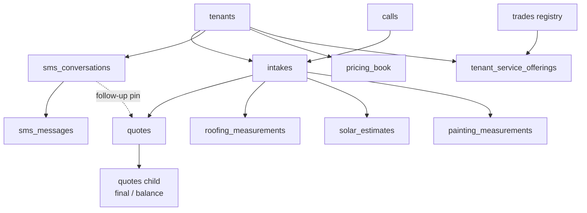

# Database Overview

One Postgres database — a hosted **Supabase** project (`bobvihqwhtcbxneelfns`, Postgres 17 + pgvector)
— backs the whole platform. There is no second store: no Redis, no separate analytics warehouse, no
queue. Every pipeline in [[The Four Pipelines]] reads and writes the same `public` schema.

The schema is not designed top-down. It grew as a sequence of numbered migrations, each one a
narrow, additive, idempotent change, applied directly to the production project. The result is a
wide `quotes` table with ~40 columns accreted over 200 migrations, and a set of per-trade satellite
tables (`roofing_measurements`, `solar_estimates`, `painting_measurements`, …) that each own their
trade's measurement/pricing state while the customer-facing money row stays on `quotes`.

## The three schema sources — and which one is real

⚠ **`sql/init.sql` is NOT production schema.** This trips people up, so migration 194 says it in the
file itself (`quotemate-automation/sql/migrations/194_quote_chain.sql:39-46`):

> `sql/init.sql`'s quotes DDL is NOT prod schema and must never be treated as such. It already lacks
> `share_token`, `paid_at`, `paid_tier`, `deposit_pct` and `tenant_id`.

| File | What it is | Trust for |
|---|---|---|
| `quotemate-automation/sql/init.sql` (487 lines) | A *representative* bootstrap: extensions, the 8 original core tables, `match_intakes`, the electrical "easy 5" seed, plus hand-picked later blocks (file store, historical quotes, audit log) mirrored back in. | Reading intent and the inline comments. Never for "does column X exist". |
| `quotemate-automation/sql/02_stages_06_10_partial.sql` + `04_f3_finish.sql` | The pre-numbering F3 stage migrations. These are where `share_token`, `stripe_links`, `deposit_pct`, `paid_at`, `paid_tier`, `paid_stripe_session_id` (02) and `routing_decision`, `viewed_at`, `accepted_tier`, `scheduled_at` (04) actually came from. | Archaeology on the payment columns. |
| `quotemate-automation/sql/migrations/002…196` (244 files incl. `*_down.sql`) | **The truth.** Newest wins. See [[Migrations]]. | Everything. |

`sql/03_photo_capture.sql` is a third stage file — it adds `calls.photo_request_token` and
`calls.photos_completed_at` for the `/upload/[token]` flow.

There is also one seed data file: `sql/seeds/2026-07-30-plumbing-repair-boms.json`.

## Extensions and database-side logic

Almost nothing lives in the database. Two exceptions:

```sql
create extension if not exists vector;   -- pgvector 0.8
```

- **`match_intakes(query_embedding vector(1536), match_count int default 5)`** —
  `sql/init.sql:246-258`. Cosine-similarity search over `intakes.embedding`, returning
  `(id, scope, similarity)`. This is the RAG retrieval step in [[Estimate Engine]]
  (`lib/estimate/rag.ts`). Note the vector dimension: `init.sql` declares `vector(1536)`, and
  migration `057_voyage3_large_1024.sql` moved the live embedding column to Voyage-3-large
  dimensions — see [[Migrations]].
- **`next_quote_estimate_number(p_quote_id uuid)`** — `sql/init.sql:186-232`, from migration 195.
  Draws `quote_estimate_number_seq` lazily the first time an estimate document renders, so quotes
  that never render one never burn a number. The guarded `UPDATE … WHERE estimate_number IS NULL
  RETURNING` plus the read-back **MUST be one statement**, because PostgREST cannot put `nextval()`
  in an update payload and a read-then-write from the app would race two concurrent renders into two
  numbers. It is `security definer` with `revoke execute … from public` — the default `PUBLIC
  EXECUTE` grant would otherwise make it an unauthenticated RLS-bypassing write against `quotes`.

Everything else — pricing, tier selection, routing, grounding — is application code. There are no
triggers doing business logic and no stored procedures for money.

## How the app connects

Two clients, and the difference is the whole tenancy story:

| Client | File | Key | RLS |
|---|---|---|---|
| Server (API routes, server components, cron) | `lib/supabase/admin.ts` — `getServiceClient()` | `SUPABASE_SERVICE_ROLE_KEY` | **Bypassed.** Tenancy is app-layer `tenant_id` filtering. |
| Browser (client components) | `lib/supabase/client.ts` — `getBrowserSupabase()` | `NEXT_PUBLIC_SUPABASE_ANON_KEY` | Enforced (and policies are deny-by-default, so this client reads almost nothing). |

`getServiceClient()` is constructed **per call**, deliberately, "so a missing env at import time
never crashes module load in test/build" (`lib/supabase/admin.ts:4-6`).

Ad-hoc/ops access is a third path: `scripts/*.mjs` connect with the `pg` driver over
`SUPABASE_DB_URL` (see `scripts/run-migration-194.mjs`). See [[Operations Overview]].

The consequence is stated plainly in [[Tenancy and RLS]]: RLS being *on* for 78 of 85 tables buys
almost nothing at runtime, because the runtime never authenticates as a user. It is a backstop
against a leaked anon key, not the isolation mechanism.

## The shape of the data



Three things about this diagram matter more than the boxes:

1. **`quotes` is the money row for every trade.** Roofing, solar, painting and commercial painting
   each have their own measurement table, but when a customer must *pay*, a `quotes` row is minted
   (solar does this as a **twin row sharing the same token**). [[Mint Routes and Guards]] and
   [[Pay-First Booking Funnel]] only ever look at `quotes`.
2. **`quotes` is now a chain, not a row.** Migration 194 added `parent_quote_id` + `quote_kind`
   (`initial` → `final` → `balance`) because *one customer charge per row is structural*:
   `finalisePaidQuote` claims with `.is('paid_at', null)`. See
   [[The Post-Visit Quote Ladder]] and [[Key Columns and Invariants]].
3. **Line items are never normalised.** `quote_line_items` was declared in `init.sql`, never
   written to, and dropped in migration 061. Every quote's lines live inside the
   `quotes.good` / `.better` / `.best` jsonb columns. ⚠ `init.sql` still contains the
   `create table if not exists quote_line_items` block — it is dead DDL kept for history.

## Tables no longer present

Deletions are as load-bearing as additions, and the migrations record why:

| Table | Removed by | Why |
|---|---|---|
| `payments` | `061_drop_unused_tables.sql` | 0 rows. Payment state lives on `quotes` (`paid_at`, `paid_tier`, `paid_amount_cents`, `platform_fee_cents`) plus Stripe itself. ⚠ [[Payments Overview]] must not reintroduce it. |
| `quote_line_items` | `061_drop_unused_tables.sql` | 0 rows. Lines live in the G/B/B jsonb. |
| `tradies` | `063_drop_tradies.sql` | Single pilot row, superseded by `tenants`. Migration 062 backfilled `tenants.available_slots` from it first. |

⚠ **Drift**: `quotemate-automation/sql/04_f3_finish.sql` still creates `tradies` and `payments`. It
is an early stage file that was never edited after the drops; running it against a fresh database
would resurrect both. Read it as history.

## Row counts as of the CLAUDE.md snapshot

Useful for calibrating "is this table real or aspirational" — but these are a point-in-time count
from `quotemate-automation/../CLAUDE.md`, not something this note verified against prod:
`intakes` 241, `quotes` 228, `sms_conversations` 210, `sms_messages` 2597, `roofing_measurements`
100, `solar_estimates` 34, `painting_measurements` 22, `tenant_service_offerings` 221,
`signage_rules` 882, `shared_assemblies` 63, `shared_materials` 46, `pipeline_traces` 1661,
`eval_run_items` 55, `tenants` 8, `customers` 6.

The distribution tells you where the traffic is: SMS is the busiest surface by an order of
magnitude, and `pipeline_traces` is the only observability store ([[Observability and Tracing]] —
there is no Sentry and no PostHog).

## Conventions that hold across the schema

- **Currency is stored ex-GST and displayed inc-GST.** `quotes` carries all three:
  `subtotal_ex_gst`, `gst`, `total_inc_gst`. Cent-denominated Stripe amounts are separate columns
  (`paid_amount_cents`, `platform_fee_cents`, `payout_amount_cents`) — do not mix the two families.
- **`timestamptz`, never `timestamp`.** Every temporal column in the recent migrations is
  `timestamptz`; the app is AU/NZ-first and daylight saving is real.
- **Nullable timestamps are the state machine.** `released_at`, `quote_sent_at`, `paid_at`,
  `confirmed_at`, `completed_at`, `viewed_at`, `accepted_at`, `payout_created_at` — a NULL means
  "hasn't happened", a value means "happened at". There is almost no `status text` enum on the
  money path, and this is deliberate: a timestamp records *when*, which an enum loses.
- **jsonb for anything shaped per-trade.** `quotes.good/better/best`, `intakes.scope/access/property/
  risks`, `sms_conversations.conversation_state/roofing_state/painting_state`,
  `pricing_book.overlays`, `tenants.available_slots`. The shapes are enforced by Zod in TypeScript,
  not by the database.
- **Migrations end with `notify pgrst, 'reload schema'`** so supabase-js sees a new column
  immediately (see `189_painting_quote_sent_at.sql:34`). Forgetting this makes a freshly-added
  column invisible to PostgREST until the cache expires.

## Open questions

- The live vector dimension after `057_voyage3_large_1024.sql` — `init.sql` still declares
  `vector(1536)` and `match_intakes` is typed to it. Whether the production column is 1024 or 1536
  needs a check against the live schema, not the repo.
- Exact live table count. CLAUDE.md says 85 base tables; this note evidences ~100 distinct
  `create table` statements across the migration history, some of which were later dropped or are
  `*_backup_mig*` staging tables. [[Tables by Domain]] enumerates the ones with code that reads them.

## Related

- [[Tables by Domain]]
- [[Migrations]]
- [[Tenancy and RLS]]
- [[Key Columns and Invariants]]
- [[Tech Stack]]
- [[The Post-Visit Quote Ladder]]
- [[Observability and Tracing]]
