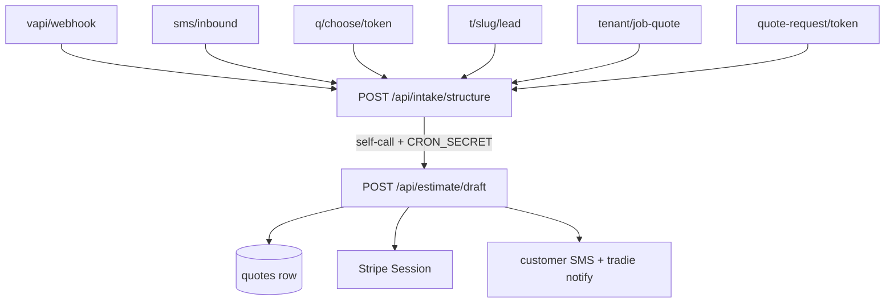

# API - Intake and Estimate

The two-route spine that turns any channel's raw input into a priced, sent quote. Every
intake channel — voice, SMS, flyer QR, self-serve form, dashboard form — converges here.
See [[The Four Pipelines]] for the pipeline shapes and [[Estimate Engine]] for what runs
inside `runEstimation`.



## The two guarded routes

| Path | Methods | Auth | What it does | Side effects |
|---|---|---|---|---|
| `/api/intake/structure` | POST | **`CRON_SECRET` bearer** (`isCronAuthorised`, before `req.json()` — `route.ts:145`) | Opus-structures a voice transcript or SMS thread into an `IntakeSchema` object, embeds it, quality-gates it, inserts `intakes`, then self-calls draft | inserts `intakes` (`:656`); `findOrCreateCustomer` writes `customers` (`:489`); may text the customer a photo request, an incomplete-call message, a recovery message or a quote-failure message; `enqueuePushEvent` for the tradie |
| `/api/estimate/draft` | POST | **`CRON_SECRET` bearer** (`route.ts:81`) | Runs `runEstimation` (RAG + Opus with tool-calling), grounding-validates, routes, writes the quote, mints Stripe, sends | inserts `quotes` (`:568`); mints Stripe Checkout Sessions (`:720` / `:763`) and stores them in `quotes.stripe_links`; texts the customer the quote (+ PDF/MMS); notifies the tradie; `recordTrace` into `pipeline_traces` (`:132`) |

Both accept a single small JSON body:

- `structure`: `{ callId, sourceChannel?: 'voice' }` **or** `{ conversationId, sourceChannel: 'sms' }`
  (`app/api/intake/structure/route.ts:134-136`).
- `draft`: `{ intakeId, tradieDrafted? }`.

`tradieDrafted` is fail-safe by construction: its only effect is to force
`shouldHoldForReview()` to **hold**, so an untrusted caller setting it cannot cause a send
that would not otherwise happen (`app/api/estimate/draft/route.ts:85-90`).

### Why the guard exists and what it costs

`/api/estimate/draft` "mints a quotes row, real Stripe Checkout Sessions and a real
customer SMS from nothing but an intake UUID, and proxy.ts:20 is a bare clerkMiddleware()
that gates nothing" (`route.ts:69-73`). `isCronAuthorised` was reused rather than
reimplemented because it is already unit-tested and fail-closed. Its own comment flags the
conflation to fix later: it treats "Vercel Cron caller" and "internal self-call" as the
same secret, and suggests renaming to `isMachineAuthorised` reading
`INTERNAL_API_SECRET ?? CRON_SECRET` if they ever need splitting (`route.ts:75-80`).

**Invariant:** the guard MUST run before `await req.json()`, so an unauthorised call parses
nothing and registers no `after()` work. This is asserted at source level *and* at runtime
by `tests/internal-route-auth.test.ts:64-77`.

⚠ The self-call in `structure` targets `${process.env.APP_URL}/api/estimate/draft`
(`route.ts:989`). If `APP_URL` is unset the fetch goes to `undefined/api/...`. The same
env is separately defended in `draft` for **link building** — `APP_URL ?? NEXT_PUBLIC_APP_URL
?? new URL(req.url).origin` — precisely because "`${appUrl}/q/...` becomes `undefined/q/...`
and the customer SMS goes out with a broken link" (`estimate/draft/route.ts:705-710`). The
self-call has no such fallback.

## What `estimate/draft` decides

Order of operations after `runEstimation` returns a draft:

1. **Billing entitlement gate** — `checkQuoteEntitlement` / `checkVoiceEntitlement`, flag-gated
   by `BILLING_ENFORCEMENT_ENABLED` (off by default). **Fails open** on any error so a
   billing hiccup never blocks a legitimate quote; `billing_exempt` tenants bypass entirely.
   Quotes are fair-use (soft flag on overage); voice is the hard, minute-capped channel
   (`route.ts:106-115`).
2. **`decideRouting`** (`:527`) → see [[Routing Decision]].
3. **Insert the `quotes` row** with a fresh `generateShareToken()` (`:567-568`).
4. **Mint Stripe** — the branch that encodes [[What the Customer Pays by Trade]]:

```ts
// app/api/estimate/draft/route.ts:702-712
const siteVisitFirst = isSiteVisitFirstTrade(intake?.trade)
const connect = await connectDestinationForTenantId(supabase, intakeTenantId)
if (!draft.needs_inspection && !siteVisitFirst) { /* 3-tier deposit mint */ }
else { /* single $99 site-visit mint */ }
```

⚠ The comment on `isSiteVisitFirstTrade` states the failure mode plainly: it is an
**allowlist on the RAW `intake.trade`**, matching `/r/[token]/[tier]` and the customer page,
and **"a legacy trade-less intake fails open to the tier mint"** (`:700-701`). A blocklist
here would silently kill roofing's deposit path — see [[Mint Routes and Guards]].

`createCheckoutSessionsForQuote` is retired-but-present: for electrical/plumbing it is
"unreachable from this route", though `draft.good/better/best` is still computed, stored and
shown (`:694-698`).

5. **Stripe failures never block the send.** Both mint branches catch and log — the SMS goes
   out without pay links rather than not at all (`:752-756`, `:781-786`).
6. **`shouldHoldForReview`** (`:829`) decides auto-send vs held.
7. **Sends** go through `sendWithRetry(() => dispatchQuoteMessage(...))` (`:897`, `:1025`,
   `:1263`), with a tradie-mobile fallback chain (`:1342`, `:1377`).

## Public intake entrypoints

| Path | Methods | Auth | What it does | Side effects |
|---|---|---|---|---|
| `/api/t/[slug]/lead` | POST | **none** — public QR landing page | Creates a `web` intake from a flyer scan (photo + details) and runs the same structure → estimate → quote pipeline | uploads to `intake-photos`; `findOrCreateCustomer`; `enqueuePushEvent`; self-calls `intake/structure` with the shared secret (`:263`); eventually a quote + SMS |
| `/api/quote-request/[token]` | GET, POST | **capability token** = `trade_lead_requests.token` | The public self-serve generic quote form, every trade. One-shot | claims the token (`pending`→`submitted`) conditionally; writes the brief onto the SMS thread; runs that trade's dispatcher; self-calls `intake/structure` (`:455`) |
| `/api/quote-request/[token]/photos` | POST | capability token, row must still be `pending` | Optional photo field | uploads to `intake-photos`, merges onto `sms_conversations.photo_urls` |
| `/api/quote-request/[token]/suggest-address` | POST | capability token | AU address autocomplete | none |
| `/api/upload/[token]` | POST | capability token (resolves to a `calls` **or** `sms_conversations` row) | Customer photo upload from the SMS/voice link | uploads to `intake-photos`; updates the resolved row's `photo_urls` + `photo_paths`; may trigger AI preview + sample image generation |
| `/api/upload/plan/[token]` | POST | capability token | Aircon plan-document upload | writes `plan_uploads` |
| `/api/q/choose/[token]` | GET, POST | capability token = `sms_conversations` | WP9 mid-conversation product pick. Inert unless `WP9_PRODUCT_OPTIONS=1` | records the choice idempotently; texts the customer; self-calls `intake/structure` (`:154`) |
| `/api/paint-request/[token]` | GET, POST | capability token | Self-serve painting intake form — see [[API - Trade Routes (Roofing, Solar, Painting, Aircon, Signage, Commercial Paint)]] | |
| `/api/tenant/job-quote` | POST | **tenant Bearer** | Dashboard job quoter: labelled answers → prose transcript → `structureIntake` → `intakes` → draft | inserts `intakes`; self-calls draft with `tradieDrafted:true` (`:323`) |
| `/api/tenant/job-quote/photos` | POST | tenant Bearer | Photos for the above | uploads to `intake-photos` |

### `/api/t/[slug]/lead` — the public-money-path template

This is the reference implementation for "public endpoint that spends money", and worth
copying rather than re-deriving. Its header says so: "Money-touching + public → throttled +
honeypotted" (`route.ts:6`). Concretely:

| Control | Value | Source |
|---|---|---|
| max files | 5 | `route.ts:21` |
| max size | 5 MB | `:22` |
| MIME allow-list | jpeg, png, webp | `:23` |
| per-mobile limit | 3 / hour | `:27` |
| per-IP limit | 10 / hour | `:28` |
| window | 3600 s | `:29` |
| throttle store | `lead_throttle` via `bump_lead_throttle` | shared with `/api/contact` |

`POST /api/contact` (the marketing "contact us" form) reuses exactly this shape: honeypot
first, strict validation, the same `bump_lead_throttle` per-IP window, then a Resend send —
with every visitor-typed field HTML-escaped before it reaches the email body, the visitor's
address in `reply_to` and never in `from` (`app/api/contact/route.ts:1-13`).

### `/api/quote-request/[token]` — the fixed reference

Its header documents six ordered steps and three deliberate divergences from the painting
form it was modelled on (`route.ts:9-31`). All three are bug fixes worth internalising:

1. The painting route **returns 200 on a failed estimate**; this one returns non-2xx.
2. The painting route **bare-awaits** its mark-submitted write; this one checks the error.
3. The painting route reads a lead-lookup error as "invalid link"; this one distinguishes a
   PostgREST outage (503) from a genuinely bad token.

**Invariant:** the token claim (`pending` → `submitted`) is a *conditional* update, so a
second tab matches zero rows and gets a 409 rather than producing a second quote. On any
downstream failure the claim is **released** back to `pending`.

The response field `texted` is "a delivery FACT (true / false / null-for-not-mine), never a
hopeful literal" because the thank-you page branches on it (`:30-31`) — the same rule as
painting's `{ sent }`, see [[API - Quote, Payments and Booking]].

⚠ `trade_lead_requests` is the table backing this route. It is **not** in the table list in
the repo's `CLAUDE.md` (which names `painting_lead_requests` only). Cross-check with
[[Tables by Domain]].

## Supporting routes

| Path | Methods | Auth | Notes |
|---|---|---|---|
| `/api/filestore/chat` | POST | tenant Bearer | RAG chat over the tenant file store |
| `/api/captions` | GET | **none, stateless** | Returns a WebVTT track built purely from the `?s=` script param; caps at 600 chars, caches `immutable`. "Nothing to look up, nothing to authorise" (`route.ts:6-7`) |
| `/api/email/unsubscribe/[token]` | GET | capability token | One-click unsubscribe |

## Open questions

- `intake/structure` pins `tradeHint` to `'electrical'` on the voice path with the comment
  "Vapi is electrical-only per v5 strategy doc" (`route.ts:174-178`). With eight trades live
  and `runVoiceTradeHandover` imported by the Vapi webhook, is that pin still correct or is
  it stale?
- `WP9_PRODUCT_OPTIONS` is off by default in both `intake/structure` (`:25`) and the inbound
  route. Is `/api/q/choose/[token]` reachable at all in production?

## Related
- [[API Overview]]
- [[Intake Structuring]]
- [[Estimate Engine]]
- [[Grounding Validator]]
- [[Routing Decision]]
- [[API - SMS and Voice]]
- [[API - Quote, Payments and Booking]]
- [[The Four Pipelines]]
