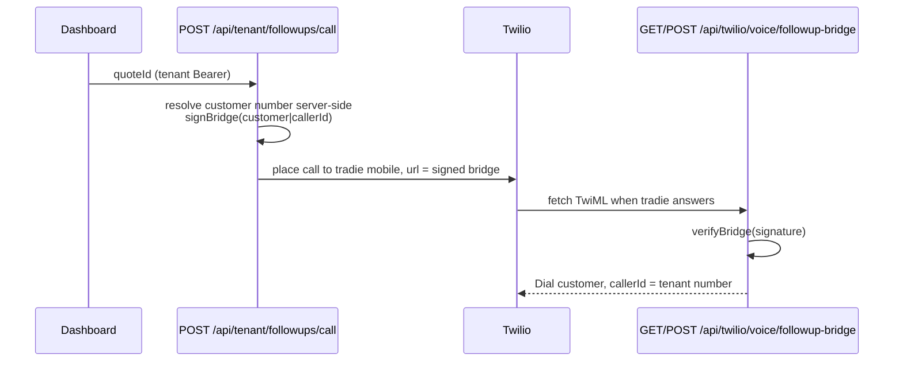

# API - SMS and Voice

Two inbound webhooks (Twilio, Vapi), one Vapi tool callback, one public TwiML bridge, and
the dashboard's outbound messaging routes. See [[SMS Channel Overview]],
[[SMS Inbound Route]] and [[Voice Channel (Vapi)]] for behaviour; this note is the API
contract and the trust boundary.

## Inventory

| Path | Methods | Auth | What it does | Side effects |
|---|---|---|---|---|
| `/api/sms/inbound` | POST | **Twilio HMAC signature** (`x-twilio-signature`) | The four-receptionist SMS engine. ⚠ Gated off by default — see below | writes `sms_conversations` + `sms_messages`; sends SMS/MMS; measures roofs; mints Stripe; self-calls `intake/structure` |
| `/api/vapi/webhook` | POST | ⚠ **none** | Vapi `end-of-call-report` handler | writes `calls`; voice→SMS trade handover; self-calls `intake/structure` with `CRON_SECRET`; may send a failure SMS |
| `/api/vapi/tools/send-sms-photo-link` | POST | ⚠ **none** | Vapi server-side tool `send_sms_photo_link`, invoked mid-call | upserts `calls` by `vapi_call_id`; sends one photo-request SMS |
| `/api/twilio/voice/followup-bridge` | GET, POST | **custom HMAC** over `(customer\|callerId)` | TwiML the tradie's answered leg fetches; returns the `<Dial>` | places no call itself; a bad signature returns hangup TwiML |
| `/api/tenant/chats` | GET | tenant Bearer | Recent conversations + full threads for the dashboard Chats tab | none (read) |
| `/api/tenant/chats/[id]/reply` | POST | tenant Bearer | Manual tradie → customer SMS on an existing thread | sends SMS; appends `sms_messages` |
| `/api/tenant/followups/text` | POST | tenant Bearer | VA-composed follow-up SMS | sends SMS from the tenant's number; logs into the customer's conversation; pins follow-up context |
| `/api/tenant/followups/call` | POST | tenant Bearer | Click-to-call bridge | places a Twilio call to the tradie's mobile with a signed bridge URL |
| `/api/tenant/followups` | GET, POST | tenant Bearer | Follow-up queue | writes `quote_followup_events` |
| `/api/tenant/followups/events` | GET, POST | tenant Bearer | Follow-up event log | writes `quote_followup_events` |
| `/api/tenant/followups/messages` | GET | tenant Bearer | Message history for a follow-up | none |
| `/api/cron/sms-cleanup` | GET | `CRON_SECRET` | Marks stale `open` conversations `abandoned` | see [[API - Cron, Health and Internal]] |
| `/api/cron/followup-2h` | GET | `CRON_SECRET` | Two 2-hour check-in sweeps | sends SMS |

---

## ⚠ `/api/sms/inbound` is retired by default

This is the largest single behavioural divergence between the code and the repo docs.

```ts
// app/api/sms/inbound/route.ts:1668
const RECEPTIONIST_ENABLED = process.env.SMS_RECEPTIONIST_ENABLED === '1'
```

The block above it (`:1644-1667`) records: **retired 2026-08-05**. Every tenant-owned number
now points at a **Front Desk** service — `qm-front-desk-production.up.railway.app/api/sms/inbound`
— which identifies tenant + trade and forwards the turn to that trade's own receptionist
(`qm-front-desk` → `qm-<trade>-receptionist` on Railway). Verified by real SMS on two live
tenants before the switch.

Three design notes worth preserving:

1. **Default-off, not env-to-disable.** An opt-out flag "would have left the old receptionist
   live until someone set a dashboard variable, so a moment of dual-brain overlap — two
   systems able to answer the same customer — would have depended on a manual step".
   Default-off makes the retirement atomic with the deploy.
2. **Rollback needs both halves.** Setting `SMS_RECEPTIONIST_ENABLED=1` "alone changes
   nothing while Twilio is pointed elsewhere" — the numbers must be repointed too.
3. **The disabled ack is a 200 with empty TwiML, on purpose.** A 4xx/5xx would make Twilio
   retry every stray inbound on a schedule, and a stray here means a misconfigured number,
   not a transient fault. The `console.error` line is the alarm.

When disabled, the handler reads the body only to name the `To`/`From` in that log; nothing
is processed, no reply is sent, no row is written (`:1673-1689`).

⚠ **Drift.** `CLAUDE.md` describes this route as the live home of four receptionists with
`SMS_LLM_RECEPTIONIST_ENABLED` default ON and the roofing-hijack bug as a live issue. In
this build all ~4,500 lines are unreachable unless `SMS_RECEPTIONIST_ENABLED=1`. The
described bugs are still *in the code* and would return with the flag, so they remain worth
documenting — but "live behaviour" claims about them should be checked against the Vercel
env first. `GET /api/health` does **not** report this flag, so the code cannot tell you.

### The signature check (when enabled)

```ts
// app/api/sms/inbound/route.ts:1702-1723
const forwardedHost  = req.headers.get('x-forwarded-host') ?? req.headers.get('host')
const forwardedProto = req.headers.get('x-forwarded-proto') ?? 'https'
const url = forwardedHost ? `${forwardedProto}://${forwardedHost}${path}${search}` : req.url
if (!validateTwilioSignature(signature, url, params)) return new Response('Invalid signature', { status: 403 })
```

**Invariant:** the URL MUST be reconstructed from the forwarded headers, because on Vercel
`req.url` can reflect an internal deployment URL while the original request hit the
production alias — and the signature is computed over the URL Twilio dialled. Using
`req.url` directly 403s every production message.

### Media-only messages

A photo with no caption arrives as `Body: ""`. Treating that as a missing field 400'd the
webhook ~480 lines before `NumMedia` was even read: no storage object, no `sms_messages`
row, no reply, and Twilio retrying into the same 400 — while the EV photo gate looked for a
photo that had been thrown away at the door. The fix is a synthetic body:

```ts
// app/api/sms/inbound/route.ts:1738-1741
const inboundHasMedia = Number.parseInt(params.NumMedia ?? '0', 10) > 0
const inboundBody = (params.Body ?? '').trim() || (inboundHasMedia ? '[photo]' : '')
```

**Invariant:** a media-only message MUST produce a non-empty body so the transcript, the
dedupe key and the LLM turn all keep working on text.

### Idempotency and locking

| Layer | Mechanism | Line |
|---|---|---|
| Duplicate webhook | dedupe on `MessageSid` (pure, unit-tested helper) | `:1811-1826` |
| Concurrent first message | `create_sms_conversation_idempotent` RPC (migration 122) — a predicate-qualified insert, so two webhooks coalesce onto ONE conversation and therefore one lock | `:2116-2136` |
| Race backstop | DB unique constraint; the loser logs "race lost" | `:2282-2300` |
| Turn serialisation | per-conversation lock, claimed **after** the inbound insert | `:2311-2323` |

**Invariant (persist-before-lock):** the inbound `sms_messages` INSERT runs BEFORE the lock
claim, deliberately — a webhook that loses the lock has already persisted the customer's
message, so nothing is lost when it declines to process the turn (`:2319-2323`).

⚠ Known hole, unchanged: the lock TTL (60 s) is shorter than the worst-case turn
(~200–300 s with a roof measure), so a slow turn lets a second webhook take the lock and run
concurrently. See [[Known Debt Register]].

### Budget self-monitoring

`maxDuration = 300` (`:388`) and the `after()` block checks itself against
`DELIVERY_KNOBS.maxDurationSec` via `isNearMaxDuration`, bailing out with a logged reason
rather than being killed mid-send (`:4478-4490`, `:4541`).

---

## ⚠ `/api/vapi/webhook` has no authentication

`POST /api/vapi/webhook` verifies **nothing**: no signature, no bearer, no allow-list, no IP
check. The only structural filter is the payload shape:

```ts
// app/api/vapi/webhook/route.ts:31-41
if (payload.message?.type !== 'end-of-call-report') return Response.json({ ok: true, ignored: … })
if (!call?.id) return Response.json({ ok: false, error: 'missing call.id' }, { status: 400 })
```

This matters because the route then, in `after()`, self-calls `/api/intake/structure` **with
the shared secret attached** (`:205`). The `isCronAuthorised` guard was added to close
anonymous access to the money path; this route is a legitimate holder of the secret with no
gate of its own, so it is the remaining path in. `CLAUDE.md` acknowledges the hole; this note
records the exact mechanism.

Practical mitigations already present (they raise the bar, they do not close it): a
transcript shorter than `MIN_TRANSCRIPT_CHARS = 50` is treated as a hangup and dispatches
nothing (`:23`); an unresolvable `tenantId` follows the no-tenant branch.

### Tenant resolution (two paths, in order)

1. `call.assistant.metadata.tenant_id` — set by `lib/vapi/provision.ts` at assistant
   creation. Cheapest and most reliable.
2. Fallback: `call.assistantId` → `tenants.vapi_assistant_id` lookup, for legacy assistants
   predating the metadata change.

`null` is accepted (legacy pre-v6 calls route via the pilot pricing book).

### The voice → SMS trade handover

Before falling through to the generic intake pipeline, the `after()` block calls
`runVoiceTradeHandover` (`lib/voice/trade-handover.ts`). For roofing/painting it seeds an
`sms_conversations` row with the slots captured on the call and texts the machine's own next
question; the customer's reply then flows through the SMS receptionist engine
(`:161-190`).

**Invariant:** *any* handover failure — extraction, DB, or SMS send — falls through to the
generic intake pipeline rather than dropping the call. The `try` wraps the whole thing and
logs, it does not rethrow (`:186-190`).

⚠ This handover targets `/api/sms/inbound`'s engine. With the receptionist retired (above),
a seeded roofing thread's reply reaches the Front Desk service instead. Whether the seeded
state is visible to that service is an open question.

### Retry and the never-silent rule

The self-call to `intake/structure` is wrapped in `withRetry` — 3 attempts, 2 s/4 s backoff,
inside `after()` so it doesn't block the ack (`:200-225`). On exhaustion the route
**sends the caller a failure SMS** so they know to expect a callback rather than wondering
if their call vanished (`:227-240`).

That failure SMS goes **from the tenant's own number, not the platform default** — the
comment cites a live incident on 2026-07-23 and points at `lib/sms/outbound-from.ts`
(`:238-240`). Copy that pattern in any new outbound send.

---

## `/api/vapi/tools/send-sms-photo-link`

Unauthenticated Vapi tool callback, invoked by the receptionist persona *during* a live call
("send a photo of the switchboard"). It returns a short natural-language string the model
speaks back to the caller.

Its idempotency contract is worth quoting because the model can legitimately call it several
times in one conversation (`route.ts:9-19`):

- Upserts the `calls` row by `vapi_call_id`, creating it if the call hasn't ended yet. The
  end-of-call webhook later upserts again and **preserves** these fields because its payload
  doesn't include them.
- If `photo_request_sent_at` is already set, it returns success **without re-sending** — one
  SMS per conversation regardless of tool-call count.
- **On dispatch failure it leaves `photo_request_sent_at` null**, so the post-call dispatcher
  in `/api/intake/structure` picks up the slack, and returns a degraded message the model
  relays to the caller.

**Invariant:** the "sent" stamp is written only on a real send. Stamping optimistically would
suppress both this tool's retry and the post-call fallback.

---

## The click-to-call bridge



Two rules make this safe:

1. **The destination is never trusted from the request body** — it is resolved server-side
   from `quoteId` via `lib/quote/followup-contact` (`app/api/tenant/followups/call/route.ts:8`,
   and identically in `followups/text/route.ts:9-11`).
2. **The public TwiML endpoint is HMAC-gated.** `/api/twilio/voice/followup-bridge` is
   "PUBLIC + UNAUTHENTICATED (Twilio has no bearer token)"; the guard is a signature over
   `(customer|callerId)` made with `TWILIO_AUTH_TOKEN`. A forged hit "gets a polite hangup,
   never a dial — so this can't be used to make our Twilio account call arbitrary numbers"
   (`route.ts:5-9`). Numbers are additionally shape-checked against `/^\+\d{8,15}$/`.

The customer always sees the tenant's provisioned number as caller-ID, never the VA's
personal phone — the same rule `followups/text` enforces for SMS.

`followups/text` caps the body at `MAX_LEN = 640` (~4 SMS segments) and logs the sent
message into the customer's conversation, so a reply re-engages the receptionist
automatically: the inbound webhook matches by `from_number` and continues the thread
(`route.ts:6-8`).

## Open questions

- Does the Front Desk service (`qm-front-desk-production.up.railway.app`) live in this repo?
  It is not under `quotemate-automation/`; only the retired in-app handler is.
- Does Vapi support a webhook secret or signed payload that could be adopted for
  `/api/vapi/webhook` and `/api/vapi/tools/*`?
- With the in-app receptionist off, is `runVoiceTradeHandover`'s seeded `sms_conversations`
  state still honoured by whatever answers the customer's reply?

## Related
- [[API Overview]]
- [[SMS Inbound Route]]
- [[SMS Channel Overview]]
- [[Voice Channel (Vapi)]]
- [[LLM Receptionist]]
- [[Grounding and Safe Replies]]
- [[API - Intake and Estimate]]
- [[API - Cron, Health and Internal]]
