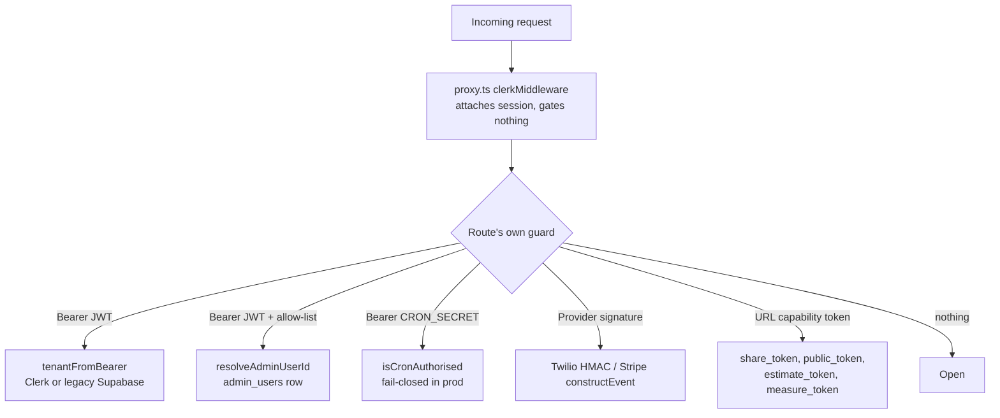

# API Overview

QuoteMax exposes **270 route handlers** (`route.ts` files) under
`quotemate-automation/app/api`. There is no API gateway, no shared route wrapper and no
declarative policy file: **every route gates itself**, or does not gate at all. This note
explains the five auth models in use, the fast-ack + `after()` convention, the idempotency
patterns, and — most importantly — exactly which parts of the surface are unauthenticated.

The per-area inventories live in:
[[API - Intake and Estimate]] ·
[[API - SMS and Voice]] ·
[[API - Trade Routes (Roofing, Solar, Painting, Aircon, Signage, Commercial Paint)]] ·
[[API - Quote, Payments and Booking]] ·
[[API - Tenant, Onboard and Admin]] ·
[[API - Cron, Health and Internal]].

---

## The one thing to understand first: proxy.ts gates nothing

Next 16 renamed `middleware.ts` to `proxy.ts`. QuoteMax's is 3 lines of substance:

```ts
// quotemate-automation/proxy.ts:22
export default clerkMiddleware()
```

Its own header comment states the contract explicitly — it "ONLY attaches Clerk's session
context to the request — it does NOT gate any route" and it "deliberately never calls
`auth.protect()`" (`quotemate-automation/proxy.ts:8-13`). The matcher covers
`/(api|trpc)(.*)`, so Clerk *runs* on every API request, but the result is advisory.

**Invariant:** a route without its own guard is world-reachable. There is no second line of
defence — RLS is bypassed too, because server routes use `SUPABASE_SERVICE_ROLE_KEY`
(see [[Tenancy and RLS]]). Adding a route means adding a guard in the same commit.

---

## The five auth models



### 1. Tenant Bearer JWT — dual-auth (the dashboard surface)

The single chokepoint is `tenantFromRequest` in
`quotemate-automation/lib/tenant/current.ts:90`, wired to the real Clerk verifier by
`resolveTenantRequest` (`quotemate-automation/lib/tenant/from-request.ts:44`). Most routes
call the thinner `tenantFromBearer` (`quotemate-automation/lib/tenant/bearer.ts:13`).

The resolver classifies the token by its `iss` claim (`providerForToken`,
`lib/tenant/current.ts:62`) and loads the tenant by the matching key:

| Token issuer | Verified by | Tenant looked up by |
|---|---|---|
| Clerk (`clerk.*`, `*.accounts.dev`) | `lib/clerk/verify.ts#verifyClerkSessionToken` | `tenants.clerk_user_id` |
| Supabase (`*.supabase.*`, `/auth/v1`) | Supabase | `tenants.owner_user_id` (legacy) |
| unclassifiable | — | treated as legacy Supabase |

There is an **email fallback**: when the id lookup misses, `resolveClerkEmail` fetches the
caller's primary email from Clerk's API and the resolver retries on `tenants.owner_email`
(`lib/tenant/from-request.ts:22-40`). Its stated purpose is to let one shared Supabase DB
serve both the dev (`sk_test`) and prod (`sk_live`) Clerk instances, because
`clerk_user_id` can only hold one instance's id. Emails are the join key of last resort —
worth knowing when debugging "signed in but no tenant".

**140 of the 270 route files** import one of `tenantFromBearer` / `resolveTenantRequest` /
`resolveIdentityRequest`. That is the dashboard/tradie surface: everything under
`/api/tenant/*`, `/api/quote/[id]/*`, `/api/dashboard/*`, the tradie halves of
`/api/roofing/*` and `/api/painting/*`, `/api/billing/*`, `/api/signage/*`.

⚠ Resolving a tenant is **not** the same as owning the row. Several routes verify "signed
in" and then act on an object addressed by a customer-facing token — see the cross-tenant
holes listed in [[Known Debt Register]] and repeated per-route in the area notes.

### 2. Admin allow-list

`resolveAdminUserId` (`lib/admin-loader/route-auth.ts:22`) runs the dual-auth resolver,
maps the caller to a **Supabase** auth id (`tenant.owner_user_id`, or the caller's own id
on the Supabase branch), then checks `isAdminUser` — a single-row lookup against
`admin_users` (`lib/admin-loader/auth.ts:17`). That helper **fails closed**: a null user, a
DB error, or a thrown exception all return `false`.

16 routes import `resolveAdminUserId`, all under `/api/admin/*`. The Files console under
`/api/admin/files/*` uses a *different* helper, `adminFromBearer` from
`lib/filestore/comments.ts`, and answers `403` rather than `401`
(`app/api/admin/files/route.ts:20`). `GET /api/admin/whoami` is the deliberate exception:
it returns `is_admin: false` with a 200 for a signed-in non-admin so the dashboard can
render its nav, and 401 only for a bad token (`app/api/admin/whoami/route.ts:5-11`).

### 3. Shared internal secret — `isCronAuthorised`

```ts
// quotemate-automation/lib/agents/cron.ts:23-38
export function isCronAuthorised(req, env = process.env): boolean {
  const expected = env.CRON_SECRET
  const got = req.headers.get('authorization')
  if (env.NODE_ENV === 'production') {
    if (!expected) return false           // fail-closed
    return got === `Bearer ${expected}`
  }
  if (got && expected) return got === `Bearer ${expected}`   // dev: strict on wrong header
  return true                                                 // dev: open to no header
}
```

Two behaviours matter:

- **Fail-closed in production.** No `CRON_SECRET` set → *every* guarded call is rejected.
- **`NODE_ENV` is `'production'` on Vercel Preview too**, so the secret must be scoped to
  Preview or preview deployments 401 the whole intake pipeline.

`GET /api/health` reports `cron_secret_present` as a **boolean only** so this failure is
diagnosable without breaking it (`app/api/health/route.ts:37`). Its comment spells out the
blast radius: a deployment missing the secret produces no quote from any channel, and
three of the four channels then text the customer a failure message.

**Guarded by it (the money path):**

| Route | Why it must be guarded |
|---|---|
| `POST /api/estimate/draft` | mints a `quotes` row, real Stripe Checkout Sessions and a customer SMS from nothing but an intake UUID (`app/api/estimate/draft/route.ts:69-83`) |
| `POST /api/intake/structure` | Opus-structures an intake, inserts `intakes`, then self-calls `/api/estimate/draft` (`app/api/intake/structure/route.ts:137-147`) |
| `GET /api/cron/agents/[agent]` | proxies to the Railway quality-agents service |
| `GET /api/cron/push-receipts` | push receipt/event sweeps |

**Every in-app caller that MUST send `Authorization: Bearer ${CRON_SECRET}`** — this list
is enforced by `tests/internal-route-auth.test.ts:36-49`, which fails the build if a new
caller ships without the header:

1. `app/api/vapi/webhook/route.ts:205`
2. `app/api/sms/inbound/route.ts:4378`
3. `app/api/q/choose/[token]/route.ts:154`
4. `app/api/intake/structure/route.ts:994` (both a guarded route *and* a caller of draft)
5. `app/api/t/[slug]/lead/route.ts:263`
6. `app/api/tenant/job-quote/route.ts:323`
7. `app/api/quote-request/[token]/route.ts:455`

⚠ CLAUDE.md lists **six** callers. The code has **seven** — the self-serve
`/api/quote-request/[token]` form was added later and is registered in the test with a note
that "the glob check caught it unregistered". Treat the test file as the authority.

The test asserts three things per guarded route, at source level *and* at runtime: the
guard is imported and called, it early-returns a 401, and it runs **before** `await
req.json()` so an unauthorised call parses nothing and schedules no `after()` work
(`tests/internal-route-auth.test.ts:64-77`).

⚠ **The guard does not close every door.** `POST /api/vapi/webhook` has no auth of its
own (see below) and reaches the same pipeline from outside.

Four cron routes do **not** import the shared helper — they carry a byte-identical
hand-rolled copy of the same logic: `cron/sms-cleanup`, `cron/kb-sync`,
`cron/tenant-filestore-reconcile`, `cron/followup-2h`. Same semantics, four places to fix.

### 4. Provider webhook signatures

| Route | Verification | Failure mode |
|---|---|---|
| `POST /api/sms/inbound` | `validateTwilioSignature(signature, url, params)` on `x-twilio-signature`, with the URL **reconstructed from `x-forwarded-host`/`x-forwarded-proto`** because Vercel's `req.url` can be an internal deployment URL (`app/api/sms/inbound/route.ts:1702-1723`) | 403 `Invalid signature` |
| `POST /api/stripe/webhook` | `getStripe().webhooks.constructEventAsync(raw, sig, STRIPE_WEBHOOK_SECRET)` (`app/api/stripe/webhook/route.ts:123-133`) | rejected before any DB write |
| `POST /api/stripe/connect-webhook` | same, own secret (`app/api/stripe/connect-webhook/route.ts:29-42`) | as above |
| `GET,POST /api/twilio/voice/followup-bridge` | **not** a Twilio signature — a custom HMAC over `(customer\|callerId)` signed with `TWILIO_AUTH_TOKEN` by the caller (`/api/tenant/followups/call`) and checked by `verifyBridge` (`lib/twilio/voice.ts`) | polite hangup TwiML, never a dial |

The followup-bridge comment names the threat it closes: without the HMAC the endpoint
"could be used to make our Twilio account call arbitrary numbers"
(`app/api/twilio/voice/followup-bridge/route.ts:5-9`).

### 5. Capability tokens (unauthenticated by design)

The whole customer surface is token-only. An unguessable token in the URL *is* the
credential; there is no login, no session, no rate limit visible at the route.

| Token | Column | Grants |
|---|---|---|
| `share_token` | `quotes.share_token` | `/q/[token]` page, PDF, booking, accept, ICS |
| `public_token` | `roofing_measurements` / `painting_measurements` | `/q/roof`, `/q/paint`, trade booking |
| `measure_token` | `roofing_measurements` | tradie `/m/[token]` measurement editor |
| `estimate_token` | `painting_measurements` | tradie `/p/[token]` review + release |
| intent/upload tokens | `tradie_signup_intents`, `calls`, `sms_conversations` | onboarding resume, photo upload |

⚠ This is the real risk surface, and it is *large*. Notable examples, all reachable by
anyone holding (or guessing) a token, with no signed-in check:

- `POST /api/q/[token]/book` — books a slot, texts a confirmation. Guarded by state, not
  identity: it requires the quote to be **paid** (409 otherwise) and the slot to be one the
  server itself offers (`app/api/q/[token]/book/route.ts:18-23`).
- `POST /api/q/book/[trade]/[token]` — same for roofing/painting jobs, requires `paid_at`.
- `POST /api/painting/release/[token]` — the *tradie's* Send button, gated only by
  `estimate_token`; stamps `released_at` and texts the customer.
- `GET /api/q/[token]/pdf`, `/api/q/roof|paint|solar|plan/[token]/pdf` — stream the quote
  PDF and **lazily generate it** on first hit.
- `POST /api/upload/[token]`, `POST /api/upload/plan/[token]` — accept customer photos
  (bounded: 5 files, 5 MB, jpeg/png/webp — `app/api/upload/[token]/route.ts:11-13`).

### Genuinely open (no guard at all)

| Route | Note |
|---|---|
| `POST /api/vapi/webhook` | ⚠ **No signature, no secret, no allow-list.** It writes a `calls` row and self-calls `/api/intake/structure` with the shared secret, so an attacker who can post a plausible `end-of-call-report` reaches the estimator through the front door the internal guard was built to close. Only structural filter: the payload must have `message.type === 'end-of-call-report'` and a `call.id` (`app/api/vapi/webhook/route.ts:31-41`). |
| `POST /api/vapi/tools/send-sms-photo-link` | Vapi tool callback, unauthenticated; sends an SMS. |
| `GET /api/health`, `GET /api/health/deep` | Deliberate. `health` returns flag **presence**, never values; `health/deep` pings Supabase, Gotenberg. |
| `GET /api/studio/render` | Renders a PNG via `next/og` from query params; the photo is read off local disk, never network-fetched. |
| `GET /api/q/download?path=…` | Renders a live quote page to PDF via Gotenberg's URL route. Protected from SSRF by a **strict path allow-list**, not by auth (`app/api/q/download/route.ts:7-9`). |
| `POST /api/solar/[tenantSlug]/estimate`, `/detect` | The public solar lead form — see [[Solar]]. |
| `POST /api/onboard/validate-code`, `GET /api/onboard/trades` | Pre-signup lookups. |
| `GET /api/roofing/map-tiles/[z]/[x]/[y]` | Google tile proxy. |

---

## Fast-ack + `after()`

Webhook and long-running routes acknowledge inside the provider's timeout, then do the
heavy work in Next's `after()`. `after()` runs *after the response is flushed but inside
the same invocation*, so it is bounded by `maxDuration`, not free.

- `maxDuration = 300` is set on essentially every heavy route: `sms/inbound`,
  `vapi/webhook`, `estimate/draft`, `intake/structure`, `stripe/webhook`,
  `cron/followup-2h`, `cron/kb-sync`, `cron/agents/[agent]`, `q/book/[trade]/[token]`.
  Vercel **Hobby's 10s ceiling times these out** — Pro or the Railway/Docker deploy is
  required.
- `maxDuration` must be a **statically analysable literal**. `estimate/draft` documents
  this the hard way: a computed `getDeliveryKnobs().maxDurationSec` is *silently ignored*
  by Next's segment analyser (`app/api/estimate/draft/route.ts:53-61`). The knobs are still
  read at runtime for retry/backoff — just not for the segment config.
- The `after()` block in `sms/inbound` **self-monitors its budget**: `isNearMaxDuration`
  compares elapsed time against `DELIVERY_KNOBS.maxDurationSec` and bails out rather than
  being killed mid-send (`app/api/sms/inbound/route.ts:4478-4490`).
- ⚠ Counter-example worth copying: `POST /api/painting/release/[token]` **awaits** its send
  instead of deferring it, because the response reports `{ sent }` and `/p` shows "Sent" on
  that flag alone. Deferring it "let 3 of 8 live releases stamp `released_at`, return
  `ok:true` and text nobody" (`app/api/painting/release/[token]/route.ts:12-15`). The AI
  repaint pre-warm went *back* into `after()` because 10–20 s of image generation inline
  could push the request past `maxDuration` and skip the rollback.

**Invariant:** anything whose success the caller reports MUST be awaited. Anything
best-effort and slow MUST be deferred. Getting this backwards produces a UI that lies.

---

## Idempotency

Three distinct mechanisms, one per provider shape:

| Surface | Key | Mechanism |
|---|---|---|
| Twilio inbound | `MessageSid` | Application-level dedupe check, then a DB unique constraint as the race backstop — a webhook that loses the race has already persisted the inbound row, by design (`app/api/sms/inbound/route.ts:1811-1826`, `:2282-2300`) |
| Conversation creation | `from_number` + predicate | `create_sms_conversation_idempotent` RPC (migration 122) — a predicate-qualified insert, so two concurrent first-messages coalesce onto one conversation and therefore one per-conversation lock (`:2116-2136`) |
| Turn processing | per-conversation lock | Claimed **after** the inbound insert (persist-before-lock, `:2311-2323`). ⚠ The lock's 60s TTL is shorter than the ~200–300s worst-case measure turn — see [[Known Debt Register]] |
| Stripe | `paid_stripe_session_id` + `WHERE paid_at IS NULL` | **No `event.id` ledger.** Re-delivery of the same session is skipped on the session id; two *different* sessions can never both finalise, because the `paid_at` write is a conditional claim (`app/api/stripe/webhook/route.ts:1-8`) |
| Cron sweeps | `followup_2h_sent_at` | Two belts: partial indexes + `IS NULL` in the select, and `UPDATE … WHERE followup_2h_sent_at IS NULL` so a second pod's update is a rowcount-0 no-op (`app/api/cron/followup-2h/route.ts:34-42`) |

---

## ⚠ Drift: the in-app SMS receptionist is retired

`app/api/sms/inbound/route.ts:1644-1670` records that on **2026-08-05** the in-app SMS
receptionist was switched **off by default**:

```ts
const RECEPTIONIST_ENABLED = process.env.SMS_RECEPTIONIST_ENABLED === '1'
```

Every tenant-owned number now points at a separate **Front Desk** service
(`qm-front-desk-production.up.railway.app/api/sms/inbound`), which identifies tenant +
trade and forwards to that trade's own receptionist on Railway. The flag defaults to *off*
deliberately, so the retirement is atomic with the deploy rather than depending on someone
setting a dashboard variable — and rollback needs **both** the flag *and* repointing the
Twilio numbers.

When disabled the route reads the body only to log the number, then returns a 200 with
empty TwiML. A 4xx/5xx would make Twilio retry a misconfigured number forever; the
error-level log is the alarm.

⚠ The repo's `CLAUDE.md` still describes `/api/sms/inbound` as the live four-receptionist
route with `SMS_LLM_RECEPTIONIST_ENABLED` default ON. In this build the whole handler is
dead code behind `SMS_RECEPTIONIST_ENABLED` unless that variable is `1`. Documented in
detail in [[API - SMS and Voice]] and [[SMS Inbound Route]].

## ⚠ Drift: vercel.json declares no crons

Several cron routes state their schedule is "wired in vercel.json"
(`app/api/cron/agents/[agent]/route.ts:6`, `app/api/cron/tenant-filestore-reconcile/route.ts:7`,
`app/api/cron/sms-cleanup/route.ts:9`). `quotemate-automation/vercel.json` contains only:

```json
{ "$schema": "https://openapi.vercel.sh/vercel.json" }
```

No `crons` array exists. `cron/followup-2h` is honest about this — it says explicitly
"SCHEDULING — NOT IN vercel.json" and names **cron-job.org** (created by
`scripts/setup-cron-job-org.mjs`) as the live 15-minute trigger, because Vercel Hobby caps
native cron at once per day (`app/api/cron/followup-2h/route.ts:23-33`). `cron/kb-sync`
likewise says cron-job.org, every 5 min. See [[API - Cron, Health and Internal]].

---

## Conventions a new route must follow

1. **Guard first, parse second.** The guard MUST precede `await req.json()` so an
   unauthorised call parses nothing and schedules no `after()` work — asserted for the two
   internal routes by `tests/internal-route-auth.test.ts:64-77`.
2. **Register new internal callers in `tests/internal-route-auth.test.ts`.** A caller that
   ships without `Authorization: Bearer ${CRON_SECRET}` takes an intake channel offline in
   production only.
3. **`maxDuration` is a literal.** A computed value is silently dropped.
4. **supabase-js does not throw.** It resolves `{ data, error }`. A bare `await` on a
   Supabase or Twilio call is the silent-failure class that produced the painting
   "Sent to customer" lie — check `error` explicitly.
5. **Scope by `tenant_id` yourself.** The service-role key bypasses RLS.
6. **Never report `ok` without the thing having happened.** Return `{ sent }`, not `{ ok }`.

## Open questions

- Is `SMS_RECEPTIONIST_ENABLED` set to `1` in the live Vercel project, or is the Front Desk
  service genuinely serving all inbound SMS? The code cannot answer this; only the Vercel
  env can. `GET /api/health` does **not** report this flag.
- Whether Vapi offers a webhook secret that could be adopted for `/api/vapi/webhook` — the
  route currently has no verification of any kind.
- Whether the four hand-rolled `isAuthorised` copies in `cron/*` should be collapsed onto
  `isCronAuthorised`; behaviour is identical today but they can drift independently.

## Related
- [[API - Intake and Estimate]]
- [[API - SMS and Voice]]
- [[API - Quote, Payments and Booking]]
- [[API - Tenant, Onboard and Admin]]
- [[API - Cron, Health and Internal]]
- [[Auth and Identity]]
- [[Tenancy and RLS]]
- [[Known Debt Register]]
